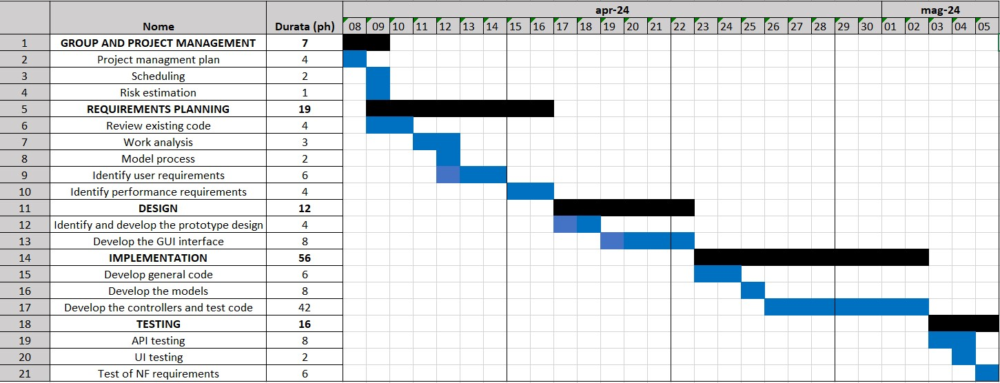

# Project Estimation - CURRENT

Date: 01/05/2024

Version: 1.2

# Estimation approach

Consider the EZElectronics  project in CURRENT version (as given by the teachers), assume that you are going to develop the project INDEPENDENT of the deadlines of the course, and from scratch

# Estimate by size

|             | Estimate                        |
| ----------- | ------------------------------- |  
| NC =  Estimated number of classes to be developed   |    27  |
|  A = Estimated average size per class, in LOC       |       150 |
| S = Estimated size of project, in LOC (= NC * A) | 4050 |
| E = Estimated effort, in person hours (here use productivity 10 LOC per person hour)  |     405  |
| C = Estimated cost, in euro (here use 1 person hour cost = 30 euro) | 12150 |
| Estimated calendar time, in calendar weeks (Assume team of 4 people, 8 hours per day, 5 days per week ) | 3 |

# Estimate by product decomposition

|         component name    | Estimated effort (person hours)   |
| ----------- | -------------|
|requirement document    | 16 |
| GUI prototype |10|
|design document |4|
|code |56|
| unit tests | 8 |
| api tests |8|
| management documents  |4|

# Estimate by activity decomposition

|         Activity name    | Estimated effort (person hours)   |
| ----------- | ------------------------------- |
| **GROUP AND PROJECT MANAGEMENT** | **7** |
| Project management plan | 4 |
| Scheduling | 2 |
| Risk Estimation | 1 |
| **REQUIREMENTS PLANNING** | **19** |
| Review existing code | 4 |
| Work Analysis | 3 |
| Model process | 2 |
| Identify user requirements |  6 |
| Identify performance requirements |  4 |
| **DESIGN** | +*12** |
| Identify and develop the prototype design | 4 |
|Developing the GUI prototype | 8 |
| **IMPLEMENTATION**| **56** |
| Develop general code | 6 |
| Developing the models | 8|
| Developing the controllers and test code | 42 |
| **TESTING** | **16** |
| API Testing | 8 |
| UI Testing | 2 |
| Testing of NF req | 6 |

# Summary

Report here the results of the three estimation approaches. The  estimates may differ. Discuss here the possible reasons for the difference

|             | Estimated effort (in ph)      |   Estimated duration (days=(ph/n_members)/ph_of_day) |
| ----------- | --------- | ---------------|
| estimate by size | 405 | 13 |
| estimate by product decomposition | 106 | 4 |
| estimate by activity decomposition | 110 | 4 |

The differing results among the three approaches may be related to various factors.
First of all, the approach based on lines of code (LOC) doesn't consider all the effort spent on requirements, design and testing parts.
Finally, the discrepancy between the two decomposition approaches is related to the different levels of details required from each method: the activity-based decomposition has a higher level of details respect to the product-based decomposition.
