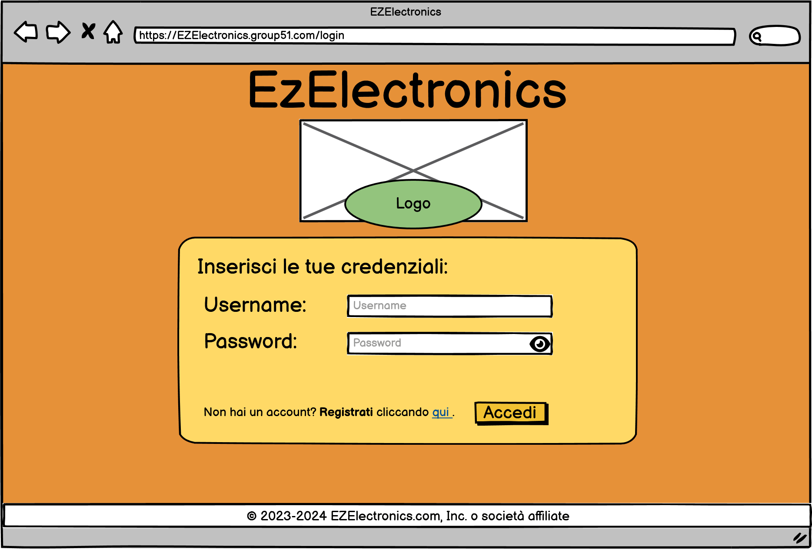
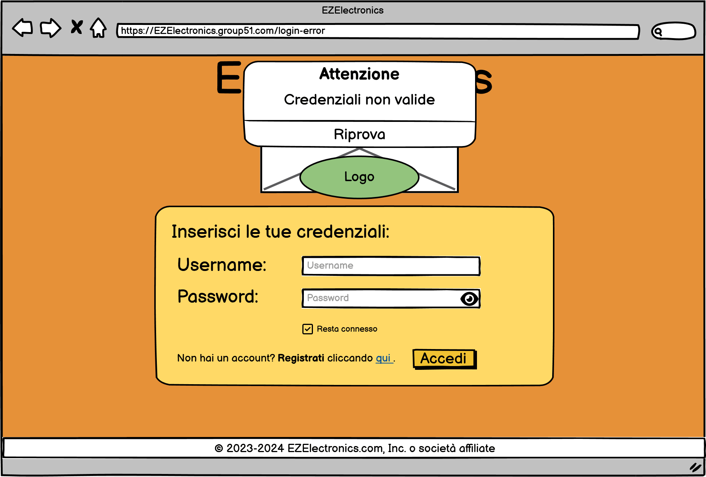
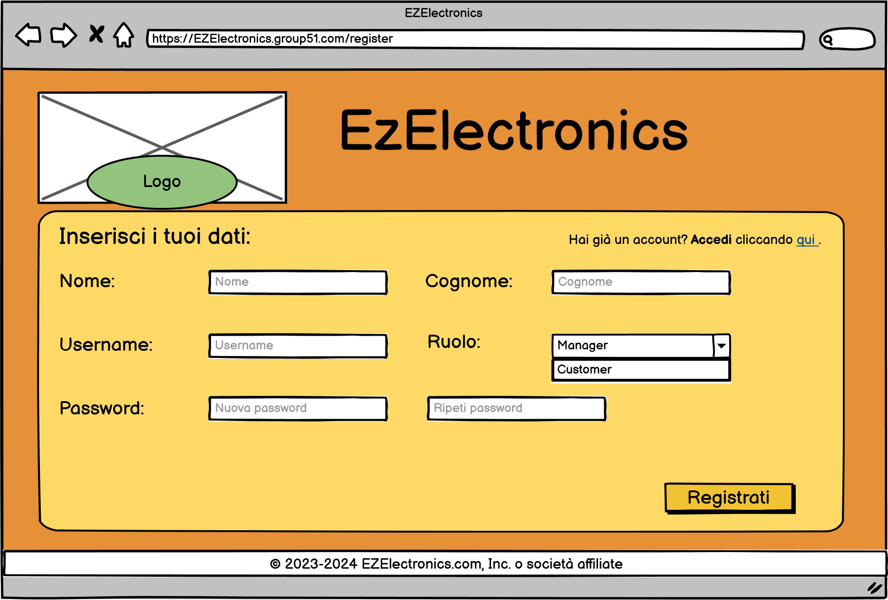
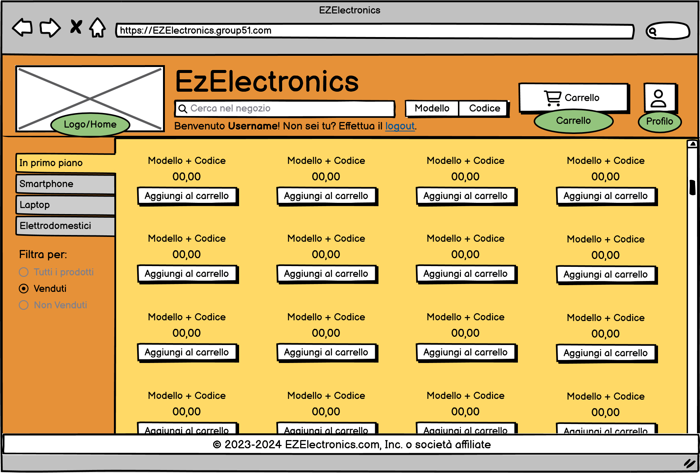

# Graphical User Interface Prototype - CURRENT

Authors: Carlino Mattia, Coppola Neri Valerio, Mosca Alessandro, Rossino Ruggero

Date:

Version: 1.0.0

\<Report here the GUI that you propose for EZElectronics in CURRENT form, as received by teachers. You are free to organize it as you prefer. A suggested presentation matches the Use cases and scenarios defined in the Requirement document. The GUI can be shown as a sequence of graphical files (jpg, png) >

# Application GUI

| Screen | Image |
| ----------------- |:-----------:|
| Login |  |
| Credenziali errate |  |
| Registrazione |  |
| Homepage |  |
