# Graphical User Interface Prototype - CURRENT

Authors: Carlino Mattia, Coppola Neri Valerio, Mosca Alessandro, Rossino Ruggero

Date:

Version: 1.0.0

# Application GUI

| Functionality | Description | Image |
| ----------------- | ----------------- |:-----------:|
|Login| Pagina relativa al login di utente. |  |
|Register| Pagina relativa alla registrazione di un utente. |  |
|Home principale v1| Homepage (vista senza filtro vendita). | 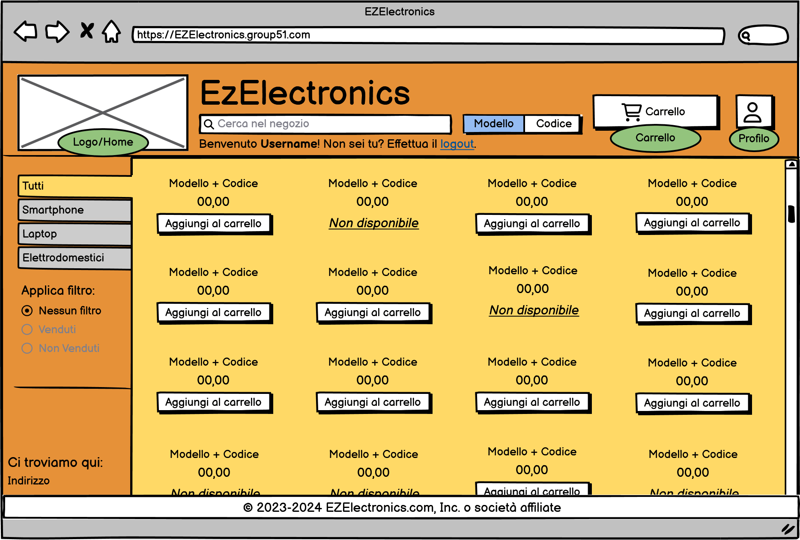 |
|Home principale v2| Homepage (vista con filtro "Venduti"). | 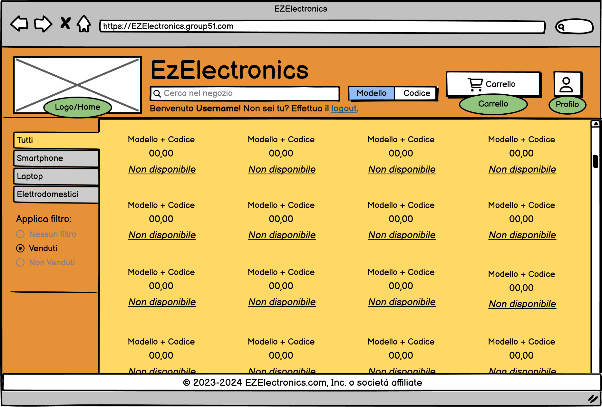 |
|Home principale v3| Homepage (vista con filtro "Non Venduti").| 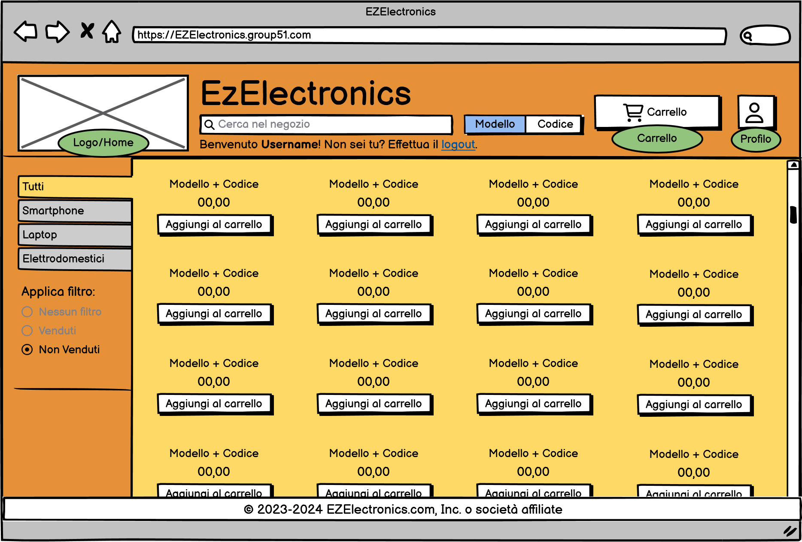 |
|Smartphone| Pagina relativa alla presentazione generale dei prodotti appartenenti alla categoria "Smartphone". | 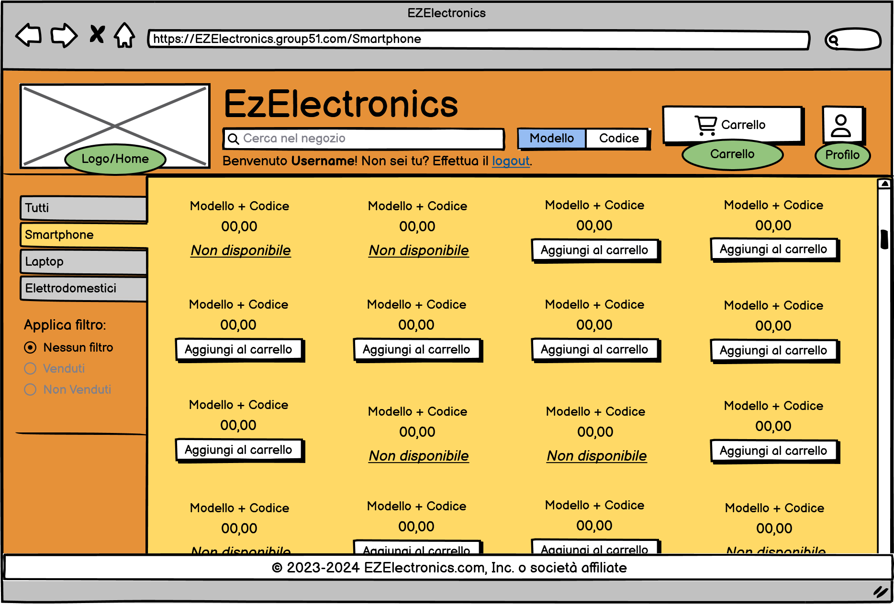 |
|Laptop| Pagina relativa alla presentazione generale dei prodotti appartenenti alla categoria "Laptop". |  |
|Elettrodomestici| Pagina relativa alla presentazione generale dei prodotti appartenenti alla categoria "Elettrodomestici". |  |
|Visualizzazione prodotto disponibile| Pagina relativa alla visualizzazione, da parte di un utente customer, di un singolo prodotto disponibile e quindi idoneo all'acquisto all'interno del sito. |  |
|Visualizzazione prodotto venduto| Pagina relativa alla visualizzazione, da parte di un utente customer, di un singolo prodotto venduto e quindi non idoneo all'acquisto all'interno del sito. |  |
|Visualizzazione prodotto disponibile| Pagina relativa alla visualizzazione, da parte di un utente manager, di un singolo prodotto disponibile e quindi idoneo all'acquisto all'interno del sito. | 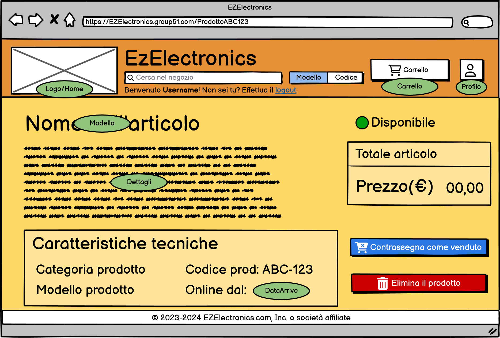 |
|Visualizzazione prodotto venduto| Pagina relativa alla visualizzazione, da parte di un utente manager, di un singolo prodotto venduto e quindi non idoneo all'acquisto all'interno del sito. | 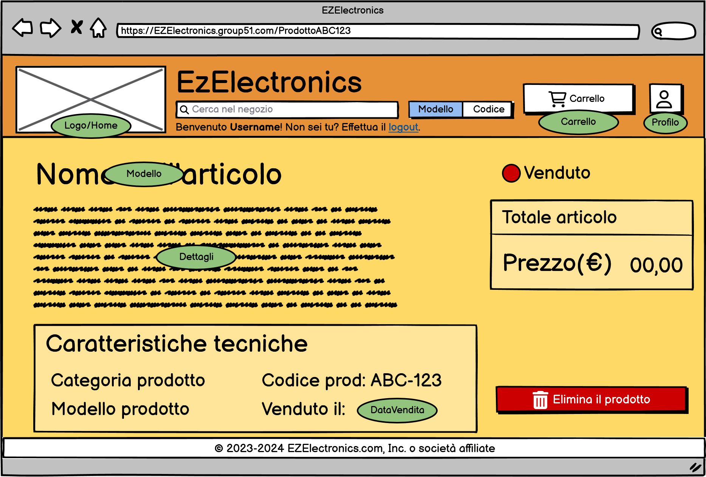 |
|Carrello vuoto| Pagina relativa alla visualizzazione del carrello attuale, da parte di un utente customer, nella condizione in cui nessun prodotto è stato inserito nel carrello. | 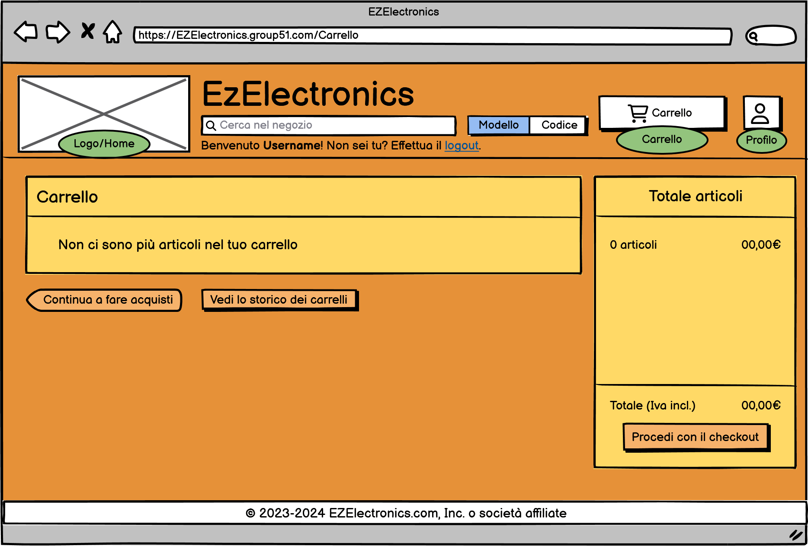 |
|Carrello pieno| Pagina relativa alla visualizzazione del carrello attuale, da parte di un utente customer, nella condizione in cui sono già stati aggiunti diversi prodotti nel carrello. | 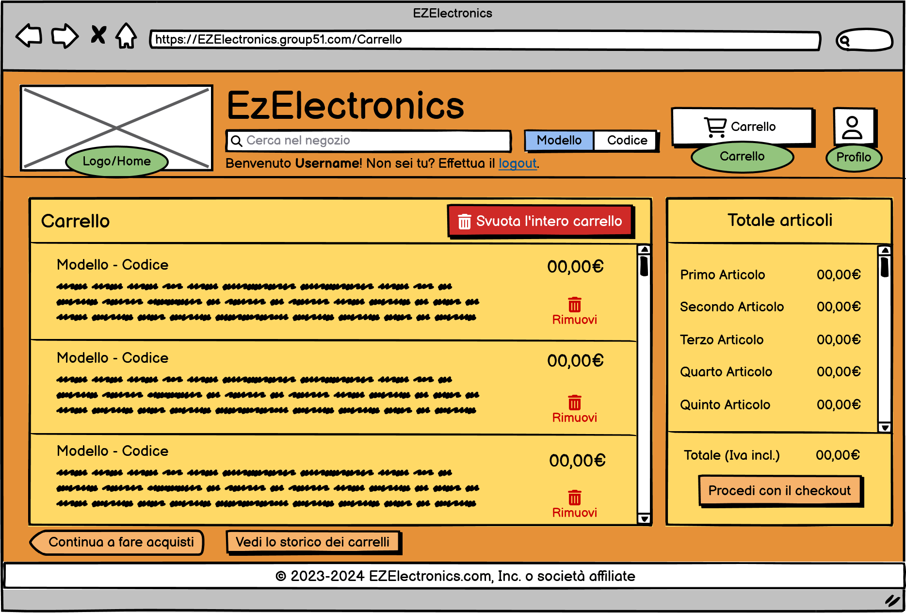 |
|Checkout effettuato| Pagina relativa alla visualizzazione di conferma di avvenuta vendita/acquisto, da parte di un utente customer, del carrello. | 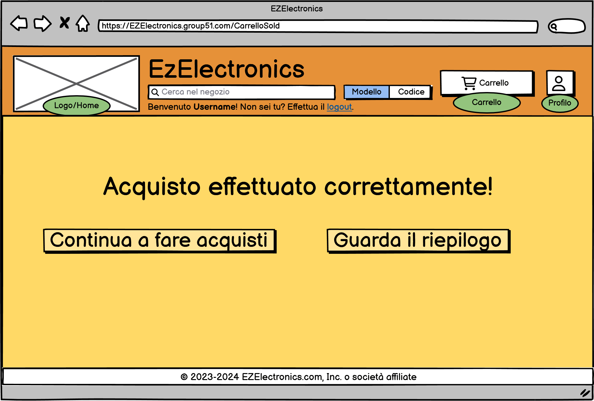 |
|Carrello vecchio pieno| Pagina relativa alla visualizzazione del resoconto di un carrello, da parte di un utente customer, nella condizione in cui il checkout sia già stato effetuato. | 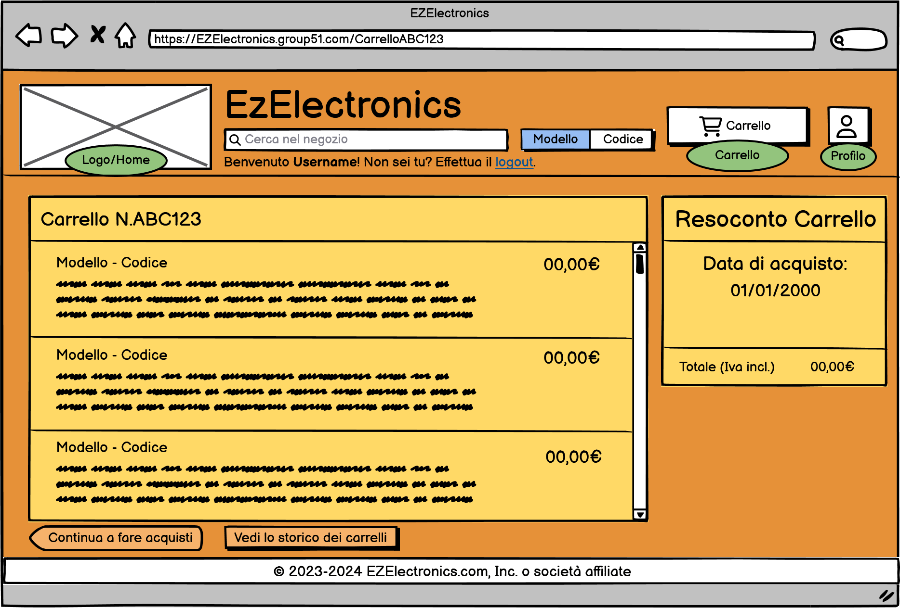 |
|Cronologia carrelli vuota| Pagina relativa alla visualizzazione dello storico dei carrelli passati, da parte di un utente customer, nella condizione in cui non vi sia alcun carrello passato. | 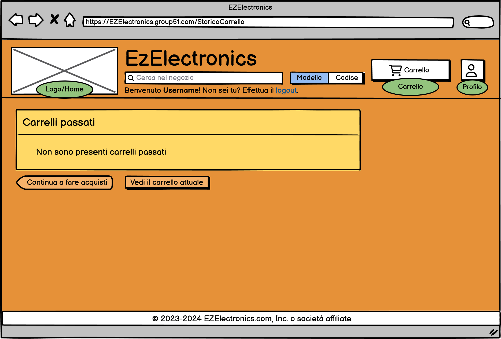 |
|Carrello carrelli piena| Pagina relativa alla visualizzazione dello storico dei carrelli passati, da parte di un utente customer, nella condizione in cui vi siano uno o più carrelli passati. | 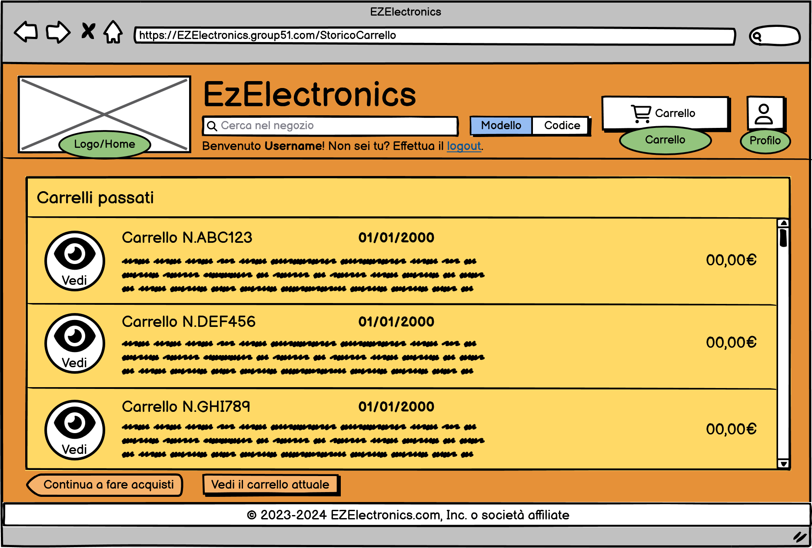 |

# Application GUI - Alert

**In questa tabella saranno riportati tutti gli alert collegati alla corretta funzionalità della GUI**

| Functionality | Description | Image |
| ----------------- | ----------------- |:-----------:|
| Alert Credenziali errate | Messaggio di avviso a comparsa relativo ad un incorretto inserimento nei campi di input. |  |
| Alert Smartphone Aggiunto al carrello | Messaggio di avviso a comparsa con durata regolabile (impostato a 3 secondi) relativo ad un click sul bottone "Aggiungi al carrello", dalla pagina principale, che comporta l'inserimento del prodotto associato alla sezione carrello del profilo. | 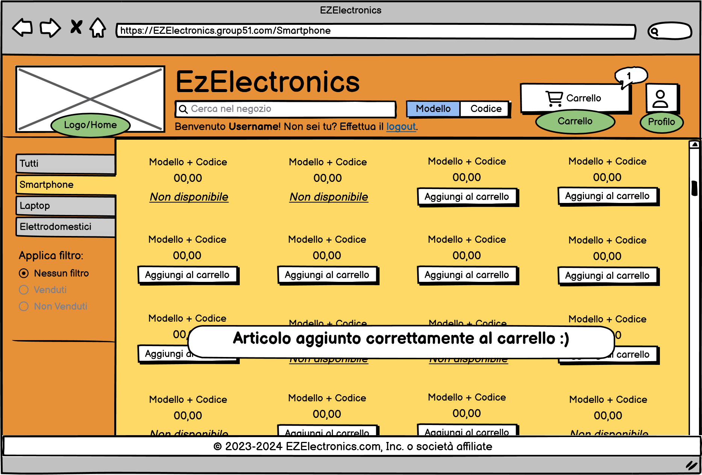 |
| Alert prodotto Aggiunto al carrello | Messaggio di avviso a comparsa con durata regolabile (impostato a 3 secondi) relativo ad un click sul bottone "Aggiungi al carrello", dalla pagina del determinato prodotto, che ne comporta l'inserimento nella sezione carrello del profilo. | 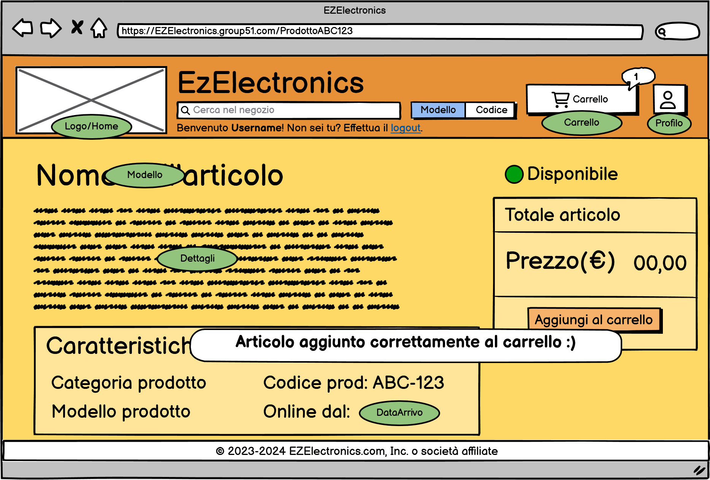 |
| Alert prodotto contrassegnato come venduto | Messaggio di input a comparsa relativo ad un click sul bottone "Contrassegna come venduto", dalla pagina del determinato prodotto, che comporta l'inserimento della "SellingDate" relativa al prodotto. | 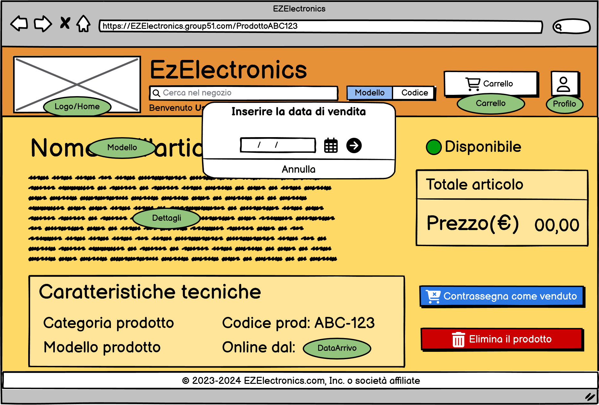 |
| Alert prodotto Aggiunto al carrello | Alert di avviso a comparsa relativo ad un click sul bottone "Elimina il prodotto", dalla pagina del determinato prodotto, che attende la selezione sulla conferma dell'operazione da parte del manager. | 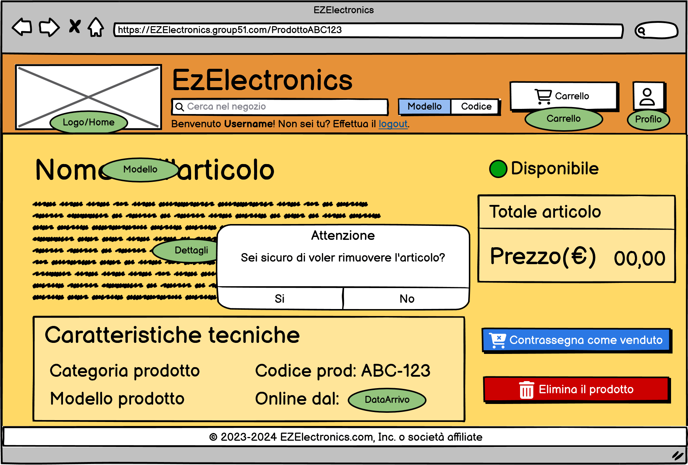 |
| Alert checkout vuoto | Alert di avviso a comparsa relativo ad un click sul bottone "Procedi con il checkout", dalla pagina del carrello vuoto, che segnala il mancato avvio del processo di checkout. | 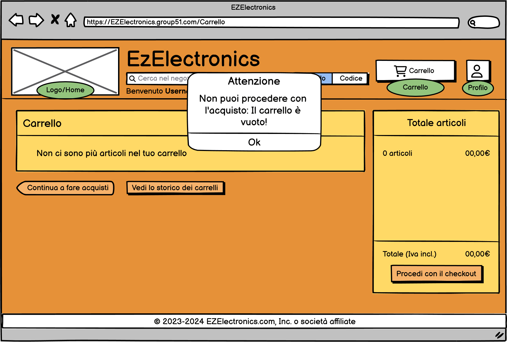 |
| Alert svuota carrello |  Alert di avviso a comparsa relativo ad un click sul bottone "Svuota l'intero carrello", dalla pagina di visualizzazione del carrello, che attende la selezione sulla conferma dell'operazione da parte del customer. | 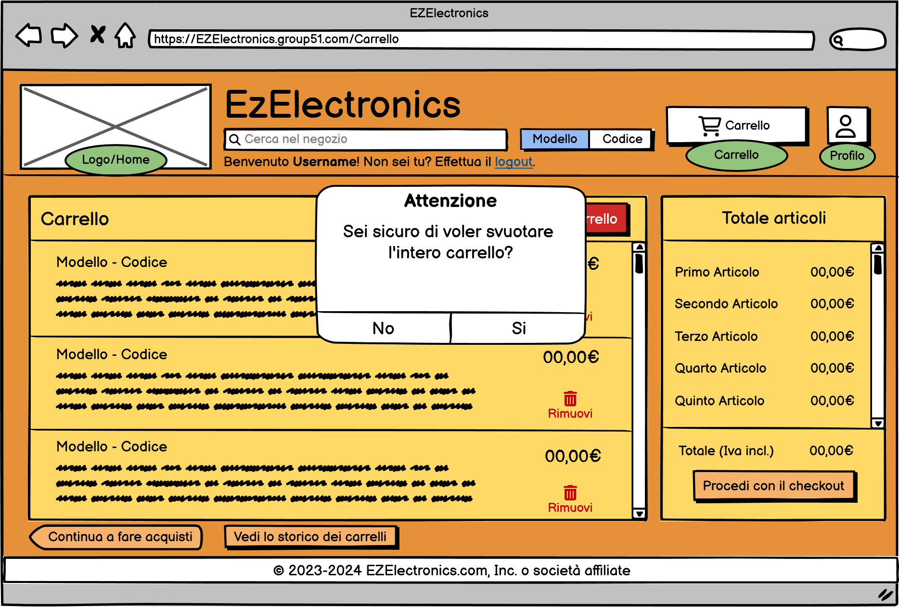 |
