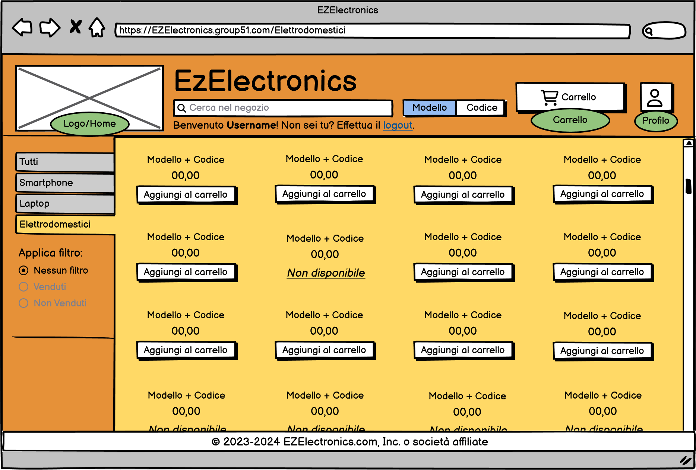

# Graphical User Interface Prototype - CURRENT

Authors: Carlino Mattia, Coppola Neri Valerio, Mosca Alessandro, Rossino Ruggero

Date:

Version: 1.0.0

# Application GUI

| Functionality | Description | Image |
| ----------------- | ----------------- |:-----------:|
|Login| Pagina relativa al login di utente. |  |
|Register| Pagina relativa alla registrazione di un utente. |  |
|Home principale v1| Homepage (vista senza filtro vendita). |  |
|Home principale v2| Homepage (vista con filtro "Venduti"). |  |
|Home principale v3| Homepage (vista con filtro "Non Venduti").|  |
|Smartphone| Pagina relativa alla presentazione generale dei prodotti appartenenti alla categoria "Smartphone". |  |
|Laptop| Pagina relativa alla presentazione generale dei prodotti appartenenti alla categoria "Laptop". |  |
|Elettrodomestici| Pagina relativa alla presentazione generale dei prodotti appartenenti alla categoria "Elettrodomestici". |  |
|Visualizzazione Prodotto Disponibile| Pagina relativa alla visualizzazione, da parte di un utente customer, di un singolo prodotto disponibile e quindi idoneo all'acquisto all'interno del sito. |  |
|Visualizzazione Prodotto Venduto| Pagina relativa alla visualizzazione, da parte di un utente customer, di un singolo prodotto venduto e quindi non idoneo all'acquisto all'interno del sito. |  |
|Visualizzazione Prodotto Disponibile| Pagina relativa alla visualizzazione, da parte di un utente manager, di un singolo prodotto disponibile e quindi idoneo all'acquisto all'interno del sito. |  |
|Visualizzazione Prodotto Venduto| Pagina relativa alla visualizzazione, da parte di un utente manager, di un singolo prodotto venduto e quindi non idoneo all'acquisto all'interno del sito. |  |

# Application GUI - Alert

**In questa tabella saranno riportati tutti gli alert collegati alla corretta funzionalità della GUI**

| Functionality | Description | Image |
| ----------------- | ----------------- |:-----------:|
| Alert Credenziali errate | Messaggio di avviso a comparsa relativo ad un incorretto inserimento nei campi di input. |  |
| Alert Smartphone Aggiunto al carrello | Messaggio di avviso a comparsa con durata regolabile (impostato a 3 secondi) relativo ad un click sul bottone "Aggiungi al carrello", dalla pagina principale, che comporta l'inserimento del prodotto associato alla sezione carrello del profilo. |  |
| Alert prodotto Aggiunto al carrello | Messaggio di avviso a comparsa con durata regolabile (impostato a 3 secondi) relativo ad un click sul bottone "Aggiungi al carrello", dalla pagina del determinato prodotto, che ne comporta l'inserimento nella sezione carrello del profilo. |  |
