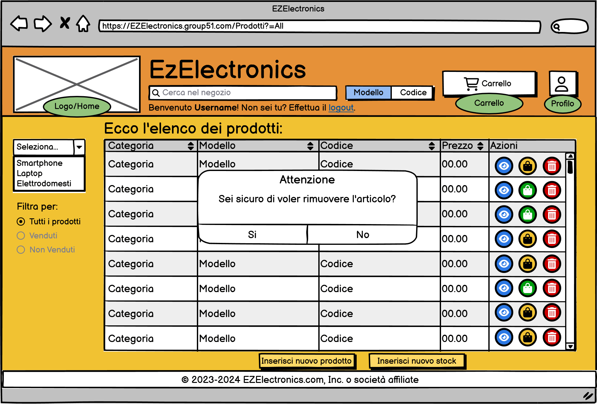

# Graphical User Interface Prototype - CURRENT

Authors: Carlino Mattia, Coppola Neri Valerio, Mosca Alessandro, Rossino Ruggero

Date: 24/04/2024

Version: 1.0.0

# Application GUI

| Functionality | Description | Image |
| ----------------- | ----------------- |:-----------:|
|Login| La pagina dedicata all'autenticazione degli utenti. |  |
|Register| Pagina relativa alla registrazione di un utente. |  |
|Home principale v1| La homepage nella sua versione base, senza alcun filtro per la visualizzazione dei prodotti in vendita. |  |
|Home principale v2| La homepage con il filtro applicato ("Venduti") per visualizzare solo i prodotti già venduti. |  |
|Home principale v3| La homepage con il filtro applicato ("Non Venduti") per visualizzare solo i prodotti non ancora venduti.|  |
|Smartphone| Pagina relativa alla presentazione generale dei prodotti appartenenti alla categoria "Smartphone". |  |
|Laptop| Pagina relativa alla presentazione generale dei prodotti appartenenti alla categoria "Laptop". |  |
|Elettrodomestici| Pagina relativa alla presentazione generale dei prodotti appartenenti alla categoria "Elettrodomestici". |  |
|Visualizzazione prodotto disponibile| Pagina relativa alla visualizzazione, da parte di un utente customer, di un singolo prodotto disponibile e quindi idoneo all'acquisto all'interno del sito. |  |
|Visualizzazione prodotto venduto| Pagina relativa alla visualizzazione, da parte di un utente customer, di un singolo prodotto venduto e quindi non idoneo all'acquisto all'interno del sito. |  |
|Visualizzazione prodotto disponibile| Pagina relativa alla visualizzazione, da parte di un utente manager, di un singolo prodotto disponibile e quindi idoneo all'acquisto all'interno del sito. |  |
|Visualizzazione prodotto venduto| Pagina relativa alla visualizzazione, da parte di un utente manager, di un singolo prodotto venduto e quindi non idoneo all'acquisto all'interno del sito. |  |
|Carrello vuoto| Pagina relativa alla visualizzazione del carrello attuale, da parte di un utente customer, nella condizione in cui nessun prodotto è stato inserito nel carrello. |  |
|Carrello pieno| Pagina relativa alla visualizzazione del carrello attuale, da parte di un utente customer, nella condizione in cui sono già stati aggiunti diversi prodotti nel carrello. |  |
|Checkout effettuato| Pagina relativa alla visualizzazione di conferma di avvenuta vendita/acquisto, da parte di un utente customer, del carrello. |  |
|Cronologia carrelli vuota| Pagina relativa alla visualizzazione dello storico dei carrelli passati, da parte di un utente customer, nella condizione in cui non vi sia alcun carrello passato. |  |
|Cronologia carrelli piena| Pagina relativa alla visualizzazione dello storico dei carrelli passati, da parte di un utente customer, nella condizione in cui vi siano uno o più carrelli passati. |  |
|Carrello vecchio pieno| Pagina relativa alla visualizzazione del resoconto di un carrello, da parte di un utente customer, nella condizione in cui il checkout sia già stato effettuato. |  |
|Info profilo Customer| Pagina relativa alla visualizzazione del profilo di un utente customer. |  |
|Info profilo Manager| Pagina relativa alla visualizzazione del profilo di un utente manager. |  |
|New product| Pagina, visualizzabile solo dall'utente manager, relativa all'inserimento di un nuovo prodotto. |  |
|New stock| Pagina, visualizzabile solo dall'utente manager, relativa all'inserimento di un nuovo stock di prodotti. |  |
|Visualizza tutti i prodotti| Pagina, visualizzabile solo dall'utente manager, relativa all'elenco di tutti i prodotti presenti nel database. |  |
|Visualizza tutti i prodotti venduti| Pagina, visualizzabile solo dall'utente manager, relativa all'elenco di tutti i prodotti non disponibili presenti nel database. |  |
|Visualizza tutti i prodotti non venduti| Pagina, visualizzabile solo dall'utente manager, relativa all'elenco di tutti i prodotti disponibili presenti nel database. |  |

# Application GUI - Alert

**In questa tabella saranno riportati tutti gli alert collegati alla corretta funzionalità della GUI**

| Functionality | Description | Image |
| ----------------- | ----------------- |:-----------:|
| Alert credenziali errate | Un avviso a comparsa che segnala l'inserimento errato nei campi di input durante il processo di login. Questo avviso fornisce un feedback immediato all'utente sull'errore nelle credenziali inserite. |  |
| Alert Smartphone aggiunto al carrello | Un messaggio di avviso temporaneo con una durata predefinita di 3 secondi, visualizzato dopo aver cliccato sul pulsante "Aggiungi al carrello" dalla pagina principale. Questo avviso conferma l'inserimento dello smartphone selezionato nel carrello dell'utente customer. |  |
| Alert prodotto aggiunto al carrello | Un avviso a comparsa temporizzato della durata di 3 secondi, che appare dopo aver cliccato sul pulsante "Aggiungi al carrello" dalla pagina di un prodotto specifico. Questo avviso conferma l'inserimento del prodotto selezionato nel carrello dell'utente customer.  |  |
| Alert prodotto contrassegnato come venduto | Un messaggio di avviso che appare dopo che un manager ha contrassegnato un prodotto come venduto dalla pagina di dettaglio del prodotto. Questo avviso informa gli utenti sul cambiamento dello stato del prodotto e l'aggiornamento della data di vendita associata ad esso. |  |
| Alert prodotto eliminato | Un avviso a comparsa che appare dopo aver cliccato sul pulsante "Elimina il prodotto" dalla pagina di dettaglio di un prodotto specifico. Questo avviso richiede la conferma dell'azione da parte del manager prima di eliminare definitivamente il prodotto.  |  |
| Alert checkout vuoto | Un avviso che compare dopo aver cliccato sul pulsante "Procedi con il checkout" dalla pagina del carrello vuoto, segnalando che non è possibile avviare il processo di checkout in assenza di prodotti nel carrello. Questo avviso fornisce un feedback all'utente sulla necessità di aggiungere prodotti al carrello prima di procedere con il checkout. |  |
| Alert rimuovi prodotto |  Un avviso che compare dopo aver cliccato sul pulsante "Rimuovi" dalla pagina di visualizzazione del carrello, richiedendo la conferma dell'azione da parte dell'utente customer prima di eliminare il prodotto dal carrello. Questo avviso offre un'opportunità all'utente di confermare o annullare l'azione di rimozione del prodotto. |  |
| Alert svuota carrello |  Un avviso che compare dopo aver cliccato sul pulsante "Svuota l'intero carrello" dalla pagina di visualizzazione del carrello, richiedendo la conferma dell'azione da parte dell'utente customer prima di svuotare completamente il carrello. Questo avviso offre all'utente la possibilità di confermare o annullare l'operazione di svuotamento del carrello. |  |
| Alert nuovo prodotto |  Un avviso che compare dopo aver cliccato sul pulsante "Inserisci prodotto" dalla pagina di inserimento dei dati di un nuovo prodotto, confermando il corretto caricamento dei dati del nuovo prodotto. Questo avviso fornisce un feedback positivo all'utente manager sull'avvenuto inserimento del nuovo prodotto nel sistema. |  |
| Alert error nuovo prodotto |  Un avviso che compare dopo aver cliccato sul pulsante "Inserisci prodotto" dalla pagina di inserimento dei dati di un nuovo prodotto e mostra un errore nei dati inseriti. Questo avviso informa l'utente manager dell'errore nei dati del nuovo prodotto e fornisce indicazioni su come correggere l'errore. |  |
| Alert nuovo stock |  Un avviso che compare dopo aver cliccato sul pulsante "Inserisci stock prodotti" dalla pagina di inserimento dei dati di un nuovo prodotto che conferma l'avvenuto caricamento. |  |
| Alert error nuovo stock |  Un avviso che compare dopo aver cliccato sul pulsante "Inserisci stock prodotti" dalla pagina di inserimento dei dati dello stock del nuovo prodotto che mostra un errore nei dati. |  |
| Alert elimina prodotto |  Un avviso che compare dopo aver cliccato sul pulsante "Elimina" dalla pagina di visualizzazione dell'elenco dei prodotti, richiedendo la conferma dell'azione da parte dell'utente manager prima di eliminare definitivamente il prodotto selezionato. Questo avviso offre all'utente la possibilità di confermare o annullare l'azione di eliminazione del prodotto. |  |
