# Graphical User Interface Prototype - FUTURE

Authors: Carlino Mattia, Coppola Neri Valerio, Mosca Alessandro, Rossino Ruggero

Date:

Version: 2.0.0

# Application GUI

| Functionality | Description | Image |
| ----------------- | ----------------- |:-----------:|
|Login| La pagina dedicata all'autenticazione degli utenti. | 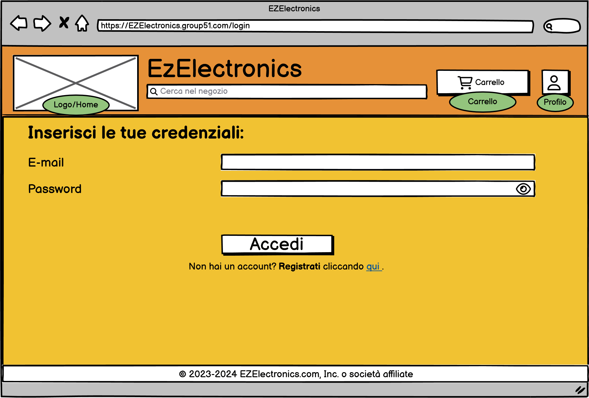 |
|Register| Pagina relativa alla registrazione di un utente. | 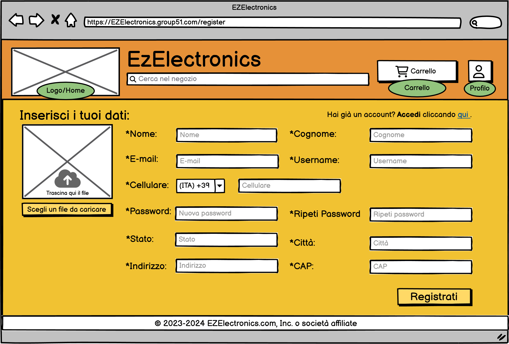 |
|Home principale generica| La homepage nella sua versione base, senza alcun filtro per la visualizzazione dei prodotti in vendita. Ogni utente, anche non autenticato, può visualizzare la pagina. | 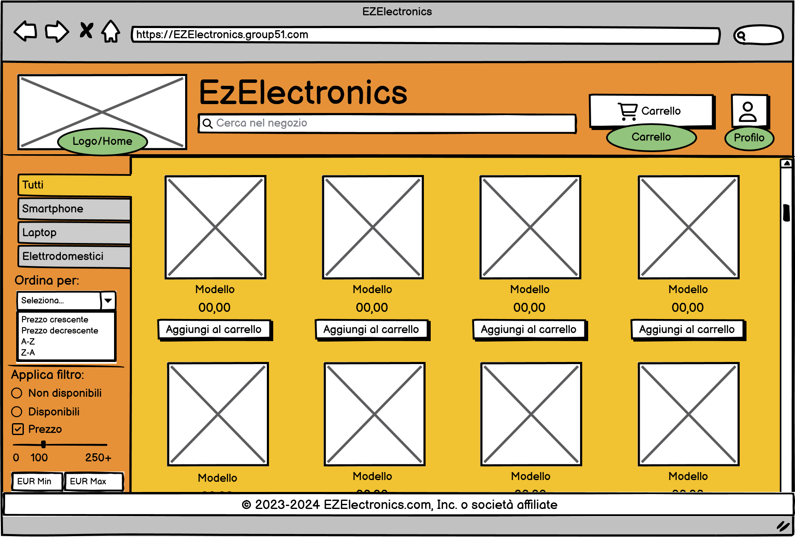 |
|Home principale utenti customer| La homepage nella sua versione base, senza alcun filtro per la visualizzazione dei prodotti in vendita. Ogni utente customer può visualizzare la pagina. | 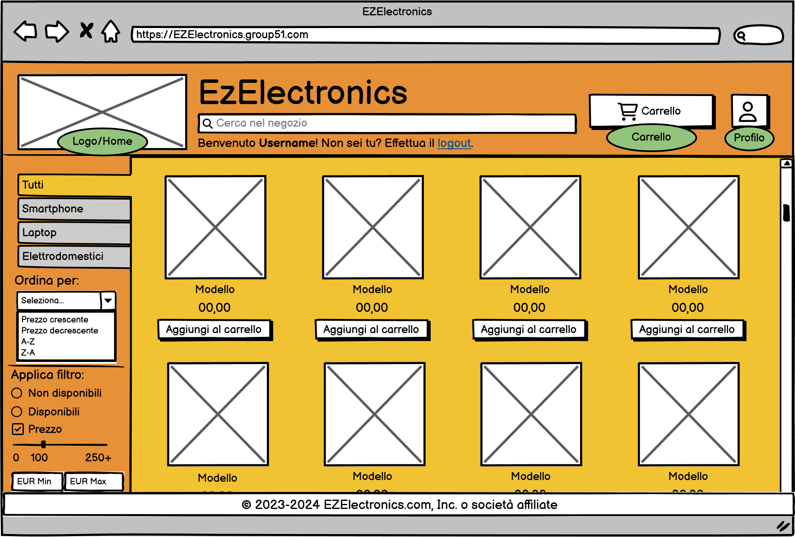 |
|Home principale filtro "Non disponibili"| La homepage con il filtro applicato ("Non Disponibili") per visualizzare solo i prodotti terminati e quindi non acquistabili. | 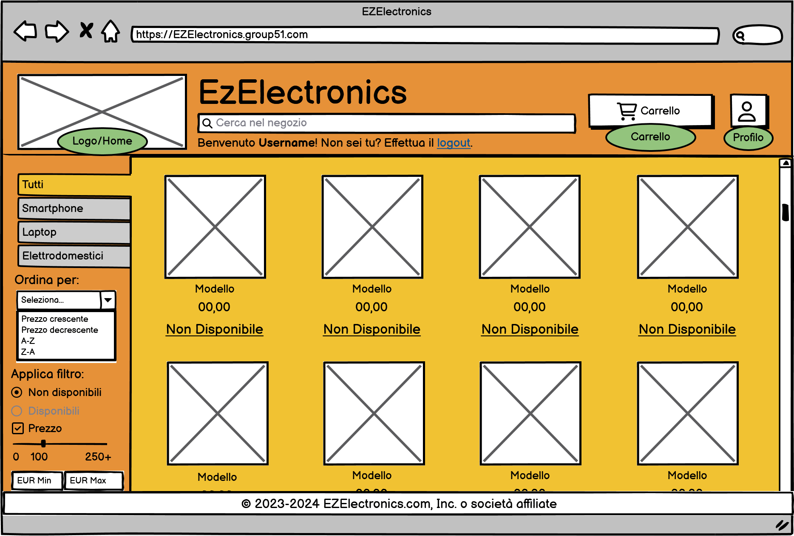 |
|Home principale filtro "Disponibili"| La homepage con il filtro applicato ("Disponibili") per visualizzare solo i prodotti disponibili all'acquisto.| 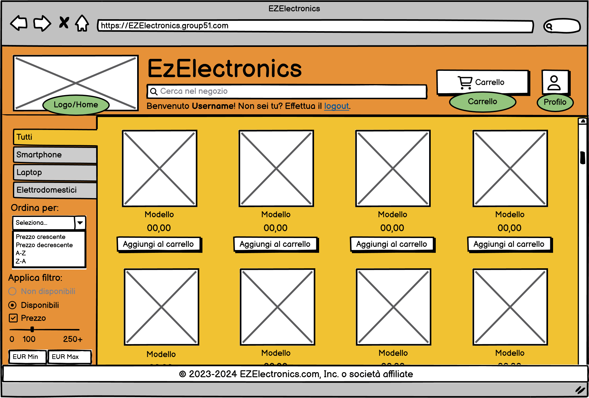 |
|Smartphone| Pagina relativa alla presentazione generale dei prodotti appartenenti alla categoria "Smartphone". |  |
|Laptop| Pagina relativa alla presentazione generale dei prodotti appartenenti alla categoria "Laptop". | 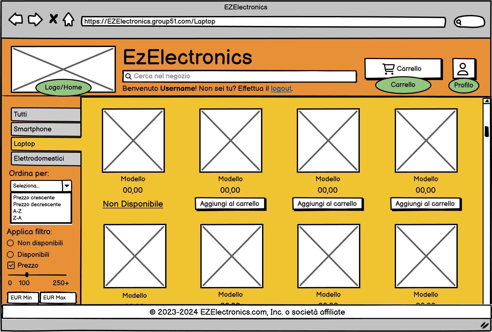 |
|Elettrodomestici| Pagina relativa alla presentazione generale dei prodotti appartenenti alla categoria "Elettrodomestici". | 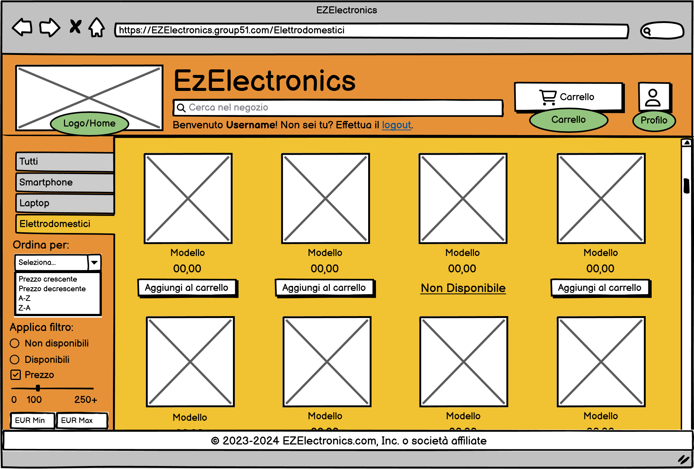 |
|Info profilo Customer| Pagina relativa alla visualizzazione del profilo di un utente customer. | 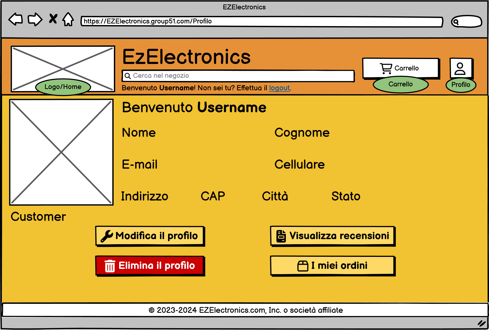 |
|Home principale utenti employee| La homepage che ogni utente employee visualizza dopo essersi autenticato. | 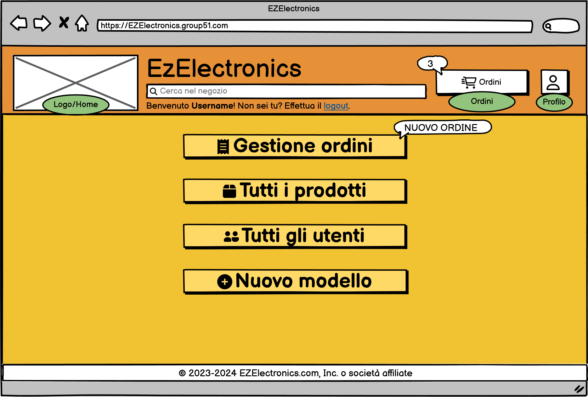 |
|Info profilo Employee| Pagina relativa alla visualizzazione del profilo di un utente employee. | 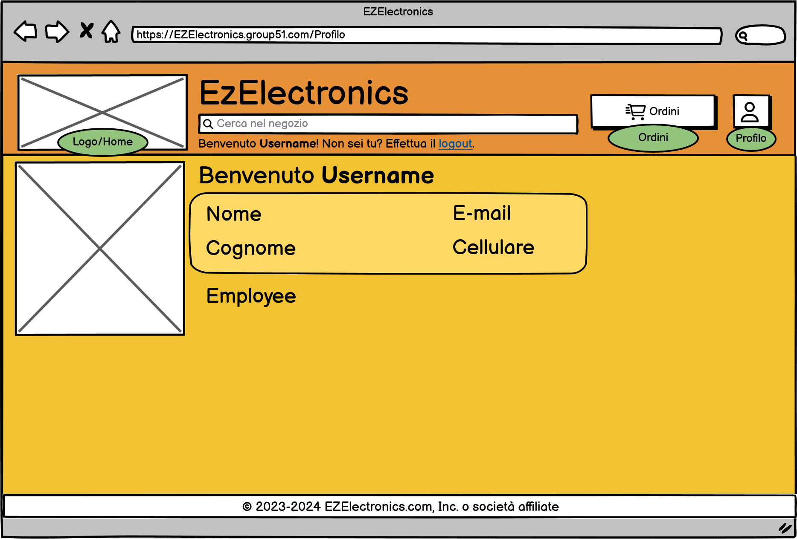 |
|Home principale utenti manager| La homepage che ogni utente manager visualizza dopo essersi autenticato. | 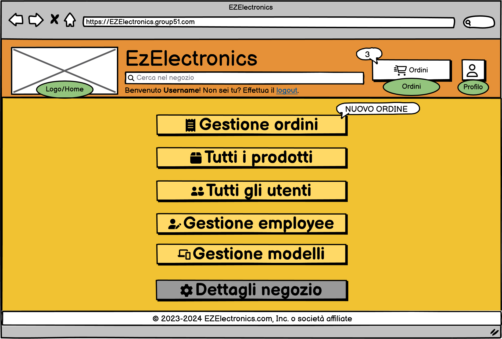 |
|Info profilo Manager| Pagina relativa alla visualizzazione del profilo di un utente manager. | 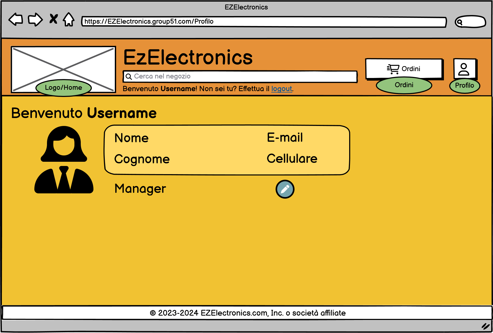 |
|Visualizzazione prodotto disponibile| Pagina relativa alla visualizzazione, da parte di un utente customer, di un singolo prodotto disponibile e quindi idoneo all'acquisto all'interno del sito. |  |
|Visualizzazione prodotto venduto| Pagina relativa alla visualizzazione, da parte di un utente customer, di un singolo prodotto venduto e quindi non idoneo all'acquisto all'interno del sito. |  |
|Visualizzazione prodotto disponibile| Pagina relativa alla visualizzazione, da parte di un utente manager, di un singolo prodotto disponibile e quindi idoneo all'acquisto all'interno del sito. |  |
|Visualizzazione prodotto venduto| Pagina relativa alla visualizzazione, da parte di un utente manager, di un singolo prodotto venduto e quindi non idoneo all'acquisto all'interno del sito. |  |
|Carrello vuoto| Pagina relativa alla visualizzazione del carrello attuale, da parte di un utente customer, nella condizione in cui nessun prodotto è stato inserito nel carrello. | 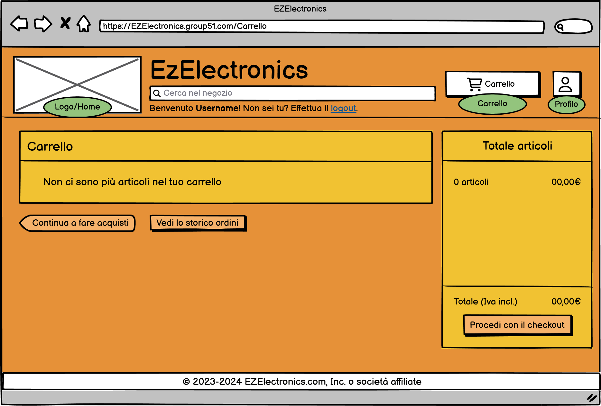 |
|Carrello pieno| Pagina relativa alla visualizzazione del carrello attuale, da parte di un utente customer, nella condizione in cui sono già stati aggiunti diversi prodotti nel carrello. | 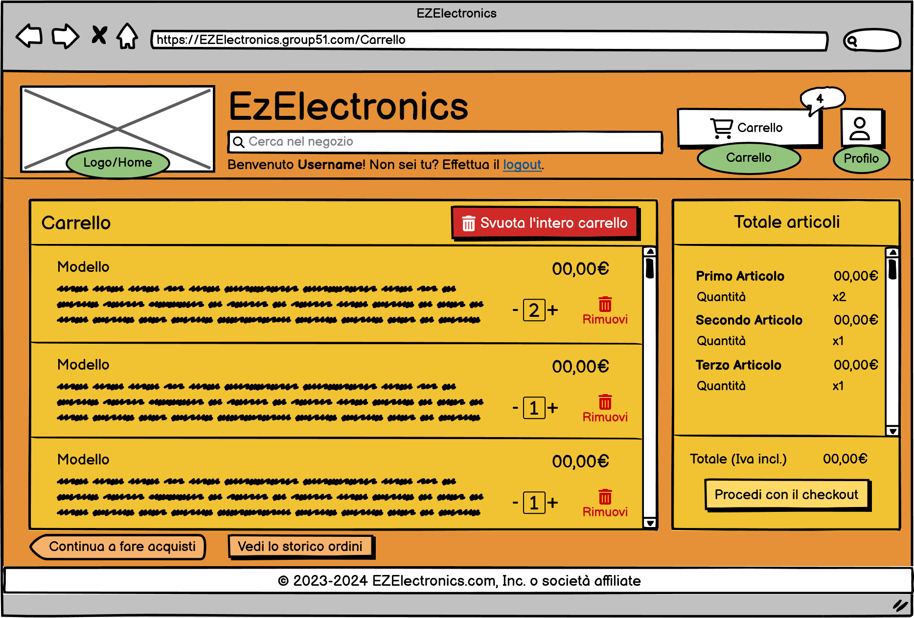 |
|Checkout effettuato| Pagina relativa alla visualizzazione di conferma di avvenuta vendita/acquisto, da parte di un utente customer, del carrello. |  |
|Cronologia carrelli vuota| Pagina relativa alla visualizzazione dello storico dei carrelli passati, da parte di un utente customer, nella condizione in cui non vi sia alcun carrello passato. |  |
|Carrello carrelli piena| Pagina relativa alla visualizzazione dello storico dei carrelli passati, da parte di un utente customer, nella condizione in cui vi siano uno o più carrelli passati. |  |
|Carrello vecchio pieno| Pagina relativa alla visualizzazione del resoconto di un carrello, da parte di un utente customer, nella condizione in cui il checkout sia già stato effetuato. |  |
|New product| Pagina, visualizzabile solo dall'utente manager, relativa all'inserimento di un nuovo prodotto. |  |
|New stock| Pagina, visualizzabile solo dall'utente manager, relativa all'inserimento di un nuovo stock di prodotti. |  |
|Visualizza tutti i prodotti| Pagina, visualizzabile solo dall'utente manager, relativa all'elenco di tutti i prodotti presenti nel database. |  |
|Visualizza tutti i prodotti venduti| Pagina, visualizzabile solo dall'utente manager, relativa all'elenco di tutti i prodotti non disponibili presenti nel database. |  |
|Visualizza tutti i prodotti non venduti| Pagina, visualizzabile solo dall'utente manager, relativa all'elenco di tutti i prodotti disponibili presenti nel database. |  |
|Footer| Barra di navigazione presente alla fine di ogni pagina diversa da quelle di autenticazione. Consente una user experience più piacevole. |  |

# Application GUI - Alert

**In questa tabella saranno riportati tutti gli alert collegati alla corretta funzionalità della GUI**

| Functionality | Description | Image |
| ----------------- | ----------------- |:-----------:|
| Alert credenziali errate | Un avviso a comparsa indicante l'inserimento errato nei campi di input durante il processo di login. | 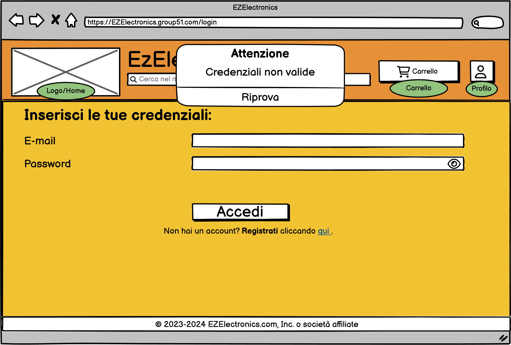 |
| Alert campi non compilati | Un avviso a comparsa indicante la mancanza di input nei campi obbligatori durante il processo di registrazione. | 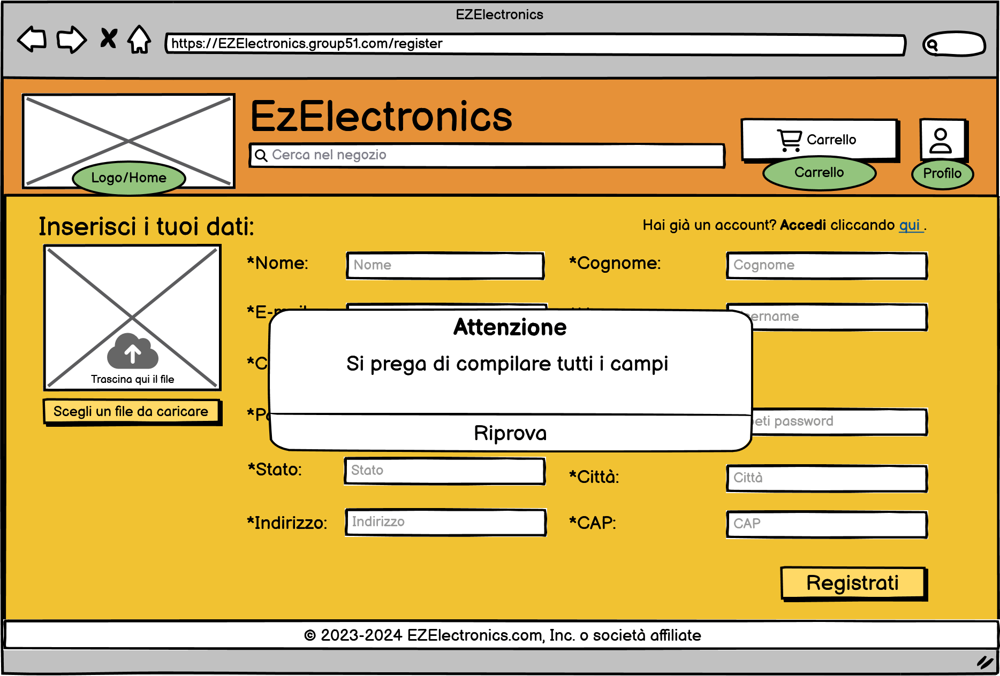 |
| Allegato file multimediale | Window che permette la selezione di un file multimediale da utilizzare come immagine del profilo dell'utente durante il processo di registrazione. | 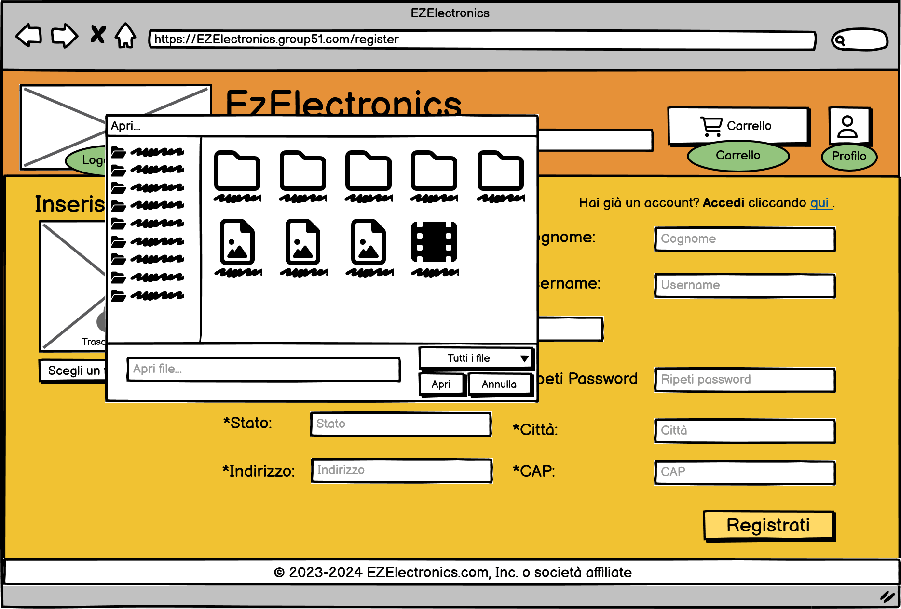 |
| Alert Smartphone aggiunto al carrello | Un messaggio di avviso temporaneo, con una durata predefinita di 3 secondi, che appare dopo aver cliccato sul pulsante "Aggiungi al carrello" dalla pagina principale e che indica l'inserimento del relativo smartphone nel carrello utente. | 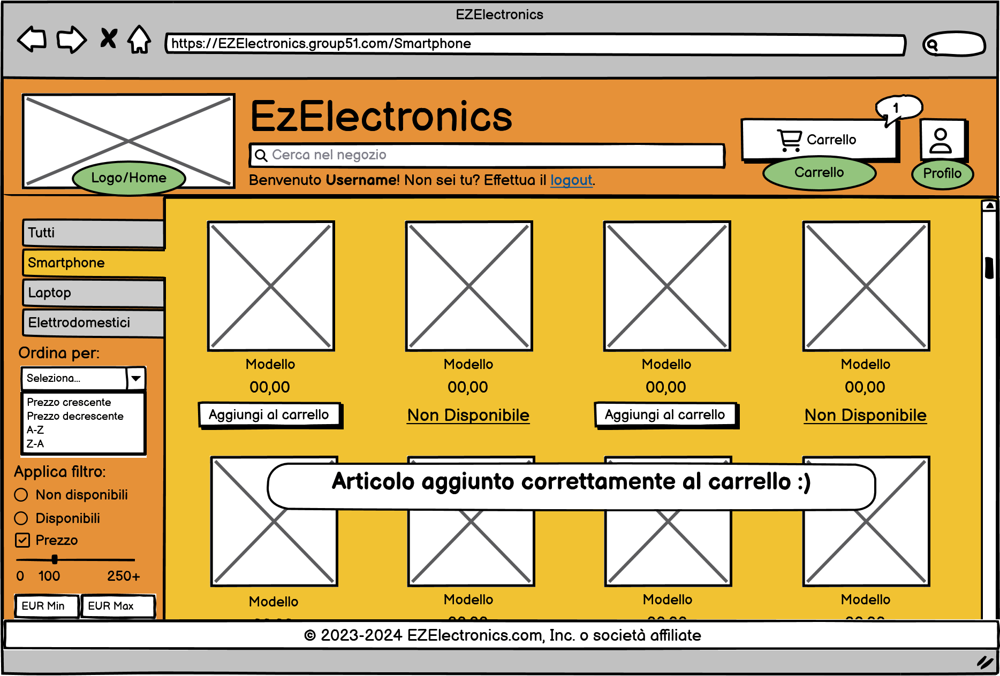 |
| Alert prodotto aggiunto al carrello | Un avviso a comparsa temporizzato, della durata di 3 secondi, che appare dopo aver cliccato sul pulsante "Aggiungi al carrello" dalla pagina di un prodotto specifico, indicando l'inserimento del prodotto nel carrello utente.  |  |
| Alert prodotto contrassegnato come venduto | Un messaggio di avviso che appare dopo che un manager ha cliccato sul pulsante "Contrassegna come venduto" dalla pagina di un prodotto specifico, indicando l'aggiornamento della data di vendita associata al prodotto. |  |
| Alert prodotto eliminato | Un avviso a comparsa che appare dopo aver cliccato sul pulsante "Elimina il prodotto" dalla pagina di un prodotto specifico, richiedendo la conferma dell'azione da parte del manager.  |  |
| Alert checkout vuoto | Un avviso che compare dopo aver cliccato sul pulsante "Procedi con il checkout" dalla pagina del carrello vuoto, segnalando l'impossibilità di avviare il processo di checkout in assenza di prodotti nel carrello. | 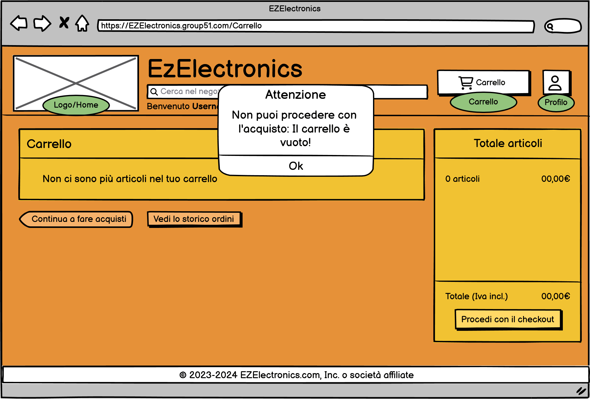 |
| Alert rimuovi prodotto |  Un avviso che compare dopo aver cliccato sul pulsante "Rimuovi" dalla pagina di visualizzazione del carrello, richiedendo la conferma dell'azione da parte dell'utente customer. | 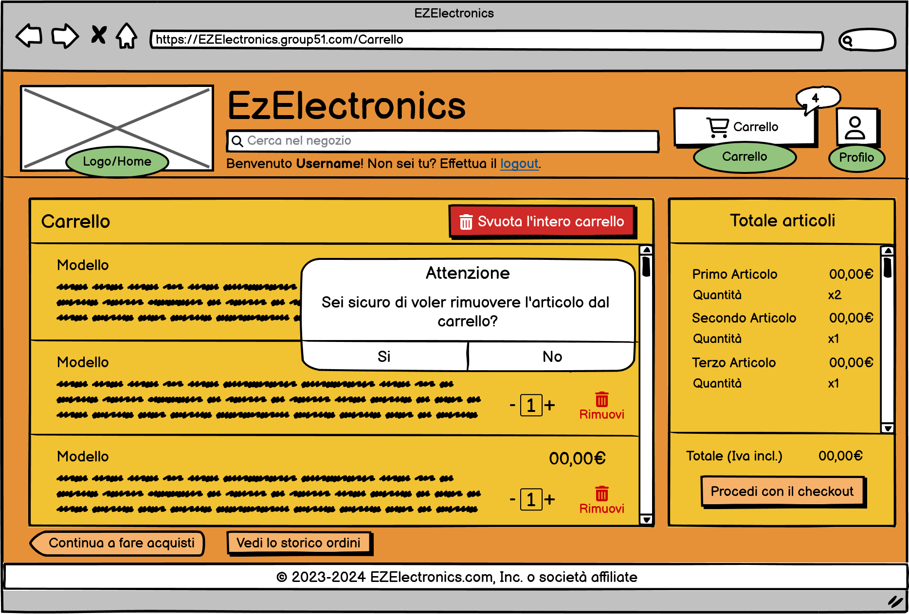 |
| Alert svuota carrello |  Un avviso che compare dopo aver cliccato sul pulsante "Svuota l'intero carrello" dalla pagina di visualizzazione del carrello, richiedendo la conferma dell'azione da parte dell'utente customer. | 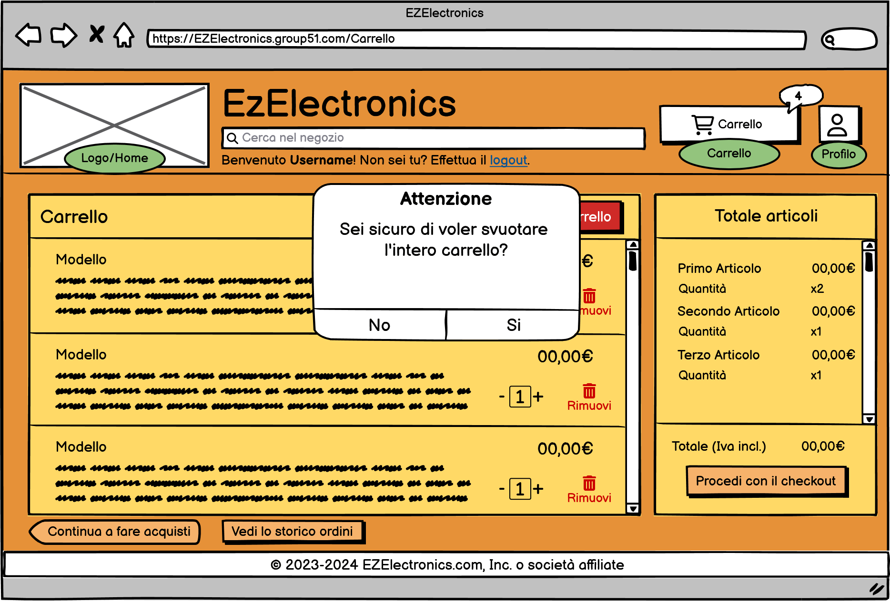 |
| Alert nuovo prodotto |  Un avviso che compare dopo aver cliccato sul pulsante "Inserisci prodotto" dalla pagina di inserimento dei dati di un nuovo prodotto che conferma l'avvenuto caricamento. |  |
| Alert error nuovo prodotto |  Un avviso che compare dopo aver cliccato sul pulsante "Inserisci prodotto" dalla pagina di inserimento dei dati di un nuovo prodotto che mostra un errore nei dati. |  |
| Alert nuovo stock |  Un avviso che compare dopo aver cliccato sul pulsante "Inserisci stock prodotti" dalla pagina di inserimento dei dati di un nuovo prodotto che conferma l'avvenuto caricamento. |  |
| Alert error nuovo stock |  Un avviso che compare dopo aver cliccato sul pulsante "Inserisci stock prodotti" dalla pagina di inserimento dei dati dello stock del nuovo prodotto che mostra un errore nei dati. |  |
| Alert elimina prodotto |  Un avviso che compare, dopo aver cliccato sul bottone elimina, dalla pagina di visualizzazione dell'elenco dei prodotti, richiedendo la conferma dell'azione da parte dell'utente manager. |  |

\<Report here the GUI that you propose for EZElectronics in FUTURE form, as proposed by the team. You are free to organize it as you prefer. A suggested presentation matches the Use cases and scenarios defined in the Requirement document. The GUI can be shown as a sequence of graphical files (jpg, png) >
