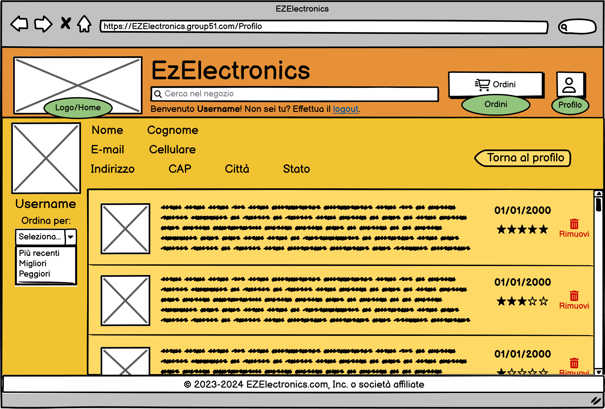
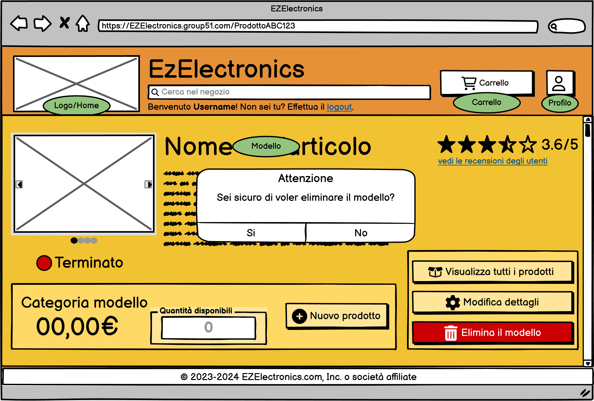

# Graphical User Interface Prototype - FUTURE

Authors: Carlino Mattia, Coppola Neri Valerio, Mosca Alessandro, Rossino Ruggero

Date: 03/05/2024

Version: 2.0.0

# Application GUI

| Functionality | Description | Image |
| ----------------- | ----------------- |:-----------:|
|Login| Questa schermata rappresenta il punto di ingresso per gli utenti autorizzati al sistema. Gli utenti devono inserire le proprie credenziali di accesso per autenticarsi e accedere alle funzionalità del sistema. |  |
|Register| Questa pagina consente agli utenti di registrare un nuovo account nel sistema. Gli utenti devono fornire le informazioni richieste e seguire il processo di registrazione per creare un nuovo profilo utente. |  |
|Home principale generica| La homepage generica rappresenta la pagina principale del sistema accessibile a tutti gli utenti, incluso quelli non autenticati. Mostra una panoramica dei prodotti disponibili senza alcun filtro specifico. |  |
|Home principale utenti customer| Questa pagina è la homepage personalizzata per gli utenti con ruolo "customer". Mostra i prodotti per gli utenti registrati come clienti. |  |
|Home principale filtro "Non disponibili"| La homepage con il filtro "Non Disponibili" applicato mostra solo i prodotti che sono terminati e non sono più disponibili per l'acquisto. |  |
|Home principale filtro "Disponibili"| La homepage con il filtro "Disponibili" applicato mostra solo i prodotti attualmente disponibili per l'acquisto.|  |
|Smartphone| Pagina relativa alla presentazione generale dei prodotti appartenenti alla categoria "Smartphone". |  |
|Laptop| Pagina relativa alla presentazione generale dei prodotti appartenenti alla categoria "Laptop". |  |
|Elettrodomestici| Pagina relativa alla presentazione generale dei prodotti appartenenti alla categoria "Elettrodomestici". |  |
|Info profilo Customer| Questa pagina consente agli utenti con ruolo "customer" di visualizzare le informazioni del proprio profilo utente. Include dettagli personali come nome, cognome, email e altre informazioni rilevanti. |  |
|Recensioni utente customer| Qui gli utenti con ruolo "customer" possono visualizzare le recensioni lasciate su prodotti acquistati. Fornisce una panoramica delle recensioni e delle valutazioni associate a ciascun prodotto. |  |
|Home principale utenti employee| Dopo l'autenticazione, gli utenti con ruolo "employee" vengono reindirizzati a questa pagina principale. Essa fornisce un riepilogo delle funzionalità e degli strumenti disponibili per gli impiegati.|  |
|Info profilo Employee| Qui gli utenti con ruolo "employee" possono visualizzare le proprie informazioni personali e professionali, come nome, ruolo e altre informazioni rilevanti. |  |
|Home principale utenti manager| Dopo l'autenticazione, gli utenti con ruolo "manager" vengono reindirizzati a questa pagina principale. Essa fornisce un riepilogo delle funzionalità e degli strumenti disponibili per i manager. |  |
|Info profilo Manager| Questa pagina consente agli utenti con ruolo "manager" di visualizzare le proprie informazioni personali e professionali, come nome, ruolo e altre informazioni rilevanti. |  |
|Gestione dettagli negozio| Solo gli utenti con ruolo "manager" possono accedere a questa pagina per modificare i dettagli relativi al negozio, come l'indirizzo, le informazioni di contatto, e altre informazioni cruciali. |  |
|Gestione modelli| Questa pagina è accessibile agli utenti con ruolo "employee" o "manager" e offre strumenti per gestire i modelli di prodotto disponibili nel sistema. Gli utenti possono visualizzare, modificare o aggiungere nuovi modelli. |  |
|Gestione ordini| Gli utenti con ruolo "employee" o "manager" possono utilizzare questa pagina per gestire gli ordini dei clienti. Fornisce una panoramica degli ordini attuali e consente agli utenti di eseguire operazioni come l'aggiornamento dello stato dell'ordine. |  |
|Ordine aperto| Questa pagina consente agli utenti con ruolo "employee" o "manager" di visualizzare i dettagli di un ordine specifico selezionato dalla pagina di gestione degli ordini. Gli utenti possono vedere un riepilogo dei dati dell'ordine e aggiornarne lo stato.  |  |
|Visualizzazione modello disponibile| Gli utenti con ruolo "customer" possono visualizzare i dettagli di un modello di prodotto disponibile per l'acquisto sul sito.|  |
|Visualizzazione prodotto terminato| Questa pagina mostra ai clienti i dettagli di un modello di prodotto che è terminato e non è più disponibile per l'acquisto. Fornisce informazioni sul modello e sul suo stato di disponibilità. |  |
|Visualizzazione modello disponibile Manager| Pagina relativa alla visualizzazione, da parte di un utente manager o di un utente employee, di un singolo modello disponibile e quindi idoneo all'acquisto all'interno del sito. |  |
|Visualizzazione prodotto terminato Manager| Pagina relativa alla visualizzazione, da parte di un utente manager o di un utente employee, di un modello terminato e quindi non idoneo all'acquisto all'interno del sito. |  |
|Modifica prodotto disponibile Manager| Pagina, visualizzabile da parte di un utente manager o di un utente employee, predisposta per le modifiche dei dettagli relativi ad un modello in vendita. |  |
|Vista prodotti modello disponibile| Pagina, visualizzabile da parte di un utente manager o di un utente employee, che mostra i diversi prodotti disponibili di un determinato modello disponibile sul sito. |  |
|Vista prodotti modello terminato| Pagina, visualizzabile da parte di un utente manager o di un utente employee, che mostra i diversi prodotti disponibili di un determinato modello terminato sul sito. |  |
|Carrello vuoto| Questa pagina mostra il carrello dell'utente quando non contiene ancora nessun prodotto. Gli utenti possono iniziare a aggiungere prodotti al carrello per procedere con gli acquisti. |  |
|Carrello pieno| Quando il carrello contiene uno o più prodotti, questa pagina mostra un riepilogo dei prodotti presenti nel carrello. Gli utenti possono visualizzare i dettagli dei prodotti e procedere al checkout. |  |
|Checkout Ritiro| Pagina relativa alla visualizzazione di conferma di avvenuto checkout, da parte di un utente customer, del carrello con selezione opzione di ritiro dell'ordine presso il negozio. |  |
|Checkout Spedizione| Pagina, visualizzata da un utente customer, di selezione e conferma dei dati per la spedizione dell'ordine. |  |
|Checkout pagamento carta di credito| Pagina, visualizzata da un utente customer, di selezione e conferma dei dati per la spedizione dell'ordine con opzione di pagamento con carta di credito. |  |
|Checkout pagamento consegna| Pagina, visualizzata da un utente customer, di selezione e conferma dei dati per la spedizione dell'ordine con opzione di pagamento in contrassegno. |  |
|Checkout pagamento PayPal| Pagina, visualizzata da un utente customer, di selezione e conferma dei dati per la spedizione dell'ordine con opzione di pagamento con PayPal. |  |
|Checkout pagamento Google Pay| Pagina, visualizzata da un utente customer, di selezione e conferma dei dati per la spedizione dell'ordine con opzione di pagamento con Google Pay. |  |
|Checkout reindirizzamento pagamento| Dopo la conferma dell'ordine, gli utenti vengono reindirizzati a questa pagina per completare il processo di pagamento. Possono essere indirizzati a una piattaforma esterna per finalizzare il pagamento. |  |
|Cronologia ordini vuota| Questa pagina mostra la cronologia degli ordini passati dell'utente quando non vi sono ancora ordini presenti nel sistema. |  |
|Cronologia ordini piena| Quando ci sono ordini precedenti nell'account dell'utente, questa pagina mostra una lista di tutti gli ordini passati. Gli utenti possono visualizzare i dettagli degli ordini precedenti e monitorare lo stato di consegna. |  |
|Ordine vecchio pieno| Questa pagina mostra un riepilogo completo di un ordine passato, compresi i dettagli dei prodotti acquistati, le informazioni di spedizione e il metodo di pagamento utilizzato. Gli utenti possono consultare questa pagina per rivedere gli ordini passati. |  |
|Inserisci recension| Gli utenti con ruolo "customer" possono utilizzare questa pagina per inserire una recensione per un prodotto precedentemente acquistato. Possono fornire una valutazione e un commento per condividere la loro esperienza con il prodotto. |  |
|Visualizza tutti utenti |Questa pagina mostra un elenco completo di tutti gli utenti registrati nel sistema, senza alcun filtro basato sul ruolo. Gli utenti con ruolo "manager" possono accedere a questa pagina per visualizzare tutti gli utenti. |  |
|Visualizza tutti utenti customer | Gli utenti con ruolo "manager" o "employee" possono visualizzare un elenco di tutti gli utenti registrati con il ruolo "customer". Questa pagina fornisce una panoramica dei clienti registrati nel sistema. |  |
|Visualizza tutti utenti employee| Questa pagina mostra un elenco di tutti gli utenti registrati con il ruolo "employee". Gli utenti con ruolo "manager" possono utilizzare questa pagina per visualizzare i dettagli degli impiegati registrati nel sistema. |  |
|Visualizza tutti utenti manager| Gli utenti con ruolo "manager" o "employee" possono visualizzare un elenco di tutti gli utenti registrati con il ruolo "manager". Questa pagina fornisce una panoramica dei manager registrati nel sistema. |  |
|Visualizza tutti utenti da employee |Questa pagina mostra un elenco completo di tutti gli utenti registrati nel sistema, senza alcun filtro basato sul ruolo. Gli utenti con ruolo "employee" possono accedere a questa pagina per visualizzare tutti gli utenti. |  |
|Visualizza tutti utenti employee da employee| Questa pagina mostra un elenco di tutti gli utenti registrati con il ruolo "employee". Gli utenti con ruolo "employee" possono utilizzare questa pagina per visualizzare i dettagli degli impiegati registrati nel sistema. |  |
|Nuovo employee| Questa pagina consente agli utenti con ruolo "manager" di registrare un nuovo utente con il ruolo "employee". Fornisce un modulo per inserire le informazioni del nuovo impiegato e creare un account associato. |  |
|Vista profilo customer da manager| Gli utenti con ruolo "manager" possono visualizzare i dettagli del profilo di un utente registrato con il ruolo "customer". Questa pagina fornisce informazioni personali e dettagli dell'account del cliente. |  |
|Vista profilo employee da manager| I manager possono visualizzare i dettagli del profilo di un utente registrato con il ruolo "employee". Questa pagina fornisce informazioni personali e dettagli dell'account dell'impiegato. |  |
|Vista profilo manager da manager| Gli utenti con ruolo "manager" possono visualizzare i dettagli del profilo di un altro manager registrato nel sistema. Questa pagina fornisce informazioni personali e dettagli dell'account del manager. |  |
|Vista ordini utente da manager| I manager possono visualizzare un elenco di tutti gli ordini effettuati da un utente registrato con il ruolo "customer". Questa pagina fornisce una panoramica degli ordini precedenti dell'utente selezionato. |  |
|Vista ordini vuoti utente da manager| Pagina, visualizzabile solo dall'utente manager, relativa alla visualizzazione di tutti gli ordini di un singolo utente customer che non ha ancora effettuato ordini. |  |
|Recensioni profilo vuoto| Pagina, visualizzabile solo dall'utente manager, relativa alla visualizzazione di tutte le recensioni di un singolo utente customer che non ha ancora effettuato recensioni. |  |
|Recensioni profilo pieno| Questa pagina mostra tutte le recensioni lasciate da un cliente registrato nel sistema. Gli utenti con ruolo "manager" o con il ruolo "employee" possono visualizzare tutte le recensioni lasciate da un cliente. |  |
|Visualizzazione elenco tutti i prodotti| Gli utenti con ruolo "manager" o con ruolo "employee" possono visualizzare un elenco completo di tutti i prodotti disponibili nel sistema, indipendentemente dallo stato di vendita. |  |
|Visualizzazione elenco tutti i prodotti non venduti| Questa pagina mostra un elenco di tutti i prodotti che non sono ancora stati venduti. Gli utenti con ruolo "manager" o con il ruolo "employee" possono utilizzare questa pagina per monitorare i prodotti rimasti invenduti. |  |
|Visualizzazione elenco tutti i prodotti venduti| Gli utenti con ruolo "manager" o con il ruolo "employee" possono visualizzare un elenco di tutti i prodotti che sono stati venduti. Questa pagina fornisce una panoramica delle vendite passate nel sistema. |  |
|Nuovo modello| Pagina, visualizzabile solo dall'utente manager, relativa all'inserimento di un nuovo modello. |  |
|Footer| Barra di navigazione presente alla fine di ogni pagina diversa da quelle di autenticazione. Consente una user experience più piacevole. |  |

# Application GUI - Alert

**In questa tabella saranno riportati tutti gli alert collegati alla corretta funzionalità della GUI**

| Functionality | Description | Image |
| ----------------- | ----------------- |:-----------:|
| Alert credenziali errate | Un avviso a comparsa indicante l'inserimento errato nei campi di input durante il processo di login. |  |
| Alert campi non compilati | Un avviso a comparsa indicante la mancanza di input nei campi obbligatori durante il processo di registrazione. |  |
| Allegato file multimediale | Window che permette la selezione di un file multimediale da utilizzare come immagine del profilo dell'utente durante il processo di registrazione. |  |
| Alert Smartphone aggiunto al carrello | Un messaggio di avviso temporaneo, con una durata predefinita di 3 secondi, che appare dopo aver cliccato sul pulsante "Aggiungi al carrello" dalla pagina principale e che indica l'inserimento del relativo smartphone nel carrello utente. |  |
| Alert elimina profilo customer |  Un avviso a comparsa, dopo aver cliccato sul bottone elimina il profilo, dalla pagina di visualizzazione del proprio profilo, richiedendo la conferma dell'azione da parte dell'utente. |  |
| Alert elimina recensione |  Un avviso a comparsa, dopo aver cliccato sul bottone "Rimuovi", dalla pagina di visualizzazione delle recensioni, richiedendo la conferma dell'azione da parte dell'utente. |  |
| Alert conferma modifiche negozio |  Un avviso a comparsa, dopo aver cliccato sul bottone "CONFERMA", dalla pagina di modifica dei dettagli del negozio, richiedendo la conferma dell'azione da parte dell'utente autenticato come manager. |  |
| Alert modello disponibile aperto manager nuovo |  Un avviso a comparsa, dopo aver cliccato sul bottone "Nuovo prodotto", dalla pagina di visualizzazione di un determinato modello ancora disponibile, richiedendo la quantità di prodotti che si intendo inserire per il modello selezionato. |  |
| Alert modello terminato manager nuovo |  Un avviso a comparsa, dopo aver cliccato sul bottone "Nuovo prodotto", dalla pagina di visualizzazione di un determinato modello terminato, richiedendo la quantità di prodotti che si intendo inserire per il modello selezionato. |  |
| Alert modello terminato manager elimina |  Un avviso a comparsa, dopo aver cliccato sul bottone "Elimina il modello", dalla pagina di visualizzazione di un determinato modello terminato, richiedendo la conferma dell'opeeazione da parte dell'utente employee o manager. |  |
| Alert acquisto carrello vuoto | Un avviso che compare dopo aver cliccato sul pulsante "Procedi con il checkout" dalla pagina del carrello vuoto, segnalando, all'utente customer, l'impossibilità di avviare il processo di checkout in assenza di prodotti nel carrello. |  |
| Alert rimuovi prodotto |  Un avviso che compare dopo aver cliccato sul pulsante "Rimuovi" dalla pagina di visualizzazione del carrello, richiedendo la conferma dell'azione da parte dell'utente customer. |  |
| Alert svuota carrello |  Un avviso che compare dopo aver cliccato sul pulsante "Svuota l'intero carrello" dalla pagina di visualizzazione del carrello, richiedendo la conferma dell'azione da parte dell'utente customer. |  |
|Alert scelta checkout| Alert relativo alla selezione di una modalità di ricezione dell'ordine. |  |
|Alert metodo di pagamento nullo| Alert che avvisa l'utente customer di non poter procedere all'operazione di spedizione poiché nessun metodo di pagamento risulta selezionato. |  |
| Allegato file multimediale recensione | Window che permette la selezione di un file multimediale da utilizzare in una recensione da parte di un utente customer. |  |
|Alert recensione effettuata| Alert che avvisa l'utente customer di aver inserito correttamente una recensione per il prodotto selezionato. |  |
|Alert Nuovo employee| Alert di attesa conferma di avvenuto inserimento di un nuovo utente con ruolo employee. |  |
|Alert eliminazione customer| Alert di attesa conferma di eliminazione di un utente con ruolo customer. |  |
|Alert eliminazione employee| Alert di attesa conferma di eliminazione di un utente con ruolo employee. |  |
|Alert eliminazione di una recensione utente| Alert di attesa conferma di eliminazione di una recensione fornita da un utente customer da parte di un utente manager. |  |
|Alert eliminazione di un prodotto vista tutti| Alert di attesa conferma di eliminazione di un prodotto da parte di un utente manager dalla schermata di tutti i prodotti. |  |
|Alert vendita di un prodotto vista tutti| Alert di attesa conferma di vendita ed inserimento data di vendita, di un prodotto, da parte di un utente manager dalla schermata di tutti i prodotti. |  |
|Alert eliminazione di un prodotto vista non venduti| Alert di attesa conferma di eliminazione di un prodotto da parte di un utente manager dalla schermata di tutti i prodotti non venduti. |  |
|Alert vendita di un prodotto vista non venduti| Alert di attesa conferma di vendita ed inserimento data di vendita, di un prodotto, da parte di un utente manager dalla schermata di tutti i prodotti non venduti. |  |
| Alert nuovo modello |  Un avviso che compare dopo aver cliccato sul pulsante "Inserisci modello" che conferma l'avvenuto caricamento. |  |
| Alert error nuovo modello |  Un avviso che compare dopo aver cliccato sul pulsante "Inserisci modello"  che mostra un errore nei dati. |  |
| Alert elimina prodotto |  Un avviso che compare, dopo aver cliccato sul bottone elimina, dalla pagina di visualizzazione dell'elenco dei prodotti, richiedendo la conferma dell'azione da parte dell'utente manager. |  |
