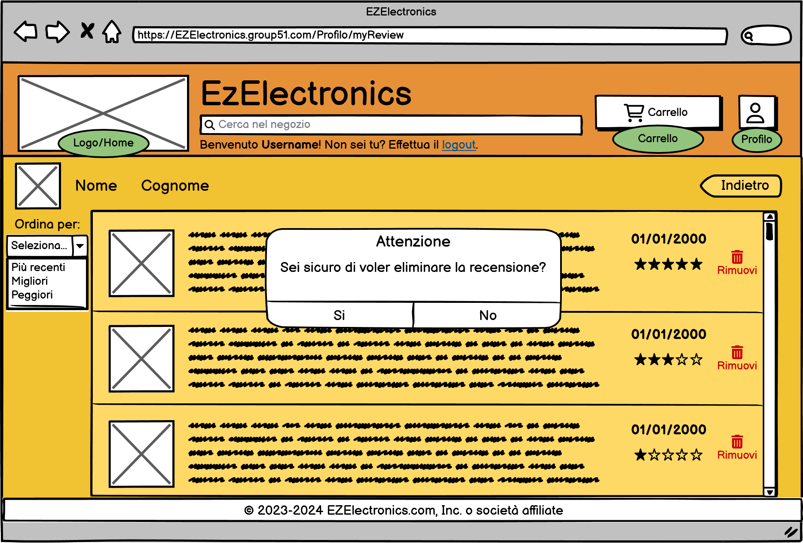
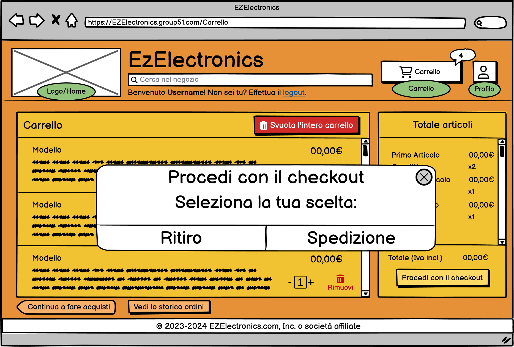

# Graphical User Interface Prototype - FUTURE

Authors: Carlino Mattia, Coppola Neri Valerio, Mosca Alessandro, Rossino Ruggero

Date: 03/05/2024

Version: 2.0.0

# Application GUI

| Functionality | Description | Image |
| ----------------- | ----------------- |:-----------:|
|Login| La pagina dedicata all'autenticazione degli utenti. |  |
|Register| Pagina relativa alla registrazione di un utente. |  |
|Home principale generica| La homepage nella sua versione base, senza alcun filtro per la visualizzazione dei prodotti in vendita. Ogni utente, anche non autenticato, può visualizzare la pagina. |  |
|Home principale utenti customer| La homepage nella sua versione base, senza alcun filtro per la visualizzazione dei prodotti in vendita. Ogni utente customer può visualizzare la pagina. |  |
|Home principale filtro "Non disponibili"| La homepage con il filtro applicato ("Non Disponibili") per visualizzare solo i prodotti terminati e quindi non acquistabili. |  |
|Home principale filtro "Disponibili"| La homepage con il filtro applicato ("Disponibili") per visualizzare solo i prodotti disponibili all'acquisto.|  |
|Smartphone| Pagina relativa alla presentazione generale dei prodotti appartenenti alla categoria "Smartphone". |  |
|Laptop| Pagina relativa alla presentazione generale dei prodotti appartenenti alla categoria "Laptop". |  |
|Elettrodomestici| Pagina relativa alla presentazione generale dei prodotti appartenenti alla categoria "Elettrodomestici". |  |
|Info profilo Customer| Pagina relativa alla visualizzazione del profilo di un utente customer. |  |
|Recensioni utente customer| Pagina relativa alla visualizzazione delle proprie recensioni da parte di un utente customer, accessibile dal profilo. |  |
|Home principale utenti employee| La homepage che ogni utente employee visualizza dopo essersi autenticato. |  |
|Info profilo Employee| Pagina relativa alla visualizzazione del profilo di un utente employee. |  |
|Home principale utenti manager| La homepage che ogni utente manager visualizza dopo essersi autenticato. |  |
|Info profilo Manager| Pagina relativa alla visualizzazione del profilo di un utente manager. |  |
|Gestione dettagli negozio| Pagina, visualizzabile solo dagli utenti manager, relativa alla modifica dei dettagli relativi al negozio |  |
|Gestione modelli| Pagina, visualizzabile solo ad un utente employee o manager, relativa alla presentazione dei diversi modelli disponibili sul sito. |  |
|Gestione ordini| Pagina, visualizzabile solo ad un utente employee o manager, relativa alla presentazione dei diversi ordini presenti sul sito. |  |
|Ordine aperto| Pagina, visualizzabile solo ad un utente employee o manager, relativa alla presentazione dell'ordine selezionato dalla pagina di gestione degli ordini. In questa pagina l'employee o il manager possono vedere il riepilogo dei dati di un ordine e aggiornare lo stato di un ordine.  |  |
|Visualizzazione modello disponibile| Pagina relativa alla visualizzazione, da parte di un utente customer, di un modello disponibile e quindi idoneo all'acquisto all'interno del sito. |  |
|Visualizzazione prodotto terminato| Pagina relativa alla visualizzazione, da parte di un utente customer, di un modello terminato e quindi non idoneo all'acquisto all'interno del sito. |  |
|Visualizzazione modello disponibile Manager| Pagina relativa alla visualizzazione, da parte di un utente manager o di un utente employee, di un singolo modello disponibile e quindi idoneo all'acquisto all'interno del sito. |  |
|Visualizzazione prodotto terminato Manager| Pagina relativa alla visualizzazione, da parte di un utente manager o di un utente employee, di un modello terminato e quindi non idoneo all'acquisto all'interno del sito. |  |
|Modifica prodotto disponibile Manager| Pagina, visualizzabile da parte di un utente manager o di un utente employee, predisposta per le modifiche dei dettagli relativi ad un modello in vendita. |  |
|Vista prodotti modello disponibile| Pagina, visualizzabile da parte di un utente manager o di un utente employee, che mostra i diversi prodotti disponibili di un determinato modello disponibile sul sito. |  |
|Vista prodotti modello terminato| Pagina, visualizzabile da parte di un utente manager o di un utente employee, che mostra i diversi prodotti disponibili di un determinato modello terminato sul sito. |  |
|Carrello vuoto| Pagina relativa alla visualizzazione del carrello, da parte di un utente customer, nella condizione in cui nessun prodotto è stato inserito nel carrello. |  |
|Carrello pieno| Pagina relativa alla visualizzazione del carrello attuale, da parte di un utente customer, nella condizione in cui sono già stati aggiunti diversi prodotti nel carrello. |  |
|Checkout Ritiro| Pagina relativa alla visualizzazione di conferma di avvenuto checkout, da parte di un utente customer, del carrello con selezione opzione di ritiro dell'ordine presso il negozio. |  |
|Checkout Spedizione| Pagina, visualizzata da un utente customer, di selezione e conferma dei dati per la spedizione dell'ordine. |  |
|Checkout pagamento carta di credito| Pagina, visualizzata da un utente customer, di selezione e conferma dei dati per la spedizione dell'ordine con opzione di pagamento con carta di credito. |  |
|Checkout pagamento consegna| Pagina, visualizzata da un utente customer, di selezione e conferma dei dati per la spedizione dell'ordine con opzione di pagamento in contrassegno. |  |
|Checkout pagamento PayPal| Pagina, visualizzata da un utente customer, di selezione e conferma dei dati per la spedizione dell'ordine con opzione di pagamento con PayPal. |  |
|Checkout pagamento Google Pay| Pagina, visualizzata da un utente customer, di selezione e conferma dei dati per la spedizione dell'ordine con opzione di pagamento con Google Pay. |  |
|Checkout reindirizzamento pagamento| Pagina alla quale viene reinderizzato un utente customer per il pagamento |  |
|Cronologia ordini vuota| Pagina relativa alla visualizzazione degli ordini passati, da parte di un utente customer, nella condizione in cui non vi sia alcun ordine passato. |  |
|Cronologia ordini piena| Pagina relativa alla visualizzazione degli ordini passati, da parte di un utente customer, nella condizione in cui vi siano uno o più ordini passati. |  |
|Ordine vecchio pieno| Pagina relativa alla visualizzazione del resoconto di un ordine, da parte di un utente customer, nella condizione in cui il checkout sia già stato effetuato. |  |
|Inserisci recension| Pagina relativa all'inserimento di una recensione, da parte di un utente customer, per un prodotto acquistato. |  |
|Visualizza tutti utenti | Pagina, visualizzabile dagli utenti manager e dagli utenti employee, relativa alla visualizzazione dell'elenco di tutti gli utenti, senza filtro sul ruolo. |  |
|Visualizza tutti utenti customer | Pagina, visualizzabile dagli utenti manager e dagli utenti employee, relativa alla visualizzazione dell'elenco di tutti gli utenti customer. |  |
|Visualizza tutti utenti employee| Pagina, visualizzabile dagli utenti manager e dagli utenti employee, relativa alla visualizzazione dell'elenco di tutti gli utenti employee. |  |
|Visualizza tutti utenti manager| Pagina, visualizzabile dagli utenti manager e dagli utenti employee, relativa alla visualizzazione dell'elenco di tutti gli utenti manager. |  |
|Nuovo employee| Pagina, accessibile solo dall'utente manager, relativa all'inserimento di un nuovo utente con ruolo employee. |  |
|Vista profilo customer da manager| Pagina, visualizzabile solo dall'utente manager, relativa ad un profilo di un utente customer. |  |
|Vista profilo employee da manager| Pagina, visualizzabile solo dall'utente manager, relativa ad un profilo di un utente employee. |  |
|Vista profilo manager da manager| Pagina, visualizzabile solo dall'utente manager, relativa ad un profilo di un utente manager. |  |
|Vista ordini utente da manager| Pagina, visualizzabile solo dall'utente manager, relativa alla visualizzazione di tutti gli ordini di un singolo utente customer. |  |
|Vista ordini vuoti utente da manager| Pagina, visualizzabile solo dall'utente manager, relativa alla visualizzazione di tutti gli ordini di un singolo utente customer che non ha ancora effettuato ordini. |  |
|Recensioni profilo vuoto| Pagina, visualizzabile solo dall'utente manager, relativa alla visualizzazione di tutte le recensioni di un singolo utente customer che non ha ancora effettuato recensioni. |  |
|Recensioni profilo pieno| Pagina, visualizzabile solo dall'utente manager, relativa alla visualizzazione di tutte le recensioni di un singolo utente customer. |  |
|Visualizzazione elenco tutti i prodotti| Pagina, visualizzabile solo dall'utente manager, relativa all'elenco di tutti i prodotti. |  |
|Visualizzazione elenco tutti i prodotti non venduti| Pagina, visualizzabile solo dall'utente manager, relativa all'elenco di tutti i prodotti ancora non venduti. |  |
|Visualizzazione elenco tutti i prodotti venduti| Pagina, visualizzabile solo dall'utente manager, relativa all'elenco di tutti i prodotti venduti. |  |
|Nuovo modello| Pagina, visualizzabile solo dall'utente manager, relativa all'inserimento di un nuovo modello. |  |
|Footer| Barra di navigazione presente alla fine di ogni pagina diversa da quelle di autenticazione. Consente una user experience più piacevole. |  |

# Application GUI - Alert

**In questa tabella saranno riportati tutti gli alert collegati alla corretta funzionalità della GUI**

| Functionality | Description | Image |
| ----------------- | ----------------- |:-----------:|
| Alert credenziali errate | Un avviso a comparsa indicante l'inserimento errato nei campi di input durante il processo di login. |  |
| Alert campi non compilati | Un avviso a comparsa indicante la mancanza di input nei campi obbligatori durante il processo di registrazione. |  |
| Allegato file multimediale | Window che permette la selezione di un file multimediale da utilizzare come immagine del profilo dell'utente durante il processo di registrazione. |  |
| Alert Smartphone aggiunto al carrello | Un messaggio di avviso temporaneo, con una durata predefinita di 3 secondi, che appare dopo aver cliccato sul pulsante "Aggiungi al carrello" dalla pagina principale e che indica l'inserimento del relativo smartphone nel carrello utente. |  |
| Alert elimina profilo customer |  Un avviso a comparsa, dopo aver cliccato sul bottone elimina il profilo, dalla pagina di visualizzazione del proprio profilo, richiedendo la conferma dell'azione da parte dell'utente. |  |
| Alert elimina recensione |  Un avviso a comparsa, dopo aver cliccato sul bottone "Rimuovi", dalla pagina di visualizzazione delle recensioni, richiedendo la conferma dell'azione da parte dell'utente. |  |
| Alert conferma modifiche negozio |  Un avviso a comparsa, dopo aver cliccato sul bottone "CONFERMA", dalla pagina di modifica dei dettagli del negozio, richiedendo la conferma dell'azione da parte dell'utente autenticato come manager. |  |
| Alert modello disponibile aperto manager nuovo |  Un avviso a comparsa, dopo aver cliccato sul bottone "Nuovo prodotto", dalla pagina di visualizzazione di un determinato modello ancora disponibile, richiedendo la quantità di prodotti che si intendo inserire per il modello selezionato. |  |
| Alert modello terminato manager nuovo |  Un avviso a comparsa, dopo aver cliccato sul bottone "Nuovo prodotto", dalla pagina di visualizzazione di un determinato modello terminato, richiedendo la quantità di prodotti che si intendo inserire per il modello selezionato. |  |
| Alert modello terminato manager elimina |  Un avviso a comparsa, dopo aver cliccato sul bottone "Elimina il modello", dalla pagina di visualizzazione di un determinato modello terminato, richiedendo la conferma dell'opeeazione da parte dell'utente employee o manager. |  |
| Alert acquisto carrello vuoto | Un avviso che compare dopo aver cliccato sul pulsante "Procedi con il checkout" dalla pagina del carrello vuoto, segnalando, all'utente customer, l'impossibilità di avviare il processo di checkout in assenza di prodotti nel carrello. |  |
| Alert rimuovi prodotto |  Un avviso che compare dopo aver cliccato sul pulsante "Rimuovi" dalla pagina di visualizzazione del carrello, richiedendo la conferma dell'azione da parte dell'utente customer. |  |
| Alert svuota carrello |  Un avviso che compare dopo aver cliccato sul pulsante "Svuota l'intero carrello" dalla pagina di visualizzazione del carrello, richiedendo la conferma dell'azione da parte dell'utente customer. |  |
|Alert scelta checkout| Alert relativo alla selezione di una modalità di ricezione dell'ordine. |  |
|Alert metodo di pagamento nullo| Alert che avvisa l'utente customer di non poter procedere all'operazione di spedizione poiché nessun metodo di pagamento risulta selezionato. |  |
| Allegato file multimediale recensione | Window che permette la selezione di un file multimediale da utilizzare in una recensione da parte di un utente customer. |  |
|Alert recensione effettuata| Alert che avvisa l'utente customer di aver inserito correttamente una recensione per il prodotto selezionato. |  |
|Alert Nuovo employee| Alert di attesa conferma di avvenuto inserimento di un nuovo utente con ruolo employee. |  |
|Alert eliminazione customer| Alert di attesa conferma di eliminazione di un utente con ruolo customer. |  |
|Alert eliminazione employee| Alert di attesa conferma di eliminazione di un utente con ruolo employee. |  |
|Alert eliminazione di una recensione utente| Alert di attesa conferma di eliminazione di una recensione fornita da un utente customer da parte di un utente manager. |  |
|Alert eliminazione di un prodotto vista tutti| Alert di attesa conferma di eliminazione di un prodotto da parte di un utente manager dalla schermata di tutti i prodotti. |  |
|Alert vendita di un prodotto vista tutti| Alert di attesa conferma di vendita ed inserimento data di vendita, di un prodotto, da parte di un utente manager dalla schermata di tutti i prodotti. |  |
|Alert eliminazione di un prodotto vista non venduti| Alert di attesa conferma di eliminazione di un prodotto da parte di un utente manager dalla schermata di tutti i prodotti non venduti. |  |
|Alert vendita di un prodotto vista non venduti| Alert di attesa conferma di vendita ed inserimento data di vendita, di un prodotto, da parte di un utente manager dalla schermata di tutti i prodotti non venduti. |  |
| Alert nuovo modello |  Un avviso che compare dopo aver cliccato sul pulsante "Inserisci modello" che conferma l'avvenuto caricamento. |  |
| Alert error nuovo modello |  Un avviso che compare dopo aver cliccato sul pulsante "Inserisci modello"  che mostra un errore nei dati. |  |
| Alert elimina prodotto |  Un avviso che compare, dopo aver cliccato sul bottone elimina, dalla pagina di visualizzazione dell'elenco dei prodotti, richiedendo la conferma dell'azione da parte dell'utente manager. |  |
