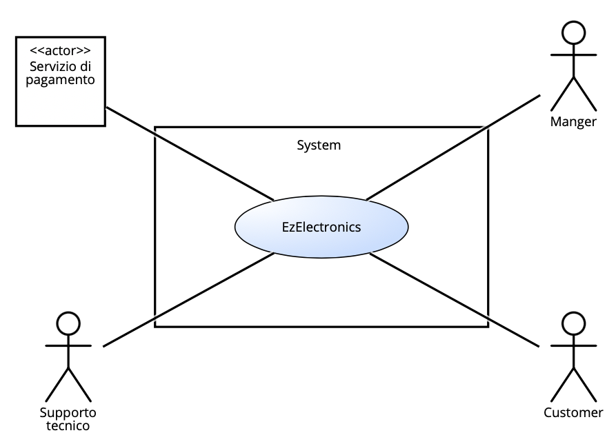

# Requirements Document - current EZElectronics

Date:

Version: V1 - description of EZElectronics in CURRENT form (as received by teachers)

| Version number | Change |
| :------------: | :----: |
|        4       |    Stories and personas |

# Contents

- [Requirements Document - current EZElectronics](#requirements-document---current-ezelectronics)
- [Contents](#contents)
- [Informal description](#informal-description)
- [Stakeholders](#stakeholders)
- [Context Diagram and interfaces](#context-diagram-and-interfaces)
  - [Context Diagram](#context-diagram)
  - [Interfaces](#interfaces)
- [Stories and personas](#stories-and-personas)
- [Functional and non functional requirements](#functional-and-non-functional-requirements)
  - [Functional Requirements](#functional-requirements)
  - [Non Functional Requirements](#non-functional-requirements)
- [Use case diagram and use cases](#use-case-diagram-and-use-cases)
  - [Use case diagram](#use-case-diagram)
    - [Use case 1, UC1](#use-case-1-uc1)
      - [Scenario 1.1](#scenario-11)
      - [Scenario 1.2](#scenario-12)
      - [Scenario 1.x](#scenario-1x)
    - [Use case 2, UC2](#use-case-2-uc2)
    - [Use case x, UCx](#use-case-x-ucx)
- [Glossary](#glossary)
- [System Design](#system-design)
- [Deployment Diagram](#deployment-diagram)

# Informal description

EZElectronics (read EaSy Electronics) is a software application designed to help managers of electronics stores to manage their products and offer them to customers through a dedicated website. Managers can assess the available products, record new ones, and confirm purchases. Customers can see available products, add them to a cart and see the history of their past purchases.

# Stakeholders

| Stakeholder name | Description |
| :--------------: | :---------: |
| Manager          | Principale utente dell'applicazione, ha un interesse diretto nel suo funzionamento ottimale per gestire efficacemente i prodotti e le vendite del suo negozio. |
| Customer         | Gli acquirenti che utilizzano il sito web dedicato per visualizzare e acquistare prodotti. Hanno interesse nell'esperienza utente, nella facilità di navigazione, e nella consistenza sui dati dei prodotti. |
| Supporto tecnico | Responsabili della creazione, manutenzione e aggiornamento dell'applicazione. Sono interessati a garantire che l'applicazione sia funzionale, sicura e risponda alle esigenze degli altri stakeholder. |
| Sistema di pagamenti | Sistema terzo attraverso il quale vengono approvati o rifiutati i pagamenti dei Customer e che garantisce la sicurezza e il completmaneto delle transazioni. |

# Context Diagram and interfaces

## Context Diagram

## Interfaces

|   Actor   | Logical Interface | Physical Interface |
| :-------: | :---------------: | :----------------: |
| Manager | Pc                  | GUI                    |
| Customer | Smartphone, Pc | GUI |
| Servizio di pagamento | Internet | https://developers.satispay.com/docs/official-plugins |
| Supporto tecnico | Pc | GUI |

# Stories and personas

## Personas

|   **Manager**   |  |
| :-------: | :---------------: |
| Età| 37 anni|
| Occupazione| Manager di un negozio di elettronica|
|Comportamento| Organizzato, interessato alle vendite|
|Obiettivi| Monitorare le vendite, gestire l'inventario e i prodotti del negozio|
|Necessità| Dashboard per le vendite, gestione dell'inventario|

|   **Customer**   |  |
| :-------: | :---------------: |
| Età| 28 anni|
| Occupazione| Graphic designer|
|Comportamento|  Attenta ai dettagli, interessata ai prodotti di qualità|
|Obiettivi| Acquistare prodotti di qualità e visualizzare i propri ordini precedenti|
|Necessità| Navigazione intuitiva, acquisti sicuri|

|   **Non registrato**   |  |
| :-------: | :---------------: |
| Età| 40 anni|
| Occupazione| Imprenditore|
|Comportamento|  Pratico, interessato agli affari, non vuole perdere tempo|
|Obiettivi| Trovare informazioni sui prodotti, confrontare prezzi|
|Necessità| Accesso facile ai prodotti, dettagli dei prodotti senza registrazione|

## Stories

|  **Manager**  |
| :-------: |
|Come manager voglio inserire/togliere prodotti dall’inventario o settarli come venduti|
|Come manager voglio poter visualizzare la lista degli account degli utenti con la facoltà di eliminarne alcuni se malevoli|
|Come manager voglio poter visualizzare tutti i prodotti nell’inventario/appartenenti ad una specifica categoria/modello o dato un codice voglio visualizzare il relativo prodotto|
|  **Customer** |
| :-------: |
|Come cliente voglio aggiungere/rimuovere/visualizzare i prodotti del carrello in sicurezza|
|Come cliente voglio effettuare l’ordine relativo al mio carrello in semplici passi|
|Come cliente voglio poter visualizzare la cronologia ordini effettuati da me|
|Come cliente voglio poter visualizzare tutti i prodotti nell’inventario/appartenenti ad una specifica categoria/modello o dato un codice voglio visualizzare il relativo prodotto|
|  **Non registrato** |
| :-------: |
|Come utente non registrato voglio vedere i dettagli dei prodotti senza dovermi registrare|
|Come utente non registrato voglio poter visualizzare tutti i prodotti nell’inventario/appartenenti ad una specifica categoria/modello o dato un codice voglio visualizzare il relativo prodotto senza dovermi registrare|
|Come utente non registrato voglio poter creare un account in pochi passi|

# Functional and non functional requirements

## Functional Requirements

|  ID   | Description |
| :---: | :---------: |
| **FR1**  |      **Gestione Utenti**       |
| FR1.1  | Chiunque può visualizzare la lista di tutti gli utenti registrati      |
| FR1.2 |   Chiunque può filtrare la lista degli utenti dato un specifico ruolo         |
| FR1.3 |    Chiunque può ricercare un utente tramite il suo username         |
| FR1.4 |    L'utente costumer loggato può eliminare il suo account         |
| FR1.5 |    E' possibile eliminare tutti gli utenti         |
| FR1.6 |    Un manager può eliminare l'account di un utente  |
| **FR2** |    **Gestione dell'account**         |
| FR2.1 |    Chiunque può creare un account         |
| FR2.2 |    Un utente loggato può visualizzare il suo profilo         |
| FR2.3 |    Un utente qualsiasi può effettuare login e logout         |
| FR2.4 |    Visualizzazione cronologia ordini        |
| **FR3** |    **Gestione Prodotti**        |
| FR3.1 |    Un manager può registrare l'arrivo di un insieme di prodotti dello stesso modello        |
| FR3.2 |    Un manager può creare un nuovo prodotto        |
| FR3.3 |    Un manager può registrare un prodotto come venduto        |
| FR3.4 |    Qualsiasi utente loggato può recuperare l'elenco di tutti i prodotti        |
| FR3.5 |    Qualsiasi utente loggato può recuperare l'elenco di tutti i prodotti appartenenti ad una specifica categoria (parametro opzionale sold: yes per venduti, no per non venduti)    |
| FR3.6 |    Qualsiasi utente loggato può recuperare l'elenco di tutti i prodotti appartenenti ad un specifico modello (parametro opzionale sold: yes per venduti, no per non venduti)   |
| FR3.7 |    Un utente manager può eliminare un prodotto      |
| FR3.8 |    Qualsiasi utente loggato può ricercare un prodotto dato il codice      |
| FR3.9 |    E' possibile eliminare tutti i prodotti       |
| **FR4** | **Gestione Carrello**       |
| FR4.1 | Un utente Costumer può aggiungere un prodotto al carrello       |
| FR4.2 | Un utente costumer può rimuovere un prodotto dal carrello        |
| FR4.3 | Un utente costumer può visualizzare il carrello        |
| FR4.4 | Un utente costumer può visualizzare la propria cronologia carrelli    |
| FR4.5 | Un utente costumer può eliminazione il proprio carrello corrente    |
| FR4.6 | E' possibile eliminare tutti i carreli    |
| FR4.7 | Un utente Costumer può avviare il pagamento per il carrello corrente che, una volta conclusa l'operazione, verrà svuotato|

## Non Functional Requirements

|   ID    | Type (efficiency, reliability, ..) | Description | Refers to |
| :-----: | :--------------------------------: | :---------: | :-------: |
|  NFR1   |            Sicurezza               |   Il sistema deve garantire la sicurezza dei dati sensibili, inclusi dettagli dell'account degli utenti customer e informazioni finanziarie durante le transazioni; la password dell’utente deve essere criptata tramite un algoritmo di hash. Solo il valore hash deve essere salvato nel database. |      FR2      |
|  NFR2   |              Prestazioni           |    Il sito web e l'applicazione devono essere veloci e reattivi, fornendo tempi di risposta rapidi per la navigazione, la ricerca dei prodotti e il completamento degli ordini.  |    FR3       |
|  NFR3   |           Usabilità                | L'interfaccia utente deve essere intuitiva e facile da navigare sia per i gestori che per gli utenti customer, riducendo al minimo la necessità di istruzioni aggiuntive per l'utilizzo. |   FR1-FR2-FR3-F4-FR5   |
| NFR4    |         Affidabilità               | Il sistema deve essere affidabile e disponibile 24/7, riducendo al minimo i tempi di inattività e garantendo che gli utenti possano accedere ai servizi in qualsiasi momento. Le funzionalità sopra citate devono includere un blocco di gestione degli eventuali errori.In caso di errore deve essere ritornato il codice di errore "500" e la descrizione dell'errore.  |      FR1-FR2-FR3-FR4-FR5  |
|  NFR5   |       Scalabilità                  | Il sistema deve essere in grado di gestire un aumento del traffico e del carico di lavoro senza compromettere le prestazioni o la disponibilità del servizio.  |    FR1-FR2-FR3-FR4-FR5    |
|  NFR6   |     Compatibilità                  | Il sito web e l'applicazione devono essere compatibili con una vasta gamma di dispositivi e browser web per garantire un'esperienza coerente agli utenti.   |      FR1-FR2-FR3-FR4-FR5     |
|  NFR7   |     Efficienza                     | Le funzioni indicate nei requisiti, devono lavorare in maniera asincrona in modo da aumentare l’efficienza    |   FR1-FR2-FR3-FR4-FR5    |

# Use case diagram and use cases

## Use case diagram

\<define here UML Use case diagram UCD summarizing all use cases, and their relationships>

\<next describe here each use case in the UCD>

### Use case 1, UC1

| Actors Involved  |                                                                      |
| :--------------: | :------------------------------------------------------------------: |
|   Precondition   | \<Boolean expression, must evaluate to true before the UC can start> |
|  Post condition  |  \<Boolean expression, must evaluate to true after UC is finished>   |
| Nominal Scenario |         \<Textual description of actions executed by the UC>         |
|     Variants     |                      \<other normal executions>                      |
|    Exceptions    |                        \<exceptions, errors >                        |

##### Scenario 1.1

\<describe here scenarios instances of UC1>

\<a scenario is a sequence of steps that corresponds to a particular execution of one use case>

\<a scenario is a more formal description of a story>

\<only relevant scenarios should be described>

|  Scenario 1.1  |                                                                            |
| :------------: | :------------------------------------------------------------------------: |
|  Precondition  | \<Boolean expression, must evaluate to true before the scenario can start> |
| Post condition |  \<Boolean expression, must evaluate to true after scenario is finished>   |
|     Step#      |                                Description                                 |
|       1        |                                                                            |
|       2        |                                                                            |
|      ...       |                                                                            |

##### Scenario 1.2

##### Scenario 1.x

### Use case 2, UC2

..

### Use case x, UCx

..

# Glossary

\<use UML class diagram to define important terms, or concepts in the domain of the application, and their relationships>

\<concepts must be used consistently all over the document, ex in use cases, requirements etc>

# System Design

\<describe here system design>

\<must be consistent with Context diagram>

# Deployment Diagram

\<describe here deployment diagram >
