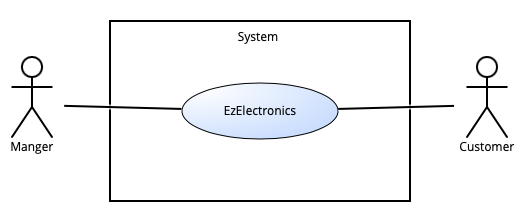

# Requirements Document - current EZElectronics

Date:

Version: V1 - description of EZElectronics in CURRENT form (as received by teachers)

| Version number | Change |
| :------------: | :----: |
|        4       |    Stories and personas |

# Contents

- [Requirements Document - current EZElectronics](#requirements-document---current-ezelectronics)
- [Contents](#contents)
- [Informal description](#informal-description)
- [Stakeholders](#stakeholders)
- [Context Diagram and interfaces](#context-diagram-and-interfaces)
  - [Context Diagram](#context-diagram)
  - [Interfaces](#interfaces)
- [Stories and personas](#stories-and-personas)
- [Functional and non functional requirements](#functional-and-non-functional-requirements)
  - [Functional Requirements](#functional-requirements)
  - [Non Functional Requirements](#non-functional-requirements)
- [Use case diagram and use cases](#use-case-diagram-and-use-cases)
  - [Use case diagram](#use-case-diagram)
    - [Use case 1, UC1](#use-case-1-uc1)
      - [Scenario 1.1](#scenario-11)
      - [Scenario 1.2](#scenario-12)
      - [Scenario 1.x](#scenario-1x)
    - [Use case 2, UC2](#use-case-2-uc2)
    - [Use case x, UCx](#use-case-x-ucx)
- [Glossary](#glossary)
- [System Design](#system-design)
- [Deployment Diagram](#deployment-diagram)

# Informal description

EZElectronics (read EaSy Electronics) is a software application designed to help managers of electronics stores to manage their products and offer them to customers through a dedicated website. Managers can assess the available products, record new ones, and confirm purchases. Customers can see available products, add them to a cart and see the history of their past purchases.

# Stakeholders

| Stakeholder name | Description |
| :--------------: | :---------: |
| Manager          | Principale utente dell'applicazione, ha un interesse diretto nel suo funzionamento ottimale per gestire efficacemente i prodotti e le vendite del suo negozio. |
| Customer         | Gli acquirenti che utilizzano il sito web dedicato per visualizzare e acquistare prodotti. Hanno interesse nell'esperienza utente, nella facilità di navigazione, e nella consistenza sui dati dei prodotti. |

# Context Diagram and interfaces

## Context Diagram

## Interfaces

|   Actor   | Logical Interface | Physical Interface |
| :-------: | :---------------: | :----------------: |
| Manager | Pc                  | GUI                    |
| Customer | Smartphone, Pc | GUI |

# Stories and personas

## Personas

|   **Manager**   |  |
| :-------: | :---------------: |
| Età| 37 anni|
| Occupazione| Manager di un negozio di elettronica|
|Comportamento| Organizzato, interessato alle vendite|
|Obiettivi| Monitorare le vendite, gestire l'inventario e i prodotti del negozio|
|Necessità| Dashboard per le vendite, gestione dell'inventario|

|   **Customer**   |  |
| :-------: | :---------------: |
| Età| 28 anni|
| Occupazione| Graphic designer|
|Comportamento|  Attenta ai dettagli, interessata ai prodotti di qualità|
|Obiettivi| Acquistare prodotti di qualità e visualizzare i propri ordini precedenti|
|Necessità| Navigazione intuitiva, acquisti sicuri|

## Stories

|  **Manager**  |
| :-------: |
|Come manager voglio inserire/togliere prodotti dall’inventario o settarli come venduti|
|Come manager voglio poter visualizzare la lista degli account degli utenti con la facoltà di eliminarne alcuni se malevoli|
|Come manager voglio poter visualizzare tutti i prodotti nell’inventario/appartenenti ad una specifica categoria/modello o dato un codice voglio visualizzare il relativo prodotto|

|  **Customer** |
| :-------: |
|Come customer voglio poter aggiungere/rimuovere/visualizzare i prodotti del carrello in sicurezza|
|Come customer voglio effettuare l’ordine relativo al mio carrello in semplici passi|
|Come customer voglio poter visualizzare la cronologia ordini effettuati da me|
|Come customer voglio poter visualizzare tutti i prodotti nell’inventario/appartenenti ad una specifica categoria/modello o dato un codice voglio visualizzare il relativo prodotto|

# Functional and non functional requirements

## Functional Requirements

|  ID   | Description                                                         |
| :---: | :---------:                                                         |
| **FR1** |      **Gestione Utenti**                                          |
| FR1.1 | Chiunque può creare un account                                      |
| FR1.2 | Un utente può effettuare login e logout                             |
| FR1.3 | Un utente può visualizzare le informazioni del proprio profilo      |
| **FR2** |    **Gestione Prodotti**                                          |
| FR2.1 | Un manager può registrare un prodotto                               |
| FR2.2 | Un manager può registrare l'arrivo di un insieme di prodotti dello stesso modello |
| FR2.3 | Un manager può segnare un prodotto come venduto                     |
| FR2.4 | Qualsiasi utente loggato può ottenere l'elenco di tutti i prodotti  |
| FR2.5 | Qualsiasi utente loggato può ottenere un prodotto dato il codice    |
| FR2.6 | Qualsiasi utente loggato può ottenere l'elenco di tutti i prodotti appartenenti ad una specifica categoria |
| FR2.7 | Qualsiasi utente loggato può recuperare l'elenco di tutti i prodotti appartenenti ad uno specifico modello |
| FR2.8 | Un utente manager può eliminare un prodotto                         |
| **FR3** | **Gestione Carrello**                                             |
| FR3.1 | Un customer può visualizzare il proprio carrello                    |
| FR3.2 | Un customer può aggiungere un prodotto al proprio carrello          |
| FR3.3 | Un customer può eseguire il checkout del proprio carrello           |
| FR3.4 | Un customer può visualizzare la propria cronologia carrelli         |
| FR3.5 | Un customer può rimuovere un prodotto dal carrello                  |
| FR3.6 | Un customer può eliminare un carrello dalla cronologia              |

## Non Functional Requirements

|   ID    | Type (efficiency, reliability, ..) | Description | Refers to |
| :-----: | :--------------------------------: | :---------: | :-------: |
| NFR1    | Usabilitá      | Un nuovo customer che visita per la prima volta il sito deve poter utilizzare tutte le funzionalità basilari (ricerca prodotti, aggiunta al carrello e checkout) senza alcun tipo di training. Un nuovo manager deve essere in grado di sfruttare tutte le funzionalità del sito dopo un massimo di due ore di training. | FR1-FR3 |
| NFR2    | Usabilitá      | Il carrello di un utente non deve essere cancellato quando esso effettua log out ma deve essere persistente, finchè non viene eseguito il checkout | FR3 |
| NFR3    | Prestazioni    | Il sito deve essere in grado di gestire e portare a compimento un minimo di 10 transazioni al secondo. Il tempo di risposta ad un evento (come click su un pulsante) in condizioni ottimali di velocità della connessione non deve superare i due secondi. | FR1-FR3 |
| NFR3    | Affidabilità   | Il tempo di disponibilitá del servizio durante un mese deve essere almeno del 99.95%. | FR1-FR3  |
| NFR4    | Robustezza     | non possono verificarsi più di 5 guasti all’anno e, nel caso se ne verifichi uno, il tempo richiesto affinché il sito torni online non deve superare le 12h | FR1-FR3 |
| NFR5    | Portabilità    | Il sito deve poter essere visualizzato su tutte le versioni degli ultimi 4 anni di almeno cinque dei browser più utilizzati. | FR1-FR3 |
| NFR6    | Sicurezza      | Le fughe di dati non possono verificarsi più frequentemente di una volta ogni 20 anni. | FR1-FR3 |

Nota: la scrittura FRX-FRY signfica che il relativo NFR si riferisce a tutti i FR da FRX a FRY compresi. La dicitura FRX, FRY significa che il relativo NFR si riferisce separatamente a FRX e FRY.

### Use case 1, UC1, LOGIN

| Actors Involved  |           Utente (customer o manager)         |
| :--------------: | :------------------------------------------------------------------: |
|   Precondition   |  Utente non loggato  |
|  Post condition  |  Utente autenticato e autorizzato   |
| Nominal Scenario |  Login dell'utente |
|     Variants     | Nessuna  |
|    Exceptions    | Username o password non riconosciute  |

|  Scenario 1.1  |  Login corretto  |
| :------------: | :------------------------------------------------------------------------: |
|  Precondition  | Utente non loggato |
| Post condition | Utente autenticato e autorizzato    |
|     Step#      |           Description     |
|       1        | Il sistema chiede username e password all'utente |
|       2        | L'utente inserisce username e password nei campi appositi |
|       3        | Il sistema risponde cercando lo username nel database |
|       4        | Il sistema confronta la password inserita con quella salvata |
|       5        | Il sistema esegue il login utente (status: 200)  |

|  Scenario 1.2  |  Username inesistente |
| :------------: | :------------------------------------------------------------------------: |
|  Precondition  | Username non esistente |
| Post condition | Utente non loggato    |
|     Step#      |             Description     |
|       1        | Il sistema richiede all'utente username e password |
|       2        | L'utente inserisce username e password nei campi appositi |
|       3        | Il sistema risponde cercando lo username nel database |
|       4        | Il sistema non autorizza l’utente (status: 404) e stampa “Credenziali non valide” |

|  Scenario 1.3  |  Password errata |
| :------------: | :------------------------------------------------------------------------: |
|  Precondition  | Password errata |
| Post condition | Utente non loggato    |
|     Step#      |                                Description     |
|       1        | Il sistema richiede all'utente username e password |
|       2        | L'utente inserisce username e password nei campi appositi |
|       3        | Il sistema risponde cercando lo username nel database |
|       4        | Il sistema confronta la password inserita con quella salvata |
|       5        | Il sistema non autorizza l’utente (status: 404) e stampa “Credenziali non valide” |

### Use case 2, UC2, LOGOUT

| Actors Involved  |           Utente (customer o manager)         |
| :--------------: | :------------------------------------------------------------------: |
|   Precondition   | Utente loggato  |
|  Post condition  | Utente non più autorizzato   |
| Nominal Scenario | L’utente effettua il logout dal sito |
|     Variants     | Nessuna  |
|    Exceptions    | Nessuna  |

|  Scenario 2.1  |  Logout con successo |
| :------------: | :------------------------------------------------------------------------: |
|  Precondition  | Utente loggato |
| Post condition | Utente non più autorizzato    |
|     Step#      |                                Description     |
|       1        | L'utente clicca sul link per il logout (barra in alto) |
|       2        | Il sistema risponde eseguendo il logout utente (status: 200) |

### Use case 3, UC3, STAMPA INFORMAZIONI UTENTE

| Actors Involved  |           Utente (customer o manager)         |
| :--------------: | :------------------------------------------------------------------: |
|   Precondition   | Utente loggato  |
|  Post condition  | Stampa delle informazioni utente a video   |
| Nominal Scenario | Informazioni utente visualizzaate sullo schermo |
|     Variants     | Nessuna  |
|    Exceptions    | Nessuna  |

|  Scenario 3.1  |  Visualizzazione con successo |
| :------------: | :------------------------------------------------------------------------: |
|  Precondition  | Utente loggato |
| Post condition | Stampa delle informazioni utente a video   |
|     Step#      |                                Description     |
|       1        | L'utente clicca sull’icona del profilo in alto |
|       2        | Il sistema preleva dal database le informazioni-utente |
|       3        | Il sistema stampa le informazioni appena prelevate a video (status: 200)  |

### Use case 4, UC4 Creazione di un nuovo utente

| Actors Involved  |                     Chiunque         |
| :--------------: | :------------------------------------------------------------------: |
|   Precondition   |  Utente non autenticato                                    |
|  Post condition  |  Nuovo utente viene creato e inserito nel database                        |
| Nominal Scenario |  Creazione utente |
|     Variants     |  Nessuna |
|    Exceptions    |  Username già esistente |

|  Scenario 4.1  | Creazione nuovo utente  |
| :------------: | :------------------------------------------------------------------------: |
|  Precondition  | Utente non autenticato |
| Post condition | Nuovo utente viene creato e inserito nel database   |
|     Step#      |                                Description                                 |
|       1        | L'utente richiede al sistema di creare un nuovo utente cliccando su "Registrati" |
|       2        | Il sistema chiede all’utente di inserire username, nome, cognome, password e ruolo |
|       3        | L'utente inserisce le informazioni richieste dal sistema |
|       4        | Il sistema controlla se nel database è già presente lo username passato |
|       5        | Il sistema applica un algoritmo di hash della password |
|       6        | Il sistema inserisce le informazioni in una nuova lineea nel database |
|       7       | Il sistema risponde con il messaggio di successo (status: 200) |

|  Scenario 4.2  | Creazione di un utente già presente  |
| :------------: | :------------------------------------------------------------------------: |
|  Precondition  | Utente non autenticato, lo username è già presente nel database |
| Post condition | Un messaggio di errore viene mostrato a schermo, non viene creato l’utente   |
|     Step#      |                                Description                                 |
|       1        | L'utente richiede al sistema di creare un nuovo utente cliccando su "Registrati" |
|       2        | Il sistema chiede all’utente di inserire username, nome, cognome, password e ruolo |
|       3        | L'utente inserisce le informazioni richieste dal sistema |
|       4        | Il sistema controlla se nel database è già presente lo username passato |
|       5        | La richiesta fallisce e Il sistema mostra a video un messaggio di errore (status: 404) |

### Use case 5, U5 Registrazione di un prodotto

| Actors Involved  |                     Chiunque         |
| :--------------: | :------------------------------------------------------------------: |
|   Precondition   |  Utente loggato come manager                             |
|  Post condition  |  Prodotto registrato                    |
| Nominal Scenario |  Registrazione nuovo prodotto |
|     Variants     |  Nessuna |
|    Exceptions    |  Prodotto già esistente, Data di arrivo non valida|

##### Scenario 5.1
|  Scenario 5.1  | Il prodotto viene registrato correttamente nel database  |
| :------------: | :------------------------------------------------------------------------: |
|  Precondition  | Utente loggato come manager |
| Post condition | Nuovo prodotto aggiunto nel database  |
|     Step#      |                                Description                                 |
|       1        | L'utente richiede al sistema di registrare un nuovo prodotto |
|       2        | Il sistema richiede all’utente di inserire i dettagli del prodotto |
|       3       | L’utente conferma la registrazione del prodotto |
|       4       | Il sistema invia una POST request e il prodotto viene registrato nel database |
|       4       | La richiesta viene correttamente eseguita, il sistema mostra a schermo il codice del prodotto appena registrato|

##### Scenario 5.2
|  Scenario 5.2  | Il prodotto già esistente |
| :------------: | :------------------------------------------------------------------------: |
|  Precondition  | Prodotto già esistente nel database |
| Post condition | Il prodotto non viene inserito nel database  |
|     Step#      |                                Description                                 |
|       1        | L'utente richiede al sistema di registrare un nuovo prodotto |
|       2        | Il sistema richiede all’utente di inserire i dettagli del prodotto |
|       3       | L’utente conferma la registrazione del prodotto |
|       4       | La richiesta fallisce con status code 409  |
|       5      | Il sistema mostra a video un messaggio di errore |

##### Scenario 5.3
|  Scenario 5.3  | Data di arrivo successiva alla data odierna |
| :------------: | :------------------------------------------------------------------------: |
|  Precondition  | La data di arrivo inserita è successiva alla data odierna  |
| Post condition | Il prodotto non viene inserito nel database  |
|     Step#      |                                Description                                 |
|       1        | L'utente richiede al sistema di registrare un nuovo prodotto |
|       2        | Il sistema richiede all’utente di inserire i dettagli del prodotto |
|       3       | L’utente conferma la registrazione del prodotto |
|       4       | La richiesta fallisce |
|       5      | Il sistema mostra a video un messaggio di errore |

### Use case 6, U6 Registrazione di un set di prodotti dello stesso modello

| Actors Involved  |                     Chiunque         |
| :--------------: | :------------------------------------------------------------------: |
|   Precondition   |  Utente loggato come manager                             |
|  Post condition  |  Set di prodotti registrati                   |
| Nominal Scenario |  Registrazione set di prodotti dello stesso modello |
|     Variants     |  Nessuna |
|    Exceptions    |  Data di arrivo non valida|

##### Scenario 6.1
|  Scenario 6.1  | I prodotti del set vengono registrati nel database|
| :------------: | :------------------------------------------------------------------------: |
|  Precondition  | Utente loggato come manager |
| Post condition | Nuovo prodotti aggiunti nel database  |
|     Step#      |                                Description                                 |
|       1        | L'utente richiede al sistema di registrare il set di prodotti |
|       2        | Il sistema richiede all’utente di inserire i dettagli del prodotti |
|       3       | L’utente conferma la registrazione dei prodotti |
|       4       | Il sistema invia una POST request e il prodotti vengono registrati nel database |

##### Scenario 6.2
|  Scenario 6.2  | Data di arrivo successiva alla data odierna |
| :------------: | :------------------------------------------------------------------------: |
|  Precondition  | La data di arrivo inserita è successiva alla data odierna  |
| Post condition | I prodotti non vengono inseriti nel database  |
|     Step#      |                                Description                                 |
|       1        | L'utente richiede al sistema di registrare un nuovo set di prodotti |
|       2        | Il sistema richiede all’utente di inserire i dettagli dei prodotti |
|       3       | L’utente conferma la registrazione dei prodotti |
|       4       | La richiesta fallisce |
|       5      | Il sistema mostra a video un messaggio di errore |

### Use case 7, U7 Vendita prodotto

| Actors Involved  |                     Chiunque         |
| :--------------: | :------------------------------------------------------------------: |
|   Precondition   |  Utente loggato come manager                             |
|  Post condition  |  Prodotto contrassegnato come venduto                 |
| Nominal Scenario |  Prodotto contrassegnato come venduto |
|     Variants     |  Nessuna |
|    Exceptions    |  Codice prodotto inesistente, Data di vendita antecedente alla data di arrivo, Data di vendita conseguente alla data odierna, Prodotto già venduto|

##### Scenario 7.1 
|  Scenario 7.1  | Il prodotto viene registrato come venduto nel database|
| :------------: | :------------------------------------------------------------------------: |
|  Precondition  | Utente loggato come manager |
| Post condition | Prodotto contrassegnato come venduto  |
|     Step#      |                                Description                                 |
|       1        | L'utente richiede al sistema di contrassegnare il prodotto come venduto |
|       2       | Il sistema richiede di specificare opzionalmente la data di vendita |
|       3       | L’utente conferma la modifica del prodotto |
|       4       | Il sistema invia una PATCH request e il prodotto viene contrassegnato come venduto |

##### Scenario 7.2
|  Scenario 7.2  | Codice prodotto invalido |
| :------------: | :------------------------------------------------------------------------: |
|  Precondition  | Il codice del prodotto è inesistente |
| Post condition | Il prodotto non viene contrassegnato come venduto  |
|     Step#      |                                Description                                 |
|       1        | L'utente richiede al sistema di contrassegnare il prodotto come venduto |
|       2       | Il sistema richiede di specificare opzionalmente la data di vendita |
|       3       | L’utente conferma la modifica del prodotto |
|       4       | La richiesta fallisce con status error 404 |
|       5       | Il sistema mostra un messaggio di errore |

##### Scenario 7.3
|  Scenario 7.3  | Data di vendita conseguente alla data odierna |
| :------------: | :------------------------------------------------------------------------: |
|  Precondition  | La data di vendita inserita è successiva alla data odierna |
| Post condition | Il prodotto non viene contrassegnato come venduto  |
|     Step#      |                                Description                                 |
|       1        | L'utente richiede al sistema di contrassegnare il prodotto come venduto |
|       2       | Il sistema richiede di specificare opzionalmente la data di vendita |
|       3       | L’utente inserisce una data di vendita successiva alla data odierna |
|       4       | La richiesta fallisce e il sistema mostra un messaggio di errore |

##### Scenario 7.4
|  Scenario 7.4  | Data di vendita antecedente alla data di arrivo|
| :------------: | :------------------------------------------------------------------------: |
|  Precondition  | La data di vendita inserita è antecedente alla data di arrivo del prodotto |
| Post condition | Il prodotto non viene contrassegnato come venduto  |
|     Step#      |                                Description                                 |
|       1        | L'utente richiede al sistema di contrassegnare il prodotto come venduto |
|       2       | Il sistema richiede di specificare opzionalmente la data di vendita |
|       3       | L’utente inserisce una data di vendita antecedente alla data di arrivo del prodotto |
|       4       | La richiesta fallisce e il sistema mostra un messaggio di errore |
##### Scenario 7.5
|  Scenario 7.5  | Prodotto già venduto |
| :------------: | :------------------------------------------------------------------------: |
|  Precondition  | Il prodotto è già stato venduto |
| Post condition | Il prodotto non viene contrassegnato come venduto  |
|     Step#      |                                Description                                 |
|       1        | L'utente richiede al sistema di contrassegnare il prodotto come venduto |
|       2      | La richiesta fallisce e il sistema mostra un messaggio di errore |

# Glossary

\<use UML class diagram to define important terms, or concepts in the domain of the application and their relationships>

\<concepts must be used consistently all over the document, ex in use cases, requirements etc>

# System Design

\<describe here system design>

\<must be consistent with Context diagram>

# Deployment Diagram

\<describe here deployment diagram >
