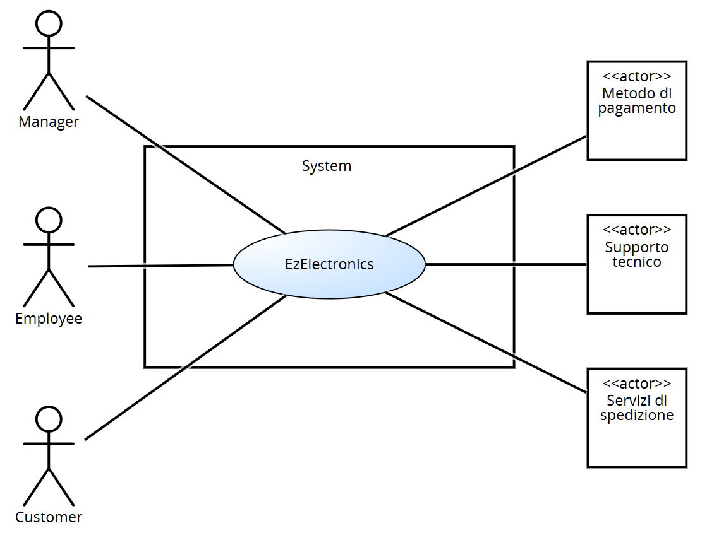

# Requirements Document - current EZElectronics

Date:

Version: V2 - description of EZElectronics in CURRENT form (as received by teachers)

| Version number | Change |
| :------------: | :----: |
|       4        | Primi casi d'uso e fix minori |

# Contents

- [Requirements Document - current EZElectronics](#requirements-document---current-ezelectronics)
- [Contents](#contents)
- [Informal description](#informal-description)
- [Stakeholders](#stakeholders)
- [Context Diagram and interfaces](#context-diagram-and-interfaces)
  - [Context Diagram](#context-diagram)
  - [Interfaces](#interfaces)
- [Stories and personas](#stories-and-personas)
- [Functional and non functional requirements](#functional-and-non-functional-requirements)
  - [Functional Requirements](#functional-requirements)
  - [Non Functional Requirements](#non-functional-requirements)
  - [Test requirements](#test-requirements)
  - [Table of rights](#table-of-rights)
- [Use case diagram and use cases](#use-case-diagram-and-use-cases)
  - [Use case diagram](#use-case-diagram)
  - [Use cases](#use-cases)
    - [UC1, Login](#use-case-1-uc1-login)
    - [UC2, Logout](#use-case-2-uc2-logout)
    - [UC3, Stampa informazioni utente](#use-case-3-uc3-stampa-informazioni-utente)
    - [UC4, Creazione di un nuovo utente](#use-case-4-uc4-creazione-di-un-nuovo-utente)
    - [UC5, Creazione di un nuovo prodotto](#use-case-5-uc5-creazione-di-un-nuovo-prodotto)
    - [UC6, Registrazione arrivo di un set di prodotti](#use-case-6-uc6-registrazione-arrivo-di-un-set-di-prodotti)
    - [UC7, Registrazione prodotto come venduto](#use-case-7-uc7-registrazione-prodotto-come-venduto)
    - [UC8, Elenco prodotti](#use-case-8-uc8-elenco-prodotti)
    - [UC9, Ricerca prodotto](#use-case-9-uc9-ricerca-prodotto)
    - [UC10, Elenco prodotti data la categoria](#use-case-10-uc10-elenco-prodotti-data-la-categoria)
    - [UC11, Elenco prodotti dato il modello](#use-case-11-uc11-elenco-prodotti-dato-il-modello)
    - [UC12, Eliminazione prodotto](#use-case-12-uc12-eliminazione-prodotto)
    - [UC13, Visualizzazione carrello](#use-case-13-uc13-visualizzazione-carrello)
    - [UC14, Aggiunta al carrello](#use-case-14-uc14-aggiunta-al-carrello)
    - [UC15, Checkout carrello](#use-case-15-uc15-checkout-carrello)
    - [UC16, Cronologia carrelli](#use-case-16-uc16-cronologia-carrelli)
    - [UC17, Rimozione dal carrello](#use-case-17-uc17-rimozione-dal-carrello)
    - [UC18, Svuotamento carrello](#use-case-18-uc18-svuotamento-carrello)
- [Glossary](#glossary)
- [System Design](#system-design)
- [Deployment Diagram](#deployment-diagram)

# Informal description

EZElectronics (read EaSy Electronics) is a software application designed to help managers of electronics stores to manage their products and offer them to customers through a dedicated website. Managers can assess the available products, record new ones, and confirm purchases. Employees help managers and have similar tasks. Customers can see available products, add them to a cart and see the history of their past purchases.

# Stakeholders

| Stakeholder name | Description |
| :--------------: | :---------: |
| Manager          | Principale utente dell'applicazione, ha un interesse diretto nel suo funzionamento ottimale per gestire efficacemente i prodotti e le vendite del suo negozio. Può modificare le informazioni generali del negozio e gestire il profilo degli Employee. |
| Customer         | Acquirente che utilizza il sito web dedicato per visualizzare e acquistare prodotti. Ha un interesse nell'esperienza utente, nella facilità di navigazione, e nella consistenza sui dati dei prodotti. |
| Employee         | Commesso del negozio, deve gestire il negozio sia nella sua parte fisica sia nella parte online, potendo aggiungere prodotti e segnare le vendite o i resi. |
| Servizi di pagamento | Servizi terzi che permettono ai customer di effettuare transazioni in modo sicuro. |
| Supporto tecnico | Responsabile della creazione, manutenzione e aggiornamento dell'applicazione. |
| Servizi di spedizione | Servizi terzi che si incaricano di consegnare i prodotti acquistati dagli utenti presso l'indirizzo da loro specificato.  |

# Context Diagram and interfaces

## Context Diagram

## Interfaces

|   Actor   | Logical Interface | Physical Interface |
| :-------: | :---------------: | :----------------: |
| Manager   | Pc                | GUI                |
| Customer  | Smartphone, Pc    | GUI                |
| Employee  | Pc, Scanner codici a barre    | GUI    |
| Servizi di pagamento | Internet   | <https://satispay.com/>, <https://paypal.com/>, <https://visa.com/>, <https://mastercard.com/> |
| Supporto tecnico  | Pc    | GUI  |
| Servizi di spedizione  | Internet    | <https://gsped.com/api/> |

# Stories and personas

## Personas

|   **Manager**   |  |
| :-------: | :---------------: |
| Età| 37 anni|
| Occupazione| Manager di un negozio di elettronica|
|Comportamento| Organizzato, interessato alle vendite|
|Obiettivi| Monitorare le vendite, gestire l'inventario e i prodotti del negozio|
|Necessità| Dashboard per le vendite, gestione dell'inventario|

|   **Employee**   |  |
| :-------: | :---------------: |
| Età| 28 anni|
| Occupazione| Dipendente di un negozio di elettronica|
|Comportamento| Puntuale, organizzato, affidabile|
|Obiettivi| Gestire l’inventario prodotti, revisione ordini, preparazione ordini|
|Necessità| Gestione dell'inventario e delle vendite, dashboard ordini|

|   **Customer**   |  |
| :-------: | :---------------: |
| Età| 28 anni|
| Occupazione| Graphic designer|
|Comportamento|  Attenta ai dettagli, interessata ai prodotti di qualità|
|Obiettivi| Acquistare prodotti di qualità e visualizzare i propri ordini precedenti|
|Necessità| Navigazione intuitiva, acquisti sicuri|

|   **Utente non registrato**   |  |
| :-------: | :---------------: |
| Età| 40 anni|
| Occupazione| Imprenditore|
|Comportamento|  Pratico, interessato agli affari, interessato alla qualità |
|Obiettivi| Trovare informazioni sui prodotti, confrontare prezzi|
|Necessità| Accesso facile ai prodotti, dettagli dei prodotti senza registrazione|

## Stories

|  **Manager**  |
| :-------  |
|Come manager voglio inserire uno o più prodotti appartententi ad uno stesso modello, rimuovere un prodotto dall’inventario o contrassegnarle un prodotto come venduto |
|Come manager voglio poter visualizzare tutti i prodotti nell’inventario, un singolo prodotto tramite il relativo codice o prodotti  appartenenti ad una specifica categoria o modello |
| Come manager voglio poter modificare i dettagli profilo degli utenti registrati | 
| Come manager voglio poter creare gli account degli employee |

|  **Employee** |
| :-------  |
|Come employee voglio registrare l’arrivo di prodotti in magazzino, segnare le vendite e i resi dei prodotti|
|Come employee voglio visualizzare la lista di tutti i prodotti disponibili e non|

|  **Customer** |
| :-------  |
|Come customer voglio poter aggiungere/rimuovere/visualizzare i prodotti del carrello |
|Come customer voglio effettuare l’ordine relativo al mio carrello in semplici passi|
|Come customer voglio poter visualizzare la cronologia dei miei ordini |
|Come customer voglio poter visualizzare tutti i prodotti nell’inventario, un singolo prodotto tramite il relativo codice o i prodotti appartenenti ad una specifica categoria o modello |
| Come customer voglio poter modificare i dettagli del mio profilo |

|  **Utente non registrato** |
| :-------  |
|Come utente non registrato, voglio vedere i dettagli dei prodotti senza dovermi registrare. |
|Come utente non registrato voglio poter visualizzare tutti i prodotti nell’inventario/appartenenti ad una specifica categoria/modello o dato un codice voglio visualizzare il prodotto senza dovermi registrare |
|Come utente non registrato, voglio poter creare un account in pochi passi. |

# Functional and non functional requirements

## Functional Requirements

|  ID   | Description                                                         |
| :---: | :---------                                                          |
| **FR1** |      **Gestione Utenti**                                          |
| FR1.1 | Chiunque può creare un account                                      |
| FR1.2 | Un utente può effettuare login e logout                             |
| FR1.3 | Un utente può visualizzare le informazioni del proprio profilo    |
| FR1.4 | Un manager può creare il profilo di un Employee                     |
| FR1.5 | Un manager può modificare il profilo di un Employee                 |
| FR1.6 | Un manager può eliminare il profilo di un Employee                  |
| FR1.7 | Un manager può eliminare il profilo di un Customer                  |
| FR1.8 | Un customer o un manager possono eliminare il proprio profilo       |
| FR1.9 | Un manager può visualizzare la lista di tutti i profili registrati  |
| FR1.10| Un manager può filtrare la lista dei profili registrati per ruolo   |
| FR1.11| Un manager può cercare il profilo di un utente dato lo username     |
| FR1.12| Un manager può visualizzare il profilo di un altro utente           |
| FR1.13| Un manager può modificare le informazioni sul negozio               |
| **FR2** |    **Gestione Prodotti**                                          |
| FR2.1 | Un manager o un employee possono registrare un nuovo prodotto       |
| FR2.2 | Un manager o un employee possono registrare l'arrivo di un insieme di prodotti dello stesso modello |
| FR2.3 | Un manager o un employee possono segnare un prodotto come venduto   |
| FR2.4 | Un manager o un employee possono cercare un prdotto tramite codice  |
| FR2.5 | Qualsiasi utente può ottenere l'elenco di tutti i prodotti disponibili |
| FR2.6 | Qualsiasi utente può filtrarte l'elenco dei prodotti disponibili per categoria |
| FR2.7 | Qualsiasi utente può filtrarte l'elenco dei prodotti disponibili per modello |
| FR2.8 | Un manager o un employee possono eliminare un prodotto              |
| **FR3** | **Gestione Carrello**                                             |
| FR3.1 | Un customer può visualizzare il proprio carrello                    |
| FR3.2 | Un customer può aggiungere un prodotto al proprio carrello          |
| FR3.3 | Un customer può eseguire il checkout del proprio carrello           |
| FR3.4 | Un customer può rimuovere un prodotto dal carrello                  |
| FR3.5 | Un customer può svuotare il proprio carrello                        |
| **FR4** | **Gestione Recensioni**                                           |
| FR4.1 | Un customer che abbia acquistato un determinato prodotto può recensirlo |
| FR4.2 | Qualsiasi utente può visualizzare le recensioni di un determinato prodotto |
| FR4.3 | Un customer può modificare una recensione precedentemente scritta   |
| FR4.4 | Un customer può elimnare una propria recensione                     |
| FR4.5 | Un manager o un employee possono visualizzare la lista delle recensioni per un determinato prodotto |
| FR4.6 | Un manager o un employee possono eliminare una recensione           |
| **FR5** | **Gestione ordini**                                               |
| FR5.1 | Un customer decide se ritirare il proprio ordine in negozio o riceverlo a casa tramite corriere|
| FR5.2 | Un customer deve pagare il proprio ordine al momento del checkout o al ritito in negozio |
| FR5.3 | Un customer può visualizzare lo stato del proprio ordine            |
| FR5.4 | Un customer può visualizzare lo storico di tutti gli ordini che ha effettuato |
| FR5.5 | Un customer può cercare un ordine tramite id                        |
| FR5.6 | Un customer può effettuare il reso di un ordine entro 14 giorni dal suo pagamento |
| FR5.7 | Il sito deve mostrare a un manager e a un employee una notifica quando un nuovo ordine viene ricevuto |
| FR5.8 | Un manager o un employee possono cambiare lo stato di un ordine finchè esso non è stato consegnato al customer    |
| FR5.9 | Un manager o un employee possono accettare o rifiutare una richiesta di reso|
| FR5.10| Un manager o un employee possono ottenere lo sotrico di tutti gli ordini    |
| FR5.11| Un manager o un employee possono filtrare lo storico degli ordini per stato |

Nota: il requisito FR4.6 può far sorgere dubbi di natura etica, tuttavia lo si ritiene necessario per motivi di moderazione.

## Non Functional Requirements

|   ID    | Type (efficiency, reliability, ..) | Description | Refers to |
| :-----: | :--------------------------------: | :---------  | :-------: |
| NFR1    | Usabilitá      | Un nuovo customer che visita per la prima volta il sito deve poter utilizzare tutte le funzionalità basilari (ricerca prodotti, aggiunta al carrello e checkout) senza alcun tipo di training. Un nuovo manager deve essere in grado di sfruttare tutte le funzionalità del sito dopo un massimo di due ore di training. Un employee | FR1-FR3 |
| NFR2    | Usabilitá      | Il carrello di un utente non deve essere cancellato quando esso effettua log out ma deve essere persistente, finchè non viene eseguito il checkout | FR3 |
| NFR3    | Prestazioni    | Il sito deve essere in grado di gestire e portare a compimento un minimo di 10 transazioni al secondo. Il tempo di risposta ad un evento (come click su un pulsante) in condizioni ottimali di velocità della connessione non deve superare i due secondi. | FR1-FR3 |
| NFR3    | Affidabilità   | Il tempo di disponibilitá del servizio durante un mese deve essere almeno del 99.95%. | FR1-FR3  |
| NFR4    | Robustezza     | non possono verificarsi più di 5 guasti all’anno e, nel caso se ne verifichi uno, il tempo richiesto affinché il sito torni online non deve superare le 12h | FR1-FR3 |
| NFR5    | Portabilità    | Il sito deve poter essere visualizzato su tutte le versioni degli ultimi 4 anni di almeno cinque dei browser più utilizzati. | FR1-FR3 |
| NFR6    | Sicurezza      | Le fughe di dati non possono verificarsi più frequentemente di una volta ogni 20 anni. | FR1-FR3 |

Nota: la scrittura FRX-FRY signfica che il relativo NFR si riferisce a tutti i FR da FRX a FRY compresi. La dicitura FRX, FRY significa che il relativo NFR si riferisce separatamente a FRX e FRY.

### Test Requirements

|  ID   | Description        |
| :---: | :---------:        |
|  T1   | Eliminazione di tutti gli utenti|
|  T2   | Eliminazione di tutti i prodotti|
|  T3   | Eliminazione di tutti i carrelli|
|  T4   | Eliminazione di tutte le recensioni|

### Table of rights

| FR  |  Customer  |  Manager  |  Employee  | Servizi di pagamento | Servizi di spedizione |
| :-: |  :------:  |  :-----:  |  :-------: | :------------------: | :-------------------: |
| 1.1 |     X      |           |            |                      |                       |
| 1.2 |     X      |     X     |     X      |                      |                       |
| 1.3 |     X      |     X     |     X      |                      |                       |
| 1.4 |            |     X     |            |                      |                       |
| 1.5 |            |     X     |            |                      |                       |
| 1.6 |            |     X     |            |                      |                       |
| 1.7 |            |     X     |            |                      |                       |
| 1.8 |     X      |     X     |            |                      |                       |
| 1.9 |            |     X     |            |                      |                       |
| 1.10|            |     X     |            |                      |                       |
| 1.11|            |     X     |            |                      |                       |
| 1.12|            |     X     |            |                      |                       |
| 1.13|            |     X     |            |                      |                       |
| 2.1 |            |     X     |     X      |                      |                       |
| 2.2 |            |     X     |     X      |                      |                       |
| 2.3 |            |     X     |     X      |                      |                       |
| 2.4 |            |     X     |     X      |                      |                       |
| 2.5 |     X      |     X     |     X      |                      |                       |
| 2.6 |     X      |     X     |     X      |                      |                       |
| 2.7 |     X      |     X     |     X      |                      |                       |
| 2.8 |            |     X     |     X      |                      |                       |
| 3   |     X      |           |            |                      |                       |
| 4.1 |     X      |           |            |                      |                       |
| 4.2 |     X      |     X     |     X      |                      |                       |
| 4.3 |     X      |           |            |                      |                       |
| 4.4 |     X      |           |            |                      |                       |
| 4.5 |            |     X     |     X      |                      |                       |
| 4.6 |            |     X     |     X      |                      |                       |
| 5.1 |     X      |           |            |                      |            X          |
| 5.2 |     X      |           |            |        X             |                       |
| 5.3 |     X      |           |            |                      |            X          |
| 5.4 |     X      |           |            |                      |                       |
| 5.5 |     X      |           |            |                      |                       |
| 5.6 |     X      |           |            |        X             |                       |
| 5.7 |            |     X     |     X      |                      |                       |
| 5.8 |            |     X     |     X      |                      |                       |
| 5.9 |            |     X     |     X      |                      |                       |
| 5.10|            |     X     |     X      |                      |                       |
| 5.11|            |     X     |     X      |                      |                       |

# Use case diagram and use cases

## Use case diagram

## Use cases

### Use case 1, UC1, Login

| Actors Involved  |           Utente (customer,manager o employee)         |
| :--------------: | :------------------------------------------------------------------: |
|   Precondition   |  Utente non autenticato  |
|  Post condition  |  Utente autenticato e autorizzato   |
| Nominal Scenario |  Login dell'utente |
|     Variants     |  Nessuna  |
|    Exceptions    |  Username o password non riconosciuti, errore interno  |

|  Scenario 1.1  |  Login corretto  |
| :------------: | :------------------------------------------------------------------------: |
|  Precondition  | Utente non autenticato |
| Post condition | Utente autenticato e autorizzato    |
|     Step#      |           Description     |
|       1        | Il sistema chiede all'utente di inserire username e password |
|       2        | L'utente fornisce username e password nei campi appositi e clicca su "Accedi" |
|       3        | Il sistema cerca l' username nel database |
|       4        | Il sistema confronta la password inserita con quella salvata |
|       5        | Il sistema esegue il login utente (status: 200)  |

|  Scenario 1.2  |  Username inesistente |
| :------------: | :------------------------------------------------------------------------: |
|  Precondition  | Username inesistente |
| Post condition | Utente non autenticato    |
|     Step#      |             Description     |
|       1        | Il sistema richiede all'utente di inserire username e password |
|       2        | L'utente fornisce username e password nei campi appositi e clicca su "Accedi" |
|       3        | Il sistema cercan lo username nel database |
|       4        | Il sistema non autorizza l’utente (status: 404) e mostra “Credenziali non valide” |

|  Scenario 1.3  |  Password errata |
| :------------: | :------------------------------------------------------------------------: |
|  Precondition  | Password errata |
| Post condition | Utente non autenticato    |
|     Step#      |                                Description     |
|       1        | Il sistema richiede all'utente di inserire username e password |
|       2        | L'utente fornisce username e password nei campi appositi e clicca su "Accedi" |
|       3        | Il sistema cerca lo username nel database |
|       4        | Il sistema confronta la password inserita con quella salvata |
|       5        | Il sistema non autorizza l’utente (status: 404) e mostra “Credenziali non valide” |

|  Scenario 1.4  |  Errore interno |
| :------------: | :----------------------------------------------------------------------: |
| Precondition   | L'utente ha avviato la richiesta |
| Post condition | L'operazione viene annullata |
|     Step#      |   Description    |
|       1        | Il sistema annulla ogni modifica nel database e mostra il messaggio di errore |

### Use case 2, UC2, Logout

| Actors Involved  |           Utente (customer,manager o employee)         |
| :--------------: | :------------------------------------------------------------------: |
|   Precondition   | Utente autenticato  |
|  Post condition  | Utente non più autorizzato   |
| Nominal Scenario | L’utente effettua il logout dal sito |
|     Variants     | Nessuna  |
|    Exceptions    | Errore interno  |

|  Scenario 2.1  |  Logout con successo |
| :------------: | :------------------------------------------------------------------------: |
|  Precondition  | Utente autenticato |
| Post condition | Utente non più autorizzato    |
|     Step#      |                                Description     |
|       1        | L'utente clicca sul link per il logout (barra in alto) |
|       2        | Il sistema risponde eseguendo il logout utente (status: 200) |

|  Scenario 2.2  |  Errore interno |
| :------------: | :----------------------------------------------------------------------: |
| Precondition   | L'utente ha avviato la richiesta |
| Post condition | L'operazione viene annullata |
|     Step#      |   Description    |
|       1        | Il sistema annulla ogni modifica nel database e stampa il messaggio di errore |

### Use case 3, UC3, Stampa informazioni utente

| Actors Involved  |           Utente (customer,manager o employee)         |
| :--------------: | :------------------------------------------------------------------: |
|   Precondition   | Utente autenticato  |
|  Post condition  | Stampa delle informazioni utente a video   |
| Nominal Scenario | Informazioni utente visualizzate sullo schermo |
|     Variants     | Nessuna  |
|    Exceptions    | Errore interno  |

|  Scenario 3.1  |  Visualizzazione con successo |
| :------------: | :------------------------------------------------------------------------: |
|  Precondition  | Utente autenticato |
| Post condition | Stampa delle informazioni utente a video   |
|     Step#      |                                Description     |
|       1        | L'utente clicca sull’icona del profilo in alto |
|       2        | Il sistema preleva dal database le informazioni-utente |
|       3        | Il sistema stampa le informazioni appena prelevate a video (status: 200)  |

|  Scenario 3.2  |  Errore interno |
| :------------: | :----------------------------------------------------------------------: |
| Precondition   | L'utente ha avviato la richiesta |
| Post condition | L'operazione viene annullata |
|     Step#      |   Description    |
|       1        | Il sistema annulla ogni modifica nel database e stampa il messaggio di errore |

### Use case 4, UC4 Creazione di un nuovo utente

| Actors Involved  |                     Chiunque         |
| :--------------: | :------------------------------------------------------------------: |
|   Precondition   |  Utente non autenticato                                    |
|  Post condition  |  un nuovo utente customer viene creato e inserito nel database                        |
| Nominal Scenario |  Creazione utente |
|     Variants     |  Nessun inserimento immagine di profilo |
|    Exceptions    |  Username già esistente, errore interno |

|  Scenario 4.1  | Creazione nuovo utente (con immagine)  |
| :------------: | :------------------------------------------------------------------------: |
|  Precondition  | Utente non autenticato |
| Post condition | Nuovo utente viene creato e inserito nel database   |
|     Step#      |                                Description                                 |
|       1        | L'utente richiede al sistema di creare un nuovo utente cliccando sul link in basso |
|       2        | Il sistema chiede all’utente di inserire username,name,surname,password,indirizzo,città,stato,CAP,email,cellulare,immagine |
|       3        | L'utente inserisce le informazioni richieste  dal sistema e clicca su "Registrati" |
|       4        | Il sistema controlla se nel database è già presente lo username passato |
|       5        | Il sistema applica un algoritmo di hash della password |
|       6        | Il sistema inserisce le informazioni in una nuova linea nel database |
|       7        | Il sistema risponde con il messaggio di successo (status: 200) |

|  Scenario 4.2  | Creazione nuovo utente (senza immagine)  |
| :------------: | :------------------------------------------------------------------------: |
|  Precondition  | Utente non autenticato |
| Post condition | Nuovo utente viene creato e inserito nel database   |
|     Step#      |                                Description                                 |
|       1        | L'utente richiede al sistema di creare un nuovo utente cliccando sul link in basso |
|       2        | Il sistema chiede all’utente di inserire username,name,surname,password,indirizzo,città,stato,CAP,email,cellulare,immagine |
|       3        | L'utente inserisce le informazioni richieste dal sistema, tranne l'immagine, e clicca su "Registrati" |
|       4        | Il sistema controlla se nel database è già presente lo username passato |
|       5        | Il sistema applica un algoritmo di hash della password |
|       6        | Il sistema inserisce le informazioni in una nuova linea nel database |
|       7        | Il sistema risponde con il messaggio di successo (status: 200) |

|  Scenario 4.3  | Creazione di un utente già presente  |
| :------------: | :------------------------------------------------------------------------: |
|  Precondition  | Utente non autenticato, lo username è già presente nel database |
| Post condition | Un messaggio di errore viene mostrato a schermo, non viene creato l’utente   |
|     Step#      |                                Description                                 |
|       1        | L'utente richiede al sistema di creare un nuovo utente cliccando sul link in basso |
|       2        | Il sistema chiede all’utente di inserire username,name,surname,password,indirizzo,città,stato,CAP,email,cellulare,immagine |
|       3        | L'utente inserisce le informazioni richieste dal sistema e clicca su "Registrati" |
|       4        | Il sistema controlla se nel database è già presente lo username passato |
|       5        | La richiesta fallisce e Il sistema mostra a video un messaggio di errore (status: 404) |

|  Scenario 4.4  | Omissione di campi obbligatori  |
| :------------: | :------------------------------------------------------------------------: |
|  Precondition  | Utente non autenticato |
| Post condition | Un messaggio di errore viene mostrato a schermo, non viene creato l’utente   |
|     Step#      |                                Description                                 |
|       1        | L'utente richiede al sistema di creare un nuovo utente cliccando sul link in basso |
|       2        | Il sistema chiede all’utente di inserire username,name,surname,password,indirizzo,città,stato,CAP,email,cellulare,immagine |
|       3        | L'utente inserisce le informazioni richieste dal sistema, ma ne omette alcune e clicca su "Registrati" |
|       4        | La richiesta fallisce e Il sistema mostra a video un messaggio di errore (status: 404)|

|  Scenario 4.5  |  Errore interno |
| :------------: | :----------------------------------------------------------------------: |
| Precondition   | L'utente ha avviato la richiesta |
| Post condition | L'operazione viene annullata |
|     Step#      |   Description    |
|       1        | Il sistema annulla ogni modifica nel database e stampa il messaggio di errore |

### Use case 5, UC5, Creazione di un nuovo prodotto

| Actors Involved  |                     Utente manager o employee         |
| :--------------: | :------------------------------------------------------------------: |
|   Precondition   |  Utente autenticato come manager o employee                          |
|  Post condition  |  Nuovo prodotto creato e inserito nel database                        |
| Nominal Scenario |  Creazione di un nuovo prodotto date le sue informazioni |
|     Variants     |  Nessuna |
|    Exceptions    |  Codice prodotto già esistente, uno o più campi non inseriti o non validi, errore interno |

|  Scenario 5.1  | Creazione nuovo prodotto con successo |
| :------------: | :------------------------------------------------------------------------: |
|  Precondition  | Utente autenticato come manager o employee |
| Post condition | Nuovo prodotto creato e inserito nel database   |
|     Step#      |                                Description                                 |
|       1        | L'utente richiede al sistema di creare un nuovo prodotto cliccando sul pulsante apposito |
|       2        | Il sistema chiede di inserire code,sellingPrice,model,category,details,foto |
|       3        | L'utente inserisce le informazioni richieste dal sistema |
|       4        | Il sistema controlla se nel database è già presente il codice inserito |
|       5        | Il sistema inserisce nel database il nuovo prodotto con i campi passati, arrivalDate=data corrente |
|       6        | Il sistema risponde con il messaggio di successo in cui scrive il nuovo codice (status: 200) |

|  Scenario 5.2  | Codice prodotto già presente nel database  |
| :------------: | :------------------------------------------------------------------------: |
|  Precondition  | Utente autenticato come manager o employee, codice già presente nel database |
| Post condition | Prodotto non creato   |
|     Step#      |                                Description                                 |
|       1        | L'utente richiede al sistema di creare un nuovo prodotto cliccando sul pulsante apposito |
|       2        | Il sistema chiede di inserire code,sellingPrice,model,category,details,foto |
|       3        | L'utente inserisce le informazioni richieste dal sistema |
|       4        | Il sistema controlla se nel database è già presente il codice inserito |
|       5        | Il sistema non inserisce il prodotto e risponde con il messaggio di fallimento |

|  Scenario 5.3  | Campo/i non inserito |
| :------------: | :------------------------------------------------------------------------: |
|  Precondition  | Utente autenticato come manager o employee |
| Post condition | Prodotto non creato   |
|     Step#      |                                Description                                 |
|       1        | L'utente richiede al sistema di creare un nuovo prodotto cliccando sul pulsante apposito |
|       2        | Il sistema chiede di inserire code,sellingPrice,model,category,details,foto |
|       3        | L'utente inserisce le informazioni richieste dal sistema tranne uno o più campi |
|       4        | Il sistema non inserisce il prodotto e risponde con il messaggio di fallimento |

|  Scenario 5.4  | campo/i non valido/i |
| :------------: | :------------------------------------------------------------------------: |
|  Precondition  | Utente autenticato come manager |
| Post condition | Prodotto non creato   |
|     Step#      |                                Description                                 |
|       1        | L'utente richiede al sistema di creare un nuovo prodotto cliccando sul pulsante apposito |
|       2        | Il sistema chiede di inserire code,sellingPrice,model,category,details,foto |
|       3        | L'utente inserisce le informazioni richieste dal sistema, ma alcuni non sono validi |
|       4        | Il sistema non inserisce il prodotto e risponde con il messaggio di fallimento |

|  Scenario 5.5  |  Errore interno |
| :------------: | :----------------------------------------------------------------------: |
| Precondition   | L'utente ha avviato la richiesta |
| Post condition | L'operazione viene annullata |
|     Step#      |   Description    |
|       1        | Il sistema annulla ogni modifica nel database e stampa il messaggio di errore |

### Use case 6, UC6, Registrazione arrivo di un set di prodotti

| Actors Involved  |                     Utente manager o employee         |
| :--------------: | :------------------------------------------------------------------: |
|   Precondition   |  Utente autenticato come manager o employee               |
|  Post condition  |  Insieme di prodotti creato e inserito nel database                        |
| Nominal Scenario |  Creazione di un insieme di prodotti |
|     Variants     |  Nessuna |
|    Exceptions    |  Uno o più campi omessi o non validi, errore interno |

|  Scenario 6.1  | Creazione nuovo set con successo  |
| :------------: | :------------------------------------------------------------------------: |
|  Precondition  | Utente autenticato come manager o employee |
| Post condition | Nuovi prodotti creati e inseriti nel database   |
|     Step#      |                                Description                                 |
|       1        | L'utente richiede al sistema di caricare un nuovo set di prodotti cliccando sul pulsante apposito |
|       2        | Il sistema chiede di inserire model,category,details,quantity,sellingPrice |
|       3        | L'utente inserisce le informazioni richieste dal sistema |
|       4        | Il sistema controlla se tutti i campi sono validi |
|       5        | Il sistema inserisce nel database il nuovo set di prodotti con i campi passati, arrivalDate=data corrente |
|       6        | Il sistema risponde con il messaggio di successo (status: 200) |

|  Scenario 6.2  | Campo/i non inserito |
| :------------: | :------------------------------------------------------------------------: |
|  Precondition  | Utente autenticato come manager o employee, campo/i non inserito |
| Post condition | Operazione annullata   |
|     Step#      |                                Description                                 |
|       1        | L'utente richiede al sistema di caricare un nuovo set di prodotti cliccando sul pulsante apposito |
|       2        | Il sistema chiede di inserire model,category,details,quantity,sellingPrice |
|       3        | L'utente inserisce le informazioni richieste dal sistema tranne uno o più campi |
|       4        | Il sistema non procede e risponde con il messaggio di fallimento |

|  Scenario 6.3  | Campo/i non valido/i |
| :------------: | :------------------------------------------------------------------------: |
|  Precondition  | Utente autenticato come manager o employee, campo/i non valido/i |
| Post condition | Operazione annullata   |
|     Step#      |                                Description                                 |
|       1        | L'utente richiede al sistema di caricare un nuovo set di prodotti cliccando sul pulsante apposito |
|       2        | Il sistema chiede di inserire model,category,details,quantity,sellingPrice |
|       3        | L'utente inserisce le informazioni richieste dal sistema con alcuni campi non validi (es sellingPrice<=0.0) |
|       4        | Il sistema non procede e risponde con il messaggio di fallimento |

|  Scenario 6.4  |  Errore interno |
| :------------: | :----------------------------------------------------------------------: |
| Precondition   | L'utente ha avviato la richiesta |
| Post condition | L'operazione viene annullata |
|     Step#      |   Description    |
|       1        | Il sistema annulla ogni modifica nel database e stampa il messaggio di errore |

### Use case 7, UC7, Creazione profilo dell'employee da parte del manager

| Actors Involved  |                     Utente manager         |
| :--------------: | :------------------------------------------------------------------: |
|   Precondition   |  Utente autenticato come manager                                    |
|  Post condition  |  un nuovo utente employee viene creato e inserito nel database                        |
| Nominal Scenario |  Creazione utente |
|     Variants     |  Nessun inserimento immagine di profilo |
|    Exceptions    |  Username già esistente, omissione di campi obbligatori,errore interno |

|  Scenario 4.1  | Creazione nuovo utente (con immagine)  |
| :------------: | :------------------------------------------------------------------------: |
|  Precondition  | Utente autenticato come manager|
| Post condition | Nuovo utente employee creato e inserito nel database   |
|     Step#      |                                Description                                 |
|       1        | L'utente richiede al sistema di creare un nuovo utente employee dall'apposito link |
|       2        | Il sistema chiede all’utente di inserire username,name,surname,password,indirizzo,città,stato,CAP,email,cellulare,immagine |
|       3        | L'utente inserisce le informazioni richieste dal sistema e invia la richiesta |
|       4        | Il sistema controlla se nel database è già presente lo username passato |
|       5        | Il sistema applica un algoritmo di hash della password |
|       6        | Il sistema inserisce le informazioni in una nuova linea nel database |
|       7        | Il sistema risponde con il messaggio di successo (status: 200) |

|  Scenario 4.2  | Creazione nuovo utente (senza immagine)  |
| :------------: | :------------------------------------------------------------------------: |
|  Precondition  | Utente autenticato come manager|
| Post condition | Nuovo utente employee creato e inserito nel database   |
|     Step#      |                                Description                                 |
|       1        | L'utente richiede al sistema di creare un nuovo utente employee dall'apposito link |
|       2        | Il sistema chiede all’utente di inserire username,name,surname,password,indirizzo,città,stato,CAP,email,cellulare,immagine |
|       3        | L'utente inserisce le informazioni richieste dal sistema, tranne l'immagine di profilo, e invia la richiesta |
|       4        | Il sistema controlla se nel database è già presente lo username passato |
|       5        | Il sistema applica un algoritmo di hash della password |
|       6        | Il sistema inserisce le informazioni in una nuova linea nel database |
|       7        | Il sistema risponde con il messaggio di successo (status: 200) |

|  Scenario 4.3  | Creazione di un utente già presente  |
| :------------: | :------------------------------------------------------------------------: |
|  Precondition  | Utente autenticato come manager, lo username è già presente nel database |
| Post condition | Un messaggio di errore viene mostrato a schermo, non viene creato l’utente   |
|     Step#      |                                Description                                 |
|       1        | L'utente richiede al sistema di creare un nuovo utente employee dall'apposito link |
|       2        | Il sistema chiede all’utente di inserire username,name,surname,password,indirizzo,città,stato,CAP,email,cellulare,immagine |
|       3        | L'utente inserisce le informazioni richieste dal sistema e invia la richiesta |
|       4        | Il sistema controlla se nel database è già presente lo username passato |
|       5        | La richiesta fallisce e Il sistema mostra a video un messaggio di errore (status: 404) |

|  Scenario 4.4  | Omissione di campi obbligatori  |
| :------------: | :------------------------------------------------------------------------: |
|  Precondition  | Utente non autenticato |
| Post condition | Un messaggio di errore viene mostrato a schermo, non viene creato l’utente   |
|     Step#      |                                Description                                 |
|       1        | L'utente richiede al sistema di creare un nuovo utente employee dall'apposito link |
|       2        | Il sistema chiede all’utente di inserire username,name,surname,password,indirizzo,città,stato,CAP,email,cellulare,immagine |
|       3        | L'utente inserisce le informazioni richieste dal sistema, ma ne omette alcune e invia la richiesta |
|       4        | La richiesta fallisce e Il sistema mostra a video un messaggio di errore (status: 404)|

|  Scenario 4.5  |  Errore interno |
| :------------: | :----------------------------------------------------------------------: |
| Precondition   | L'utente ha avviato la richiesta |
| Post condition | L'operazione viene annullata |
|     Step#      |   Description    |
|       1        | Il sistema annulla ogni modifica nel database e stampa il messaggio di errore |

### Use case 8, UC8, Modifica profilo dell'employee da parte del manager

Nota: modifica non eseguibile sul campo username

| Actors Involved  |                     Utente manager         |
| :--------------: | :------------------------------------------------------------------: |
|   Precondition   |  Utente autenticato come manager, visualizzazione del profilo desiderato |
|  Post condition  |  Modifica al profilo dell'employee selezionato                        |
| Nominal Scenario |  Modifica utente |
|     Variants     |  Nessun inserimento immagine di profilo |
|    Exceptions    |  Omissione di campi obbligatori, errore interno |

|  Scenario 8.1  | Modifica utente (con immagine)  |
| :------------: | :------------------------------------------------------------------------: |
|  Precondition  | Utente autenticato come manager, visualizzazione del profilo desiderato|
| Post condition | Utente employee modificato nel database   |
|     Step#      |                                Description                                 |
|       1        | L'utente ha viisualizzato il profilo di un employee e clicca sul link per modificarlo |
|       2        | Il sistema chiede all’utente di inserire name,surname,password,indirizzo,città,stato,CAP,email,cellulare,immagine |
|       3        | L'utente inserisce le informazioni richieste dal sistema e invia la richiesta |
|       5        | Il sistema applica un algoritmo di hash della password |
|       6        | Il sistema sovrascrive le informazioni nella linea nel database identificata dallo username |
|       7        | Il sistema risponde con il messaggio di successo (status: 200) |

|  Scenario 8.2  | Creazione nuovo utente (senza immagine)  |
| :------------: | :------------------------------------------------------------------------: |
|  Precondition  | Utente autenticato come manager, visualizzazione del profilo desiderato|
| Post condition | Utente employee modificato nel database   |
|     Step#      |                                Description                                 |
|       1        | L'utente ha viisualizzato il profilo di un employee e clicca sul link per modificarlo |
|       2        | Il sistema chiede all’utente di inserire name,surname,password,indirizzo,città,stato,CAP,email,cellulare,immagine |
|       3        | L'utente inserisce le informazioni richieste dal sistema tranne l'immagine e invia la richiesta |
|       5        | Il sistema applica un algoritmo di hash della password |
|       6        | Il sistema sovrascrive le informazioni nella linea nel database identificata dallo username |
|       7        | Il sistema risponde con il messaggio di successo (status: 200) |

|  Scenario 8.3  | Omissione di campi obbligatori  |
| :------------: | :------------------------------------------------------------------------: |
|  Precondition  | Utente autenticato come manager, visualizzazione del profilo desiderato|
| Post condition | Utente employee non modificato nel database   |
|     Step#      |                                Description                                 |
|       1        | L'utente ha viisualizzato il profilo di un employee e clicca sul link per modificarlo |
|       2        | Il sistema chiede all’utente di inserire name,surname,password,indirizzo,città,stato,CAP,email,cellulare,immagine |
|       3        | L'utente inserisce le informazioni richieste dal sistema tranne alcuni obbligatori e invia la richiesta |
|       4        | La richiesta fallisce e il sistema stampa un messaggio di errore (status: 404)|

|  Scenario 8.4  |  Errore interno |
| :------------: | :----------------------------------------------------------------------: |
| Precondition   | L'utente ha avviato la richiesta |
| Post condition | L'operazione viene annullata |
|     Step#      |   Description    |
|       1        | Il sistema annulla ogni modifica nel database e stampa il messaggio di errore |

### Use case 9, UC9, Eliminazione profilo dell'employee da parte del manager

| Actors Involved  |                     Utente manager         |
| :--------------: | :------------------------------------------------------------------: |
|   Precondition   |  Utente autenticato come manager, visualizzazione del profilo desiderato |
|  Post condition  |  Eliminazione del profilo dell'employee selezionato                        |
| Nominal Scenario |  Eliminazione corretta |
|     Variants     |  Nessuna |
|    Exceptions    |  Errore interno, operazione annullata |

|  Scenario 9.1  | Eliminazione con successo  |
| :------------: | :------------------------------------------------------------------------: |
|  Precondition  | Utente autenticato come manager, visualizzazione del profilo desiderato|
| Post condition | Utente employee eliminato dal database   |
|     Step#      |                                Description                                 |
|       1        | L'utente ha visualizzato il profilo di un employee e clicca sul link per cancellarlo |
|       2        | Il sistema chiede conferma dell'operazione e, dopo l'ok, cancella l'utente selezionato dal database |
|       3        | Il sistema risponde con il messaggio di successo (status: 200)|

|  Scenario 9.2  | Eliminazione annullata  |
| :------------: | :------------------------------------------------------------------------: |
|  Precondition  | Utente autenticato come manager, visualizzazione del profilo desiderato|
| Post condition | Utente employee non eliminato dal database   |
|     Step#      |                                Description                                 |
|       1        | L'utente ha visualizzato il profilo di un employee e clicca sul link per cancellarlo |
|       2        | Il sistema chiede conferma dell'operazione  |
|       3        | L'utente annulla l'operazione |

|  Scenario 9.3  |  Errore interno |
| :------------: | :----------------------------------------------------------------------: |
| Precondition   | L'utente ha avviato la richiesta |
| Post condition | L'operazione viene annullata |
|     Step#      |   Description    |
|       1        | Il sistema annulla ogni modifica nel database e stampa il messaggio di errore |

### use case 10, UC10, Eliminazione profilo customer da parte di un manager

| Actors Involved  |                     Utente manager         |
| :--------------: | :------------------------------------------------------------------: |
|   Precondition   |  Utente autenticato come manager, visualizzazione del profilo desiderato |
|  Post condition  |  Eliminazione del profilo del customer selezionato                        |
| Nominal Scenario |  Eliminazione corretta |
|     Variants     |  Nessuna |
|    Exceptions    |  Errore interno, operazione annullata |

|  Scenario 10.1  | Eliminazione con successo  |
| :------------: | :------------------------------------------------------------------------: |
|  Precondition  | Utente autenticato come manager, visualizzazione del profilo desiderato|
| Post condition | Utente customer eliminato dal database   |
|     Step#      |                                Description                                 |
|       1        | L'utente ha visualizzato il profilo di un customer e clicca sul link per cancellarlo |
|       2        | Il sistema chiede conferma dell'operazione e, dopo l'ok, cancella l'utente selezionato dal database |
|       3        | Il sistema risponde con il messaggio di successo (status: 200)|

|  Scenario 10.2  | Eliminazione annullata  |
| :------------: | :------------------------------------------------------------------------: |
|  Precondition  | Utente autenticato come manager, visualizzazione del profilo desiderato|
| Post condition | Utente customer non eliminato dal database   |
|     Step#      |                                Description                                 |
|       1        | L'utente ha visualizzato il profilo di un customer e clicca sul link per cancellarlo |
|       2        | Il sistema chiede conferma dell'operazione  |
|       3        | L'utente annulla l'operazione |

|  Scenario 10.3  |  Errore interno |
| :------------: | :----------------------------------------------------------------------: |
| Precondition   | L'utente ha avviato la richiesta |
| Post condition | L'operazione viene annullata |
|     Step#      |   Description    |
|       1        | Il sistema annulla ogni modifica nel database e stampa il messaggio di errore |

### Use case 11, UC11, Eliminazione del proprio profilo

| Actors Involved  |                     Utente manager o customer         |
| :--------------: | :------------------------------------------------------------------: |
|   Precondition   |  Utente autenticato come manager o customer |
|  Post condition  |  Eliminazione del proprio profilo                        |
| Nominal Scenario |  Eliminazione corretta |
|     Variants     |  Nessuna |
|    Exceptions    |  Errore interno, operazione annullata |

|  Scenario 11.1  | Eliminazione con successo  |
| :------------: | :------------------------------------------------------------------------: |
|  Precondition  | Utente autenticato come manager o customer|
| Post condition | Utente eliminato dal database   |
|     Step#      |                                Description                                 |
|       1        | L'utente clicca sul link per cancellare il proprio profilo |
|       2        | Il sistema chiede conferma dell'operazione e, dopo l'ok, cancella l'utente dal database |
|       3        | Il sistema risponde con il messaggio di successo (status: 200) e effettua il logout utente|

|  Scenario 11.2 | Eliminazione annullata  |
| :------------: | :------------------------------------------------------------------------: |
|  Precondition  | Utente autenticato come manager o customer|
| Post condition | Utente non eliminato dal database   |
|     Step#      |                                Description                                 |
|       1        | L'utente clicca sul link per cancellare il proprio profilo |
|       2        | Il sistema chiede conferma dell'operazione |
|       2        | Il sistema chiede conferma dell'operazione  |
|       3        | L'utente annulla l'operazione |

|  Scenario 11.3  |  Errore interno |
| :------------: | :----------------------------------------------------------------------: |
| Precondition   | L'utente ha avviato la richiesta |
| Post condition | L'operazione viene annullata |
|     Step#      |   Description    |
|       1        | Il sistema annulla ogni modifica nel database e stampa il messaggio di errore |

### Use case 12, UC12, Visualizzazione di tutti gli utenti

| Actors Involved  |                     Utente manager       |
| :--------------: | :------------------------------------------------------------------: |
|   Precondition   |  Utente autenticato come manager |
|  Post condition  |  Visualizzazione di tutti gli utenti                        |
| Nominal Scenario |  Visualizzazione corretta |
|     Variants     |  Nessuna |
|    Exceptions    |  Errore interno |

|  Scenario 12.1 | Visualizzazione corretta  |
| :------------: | :------------------------------------------------------------------------: |
|  Precondition  | Utente autenticato come manager|
| Post condition | Visualizzazione di tutti gli utenti    |
|     Step#      |                                Description                                 |
|       1        | L'utente clicca sul link per visualizzare tutti gli utenti registrati |
|       2        | Il sistema risponde stampando a video l'elenco di utenti |

|  Scenario 12.2  |  Errore interno |
| :------------: | :----------------------------------------------------------------------: |
| Precondition   | L'utente ha avviato la richiesta |
| Post condition | L'operazione viene annullata |
|     Step#      |   Description    |
|       1        | Il sistema stampa il messaggio di errore |

### Use case 13, UC13, Visualizzazione di tutti gli utenti dato il ruolo

| Actors Involved  |                     Utente manager       |
| :--------------: | :------------------------------------------------------------------: |
|   Precondition   |  Utente autenticato come manager, visualizzazione di tutti gli utenti |
|  Post condition  |  Visualizzazione di tutti gli utenti dato il ruolo                       |
| Nominal Scenario |  Visualizzazione corretta |
|     Variants     |  Nessuna |
|    Exceptions    |  Errore interno |

|  Scenario 13.1 | Visualizzazione corretta  |
| :------------: | :------------------------------------------------------------------------: |
|  Precondition  | Utente autenticato come manager, visualizzazione di tutti gli utenti|
| Post condition | Visualizzazione di tutti gli utenti dato il ruolo   |
|     Step#      |                                Description                                 |
|       1        | L'utente clicca sul ruolo utente nella tendina in basso |
|       2        | Il sistema risponde filtrando gli utenti per il ruolo indicato |

|  Scenario 13.2  |  Errore interno |
| :------------: | :----------------------------------------------------------------------: |
| Precondition   | L'utente ha avviato la richiesta |
| Post condition | L'operazione viene annullata |
|     Step#      |   Description    |
|       1        | Il sistema stampa il messaggio di errore |

### Use case 14, UC14, Visualizzazione profilo dato lo username

| Actors Involved  |                     Utente manager       |
| :--------------: | :------------------------------------------------------------------: |
|   Precondition   |  Utente autenticato come manager |
|  Post condition  |  Visualizzazione di un profilo dato lo username       |
| Nominal Scenario |  Visualizzazione corretta |
|     Variants     |  Nessuna |
|    Exceptions    |  Errore interno, utente inesistente o campo omesso |

|  Scenario 14.1 | Visualizzazione corretta  |
| :------------: | :------------------------------------------------------------------------: |
|  Precondition  | Utente autenticato come manager|
| Post condition | Visualizzazione dell'utente con username scelto   |
|     Step#      |                                Description                                 |
|       1        | L'utente inserisce uno username nella barra du ricerca e clicca sul pulsante per avviare l'operazione |
|       2        | Il sistema risponde stampando a video il profilo dell'utente cercato |

|  Scenario 14.2 | Omissione campo  |
| :------------: | :------------------------------------------------------------------------: |
|  Precondition  | Utente autenticato come manager|
| Post condition | Nessuna visualizzazione dell'utente con username scelto   |
|     Step#      |                                Description                                 |
|       1        | L'utente non inserisce uno username nella barra du ricerca e clicca sul pulsante per avviare l'operazione |
|       2        | Il sistema risponde stampando a video un messaggio di errore (status: 404) |

|  Scenario 14.3 | Utente non esistente  |
| :------------: | :------------------------------------------------------------------------: |
|  Precondition  | Utente autenticato come manager|
| Post condition | Nessuna visualizzazione dell'utente con username scelto   |
|     Step#      |                                Description                                 |
|       1        | L'utente inserisce uno username nella barra du ricerca e clicca sul pulsante per avviare l'operazione |
|       2        | Il sistema non trova l'utente e risponde stampando a video un messaggio di errore (status: 404) |

|  Scenario 14.4  |  Errore interno |
| :------------: | :----------------------------------------------------------------------: |
| Precondition   | L'utente ha avviato la richiesta |
| Post condition | L'operazione viene annullata |
|     Step#      |   Description    |
|       1        | Il sistema stampa il messaggio di errore |

### Use case 15, UC15, Modifica delle informazioni sul negozio

| Actors Involved  |                     Utente manager         |
| :--------------: | :------------------------------------------------------------------: |
|   Precondition   |  Utente autenticato come manager |
|  Post condition  |  Modifica delle informazioni sul negozio      |
| Nominal Scenario |  Modifica corretta |
|     Variants     |  Omissione immagine o link ai social |
|    Exceptions    |  Errore interno, operazione annullata, omissione campi obbligatori, campo/i non valido/i |

|  Scenario 15.1  | Modifica con successo (con tutte le informazioni)  |
| :------------: | :------------------------------------------------------------------------: |
|  Precondition  | Utente autenticato come manager|
| Post condition | Modifica informazioni sul negozio   |
|     Step#      |                                Description                                 |
|       1        | L'utente clicca sul link per modificare le informazioni suul negozio |
|       2        | Il sistema chiede di inserire i campi immagine, nome azienda, link facebook, link instagram, p.iva, sede legale, email, numero di telefono |
|       3        | L'utente inserisce i campi richiesti e avvia l'operazione |
|       4        | Il sistema chiede conferma e, una volta ricevuta, avvia l'operazione di modifica |
|       3        | Il sistema risponde con il messaggio di successo (status: 200)|

|  Scenario 15.2  | Modifica con successo (omissione una o più informazioni non obbligatorie)  |
| :------------: | :------------------------------------------------------------------------: |
|  Precondition  | Utente autenticato come manager|
| Post condition | Modifica informazioni sul negozio   |
|     Step#      |                                Description                                 |
|       1        | L'utente clicca sul link per modificare le informazioni suul negozio |
|       2        | Il sistema chiede di inserire i campi immagine, nome azienda, link facebook, link instagram, p.iva, sede legale, email, numero di telefono |
|       3        | L'utente inserisce i campi richiesti, tranne alcuni non obbligatori (es immagine, link ai social) e avvia l'operazione |
|       4        | Il sistema chiede conferma e, una volta ricevuta, avvia l'operazione di modifica |
|       3        | Il sistema risponde con il messaggio di successo (status: 200)|

|  Scenario 15.3 | Modifica annullata |
| :------------: | :------------------------------------------------------------------------: |
|  Precondition  | Utente autenticato come manager|
| Post condition | Nessuna modifica   |
|     Step#      |                                Description                                 |
|       1        | L'utente clicca sul link per modificare le informazioni suul negozio |
|       2        | Il sistema chiede di inserire i campi immagine, nome azienda, link facebook, link instagram, p.iva, sede legale, email, numero di telefono |
|       3        | L'utente inserisce i campi richiesti e avvia l'operazione |
|       4        | Il sistema chiede conferma|
|       5        | L'utente annulla l'operazione |

|  Scenario 15.4 | Omissione campi obbligatori  |
| :------------: | :------------------------------------------------------------------------: |
|  Precondition  | Utente autenticato come manager|
| Post condition | Nessuna modifica |
|     Step#      |                                Description                                 |
|       1        | L'utente clicca sul link per modificare le informazioni suul negozio |
|       2        | Il sistema chiede di inserire i campi immagine, nome azienda, link facebook, link instagram, p.iva, sede legale, email, numero di telefono |
|       3        | L'utente inserisce i campi richiesti,ma ne omette alcuni obbligatori e avvia l'operazione |
|       4        | Il sistema annulla l'operazione e stampa un messaggio di errore (status: 404) |

|  Scenario 15.5 | Campo/i non valido/i  |
| :------------: | :------------------------------------------------------------------------: |
|  Precondition  | Utente autenticato come manager|
| Post condition | Nessuna modifica |
|     Step#      |                                Description                                 |
|       1        | L'utente clicca sul link per modificare le informazioni suul negozio |
|       2        | Il sistema chiede di inserire i campi immagine, nome azienda, link facebook, link instagram, p.iva, sede legale, email, numero di telefono |
|       3        | L'utente inserisce i campi richiesti, ma ne metta alcuni non validi e avvia l'operazione |
|       4        | Il sistema annulla l'operazione e stampa un messaggio di errore (status: 404) |

|  Scenario 15.6  |  Errore interno |
| :------------: | :----------------------------------------------------------------------: |
| Precondition   | L'utente ha avviato la richiesta |
| Post condition | L'operazione viene annullata |
|     Step#      |   Description    |
|       1        | Il sistema annulla ogni modifica nel database e stampa il messaggio di errore |

### Use case 16, UC17, Registrazione prodotto come venduto

| Actors Involved  |                     Utente manager o employee         |
| :--------------: | :------------------------------------------------------------------: |
|   Precondition   |  Utente autenticato come manager o employee                                 |
|  Post condition  |  Prodotto venduto                       |
| Nominal Scenario |  Prodotto segnato nel database come venduto |
|     Variants     |  Nessuna |
|    Exceptions    |  Errore interno |

|  Scenario 16.1  | Il prodotto viene registrato come venduto nel database|
| :------------: | :------------------------------------------------------------------------: |
|  Precondition  | Utente autenticato come manager, prodotto visualizzato |
| Post condition | Prodotto contrassegnato come venduto  |
|     Step#      |                                Description                                 |
|       1        | L'utente richiede al sistema di contrassegnare il prodotto selezionato come venduto |
|       2        | Il sistema contrassegna come venduto il prodotto con il codice passato in data odierna (status: 200) |

|  Scenario 16.2  |  Errore interno |
| :------------: | :----------------------------------------------------------------------: |
| Precondition   | L'utente ha avviato la richiesta |
| Post condition | L'operazione viene annullata |
|     Step#      |   Description    |
|       1        | Il sistema annulla ogni modifica nel database e stampa il messaggio di errore |

Nota: se il prodotto è già stato venduto al manager non appare la posssibilità dieseguire l'operazione

