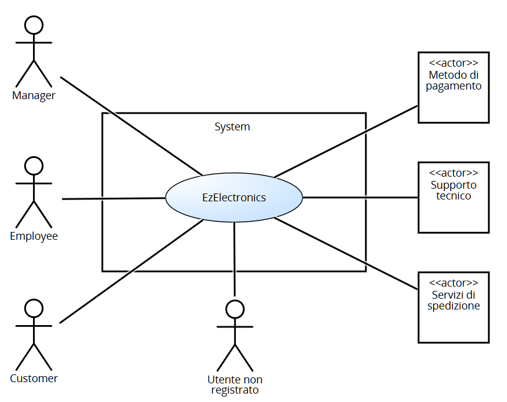
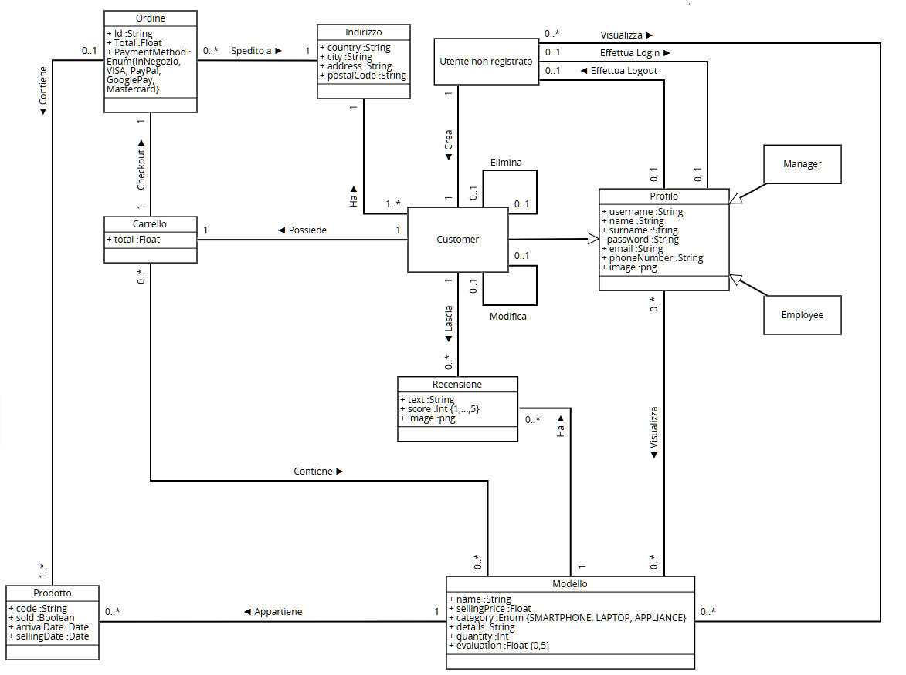
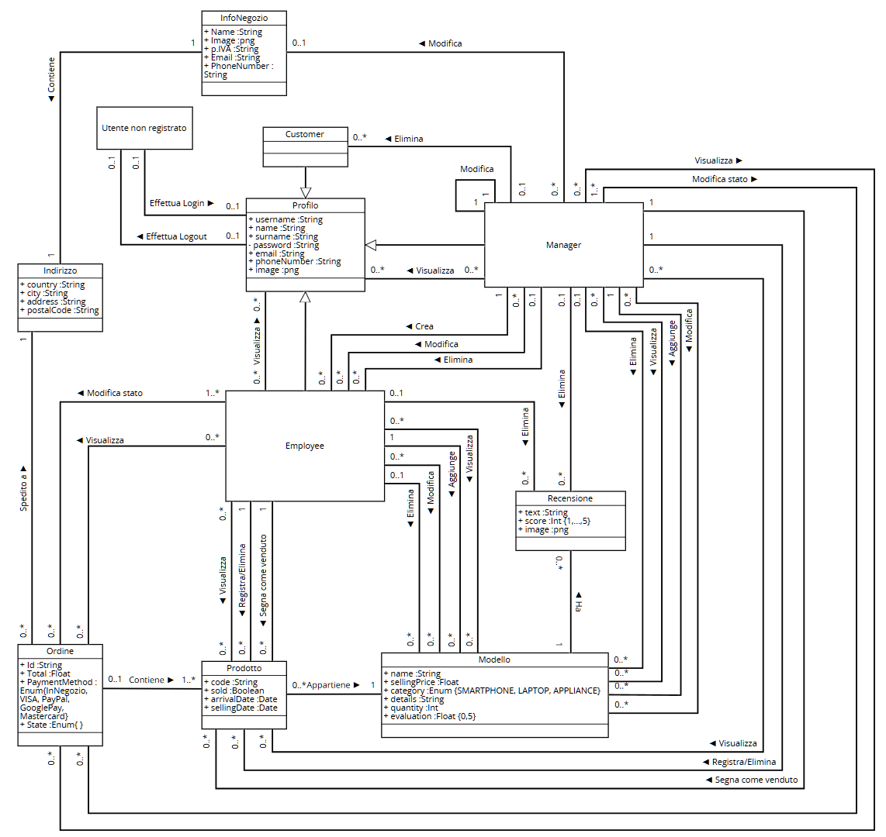

# Requirements Document - current EZElectronics

Date: 05/05/2024

Version: V2 - description of EZElectronics in NEW form (as decided in group)

| Version number | Change |
| :------------: | :----: |
|       9        | System design diagram |

# Contents

- [Requirements Document - current EZElectronics](#requirements-document---current-ezelectronics)
- [Contents](#contents)
- [Informal description](#informal-description)
- [Stakeholders](#stakeholders)
- [Context Diagram and interfaces](#context-diagram-and-interfaces)
  - [Context Diagram](#context-diagram)
  - [Interfaces](#interfaces)
- [Stories and personas](#stories-and-personas)
- [Functional and non functional requirements](#functional-and-non-functional-requirements)
  - [Functional Requirements](#functional-requirements)
  - [Non Functional Requirements](#non-functional-requirements)
  - [Table of rights](#table-of-rights)
- [Use case diagram and use cases](#use-case-diagram-and-use-cases)
  - [Use case diagram](#use-case-diagram)
  - [Use cases](#use-cases)
    - [UC1, Creazione di un nuovo utente customer](#use-case-1-uc1-creazione-di-un-nuovo-utente-customer)
    - [UC2, Login](#use-case-2-uc2-login)
    - [UC3, Logout](#use-case-3-uc3-logout)
    - [UC4, Stampa informazioni utente](#use-case-4-uc4-stampa-informazioni-utente)
    - [UC5, Creazione profilo dell'employee da parte del manager](#use-case-5-uc5-creazione-profilo-dellemployee-da-parte-del-manager)
    - [UC6, Modifica profilo dell'employee da parte del manager](#use-case-6-uc6-modifica-profilo-dellemployee-da-parte-del-manager)
    - [UC7, Eliminazione profilo dell'employee](#use-case-7-uc7-eliminazione-profilo-dellemployee-da-parte-del-manager)
    - [UC8, Eliminazione profilo del customer](#use-case-8-uc8-eliminazione-profilo-customer-da-parte-di-un-manager)
    - [UC9, Eliminazione del proprio profilo](#use-case-9-uc9-eliminazione-del-proprio-profilo)
    - [UC10, Visualizzazione di tutti gli utenti](#use-case-10-uc10-visualizzazione-di-tutti-gli-utenti)
    - [UC11, Visualizzazione di un utente](#use-case-11-uc11-visualizzazione-dettagli-utente)
    - [UC12, Modifica informazzioni del negozio](#use-case-12-uc12-modifica-delle-informazioni-sul-negozio)
    - [UC13, Modifica del proprio profilo](#use-case-13-uc13-modifica-del-proprio-profilo)
    - [UC14, Creazione nuovo prodotto](#use-case-14-uc14-creazione-di-un-nuovo-prodotto)
    - [UC15, Registrazione arrivo di un set di prodotti](#use-case-15-uc15-registrazione-arrivo-di-un-set-di-prodotti)
    - [UC16, Registrazione prodotto come venduto](#use-case-16-uc16-registrazione-prodotto-come-venduto)
    - [UC17, Ricerca prodotto](#use-case-17-uc17-ricerca-prodotto)
    - [UC18, Elenco prodotti](#use-case-18-uc18-elenco-prodotti)
    - [UC19, Eliminazione prodotto](#use-case-19-uc19-eliminazione-prodotto)
    - [UC20, Creazione nuovo modello](#use-case-20-uc20-creazione-di-un-nuovo-modello)
    - [UC21, Modifica di un modello](#use-case-21-uc21-modifica-di-un-modello)
    - [UC22, Eliminazione di un modello](#use-case-22-uc22-eliminazione-di-un-modello)
    - [UC23, Elenco modelli](#use-case-23-uc23-elenco-modelli)
    - [UC24, Ricerca modello](#use-case-24-uc24-ricerca-modello)
    - [UC25, Visualizzazione carrello](#use-case-25-uc25-visualizzazione-carrello)
    - [UC26, Aggiunta al carrello](#use-case-26-uc26-aggiunta-al-carrello)
    - [UC27, Checkout carrello](#use-case-27-uc27-checkout-carrello)
    - [UC28, Rimozione dal carrello](#use-case-28-uc28-rimozione-dal-carrello)
    - [UC29, Svuotamento carrello](#use-case-29-uc29-svuotamento-carrello)
    - [UC30, Pagamento online](#use-case-30-uc30-pagamento-online)
    - [UC31, Visualizzazione ordine](#use-case-31-uc31-visualizzazione-ordine)
    - [UC32, Ricerca ordine](#use-case-32-uc32-ricerca-ordine-tramite-id)
    - [UC33, Modifica stato dell'ordine](#use-case-33-uc33-modifica-stato-dellordine)
    - [UC34, Storico ordini](#use-case-34-uc34-storico-ordini)
    - [UC35, Cronologia ordini](#use-case-35-uc35-cronologia-ordini)
    - [UC36, Nuova recensione](#use-case-36-uc36-nuova-recensione)
    - [UC37, Visualizzazione recensioni](#use-case-37-uc37-visualizzazione-recensioni-del-modello)
    - [UC38, Eliminazione della propria recensione](#use-case-38-uc38-eliminazione-recensione-da-parte-del-customer)
    - [UC39, Eliminazione di una recensione](#use-case-39-uc39-eliminazione-recensione-da-parte-del-manageremployee)
    - [UC40, Visualizzazione delle recensioni personali](#use-case-40-uc40-visualizzazione-delle-recensioni-personali)
    - [UC41, Visualizzazione recensioni di un utente](#use-case-41-uc41-visualizzazione-recensioni-di-un-utente)

- [Glossary](#glossary)
- [System Design](#system-design)
- [Deployment Diagram](#deployment-diagram)

# Informal description

EZElectronics (read EaSy Electronics) is a software application designed to help managers of electronics stores to manage their products and offer them to customers through a dedicated website. Managers can assess the available products, record new ones, and confirm purchases. Employees help managers and have similar tasks. Customers can see available products, add them to a cart and see the history of their past purchases.

# Stakeholders

| Stakeholder name | Description |
| :--------------: | :---------: |
| Manager          | Principale utente dell'applicazione, ha un interesse diretto nel suo funzionamento ottimale per gestire efficacemente i prodotti e le vendite del suo negozio. Può modificare le informazioni generali del negozio e gestire il profilo degli Employee. |
| Customer         | Acquirente che utilizza il sito web dedicato per visualizzare e acquistare prodotti. Ha un interesse nell'esperienza utente, nella facilità di navigazione, e nella consistenza sui dati dei prodotti. |
| Employee         | Commesso del negozio, deve gestire il negozio sia nella sua parte fisica sia nella parte online, potendo aggiungere prodotti e segnare le vendite. |
| Utente non registrato | Visistatore del sito web che non ha ancora creato un profilo. È interessato a visualizzare e cercare i modelli che il sito permette di acquistare. |
| Servizi di pagamento | Servizi terzi che permettono ai customer di effettuare transazioni in modo sicuro. |
| Supporto tecnico | Responsabile della creazione, manutenzione e aggiornamento dell'applicazione. |
| Servizi di spedizione | Servizi terzi che si incaricano di consegnare i prodotti acquistati dagli utenti presso l'indirizzo da loro specificato.  |

# Context Diagram and interfaces

## Context Diagram

## Interfaces

|   Actor   | Logical Interface | Physical Interface |
| :-------: | :---------------: | :----------------: |
| Manager   | Pc                | GUI                |
| Customer  | Smartphone, Pc    | GUI                |
| Employee  | Pc, Scanner codici a barre    | GUI    |
| Utente non registrato | Smartphone, pc | GUI |
| Servizi di pagamento | Internet   | <https://developers.google.com/pay/api>, <https://paypal.com/>, <https://visa.com/>, <https://mastercard.com/> |
| Supporto tecnico  | Pc    | GUI  |
| Servizi di spedizione  | Internet    | <https://gsped.com/api/> |

# Stories and personas

## Personas

|   **Manager**   |  |
| :-------: | :---------------: |
| Età| 37 anni|
| Occupazione| Manager di un negozio di elettronica|
|Comportamento| Organizzato, interessato alle vendite|
|Obiettivi| Monitorare le vendite, gestire l'inventario e i prodotti del negozio|
|Necessità| Dashboard per le vendite, gestione dell'inventario|

|   **Employee**   |  |
| :-------: | :---------------: |
| Età| 28 anni|
| Occupazione| Dipendente di un negozio di elettronica|
|Comportamento| Puntuale, organizzato, affidabile|
|Obiettivi| Gestire l’inventario prodotti, revisione ordini, preparazione ordini|
|Necessità| Gestione dell'inventario e delle vendite, dashboard ordini|

|   **Customer**   |  |
| :-------: | :---------------: |
| Età| 28 anni|
| Occupazione| Graphic designer|
|Comportamento|  Attenta ai dettagli, interessata ai modelli di qualità|
|Obiettivi| Acquistare modelli di qualità e visualizzare i propri ordini precedenti|
|Necessità| Navigazione intuitiva, acquisti sicuri|

|   **Utente non registrato**   |  |
| :-------: | :---------------: |
| Età| 40 anni|
| Occupazione| Imprenditore|
|Comportamento|  Pratico, interessato agli affari, interessato alla qualità |
|Obiettivi| Trovare informazioni sui modelli, confrontare prezzi|
|Necessità| Accesso facile ai modelli, dettagli dei modelli senza registrazione|

## Stories

|  **Manager**  |
| :-------  |
| In qualità di manager voglio aggiungere uno o più prodotti dello stesso modello, rimuovere articoli dall'inventario o segnare prodotti come venduti.|
| Come manager voglio poter visualizzare l'intero inventario, un singolo prodotto tramite il suo codice, o prodotti appartenenti a una specifica categoria o modello. |
| Come manager voglio essere in grado di vedere l'elenco completo dei modelli disponibili sul sito. |
| Come manager voglio poter apportare modifiche ai dettagli di un modello in vendita. |
| Come manager voglio poter visualizzare i profili degli utenti registrati. |
| Come manager voglio poter creare i profili degli employee |

|  **Employee** |
| :-------  |
| Come employee voglio essere in grado di registrare l'arrivo di prodotti in magazzino e annotare le vendite.|
| Come employee voglio visualizzare la lista completa dei prodotti venduti e non venduti. |
| Come employee voglio avere accesso alla lista completa dei modelli disponibili e quelli non disponibili.|

|  **Customer** |
| :-------  |
| Come customer voglio avere la possibilità di aggiungere, rimuovere e visualizzare i modelli presenti nel mio carrello. |
| Come customer voglio poter effettuare l'ordine del mio carrello in pochi e chiari passaggi. |
| Come customer voglio accedere alla cronologia completa dei miei ordini. |
| Come customer voglio poter visualizzare tutti i modelli presenti nell'inventario o appartenenti a una specifica categoria.|
| Come customer voglio poter modificare facilmente i dettagli del mio profilo. |

|  **Utente non registrato** |
| :-------  |
| Come utente non registrato voglio poter visualizzare tutti i modelli presenti nell'inventario o appartenenti a una specifica categoria, e leggere le recensioni associate, senza dovermi registrare.|
| Come utente non registrato, voglio poter creare un account in modo rapido e senza complicazioni.|

# Functional and non functional requirements

## Functional Requirements

|  ID   | Description                                                         |
| :---: | :---------                                                          |
| **FR1** |      **Gestione utenti**                                          |
| FR1.1 | Gli utenti non autenticati hanno la capacità di creare un profilo utente di tipo "customer".                        |
| FR1.2 | Gli utenti non autenticati possono effettuare il login nel sistema.                                                 |
| FR1.3 | Gli utenti autenticati hanno la possibilità di eseguire il logout dal sistema.                                      |
| FR1.4 | Gli utenti "customer" possono accedere e visualizzare le informazioni associate al proprio profilo utente.          |
| FR1.5 | I manager sono abilitati a creare il profilo di un dipendente ("employee").                                         |
| FR1.6 | I manager possono apportare modifiche al profilo di un dipendente.                                                  |
| FR1.7 | I manager hanno l'autorità di eliminare il profilo di un dipendente.                                                |
| FR1.8 | I manager possono eliminare il profilo di un customer.                                                  |
| FR1.9 | I customer hanno la facoltà di eliminare il proprio profilo utente.                                       |
| FR1.10| I manager e gli employee hanno accesso alla visualizzazione dell'intero elenco dei profili utente registrati.       |
| FR1.11| I manager e gli employee possono filtrare l'elenco dei profili utente registrati in base al ruolo.                  |
| FR1.12| I manager e gli employee possono visualizzare il profilo di un altro utente tramite il suo username.                |
| FR1.13| Gli utenti di tipo "manager" o di tipo "customer" possono modificare le informazioni del proprio profilo utente.    |
| **FR2** |    **Gestione prodotti**                                          |
| FR2.1 | I manager e gli employee possono registrare un nuovo prodotto       |
| FR2.2 | I manager e gli employee possono registrare l'arrivo di una serie di prodotti appartenenti allo stesso modello. |
| FR2.3 | I manager e gli employee hanno la capacità di segnare un prodotto come venduto nel sistema.                     |
| FR2.4 | I manager e gli employee possono effettuare ricerche di prodotti tramite il loro codice.                        |
| FR2.5 | I manager e gli employee possono ottenere un elenco completo di tutti i prodotti e filtrarli per modello e categoria. |
| FR2.6 | I manager e gli employee possono eliminare un prodotto che non è ancora stato venduto dal sistema.           |
| **FR3**| **Gestione modelli**                                               |
| FR3.1 | I manager o gli employee possono creare un nuovo modello di prodotto.            |
| FR3.2 | I manager e gli employee sono in grado di apportare modifiche a un modello esistente.              |
| FR3.3 | I manager e gli employee possono eliminare un modello solo se tutti i prodotti associati sono stati venduti.       |
| FR3.4 | Gli utenti possono ottenere un elenco completo di tutti i modelli e filtrarli per categoria. |
| FR3.5 | Gli utenti hanno la capacità di cercare un modello specifico tramite il suo nome. |
| **FR4** | **Gestione carrello**                                             |
| FR4.1 | Gli utenti "customer" possono visualizzare il contenuto del proprio carrello.                    |
| FR4.2 | Gli utenti "customer" possono aggiungere un modello al proprio carrello, specificando la quantità desiderata. |
| FR4.3 | Gli utenti "customer" possono procedere al checkout del proprio carrello.           |
| FR4.4 | Gli utenti "customer" possono rimuovere un prodotto dal loro carrello.o                  |
| FR4.5 | Gli utenti "customer" possono svuotare completamente il proprio carrello.                       |
| **FR5** | **Gestione ordini**                                               |
| FR5.1 | Gli utenti "customer" possono scegliere se ritirare il proprio ordine presso il negozio o riceverlo tramite corriere. |
| FR5.2 | Se l'utente "customer" opta per la consegna tramite corriere, il sito deve trasferire i dati di spedizione al corriere. |
| FR5.3 | Se l'utente "customer" sceglie la consegna tramite corriere, deve essere reindirizzato alla pagina di pagamento. |
| FR5.4 | Gli utenti "customer" possono visualizzare lo stato attuale del proprio ordine.           |
| FR5.5 |  Il sistema notifica i manager e gli employee quando un customer completa un nuovo checkout. |
| FR5.6 | I manager e gli employee possono modificare lo stato di un ordine nel sistema.   |
| FR5.7 | I manager e gli employee possono cercare un ordine specifico tramite il suo identificatore.       |
| FR5.8 | I manager e gli employee possono accedere allo storico completo di tutti gli ordini effettuati.    |
| FR5.9| I manager e gli employee possono filtrare lo storico degli ordini in base allo stato. |
| FR5.10| Gli utenti customer possono visualizzare la loro cronologia completa degli ordini.          |
| **FR6** | **Gestione recensioni**                                           |
| FR6.1 | Gli utenti customer che hanno acquistato un determinato prodotto possono recensirne il modello. |
| FR6.2 | Gli utenti hanno la possibilità di visualizzare le recensioni di un determinato modello di prodotto. |
| FR6.3 | Gli utenti customer hanno la possibilità di eliminare le proprie recensioni.        |
| FR6.4 | I manager e gli employee possono eliminare una recensione dal sistema.          |
| FR6.5 | Gli utenti customer possono visualizzare un elenco delle loro recensioni.                  |
| FR6.6 | I manager o gli employee possono visualizzare le recensioni di un determinato utente "cutomer" nel sistema.  |
| **FR7** | **Gestione delle informazioni sul negozio**                       |
| FR7.1 | I manager possono modificare le informazioni relative al negozio nel sistema.       |

- Nota: Si sottolinea che il requisito FR1.1 evidenzia la possibilità di creare soltanto utenti di tipo "customer". Si precisa inoltre che gli utenti di tipo "manager" devono essere preesistenti nel database al momento dell'avvio del sistema, mentre gli utenti di tipo "employee" devono essere creati esclusivamente da un utente di tipo "manager".
- Nota: È importante notare che il requisito FR6.4 potrebbe suscitare questioni etiche; tuttavia, è stato ritenuto necessario per motivi di moderazione.
- Nota: Si tenga presente che i requisiti FR1.8 e FR1.9 comportano la rimozione completa dalle informazioni personali del database (nome, cognome, username, numero di telefono, email, indirizzo, CAP, città, stato, foto profilo e password) nonché tutte le recensioni scritte dall'utente. È tuttavia fondamentale conservare per ragioni legali lo storico degli ordini effettuati, al quale l'utente non può accedere.
- Nota: Si evidenzia che il requisito FR3.3 comporta l'eliminazione completa dalle informazioni relative a un modello nel database, comprese nome, specifiche tecniche, immagini, prezzo, recensioni e valutazioni. È però essenziale mantenere per motivi legali lo storico di tutti gli ordini relativi a quel modello.

## Non Functional Requirements

|   ID    | Type (efficiency, reliability, ..) | Description | Refers to |
| :-----: | :--------------------------------: | :---------  | :-------: |
| NFR1    | Usabilitá      | Un nuovo customer che visita per la prima volta il sito deve poter utilizzare tutte le funzionalità basilari (ricerca prodotti, aggiunta al carrello e checkout) senza alcun tipo di training. Un nuovo manager deve essere in grado di sfruttare tutte le funzionalità del sito dopo un massimo di due ore di training. | FR1-FR7 |
| NFR2    | Persistenza dei dati | Le informazioni relative ad un utente registrato non devono andare perse e devono rimanere consistenti nel database anche se esso effettua logout | FR1 |
| NFR3    | Persistenza dei dati | Le informaizoni relative a tutti gli ordini non devono andare perse e devono rimanere consistenti nel database anche se esso effettua logout | FR5 | 
| NFR4    | Prestazioni    | Il sito deve essere in grado di gestire e portare a compimento un minimo di 10 transazioni al secondo. Il tempo di risposta ad un evento (come click su un pulsante) in condizioni ottimali di velocità della connessione non deve superare i 2 secondi. | FR1-FR7 |
| NFR5    | Affidabilità   | Il tempo di disponibilitá del servizio durante un mese deve essere almeno del 99.95%. | FR1-FR3  |
| NFR6    | Robustezza     | non possono verificarsi più di 5 guasti all’anno e, nel caso se ne verifichi uno, il tempo richiesto affinché il sito torni online non deve superare le 12h | FR1-FR7 |
| NFR7    | Portabilità    | Il sito deve poter essere visualizzato su tutte le versioni degli ultimi 4 anni di almeno cinque dei browser più utilizzati. | FR1-FR7 |
| NFR8    | Sicurezza      | Le fughe di dati non possono verificarsi più frequentemente di una volta ogni 20 anni. | FR1-FR7 |

**Nota**: la scrittura FRX-FRY signfica che il relativo NFR si riferisce a tutti i FR da FRX a FRY compresi. La dicitura FRX, FRY significa che il relativo NFR si riferisce separatamente a FRX e FRY.

### Table of rights

| FR  | Utente non autenticato | Customer  |  Manager  |  Employee  | Servizi di pagamento | Servizi di spedizione |
| :-: | :--------------------: | :------:  |  :-----:  |  :-------: | :------------------: | :-------------------: |
| 1.1 |           X            |     X     |     X     |     X      |                      |                       |
| 1.2 |           X            |     X     |     X     |     X      |                      |                       |
| 1.3 |                        |     X     |     X     |     X      |                      |                       |
| 1.4 |                        |     X     |     X     |     X      |                      |                       |
| 1.5 |                        |           |     X     |            |                      |                       |
| 1.6 |                        |           |     X     |            |                      |                       |
| 1.7 |                        |           |     X     |            |                      |                       |
| 1.8 |                        |           |     X     |            |                      |                       |
| 1.9 |                        |     X     |           |            |                      |                       |
| 1.10|                        |           |     X     |     X      |                      |                       |
| 1.11|                        |           |     X     |     X      |                      |                       |
| 1.12|                        |           |     X     |     X      |                      |                       |
| 1.13|                        |     X     |     X     |            |                      |                       |
| 2.1 |                        |           |     X     |     X      |                      |                       |
| 2.2 |                        |           |     X     |     X      |                      |                       |
| 2.3 |                        |           |     X     |     X      |                      |                       |
| 2.4 |                        |           |     X     |     X      |                      |                       |
| 2.5 |                        |           |     X     |     X      |                      |                       |
| 2.6 |                        |           |     X     |     X      |                      |                       |
| 3.1 |                        |           |     X     |     X      |                      |                       |
| 3.2 |                        |           |     X     |     X      |                      |                       |
| 3.3 |                        |           |     X     |     X      |                      |                       |
| 3.4 |          X             |     X     |     X     |     X      |                      |                       |
| 3.5 |          X             |     X     |     X     |     X      |                      |                       |
|  4  |                        |     X     |           |            |                      |                       |
| 5.1 |                        |     X     |           |            |                      |                       |
| 5.2 |                        |     X     |           |            |                      |           X           |
| 5.3 |                        |     X     |           |            |         X            |                       |
| 5.4 |                        |     X     |           |            |                      |                       |
| 5.5 |                        |     X     |           |            |                      |                       |
| 5.6 |                        |           |     X     |     X      |                      |                       |
| 5.7 |                        |           |     X     |     X      |                      |                       |
| 5.8 |                        |           |     X     |     X      |                      |                       |
| 5.9 |                        |           |     X     |     X      |                      |                       |
| 5.10|                        |           |     X     |     X      |                      |                       |
| 5.11|                        |           |           |            |                      |                       |
| 6.1 |                        |     X     |           |            |                      |                       |
| 6.2 |          X             |     X     |     X     |     X      |                      |                       |
| 6.3 |                        |     X     |           |            |                      |                       |
| 6.4 |                        |           |     X     |     X      |                      |                       |
| 6.5 |                        |     X     |           |            |                      |                       |
| 6.6 |                        |           |     X     |     X      |                      |                       |
| 7 |                          |           |     X     |            |                      |                       |

# Use case diagram and use cases

## Use case diagram

Di seguto si riporta una vista generale dello use case diagram, con solo delle macro categorie.

- Use case riferiti alla gestione degli utenti

- Use case riferiti alla gestione dei modelli

- Use case riferiti alla gestione dei prodotti

- Use case riferiti alla gestione del carrello

- Use case riferiti alla gestione ordini

- Use case riferiti alla gestione delle recensioni

**Nota**: per avere un'idea chiara e precisa di tutte le condizioni necessarie affinchè uno use case possa verificarsi si consiglia di leggere gli use cases di riportati nell'apposita sezione di questo documento.

## Use cases

### Use case 1, UC1 Creazione di un nuovo utente customer

| Actors Involved  |                     Utente non autenticato        |
| :--------------: | :------------------------------------------------------------------: |
|   Precondition   |  Utente non autenticato                                    |
|  Post condition  |  Un nuovo utente customer viene creato e inserito nel database       |
| Nominal Scenario |  Creazione utente customer |
|     Variants     |  Nessun inserimento immagine di profilo |
|    Exceptions    |  Username già esistente, errore interno, omissione o invalidazione di campi obbligatori |

|  Scenario 1.1  | Creazione nuovo utente (con immagine)  |
| :------------: | :------------------------------------------------------------------------: |
|  Precondition  | Utente non autenticato |
| Post condition | Nuovo utente viene creato e inserito nel database   |
|     Step#      |                                Description                                 |
|       1        | L'utente richiede al sistema di creare un nuovo utente cliccando sul link in basso |
|       2        | Il sistema chiede all’utente di inserire username, name, surname, password, indirizzo, città, stato, CAP, email, cellulare, immagine |
|       3        | L'utente inserisce le informazioni richieste dal sistema e clicca su "Registrati" |
|       4        | Il sistema controlla se nel database è già presente un altro utente con lo stesso username |
|       5        | Il sistema applica un algoritmo di hash della password |
|       6        | Il sistema inserisce le informazioni in una nuova linea nel database |
|       7        | Il sistema risponde con il messaggio di successo (status: 200) |

|  Scenario 1.2  | Creazione nuovo utente (senza immagine)  |
| :------------: | :------------------------------------------------------------------------: |
|  Precondition  | Utente non autenticato |
| Post condition | Un nuovo utente customer viene creato e inserito nel database   |
|     Step#      |                                Description                                 |
|       1        | L'utente richiede al sistema di creare un nuovo utente cliccando sul link in basso |
|       2        | Il sistema chiede all’utente di inserire username, name, surname, password, indirizzo, città, stato, CAP, email, cellulare, immagine |
|       3        | L'utente inserisce le informazioni richieste dal sistema, tranne l'immagine, e clicca su "Registrati" |
|       4        | Il sistema controlla se nel database è già presente un altro utente con lo stesso username |
|       5        | Il sistema applica un algoritmo di hash della password |
|       6        | Il sistema inserisce le informazioni in una nuova linea nel database |
|       7        | Il sistema risponde con il messaggio di successo (status: 200) |

|  Scenario 1.3  | Creazione di un utente già presente  |
| :------------: | :------------------------------------------------------------------------: |
|  Precondition  | Utente non autenticato, lo username è già presente nel database |
| Post condition | Un messaggio di errore viene mostrato a schermo, non viene creato l’utente   |
|     Step#      |                                Description                                 |
|       1        | L'utente richiede al sistema di creare un nuovo utente cliccando sul link in basso |
|       2        | Il sistema chiede all’utente di inserire username, name, surname, password, indirizzo, città, stato, CAP, email, cellulare, immagine |
|       3        | L'utente inserisce le informazioni richieste dal sistema e clicca su "Registrati" |
|       4        | Il sistema controlla se nel database è già presente lo username passato |
|       5        | La richiesta fallisce e Il sistema mostra a video un messaggio di errore (status: 404) |

|  Scenario 1.4  | Omissione di campi obbligatori o campi non validi |
| :------------: | :------------------------------------------------------------------------: |
|  Precondition  | Utente non autenticato |
| Post condition | Un messaggio di errore viene mostrato a schermo, non viene creato l’utente   |
|     Step#      |                                Description                                 |
|       1        | L'utente richiede al sistema di creare un nuovo utente cliccando sul link in basso |
|       2        | Il sistema chiede all’utente di inserire username, name, surname, password, indirizzo, città, stato, CAP, email, cellulare, immagine |
|       3        | L'utente inserisce le informazioni richieste dal sistema, ma ne omette alcune o inserisce valori non validi e clicca su "Registrati" |
|       4        | La richiesta fallisce e Il sistema mostra a video un messaggio di errore (status: 404)|

|  Scenario 1.5  |  Errore interno |
| :------------: | :----------------------------------------------------------------------: |
| Precondition   | L'utente ha avviato la richiesta |
| Post condition | L'operazione viene annullata |
|     Step#      |   Description    |
|       1        | Il sistema annulla ogni modifica nel database e stampa il messaggio di errore |

### Use case 2, UC2, Login

| Actors Involved  |           Chiunque                                     |
| :--------------: | :----------------------------------------------------: |
|   Precondition   |  Utente non autenticato                                |
|  Post condition  |  Utente autenticato e autorizzato                      |
| Nominal Scenario |  Login dell'utente                                     |
|     Variants     |  Nessuna                                               |
|    Exceptions    |  Username o password non riconosciuti, errore interno  |

|  Scenario 2.1  | Login corretto                                           |
| :------------: | :------------------------------------------------------: |
|  Precondition  | Utente non autenticato                                   |
| Post condition | Utente autenticato e autorizzato                         |
|      Step#     |         Description                                      |
|       1        | Il sistema chiede all'utente di inserire username e password |
|       2        | L'utente fornisce username e password nei campi appositi e clicca su "Accedi" |
|       3        | Il sistema cerca lo username nel database                |
|       4        | Il sistema confronta la password inserita con quella salvata |
|       5        | Il sistema esegue il login utente (status: 200)          |

|  Scenario 2.2  | Username inesistente                                     |
| :------------: | :------------------------------------------------------: |
|  Precondition  | Username inesistente                                     |
| Post condition | Utente non autenticato                                   |
|     Step#      |             Description     |
|       1        | Il sistema richiede all'utente di inserire username e password |
|       2        | L'utente fornisce username e password nei campi appositi e clicca su "Accedi" |
|       3        | Il sistema cerca lo username nel database |
|       4        | Il sistema non autorizza l’utente (status: 404) e mostra “Credenziali non valide” |

|  Scenario 2.3  |  Password errata |
| :------------: | :------------------------------------------------------------------------: |
|  Precondition  | Password errata |
| Post condition | Utente non autenticato    |
|     Step#      |                                Description     |
|       1        | Il sistema richiede all'utente di inserire username e password |
|       2        | L'utente fornisce username e password nei campi appositi e clicca su "Accedi" |
|       3        | Il sistema cerca lo username nel database |
|       4        | Il sistema confronta la password inserita con quella salvata |
|       5        | Il sistema non autorizza l’utente (status: 404) e mostra “Credenziali non valide” |

|  Scenario 2.4  |  Errore interno |
| :------------: | :----------------------------------------------------------------------: |
| Precondition   | L'utente ha avviato la richiesta |
| Post condition | L'operazione viene annullata |
|     Step#      |   Description    |
|       1        | Il sistema non autorizza l'utente e mostra il messaggio di errore |

### Use case 3, UC3, Logout

| Actors Involved  |           Utente (customer, manager o employee)         |
| :--------------: | :------------------------------------------------------------------: |
|   Precondition   | Utente autenticato  |
|  Post condition  | Utente non più autorizzato   |
| Nominal Scenario | L’utente effettua il logout dal sito |
|     Variants     | Nessuna  |
|    Exceptions    | Errore interno  |

|  Scenario 3.1  |  Logout con successo |
| :------------: | :------------------------------------------------------------------------: |
|  Precondition  | Utente autenticato |
| Post condition | Utente non più autorizzato    |
|     Step#      |                                Description     |
|       1        | L'utente clicca sul link per il logout (barra in alto) |
|       2        | Il sistema risponde eseguendo il logout utente (status: 200) |

|  Scenario 3.2  |  Errore interno |
| :------------: | :----------------------------------------------------------------------: |
| Precondition   | L'utente ha avviato la richiesta |
| Post condition | L'operazione viene annullata |
|     Step#      |   Description    |
|       1        | Il sistema non esegue il Logout e stampa il messaggio di errore |

### Use case 4, UC4, Stampa informazioni utente

| Actors Involved  |           Utente (customer, manager o employee)         |
| :--------------: | :------------------------------------------------------------------: |
|   Precondition   | Utente autenticato  |
|  Post condition  | Stampa delle informazioni utente a video   |
| Nominal Scenario | Informazioni utente visualizzate sullo schermo |
|     Variants     | Nessuna  |
|    Exceptions    | Errore interno  |

|  Scenario 4.1  |  Visualizzazione con successo |
| :------------: | :------------------------------------------------------------------------: |
|  Precondition  | Utente autenticato |
| Post condition | Stampa delle informazioni utente a video   |
|     Step#      |                                Description     |
|       1        | L'utente clicca sull’icona del profilo in alto |
|       2        | Il sistema preleva dal database le informazioni-utente |
|       3        | Il sistema stampa le informazioni appena prelevate a video (status: 200)  |

|  Scenario 4.2  |  Errore interno |
| :------------: | :----------------------------------------------------------------------: |
| Precondition   | L'utente ha avviato la richiesta |
| Post condition | L'operazione viene annullata |
|     Step#      |   Description    |
|       1        | Il sistema stampa il messaggio di errore |

### Use case 5, UC5, Creazione profilo dell'employee da parte del manager

| Actors Involved  |                     Utente manager         |
| :--------------: | :------------------------------------------------------------------: |
|   Precondition   |  Utente autenticato come manager                                    |
|  Post condition  |  Un nuovo utente employee viene creato e inserito nel database                        |
| Nominal Scenario |  Creazione employee |
|     Variants     |  Nessun inserimento immagine di profilo |
|    Exceptions    |  Username già esistente, omissione o invalidazione di campi obbligatori, errore interno |

|  Scenario 5.1  | Creazione nuovo employee  |
| :------------: | :------------------------------------------------------------------------: |
|  Precondition  | Utente autenticato come manager|
| Post condition | Nuovo utente employee creato e inserito nel database   |
|     Step#      |                                Description                                 |
|       1        | L'utente manager richiede al sistema di creare un nuovo utente employee dall'apposito link |
|       2        | Il sistema chiede all’utente di inserire username, name, surname, password, email, cellulare, immagine |
|       3        | L'utente inserisce le informazioni richieste dal sistema e invia la richiesta |
|       4        | Il sistema controlla se nel database è già presente un employee con stesso username |
|       5        | Il sistema applica un algoritmo di hash della password |
|       6        | Il sistema inserisce le informazioni in una nuova linea nel database |
|       7        | Il sistema risponde con il messaggio di successo (status: 200) |

**Nota**: Se il manager non inserisce nessuna immagine profilo, viene usato l'avatar di default

|  Scenario 5.2  | Creazione di un employee già presente  |
| :------------: | :------------------------------------------------------------------------: |
|  Precondition  | Utente autenticato come manager, lo username è già presente nel database |
| Post condition | Un messaggio di errore viene mostrato a schermo, non viene creato l'employee   |
|     Step#      |                                Description                                 |
|       1        | L'utente richiede al sistema di creare un nuovo utente employee dall'apposito link |
|       2        | Il sistema chiede all’utente di inserire username, name, surname, password, email, cellulare, immagine |
|       3        | L'utente inserisce le informazioni richieste dal sistema e invia la richiesta |
|       4        | Il sistema controlla se nel database è già presente un employee con stesso username |
|       5        | La richiesta fallisce e Il sistema mostra a video un messaggio di errore (status: 404) |

|  Scenario 5.3  | Omissione di campi obbligatori  |
| :------------: | :------------------------------------------------------------------------: |
|  Precondition  | Utente non autenticato |
| Post condition | Un messaggio di errore viene mostrato a schermo, non viene creato l’utente   |
|     Step#      |                                Description                                 |
|       1        | L'utente richiede al sistema di creare un nuovo utente employee dall'apposito link |
|       2        | Il sistema chiede all’utente di inserire username, name, surname, password, email, cellulare, immagine |
|       3        | L'utente inserisce le informazioni richieste dal sistema, ma ne omette alcune e invia la richiesta |
|       4        | La richiesta fallisce e Il sistema mostra a video un messaggio di errore (status: 404)|

|  Scenario 5.4  |  Errore interno |
| :------------: | :----------------------------------------------------------------------: |
| Precondition   | L'utente ha inserito tutte le informazioni e ha inviato la richiesta |
| Post condition | L'operazione viene annullata |
|     Step#      |   Description    |
|       1        | Il sistema annulla ogni modifica nel database e stampa il messaggio di errore |

### Use case 6, UC6, Modifica profilo dell'employee da parte del manager

**Nota**: modifica non eseguibile sul campo username

| Actors Involved  |                     Utente manager         |
| :--------------: | :------------------------------------------------------------------: |
|   Precondition   |  Utente autenticato come manager, visualizzazione del profilo desiderato |
|  Post condition  |  Modifica al profilo dell'employee selezionato                        |
| Nominal Scenario |  Modifica employee |
|     Variants     |  Nessun inserimento immagine di profilo |
|    Exceptions    |  Omissione o invalidazione di campi obbligatori, errore interno |

|  Scenario 6.1  | Modifica profilo employee (con immagine)  |
| :------------: | :------------------------------------------------------------------------: |
|  Precondition  | Utente autenticato come manager, visualizzazione del profilo desiderato|
| Post condition | Utente employee modificato nel database   |
|     Step#      |                                Description                                 |
|       1        | L'utente ha viisualizzato il profilo di un employee e clicca sul link per modificarlo |
|       2        | Il sistema chiede all’utente di inserire name,surname,password,email,cellulare,immagine |
|       3        | L'utente inserisce le informazioni richieste dal sistema e invia la richiesta |
|       5        | Il sistema applica un algoritmo di hash della password |
|       6        | Il sistema sovrascrive le informazioni nella linea nel database identificata dallo username |
|       7        | Il sistema risponde con il messaggio di successo (status: 200) |

**Nota**: Se il manager non inserisce nessuna immagine profilo, viene usato l'avatar di default

|  Scenario 6.2  | Omissione o invalidazione di campi obbligatori  |
| :------------: | :------------------------------------------------------------------------: |
|  Precondition  | Utente autenticato come manager, visualizzazione del profilo desiderato|
| Post condition | Utente employee non modificato nel database   |
|     Step#      |                                Description                                 |
|       1        | L'utente ha visualizzato il profilo di un employee e clicca sul link per modificarlo |
|       2        | Il sistema chiede all’utente di inserire name,surname,password,email,cellulare,immagine |
|       3        | L'utente inserisce le informazioni richieste dal sistema tranne alcuni obbligatori o inserisce valori non validi e invia la richiesta |
|       4        | La richiesta fallisce e il sistema stampa un messaggio di errore (status: 404)|

|  Scenario 6.3  |  Errore interno |
| :------------: | :----------------------------------------------------------------------: |
| Precondition   | L'utente ha inserito tutte le informazioni e ha inviato la richiesta |
| Post condition | L'operazione viene annullata |
|     Step#      |   Description    |
|       1        | Il sistema annulla ogni modifica nel database e stampa il messaggio di errore |

### Use case 7, UC7, Eliminazione profilo dell'employee da parte del manager

| Actors Involved  |                     Utente manager         |
| :--------------: | :------------------------------------------------------------------: |
|   Precondition   |  Utente autenticato come manager, visualizzazione del profilo desiderato |
|  Post condition  |  Eliminazione del profilo dell'employee selezionato                        |
| Nominal Scenario |  Eliminazione corretta |
|     Variants     |  Nessuna |
|    Exceptions    |  Errore interno, operazione annullata |

|  Scenario 7.1  | Eliminazione con successo  |
| :------------: | :------------------------------------------------------------------------: |
|  Precondition  | Utente autenticato come manager, visualizzazione del profilo desiderato|
| Post condition | Utente employee eliminato dal database   |
|     Step#      |                                Description                                 |
|       1        | L'utente ha visualizzato il profilo di un employee e clicca sul link per cancellarlo |
|       2        | Il sistema chiede conferma dell'operazione e, dopo l'ok, setta come inattivo il profilo nel database |
|       3        | Il sistema risponde con il messaggio di successo (status: 200)|

|  Scenario 7.2  | Eliminazione annullata  |
| :------------: | :------------------------------------------------------------------------: |
|  Precondition  | Utente autenticato come manager, visualizzazione del profilo desiderato|
| Post condition | Utente employee non eliminato dal database   |
|     Step#      |                                Description                                 |
|       1        | L'utente ha visualizzato il profilo di un employee e clicca sul link per cancellarlo |
|       2        | Il sistema chiede conferma dell'operazione  |
|       3        | L'utente annulla l'operazione |

|  Scenario 7.3  |  Errore interno |
| :------------: | :----------------------------------------------------------------------: |
| Precondition   | L'utente ha avviato la richiesta di eliminazione |
| Post condition | L'operazione viene annullata |
|     Step#      |   Description    |
|       1        | Il sistema annulla ogni modifica nel database e stampa il messaggio di errore |

### use case 8, UC8, Eliminazione profilo customer da parte di un manager

| Actors Involved  |                     Utente manager         |
| :--------------: | :------------------------------------------------------------------: |
|   Precondition   |  Utente autenticato come manager, visualizzazione del profilo desiderato |
|  Post condition  |  Eliminazione del profilo del customer selezionato                        |
| Nominal Scenario |  Eliminazione corretta |
|     Variants     |  Nessuna |
|    Exceptions    |  Errore interno, operazione annullata |

|  Scenario 8.1  | Eliminazione con successo  |
| :------------: | :------------------------------------------------------------------------: |
|  Precondition  | Utente autenticato come manager, visualizzazione del profilo desiderato|
| Post condition | Utente customer eliminato dal database   |
|     Step#      |                                Description                                 |
|       1        | L'utente ha visualizzato il profilo di un customer e clicca sul link per cancellarlo |
|       2        | Il sistema chiede conferma dell'operazione e, dopo l'ok, setta come inattivo il profilo nel database |
|       3        | Il sistema risponde con il messaggio di successo (status: 200)|

|  Scenario 8.2  | Eliminazione annullata  |
| :------------: | :------------------------------------------------------------------------: |
|  Precondition  | Utente autenticato come manager, visualizzazione del profilo desiderato|
| Post condition | Utente customer non eliminato dal database   |
|     Step#      |                                Description                                 |
|       1        | L'utente ha visualizzato il profilo di un customer e clicca sul link per cancellarlo |
|       2        | Il sistema chiede conferma dell'operazione  |
|       3        | L'utente annulla l'operazione |

|  Scenario 8.3  |  Errore interno |
| :------------: | :----------------------------------------------------------------------: |
| Precondition   | L'utente ha avviato la richiesta di eliminazione|
| Post condition | L'operazione viene annullata |
|     Step#      |   Description    |
|       1        | Il sistema annulla ogni modifica nel database e stampa il messaggio di errore |

### Use case 9, UC9, Eliminazione del proprio profilo

| Actors Involved  |                     Utente customer         |
| :--------------: | :------------------------------------------------------------------: |
|   Precondition   |  Utente autenticato customer |
|  Post condition  |  Eliminazione del proprio profilo                        |
| Nominal Scenario |  Eliminazione corretta |
|     Variants     |  Nessuna |
|    Exceptions    |  Errore interno, operazione annullata |

|  Scenario 9.1  | Eliminazione con successo  |
| :------------: | :------------------------------------------------------------------------: |
|  Precondition  | Utente autenticato customer|
| Post condition | Utente eliminato dal database   |
|     Step#      |                                Description                                 |
|       1        | L'utente clicca sul link per cancellare il proprio profilo |
|       2        | Il sistema chiede conferma dell'operazione e, dopo l'ok, setta come inattivo il profilo |
|       3        | Il sistema risponde con il messaggio di successo (status: 200) e effettua il logout utente|

|  Scenario 9.2 | Eliminazione annullata  |
| :------------: | :------------------------------------------------------------------------: |
|  Precondition  | Utente autenticato customer|
| Post condition | Utente non eliminato dal database   |
|     Step#      |                                Description                                 |
|       1        | L'utente clicca sul link per cancellare il proprio profilo |
|       2        | Il sistema chiede conferma dell'operazione |
|       3        | L'utente annulla l'operazione |

|  Scenario 9.3  |  Errore interno |
| :------------: | :----------------------------------------------------------------------: |
| Precondition   | L'utente ha avviato la richiesta |
| Post condition | L'operazione viene annullata |
|     Step#      |   Description    |
|       1        | Il sistema annulla ogni modifica nel database e stampa il messaggio di errore |

**Nota**: l'eliminazione del profilo comporta la cancellazione della linea con le informazioni utente dal database, le recensioni, ma non gli ordini effettuati.

### Use case 10, UC10, Visualizzazione di tutti gli utenti

| Actors Involved  |                     Utente manager o employee       |
| :--------------: | :------------------------------------------------------------------: |
|   Precondition   |  Utente autenticato come manager o employee |
|  Post condition  |  Visualizzazione di tutti gli utenti                        |
| Nominal Scenario |  Visualizzazione corretta |
|     Variants     |  Filtro per ruolo |
|    Exceptions    |  Errore interno |

|  Scenario 10.1 | Visualizzazione corretta  |
| :------------: | :------------------------------------------------------------------------: |
|  Precondition  | Utente autenticato come manager o employee|
| Post condition | Visualizzazione di tutti gli utenti    |
|     Step#      |                                Description                                 |
|       1        | L'utente clicca sul link per visualizzare tutti gli utenti registrati |
|       2        | Il sistema risponde stampando a video l'elenco di utenti |

|  Scenario 10.2 | Visualizzazione utenti filtrati per ruolo  |
| :------------: | :------------------------------------------------------------------------: |
|  Precondition  | Utente autenticato come manager o employee, visualizzazione utenti effettuata|
| Post condition | Visualizzazione di tutti gli utenti dato il ruolo   |
|     Step#      |                                Description                                 |
|       1        | L'utente clicca sul filtro ruolo |
|       2        | Il sistema risponde filtrando gli utenti per il ruolo selezionato |

|  Scenario 10.3  |  Errore interno |
| :------------: | :----------------------------------------------------------------------: |
| Precondition   | L'utente ha avviato la richiesta |
| Post condition | L'operazione viene annullata |
|     Step#      |   Description    |
|       1        | Il sistema stampa il messaggio di errore |

### Use case 11, UC11, Visualizzazione dettagli utente

| Actors Involved  |                     Utente manager o employee      |
| :--------------: | :------------------------------------------------------------------: |
|   Precondition   |  Utente autenticato come manager o employee |
|  Post condition  |  Visualizzazione dettagli utente                       |
| Nominal Scenario |  Visualizzazione corretta |
|     Variants     |  Nessuna |
|    Exceptions    |  Username omesso o inesistente, errore interno |

|  Scenario 11.1 | Visualizzazione corretta  |
| :------------: | :------------------------------------------------------------------------: |
|  Precondition  | Utente autenticato come manager o employee|
| Post condition | Visualizzazione di tutti i dettagli dell'utente selezionato    |
|     Step#      |                                Description                                 |
|       1        |  L'utente inserisce uno username nella barra di ricerca e clicca sul pulsante per avviare l'operazione|
|       2        | Il sistema risponde stampando a video l'elenco dei dettagli utente |

|  Scenario 11.2 | Utente non esistente o username omesso  |
| :------------: | :------------------------------------------------------------------------: |
|  Precondition  | Utente autenticato come manager o employee|
| Post condition | Nessuna visualizzazione dell'utente con username scelto   |
|     Step#      |                                Description                                 |
|       1        | L'utente non inserisce uno username o inserisce uno relativo ad un utente inesistente nella barra di ricerca e clicca sul pulsante per avviare l'operazione |
|       2        | Il sistema non trova l'utente e risponde stampando a video un messaggio di errore (status: 404) |

|  Scenario 11.3  |  Errore interno |
| :------------: | :----------------------------------------------------------------------: |
| Precondition   | L'utente ha avviato la richiesta |
| Post condition | L'operazione viene annullata |
|     Step#      |   Description    |
|       1        | Il sistema stampa il messaggio di errore |

### Use case 12, UC12, Modifica delle informazioni sul negozio

| Actors Involved  |                     Utente manager         |
| :--------------: | :------------------------------------------------------------------: |
|   Precondition   |  Utente autenticato come manager |
|  Post condition  |  Modifica delle informazioni sul negozio      |
| Nominal Scenario |  Modifica corretta |
|     Variants     |  Nessuna |
|    Exceptions    |  Errore interno, operazione annullata, campo/i non valido/i o omessi|

|  Scenario 12.1  | Modifica con successo  |
| :------------: | :------------------------------------------------------------------------: |
|  Precondition  | Utente autenticato come manager|
| Post condition | Modifica informazioni sul negozio   |
|     Step#      |                                Description                                 |
|       1        | L'utente clicca sul link per modificare le informazioni suul negozio |
|       2        | Il sistema chiede di inserire i campi nome azienda, p.iva, sede legale, email, numero di telefono |
|       3        | L'utente inserisce i campi richiesti e avvia l'operazione |
|       4        | Il sistema chiede conferma e, una volta ricevuta, avvia l'operazione di modifica |
|       3        | Il sistema risponde con il messaggio di successo (status: 200)|

|  Scenario 12.2 | Modifica annullata |
| :------------: | :------------------------------------------------------------------------: |
|  Precondition  | Utente autenticato come manager|
| Post condition | Nessuna modifica   |
|     Step#      |                                Description                                 |
|       1        | L'utente clicca sul link per modificare le informazioni suul negozio |
|       2        | Il sistema chiede di inserire i campi nome azienda, p.iva, sede legale, email, numero di telefono |
|       3        | L'utente inserisce i campi richiesti e avvia l'operazione |
|       4        | Il sistema chiede conferma|
|       5        | L'utente annulla l'operazione |

|  Scenario 12.3 | Campo/i non valido/i o omessi |
| :------------: | :------------------------------------------------------------------------: |
|  Precondition  | Utente autenticato come manager|
| Post condition | Nessuna modifica |
|     Step#      |                                Description                                 |
|       1        | L'utente clicca sul link per modificare le informazioni suul negozio |
|       2        | Il sistema chiede di inserire i campi nome azienda, p.iva, sede legale, email, numero di telefono |
|       3        | L'utente inserisce i campi richiesti, ma ne omette alcuni o inserisce valori non validi e avvia l'operazione |
|       4        | Il sistema annulla l'operazione e stampa un messaggio di errore (status: 404) |

|  Scenario 12.4  |  Errore interno |
| :------------: | :----------------------------------------------------------------------: |
| Precondition   | L'utente ha avviato la richiesta |
| Post condition | L'operazione viene annullata |
|     Step#      |   Description    |
|       1        | Il sistema annulla ogni modifica nel database e stampa il messaggio di errore |

### Use case 13, UC13, Modifica del proprio profilo

**Nota**: modifica non eseguibile sul campo username

| Actors Involved  |                     Utente manager o customer         |
| :--------------: | :------------------------------------------------------------------: |
|   Precondition   |  Utente autenticato come manager o customer |
|  Post condition  |  Modifica al profilo                        |
| Nominal Scenario |  Modifica al profilo |
|     Variants     |  Nessun inserimento immagine di profilo |
|    Exceptions    |  Omissione o invalidazione di campi obbligatori, errore interno |

|  Scenario 13.1  | Modifica profilo (con immagine)  |
| :------------: | :------------------------------------------------------------------------: |
|   Precondition   |  Utente autenticato come manager o customer |
|  Post condition  |  Modifica al profilo      |
|     Step#      |                                Description                                 |
|       1        | L'utente ha viisualizzato il profilo di un employee e clicca sul link per modificarlo |
|       2        | Il sistema chiede all’utente di inserire name,surname,password,email,cellulare,immagine |
|       3        | L'utente inserisce  TUTTE le informazioni richieste dal sistema e invia la richiesta |
|       5        | Il sistema applica un algoritmo di hash della password |
|       6        | Il sistema sovrascrive le informazioni nella linea nel database identificata dallo username |
|       7        | Il sistema risponde con il messaggio di successo (status: 200) |

**Nota**: Se non viene inserista nessuna immagine profilo, viene usato l'avatar di default

|  Scenario 13.2  | Omissione o invalidazione di campi obbligatori  |
| :------------: | :------------------------------------------------------------------------: |
|   Precondition   |  Utente autenticato come manager o customer |
|  Post condition  |  Modifica al profilo      |
|     Step#      |                                Description                                 |
|       1        | L'utente ha viisualizzato il profilo di un employee e clicca sul link per modificarlo |
|       2        | Il sistema chiede all’utente di inserire name,surname,password,email,cellulare,immagine |
|       3        | L'utente inserisce le informazioni richieste dal sistema tranne alcuni obbligatori o inserisce valori non validi e invia la richiesta |
|       4        | La richiesta fallisce e il sistema stampa un messaggio di errore (status: 404)|

|  Scenario 13.3  |  Errore interno |
| :------------: | :----------------------------------------------------------------------: |
| Precondition   | L'utente ha inserito tutte le informazioni e ha inviato la richiesta |
| Post condition | L'operazione viene annullata |
|     Step#      |   Description    |
|       1        | Il sistema annulla ogni modifica nel database e stampa il messaggio di errore |

### Use case 14, UC14, Creazione di un nuovo prodotto

| Actors Involved  |                     Utente manager o employee         |
| :--------------: | :------------------------------------------------------------------: |
|   Precondition   |  Utente autenticato come manager o employee                          |
|  Post condition  |  Nuovo prodotto creato e inserito nel database                        |
| Nominal Scenario |  Creazione di un nuovo prodotto date le sue informazioni |
|     Variants     |  Nessuna |
|    Exceptions    |  Uno o più campi non inseriti o non validi, errore interno |

|  Scenario 14.1  | Creazione nuovo prodotto con successo |
| :------------: | :------------------------------------------------------------------------: |
|  Precondition  | Utente autenticato come manager o employee |
| Post condition | Nuovo prodotto creato e inserito nel database   |
|     Step#      |                                Description                                 |
|       1        | L'utente richiede al sistema di creare un nuovo prodotto cliccando sul pulsante apposito |
|       2        | Il sistema chiede di inserire sellingPrice, model, category, details, foto |
|       3        | L'utente inserisce le informazioni richieste dal sistema |
|       4        | Il sistema inserisce nel database il nuovo prodotto con i campi passati, aggiungendo il codice prodotto generato autoamaticamente e arrivalDate=data_corrente |
|       6        | Il sistema risponde con il messaggio di successo (status: 200) |

|  Scenario 14.2  | Campo/i non inserito |
| :------------: | :------------------------------------------------------------------------: |
|  Precondition  | Utente autenticato come manager o employee |
| Post condition | Prodotto non creato   |
|     Step#      |                                Description                                 |
|       1        | L'utente richiede al sistema di creare un nuovo prodotto cliccando sul pulsante apposito |
|       2        | Il sistema chiede di inserire sellingPrice, model, category, details, foto |
|       3        | L'utente inserisce le informazioni richieste dal sistema tranne uno o più campi |
|       4        | Il sistema non inserisce il prodotto e risponde con il messaggio di fallimento |

|  Scenario 14.3  | campo/i non valido/i |
| :------------: | :------------------------------------------------------------------------: |
|  Precondition  | Utente autenticato come manager o employee, campo/i non valido/i |
| Post condition | Prodotto non creato   |
|     Step#      |                                Description                                 |
|       1        | L'utente richiede al sistema di creare un nuovo prodotto cliccando sul pulsante apposito |
|       2        | Il sistema chiede di inserire sellingPrice, model, category, details, foto |
|       3        | L'utente inserisce le informazioni richieste dal sistema, ma alcuni non sono validi |
|       4        | Il sistema non inserisce il prodotto e risponde con il messaggio di fallimento |

|  Scenario 14.4  |  Errore interno |
| :------------: | :----------------------------------------------------------------------: |
| Precondition   | L'utente ha avviato la richiesta |
| Post condition | L'operazione viene annullata |
|     Step#      |   Description    |
|       1        | Il sistema annulla ogni modifica nel database e stampa il messaggio di errore |

### Use case 15, UC15, Registrazione arrivo di un set di prodotti

| Actors Involved  |                    Utente manager o employee         |
| :--------------: | :------------------------------------------------------------------: |
|   Precondition   |  Utente autenticato come manager o employee               |
|  Post condition  |  Insieme di prodotti creato e inserito nel database                        |
| Nominal Scenario |  Creazione di un insieme di prodotti di uno stesso modello |
|     Variants     |  Nessuna |
|    Exceptions    |  Uno o più campi omessi o non validi, errore interno |

|  Scenario 15.1  | Creazione nuovo set con successo  |
| :------------: | :------------------------------------------------------------------------: |
|  Precondition  | Utente autenticato come manager o employee |
| Post condition | Nuovi prodotti creati e inseriti nel database   |
|     Step#      |                                Description                                 |
|       1        | L'utente richiede al sistema di caricare un nuovo set di prodotti cliccando sul pulsante apposito |
|       2        | Il sistema chiede di inserire sellingPrice, model, category, details, foto |
|       3        | L'utente inserisce le informazioni richieste dal sistema |
|       4        | Il sistema controlla se tutti i campi sono validi |
|       5        | Il sistema inserisce nel database il nuovo set di prodotti con i campi passati, aggiungendo i codici prodotto generati automaticamente e arrivalDate=data_corrente |
|       6        | Il sistema risponde con il messaggio di successo (status: 200) |

|  Scenario 15.2  | Campo/i non inserito |
| :------------: | :------------------------------------------------------------------------: |
|  Precondition  | Utente autenticato come manager o employee, campo/i non inserito |
| Post condition | Operazione annullata   |
|     Step#      |                                Description                                 |
|       1        | L'utente richiede al sistema di caricare un nuovo set di prodotti cliccando sul pulsante apposito |
|       2        | Il sistema chiede di inserire sellingPrice, model, category, details, foto |
|       3        | L'utente inserisce le informazioni richieste dal sistema tranne uno o più campi |
|       4        | Il sistema non procede e risponde con il messaggio di fallimento |

|  Scenario 15.3  | Campo/i non valido/i |
| :------------: | :------------------------------------------------------------------------: |
|  Precondition  | Utente autenticato come manager o employee, campo/i non valido/i |
| Post condition | Operazione annullata   |
|     Step#      |                                Description                                 |
|       1        | L'utente richiede al sistema di caricare un nuovo set di prodotti cliccando sul pulsante apposito |
|       2        | Il sistema chiede di inserire sellingPrice, model, category, details, foto |
|       3        | L'utente inserisce le informazioni richieste dal sistema con alcuni campi non validi (es sellingPrice<=0.0) |
|       4        | Il sistema non procede e risponde con il messaggio di fallimento |

|  Scenario 15.4  |  Errore interno |
| :------------: | :----------------------------------------------------------------------: |
| Precondition   | L'utente ha avviato la richiesta |
| Post condition | L'operazione viene annullata |
|     Step#      |   Description    |
|       1        | Il sistema annulla ogni modifica nel database e stampa il messaggio di errore |

### Use case 16, UC16, Registrazione prodotto come venduto

| Actors Involved  |                     Utente manager o employee         |
| :--------------: | :------------------------------------------------------------------: |
|   Precondition   |  Utente autenticato come manager o employee                                 |
|  Post condition  |  Prodotto venduto                       |
| Nominal Scenario |  Prodotto segnato nel database come venduto |
|     Variants     |  Nessuna |
|    Exceptions    |  Errore interno |

|  Scenario 16.1  | Il prodotto viene registrato come venduto nel database|
| :------------: | :------------------------------------------------------------------------: |
|  Precondition  | Utente autenticato come manager o employee, prodotto visualizzato |
| Post condition | Prodotto contrassegnato come venduto  |
|     Step#      |                                Description                                 |
|       1        | L'utente richiede al sistema di contrassegnare il prodotto selezionato come venduto |
|       2        | Il sistema contrassegna come venduto il prodotto con il codice passato in data odierna (status: 200) |

|  Scenario 16.2  |  Errore interno |
| :------------: | :----------------------------------------------------------------------: |
| Precondition   | L'utente ha avviato la richiesta |
| Post condition | L'operazione viene annullata |
|     Step#      |   Description    |
|       1        | Il sistema annulla ogni modifica nel database e stampa il messaggio di errore |

**Nota**: se il prodotto è già stato venduto al manager non appare la posssibilità di eseguire l'operazione

### Use case 17, UC17, Ricerca prodotto

| Actors Involved  |                     Utente (employee o manager)         |
| :--------------: | :------------------------------------------------------------------: |
|   Precondition   |  Utente autenticato come manager o employee         |
|  Post condition  |  Informazioni prodotto a schermo                       |
| Nominal Scenario |  L'utente visualizza a schermo le informazioni riguardanti il prodotto cercato |
|     Variants     |  Nessuna |
|    Exceptions    |  Codice omesso o inesistente, errore interno |

|  Scenario 17.1  | Visualizzazione con successo |
| :------------: | :------------------------------------------------------------------------: |
|  Precondition  | Utente autenticato come manager o employee|
| Post condition | Informazioni prodotto a schermo         |
|     Step#      |                                Description                                 |
|       1        | L'utente inserisce il codice di un prodotto nella barra e clicca sul pulsante della ricerca per codice |
|       2        | Il sistema cerca nel database il prodotto con il codice richiesto e lo stampa a video (status: 200) |

|  Scenario 17.2  | Codice omesso |
| :------------: | :------------------------------------------------------------------------: |
|  Precondition  | Utente autenticato come manager o employee |
| Post condition | Nessun prodotto stampato        |
|     Step#      |                                Description                                 |
|       1        | L'utente clicca sul pulsante della ricerca per codice |
|       2        | Il sistema risponde con un messaggio di errore |

|  Scenario 17.3  | Codice inesistente |
| :------------: | :------------------------------------------------------------------------: |
|  Precondition  | Utente autenticato come manager o employee |
| Post condition | Nessun prodotto stampato        |
|     Step#      |                                Description                                 |
|       1        | L'utente inserisce il codice di un prodotto non valido e clicca sul pulsante della ricerca per codice |
|       2        | Il sistema non trova nel database il prodotto richiesto e risponde con un messaggio di errore |

|  Scenario 17.4  |  Errore interno |
| :------------: | :----------------------------------------------------------------------: |
| Precondition   | L'utente ha avviato la richiesta |
| Post condition | L'operazione viene annullata |
|     Step#      |   Description    |
|       1        | Il sistema annulla ogni modifica nel database e stampa il messaggio di errore |

### Use case 18, UC18, Elenco prodotti

| Actors Involved  |                     Utente (manager o employee)         |
| :--------------: | :------------------------------------------------------------------: |
|   Precondition   |  Utente autenticato come manager o employee           |
|  Post condition  |  Elenco prodotti a schermo                       |
| Nominal Scenario |  L'utente visualizza a schermo l'elenco dei prodotti disponibili |
|     Variants     |  Parametro opzionale sold (yes o no, default=null), filtro per modello, categoria |
|    Exceptions    |  Errore interno, filtro per modello con modello omesso o inesistente |

|  Scenario 18.1  | Visualizzazione con successo (senza parametro sold) |
| :------------: | :------------------------------------------------------------------------: |
|  Precondition  | Utente autenticato come manager o employee |
| Post condition | Elenco prodotti a schermo    |
|     Step#      |                                Description                                 |
|       1        | Il sistema preleva dal database tutti i prodotti creati |
|       2        | Il sistema stampa i vari prodotti sulla pagina principale (status: 200) |

|  Scenario 18.2  | Visualizzazione con successo (sold=yes) |
| :------------: | :------------------------------------------------------------------------: |
|  Precondition  | Utente autenticato come manager o employee, stampa di tutti i prodotti effettuata |
| Post condition | Elenco prodotti a schermo    |
|     Step#      |                                Description                                 |
|       1        | L'utente seleziona "venduti" nella tendina laterale |
|       2        | Il sistema filtra i vari prodotti mantenendo solo quelli venduti (status: 200) |

|  Scenario 18.3  | Visualizzazione con successo (sold=no) |
| :------------: | :------------------------------------------------------------------------: |
|  Precondition  | Utente autenticato come manager o employee, stampa di tutti i prodotti effettuata|
| Post condition | Utente autenticato, stampa di tutti i prodotti effettuata     |
|     Step#      |                                Description                                 |
|       1        | L'utente seleziona "Non venduti" nella tendina laterale |
|       2        | Il sistema filtra i vari prodotti mantenendo solo quelli non venduti (status: 200) |

|  Scenario 18.4 | Visualizzazione con successo (per categoria) |
| :------------: | :------------------------------------------------------------------------: |
|  Precondition  | Utente autenticato come manager o employee |
| Post condition | Elenco prodotti a schermo    |
|     Step#      |                                Description                                 |
|       1        | L'utente seleziona dalla barra laterale una tra le categorie proposte |
|       1        | Il sistema preleva dal database tutti i prodotti inerenti a quella categoria |
|       2        | Il sistema stampa i vari prodotti (status: 200) |

|  Scenario 18.5 | Visualizzazione con successo (per modello) |
| :------------: | :------------------------------------------------------------------------: |
|  Precondition  | Utente autenticato come manager o employee |
| Post condition | Elenco prodotti a schermo    |
|     Step#      |                                Description                                 |
|       1        | L'utente inserisce un modello nella barra in alto e clicca sul pulsaante "modello" |
|       2        | Il sistema preleva dal database tutti i prodotti inerenti a quel modello |
|       3        | Il sistema stampa i vari prodotti (status: 200) |

|  Scenario 18.6 | Visualizzazione fallita (per modello) |
| :------------: | :------------------------------------------------------------------------: |
|  Precondition  | Utente autenticato come manager o employee |
| Post condition | Nessun prodotto a schermo    |
|     Step#      |                                Description                                 |
|       1        | L'utente non inserisce un modello valido o esistente nella barra in alto e clicca sul pulsaante "modello" |
|       2        | Il sistema stampa un messaggio di errore (status:404)|

|  Scenario 18.7  |  Errore interno |
| :------------: | :----------------------------------------------------------------------: |
| Precondition   | L'utente ha avviato la richiesta |
| Post condition | L'operazione viene annullata |
|     Step#      |   Description    |
|       1        | Il sistema annulla ogni modifica nel database e stampa il messaggio di errore |

### Use case 19, UC19, Eliminazione prodotto

| Actors Involved  |                     Utente manager o employee        |
| :--------------: | :------------------------------------------------------------------: |
|   Precondition   |  Utente autenticato come manager o employee, Visualizzazione prodotto           |
|  Post condition  |  Prodotto eliminato                     |
| Nominal Scenario |  L'utente elimina il prodotto con codice scelto |
|     Variants     |  Nessuna |
|    Exceptions    |  Errore interno |

|  Scenario 19.1 | Eliminazione con successo |
| :------------: | :------------------------------------------------------------------------: |
|  Precondition  | Utente autenticato come manager o employee, visualizzazione prodotto |
| Post condition | Elenco prodotti a schermo, prodotto eliminato   |
|     Step#      |                                Description                                 |
|       1        | L'utente seleziona un prodotto singolo e clicca sul cestino |
|       2        | Il sistema elimina dal database il prodotto con il codice coincidente a quello selezionato |

|  Scenario 19.2  |  Errore interno |
| :------------: | :----------------------------------------------------------------------: |
| Precondition   | L'utente ha avviato la richiesta |
| Post condition | L'operazione viene annullata |
|     Step#      |   Description    |
|       1        | Il sistema annulla ogni modifica nel database e stampa il messaggio di errore |

**Nota**: L'eliminazione del prodotto avviene solo dopo aver selezionato il prodotto tra quelli a video che di conseguenza esiste nel db.
L'eliminazione è una possibilità offerta solo se il suddetto prodotto non è già stato contrassegnato come venduto o eliminato.

### Use case 20, UC20, Creazione di un nuovo modello

| Actors Involved  |                     Utente manager o employee         |
| :--------------: | :------------------------------------------------------------------: |
|   Precondition   |  Utente autenticato come manager o employee                          |
|  Post condition  |  Nuovo modello creato e inserito nel database                        |
| Nominal Scenario |  Creazione di un nuovo modello date le sue informazioni |
|     Variants     |  Nessuna |
|    Exceptions    |  Uno o più campi non inseriti o non validi, errore interno |

|  Scenario 20.1  | Creazione nuovo modello con successo |
| :------------: | :------------------------------------------------------------------------: |
|  Precondition  | Utente autenticato come manager o employee |
| Post condition | Nuovo modello creato e inserito nel database   |
|     Step#      |                                Description                                 |
|       1        | L'utente richiede al sistema di creare un nuovo modello cliccando sul pulsante apposito |
|       2        | Il sistema chiede di inserire sellingPrice, model, category, details, foto, quantità (default:1) |
|       3        | L'utente inserisce le informazioni richieste dal sistema |
|       4        | Il sistema inserisce nel database il nuovo modello con i campi passati, aggiungendo il codice prodotto generato autoamaticamente e arrivalDate=data_corrente |
|       6        | Il sistema risponde con il messaggio di successo (status: 200) |

|  Scenario 20.2  | Campo/i non inserito |
| :------------: | :------------------------------------------------------------------------: |
|  Precondition  | Utente autenticato come manager o employee |
| Post condition | Modello non creato   |
|     Step#      |                                Description                                 |
|       1        | L'utente richiede al sistema di creare un nuovo modello cliccando sul pulsante apposito |
|       2        | Il sistema chiede di inserire sellingPrice, model, category, details, foto, quantità |
|       3        | L'utente inserisce le informazioni richieste dal sistema tranne uno o più campi |
|       4        | Il sistema non inserisce il modello e risponde con il messaggio di fallimento |

|  Scenario 20.3  | campo/i non valido/i |
| :------------: | :------------------------------------------------------------------------: |
|  Precondition  | Utente autenticato come manager |
| Post condition | Modello non creato   |
|     Step#      |                                Description                                 |
|       1        | L'utente richiede al sistema di creare un nuovo modello cliccando sul pulsante apposito |
|       2        | Il sistema chiede di inserire sellingPrice, model, category, details, foto, quantità |
|       3        | L'utente inserisce le informazioni richieste dal sistema, ma alcuni non sono validi |
|       4        | Il sistema non inserisce il modello e risponde con il messaggio di fallimento |

|  Scenario 20.4  |  Errore interno |
| :------------: | :----------------------------------------------------------------------: |
| Precondition   | L'utente ha avviato la richiesta |
| Post condition | L'operazione viene annullata |
|     Step#      |   Description    |
|       1        | Il sistema annulla ogni modifica nel database e stampa il messaggio di errore |

### Use case 21, UC21, Modifica di un modello

| Actors Involved  |                     Utente manager o employee         |
| :--------------: | :------------------------------------------------------------------: |
|   Precondition   |  Utente autenticato come manager o employee, modello selezionato   |
|  Post condition  |  Modello modificato    |
| Nominal Scenario |  Modifica del modello selezionato |
|     Variants     |  Nessuna |
|    Exceptions    |  Omissione o invalidazione di uno o più campi, errore interno |

|  Scenario 21.1  | Modifica con successo |
| :------------: | :------------------------------------------------------------------------: |
|  Precondition  | Utente autenticato come manager o employee, modello selezionato |
| Post condition | Modello modificato   |
|     Step#      |                                Description                                 |
|       1        | L'utente richiede al sistema di modificare il modello selezionato cliccando sul pulsante apposito |
|       2        | Il sistema chiede di inserire sellingPrice, model, category, details, foto, quantità (default:1) |
|       3        | L'utente inserisce le informazioni richieste dal sistema |
|       4        | Il sistema aggiorna nel database il nuovo modello con i campi passati in data corrente|
|       5        | Il sistema risponde con il messaggio di successo (status: 200) |

|  Scenario 21.2  | Omissione o invalidazione di uno o più campi |
| :------------: | :------------------------------------------------------------------------: |
|  Precondition  | Utente autenticato come manager o employee, modello selezionato |
| Post condition | Modello non modificato   |
|     Step#      |                                Description                                 |
|       1        | L'utente richiede al sistema di modificare il modello selezionato cliccando sul pulsante apposito |
|       2        | Il sistema chiede di inserire sellingPrice, model, category, details, foto, quantità (default:1) |
|       3        | L'utente inserisce le informazioni tranne una o più o inserisce valori non validi |
|       4        | Il sistema non inserisce il modello e risponde con il messaggio di fallimento |

|  Scenario 21.3  |  Errore interno |
| :------------: | :----------------------------------------------------------------------: |
| Precondition   | L'utente ha avviato la richiesta |
| Post condition | L'operazione viene annullata |
|     Step#      |   Description    |
|       1        | Il sistema annulla ogni modifica nel database e stampa il messaggio di errore |

### Use case 22, UC22, Eliminazione di un modello

| Actors Involved  |                     Utente manager o employee         |
| :--------------: | :------------------------------------------------------------------: |
|   Precondition   |  Utente autenticato come manager o employee, modello selezionato                          |
|  Post condition  |  Modello eliminato                       |
| Nominal Scenario |  Eliminazione del modello selezionato |
|     Variants     |  Nessuna |
|    Exceptions    |  Errore interno |

|  Scenario 22.1  | Eliminazione con successo |
| :------------: | :------------------------------------------------------------------------: |
|  Precondition  | Utente autenticato come manager o employee, modello selezionato |
| Post condition | Modello eliminazione   |
|     Step#      |                                Description                                 |
|       1        | L'utente richiede al sistema di eliminare il modello selezionato cliccando sul pulsante apposito |
|       2        | Il sistema elimina il modello e tutti i prodotti correlati|
|       3        | Il sistema risponde con il messaggio di successo (status: 200) |

|  Scenario 22.2  |  Errore interno |
| :------------: | :----------------------------------------------------------------------: |
| Precondition   | L'utente ha avviato la richiesta |
| Post condition | L'operazione viene annullata |
|     Step#      |   Description    |
|       1        | Il sistema annulla ogni modifica nel database e stampa il messaggio di errore |

### Use case 23, UC23, Elenco modelli

| Actors Involved  |                     Utente anche non autenticato        |
| :--------------: | :------------------------------------------------------------------: |
|   Precondition   |  Utente anche non autenticato           |
|  Post condition  |  Elenco modelli a schermo                       |
| Nominal Scenario |  L'utente visualizza a schermo l'elenco dei modelli disponibili |
|     Variants     |  Filtro per categoria |
|    Exceptions    |  Errore interno |

|  Scenario 23.1  | Visualizzazione con successo |
| :------------: | :------------------------------------------------------------------------: |
|  Precondition  | Utente anche non autenticato |
| Post condition | Elenco prodotti a schermo    |
|     Step#      |                                Description                                 |
|       1        | Il sistema preleva dal database tutti i prodotti creati |
|       2        | Il sistema stampa i vari prodotti sulla pagina principale (status: 200) |

|  Scenario 23.2  | Visualizzazione con successo (filtro per categoria) |
| :------------: | :------------------------------------------------------------------------: |
|  Precondition  | Utente anche non autenticato, stampa di tutti i modelli effettuata |
| Post condition | Elenco prodotti a schermo filtrati per categoria    |
|     Step#      |                                Description                                 |
|       1        | L'utente seleziona una categoria nella tendina laterale |
|       2        | Il sistema filtra i vari prodotti mantenendo solo quelli della categoria selezionata (status: 200) |

|  Scenario 23.3  |  Errore interno |
| :------------: | :----------------------------------------------------------------------: |
| Precondition   | L'utente ha avviato la richiesta |
| Post condition | L'operazione viene annullata |
|     Step#      |   Description    |
|       1        | Il sistema annulla ogni modifica nel database e stampa il messaggio di errore |

### Use case 24, UC24, Ricerca modello

| Actors Involved  |                     Utente (anche non autenticato)         |
| :--------------: | :------------------------------------------------------------------: |
|   Precondition   |  Utente anche non autenticato     |
|  Post condition  |  Informazioni modello a schermo                       |
| Nominal Scenario |  L'utente visualizza a schermo le informazioni riguardanti il modello cercato |
|     Variants     |  Nessuna |
|    Exceptions    |  Modello omesso o inesistente, errore interno |

|  Scenario 24.1  | Visualizzazione con successo |
| :------------: | :------------------------------------------------------------------------: |
|  Precondition  | Utente anche non autenticato|
| Post condition | Informazioni modello a schermo         |
|     Step#      |                                Description                                 |
|       1        | L'utente inserisce il codice di un modello nella barra e clicca sul pulsante della ricerca modello |
|       2        | Il sistema cerca nel database il modello con il codice richiesto e lo stampa a video (status: 200) |

|  Scenario 24.2  | Modello omesso o inesistente |
| :------------: | :------------------------------------------------------------------------: |
|  Precondition  | Utente anche non autenticato |
| Post condition | Nessun modello stampato        |
|     Step#      |                                Description                                 |
|       1        | L'utente non inserisce un modello o ne inserisce uno non valido e clicca sul pulsante della ricerca |
|       2        | Il sistema risponde con un messaggio di errore |

|  Scenario 24.3  |  Errore interno |
| :------------: | :----------------------------------------------------------------------: |
| Precondition   | L'utente ha avviato la richiesta |
| Post condition | L'operazione viene annullata |
|     Step#      |   Description    |
|       1        | Il sistema annulla ogni modifica nel database e stampa il messaggio di errore |

### Use case 25, UC25, Visualizzazione carrello

| Actors Involved  |                     Utente customer        |
| :--------------: | :------------------------------------------------------------------: |
|   Precondition   |  Utente autenticato come customer            |
|  Post condition  |  Visualizzazione carrello                  |
| Nominal Scenario |  L'utente visualizza il proprio carrello |
|     Variants     |  Nessuna |
|    Exceptions    |  Errore interno |

|  Scenario 25.1 | Visualizzazione con successo |
| :------------: | :------------------------------------------------------------------------: |
|   Precondition   |  Utente autenticato come customer            |
|  Post condition  |  Visualizzazione carrello                  |
|     Step#      |                                Description                                 |
|       1        | L'utente clicca sull'icona del carrello in alto |
|       2        | Il sistema cerca nel database tutti i prodotti con i codici presenti nel carrello utente |
|       3        | Il sistema mostra a video i prodotti appena trovati o un messaggio di carrello vuoto (status: 200) |

|  Scenario 25.2  |  Errore interno |
| :------------: | :----------------------------------------------------------------------: |
| Precondition   | L'utente ha avviato la richiesta |
| Post condition | L'operazione viene annullata |
|     Step#      |   Description    |
|       1        | Il sistema annulla ogni modifica nel database e stampa il messaggio di errore |

### Use case 26, UC26, Aggiunta al carrello

| Actors Involved  |                     Utente customer        |
| :--------------: | :------------------------------------------------------------------: |
|   Precondition   |  Utente autenticato come customer, selezione di un modello            |
|  Post condition  |  Aggiunta prodotto/i al carrello                  |
| Nominal Scenario |  L'utente visualizza il proprio carrello |
|     Variants     |  Nessuna |
|    Exceptions    |  Errore interno |

|  Scenario 26.1 | Aggiunta con successo |
| :------------: | :------------------------------------------------------------------------: |
|   Precondition   |  Utente autenticato come customer, selezione di un modello              |
|  Post condition  |  Aggiunta prodotto/i al carrello                  |
|     Step#      |                                Description                                 |
|       1        | L'utente clicca sull'icona per aggiungere il prodotto al carrello e seleziona la quantità|
|       2        | Il sistema mostra a video un messaggio di successo (status: 200) |

|  Scenario 26.2 |  Errore interno |
| :------------: | :----------------------------------------------------------------------: |
| Precondition   | L'utente ha avviato la richiesta |
| Post condition | L'operazione viene annullata |
|     Step#      |   Description    |
|       1        | Il sistema annulla ogni modifica nel database e stampa il messaggio di errore |

**Nota**: il prodotto selezionato (quindi esistente) potrebbe essere già stato aggiunto al carrello di un altro utente e non essere stato ancora settato come venduto. Se la quantità inserita eccede la disponibilità viene causato un errore interno.

### Use case 27, UC27, Checkout carrello

| Actors Involved  |                     Utente customer        |
| :--------------: | :------------------------------------------------------------------: |
|   Precondition   |  Utente autenticato come customer         |
|  Post condition  |  Checkout e svuotamento carrello                  |
| Nominal Scenario |  L'utente effettua l'ordine e svuota il carrello |
|     Variants     |  Nessuna |
|    Exceptions    |  Carrello vuoto, errore interno |

|  Scenario 27.1 | Checkout con successo |
| :------------: | :------------------------------------------------------------------------: |
|   Precondition   |  Utente autenticato come customer         |
|  Post condition  |  Checkout e svuotamento carrello        |
|     Step#      |                                Description                                 |
|       1        | L'utente clicca sull'icona per completare l'acquisto e decide se ritirare in negozio o farsi spedire il tutto |
|       2        | Il sistema registra tutti i prodotti del carrello come venduti e svuota il carrello, data=data corrente |
|       3        | Il sistema aggiorna tutti i prodotti del carrello da eventuali altri carrelli |
|       4        | Il sistema mostra a video un messaggio di successo (status: 200) |

|  Scenario 27.2 | Carrello vuoto |
| :------------: | :------------------------------------------------------------------------: |
|   Precondition   |  Utente autenticato come customer         |
|  Post condition  |  Nessuna  |
|     Step#      |                                Description                                 |
|       1        | L'utente clicca sull'icona per completare l'acquisto |
|       2        | Il sistema mostra un messaggio di errore relativo al carrello vuoto |

|  Scenario 27.3  |  Errore interno |
| :------------: | :----------------------------------------------------------------------: |
| Precondition   | L'utente ha avviato la richiesta |
| Post condition | L'operazione viene annullata |
|     Step#      |   Description    |
|       1        | Il sistema annulla ogni modifica nel database e stampa il messaggio di errore |

**Nota**: con "aggiorna i prodotti in altri carrelli" si intende che il sistema aggiorna il valore del numero pezzi richiesti se non sono presenti abbastanza prodotti da soddisfare quella richiesta (se non ce ne sono proprio il sistema elimina direttamente il modello dai carrelli)

### Use case 28, UC28, Rimozione dal carrello

| Actors Involved  |                     Utente customer        |
| :--------------: | :------------------------------------------------------------------: |
|   Precondition   |  Utente autenticato come customer, carrello corrente visualizzato         |
|  Post condition  |  Prodotto selezionato rimosso dal carrello             |
| Nominal Scenario |  L'utente rimuove dal proprio carrello uno dei prodotti mostrati |
|     Variants     |  Nessuna |
|    Exceptions    |  Errore interno |

|  Scenario 28.1 | Cancellazione avvenuta con successo |
| :------------: | :------------------------------------------------------------------------: |
|   Precondition   |  Utente autenticato come customer         |
|  Post condition  |  Prodotto selezionato rimosso dal carrello              |
|     Step#      |                                Description                                 |
|       1        | L'utente sceglie uno dei modelli elencati nel suo carrello e clicca per ridurre il numero pezzi richiesti |
|       2        | Il sistema elimina i prodotti non più necessari dal carrello utente di cui ha l'id |
|       3        | Il sistema restituisce il successo (status: 200) |

|  Scenario 28.2  |  Errore interno |
| :------------: | :----------------------------------------------------------------------: |
| Precondition   | L'utente ha avviato la richiesta |
| Post condition | L'operazione viene annullata |
|     Step#      |   Description    |
|       1        | Il sistema annulla ogni modifica nel database e stampa il messaggio di errore |

**Nota**: la rimozione viene applicata sul carrello dell'utente (da login so il codice del carrello).

### Use case 29, UC29, Svuotamento carrello

| Actors Involved  |                     Utente customer        |
| :--------------: | :------------------------------------------------------------------: |
|   Precondition   |  Utente autenticato come customer, carrello corrente visualizzato         |
|  Post condition  |  Carrello svuotato             |
| Nominal Scenario |  L'utente rimuove dal proprio carrello ogni prodotto |
|     Variants     |  Nessuna |
|    Exceptions    |  Errore interno |

|  Scenario 29.1 | Cancellazione avvenuta con successo |
| :------------: | :------------------------------------------------------------------------: |
|   Precondition   |  Utente autenticato come customer         |
|  Post condition  |  Carrello svuotato              |
|     Step#      |                                Description                                 |
|       1        | L'utente richiede l'eliminazione di tutto il carrello cliccando sul pulsante apposito |
|       2        | Il sistema accede al codice del carrello e elimina ogni entry dalla tabella del carrello  |
|       3        | Il sistema restituisce il successo (status: 200) |

|  Scenario 29.2  |  Errore interno |
| :------------: | :----------------------------------------------------------------------: |
| Precondition   | L'utente ha avviato la richiesta |
| Post condition | L'operazione viene annullata |
|     Step#      |   Description    |
|       1        | Il sistema annulla ogni modifica nel database e stampa il messaggio di errore |

### Use case 30, UC30, Pagamento online

| Actors Involved  |                     Utente customer,Servizi di pagamento e spedizione      |
| :--------------: | :------------------------------------------------------------------: |
|   Precondition   |  Utente autenticato come customer, checkout avviato e selezione pagamento online     |
|  Post condition  |  Checkout concluso                  |
| Nominal Scenario |  Checkout concluso  con pagamento online |
|     Variants     |  Operazione annullata |
|    Exceptions    |  Errore interno |

|  Scenario 30.1 | Checkout concluso con pagamento online |
| :------------: | :------------------------------------------------------------------------: |
|   Precondition   |  Utente autenticato come customer, checkout avviato e selezione pagamento online           |
|  Post condition  |  Pagamento concluso                   |
|     Step#      |                                Description                                 |
|       1        | L'utente viene reindirizzato alla pagina del pagamento gestita da un servizio terzo affiliato all'azienda |
|       2        | IL'utente conclude la procedura sul sito terzo e gli utenti manager e employee ricevono un nuovo ordine in data odierna con tutte le informazioni su utente e carrello. Il sito inoltra al servizio di pagamento i dati del nuovo ordine |
|       3        | Il sistema mostra un messaggio di successo con l'id dell'ordine. Stato dell'ordine: "Ricevuto" (status: 200) |

**Nota**: l'indirizzo di recapito è sottointeso essere l'indirizzo dell'utente

|  Scenario 30.2 | Operazione annullata con successo |
| :------------: | :------------------------------------------------------------------------: |
|   Precondition   |  Utente autenticato come customer, checkout avviato e selezione pagamento online           |
|  Post condition  |  Pagamento bob concluso                   |
|     Step#      |                                Description                                 |
|       1        | L'utente viene reindirizzato alla pagina del pagamento gestita da un servizio terzo affiliato all'azienda |
|       2        | IL'utente annulla la procedura sul sito terzo e il chckout non prosegue |
|       3        | Il sistema mostra un messggio di errore (status: 404) |

| Scenario 30.3 | Errore interno |
| :------------: | :----------------------------------------------------------------------: |
| Precondition   | L'utente ha avviato la richiesta |
| Post condition | L'operazione viene annullata |
|     Step#      |   Description    |
|       1        | Il sistema annulla ogni modifica nel database e stampa il messaggio di errore |

### Use case 31, UC31, Visualizzazione ordine

| Actors Involved  |                     Utente customer      |
| :--------------: | :------------------------------------------------------------------: |
|   Precondition   |  Utente autenticato come customer, checkout concluso |
|  Post condition  |  Visualizzazione stato                  |
| Nominal Scenario |  Visualizzazione stato ordine |
|     Variants     |  Nessuna |
|    Exceptions    |  Errore interno |

|  Scenario 31.1 | Visualizzazione stato |
| :------------: | :------------------------------------------------------------------------: |
|   Precondition   |  Utente autenticato come customer, checkout concluso |
|  Post condition  |  Visualizzazione stato                 |
|     Step#      |                                Description                                 |
|       1        | L'utente accede alla cronologia ordini e cerca uno specifico ordine |
|       2        | Il sistema mostra le informazioni generali e lo stato dell'ordine tra: "Ricevuto","Completato","Consegnato" o "pronto da ritirare" nel caso si scelga il ritiro in negozio (status: 200) |

|  Scenario 31.2 | Errore interno |
| :------------: | :----------------------------------------------------------------------: |
| Precondition   | L'utente ha avviato la richiesta |
| Post condition | L'operazione viene annullata |
|     Step#      |   Description    |
|       1        | Il sistema annulla ogni modifica nel database e stampa il messaggio di errore |

### Use case 32, UC32, Ricerca ordine tramite id

| Actors Involved  |                     Utente     |
| :--------------: | :------------------------------------------------------------------: |
|   Precondition   |  Utente autenticato, visualizzazione cronologia ordini utente |
|  Post condition  |  Ricerca ordine                  |
| Nominal Scenario |  Ricerca ordine dato l'id |
|     Variants     |  Nessuna |
|    Exceptions    |  Omissione codice, ordine non trovato, errore interno |

|  Scenario 32.1 | Visualizzazione ordine |
| :------------: | :------------------------------------------------------------------------: |
|   Precondition   |  Utente autenticato, visualizzazione cronologia ordini utente         |
|  Post condition  |  Visualizzazione ordine                 |
|     Step#      |                                Description                                 |
|       1        | L'utente inserisce nella barra di ricerca il codice dell'ordine richiesto e avvia la ricerca |
|       2        | Il sistema mostra le informazioni generali dell'ordine corrispondente (status:200) |

|  Scenario 32.2 | Omissione codice |
| :------------: | :------------------------------------------------------------------------: |
|   Precondition   |  Utente autenticato, visualizzazione cronologia ordini utente      |
|  Post condition  |  Nessuna visualizzazione   |
|     Step#      |                                Description                                 |
|       1        | L'utente avvia la ricerca |
|       2        | Il sistema stampa un messaggio di errore (status:404) |

|  Scenario 32.3 | Ordine non trovato |
| :------------: | :------------------------------------------------------------------------: |
|   Precondition   |  Utente autenticato, visualizzazione cronologia ordini utente         |
|  Post condition  |  Nessuna visualizzazione   |
|     Step#      |                                Description                                 |
|       1        | L'utente inserisce un codice relativo ad un ordine inesistente o non effettuato da lui e avvia la ricerca |
|       2        | Il sistema stampa un messaggio di errore (status:404) |

|  Scenario 32.4 | Errore interno |
| :------------: | :----------------------------------------------------------------------: |
| Precondition   | L'utente ha avviato la richiesta |
| Post condition | L'operazione viene annullata |
|     Step#      |   Description    |
|       1        | Il sistema annulla ogni modifica nel database e stampa il messaggio di errore |

### Use case 33, UC33, Modifica stato dell'ordine

| Actors Involved  |                     Utente manager o employee       |
| :--------------: | :------------------------------------------------------------------: |
|   Precondition   |  Utente autenticato come manager o employee, selezionato un ordine tra quelli ricevuti           |
|  Post condition  |  Stato modificato                    |
| Nominal Scenario |  L'utente modifica lo stato dell'ordine |
|     Variants     |  Nessuna |
|    Exceptions    |  Errore interno |

|  Scenario 33.1 | Stato modificato con successo |
| :------------: | :------------------------------------------------------------------------: |
|   Precondition   |  Utente autenticato come manager o employee, selezionato un ordine tra quelli ricevuti           |
|  Post condition  |  Stato modificato                    |
|     Step#      |                                Description                                 |
|       1        | L'utente seleziona un nuovo stato nella barra stati |
|       2        | Il sistema sovrascrive lo stato in data odierna (status: 200) |

| Scenario 33.2 | Errore interno |
| :------------: | :----------------------------------------------------------------------: |
| Precondition   | L'utente ha avviato la richiesta |
| Post condition | L'operazione viene annullata |
|     Step#      |   Description    |
|       1        | Il sistema annulla ogni modifica nel database e stampa il messaggio di errore |

### Use case 34, UC34, Storico ordini

| Actors Involved  |                     Utente manager o employee      |
| :--------------: | :------------------------------------------------------------------: |
|   Precondition   |  Utente autenticato come manager o employee |
|  Post condition  |  Visualizzazione ordini                 |
| Nominal Scenario |  Visualizzazione di tutti gli ordini effettuati |
|     Variants     |  Filtro per stato attuale |
|    Exceptions    |  Errore interno |

|  Scenario 33.1 | Visualizzazione ordini |
| :------------: | :------------------------------------------------------------------------: |
|   Precondition   |  Utente autenticato come manager o employee |
|  Post condition  |  Visualizzazione ordini                 |
|     Step#      |                                Description                                 |
|       1        | L'utente chiede di visualizzare l'elenco ordini effettuati tramite apposito link |
|       2        | Il sistema mostra le informazioni richieste sullo schermo (status:200) |

|  Scenario 33.2 | Visualizzazione ordini filtrati |
| :------------: | :------------------------------------------------------------------------: |
|   Precondition   |  Utente autenticato come manager o employee, visualizzazione ordini |
|  Post condition  |  Visualizzazione ordini filtrati per stato                 |
|     Step#      |                                Description                                 |
|       1        | L'utente seleziona uno stato tra quelli proposti nell'apposita sezione |
|       2        | Il sistema filtra gli ordini mantenendo solo quelli nello stato selezionato (status:200) |

|  Scenario 33.3 | Errore interno |
| :------------: | :----------------------------------------------------------------------: |
| Precondition   | L'utente ha avviato la richiesta |
| Post condition | L'operazione viene annullata |
|     Step#      |   Description    |
|       1        | Il sistema annulla ogni modifica nel database e stampa il messaggio di errore |

### Use case 35, UC35, Cronologia ordini

| Actors Involved  |                     Utente customer        |
| :--------------: | :------------------------------------------------------------------: |
|   Precondition   |  Utente autenticato come customer             |
|  Post condition  |  Elenco ordini stampato a video             |
| Nominal Scenario |  L'utente visualizza la cronologia di tutti i propri ordini |
|     Variants     |  Nessuna |
|    Exceptions    |  Errore interno |

|  Scenario 35.1 | Visualizzazione |
| :------------: | :------------------------------------------------------------------------: |
|   Precondition   |  Utente autenticato come customer         |
|  Post condition  |  Elenco ordini stampato a video             |
|     Step#      |                                Description                                 |
|       1        | L'utente clicca sull'icona del suo profilo |
|       2        | Il sistema filtra tutti gli ordini completati nel database relativi all'utente |
|       3        | Il sistema visualizza le informazioni trovate o un messaggio se non sono presenti (status: 200) |

|  Scenario 35.2 |  Errore interno |
| :------------: | :----------------------------------------------------------------------: |
| Precondition   | L'utente ha avviato la richiesta |
| Post condition | L'operazione viene annullata |
|     Step#      |   Description    |
|       1        | Il sistema annulla ogni modifica nel database e mostra un messaggio di errore |

### Use case 36, UC36, Nuova recensione

| Actors Involved  |                     Utente customer       |
| :--------------: | :------------------------------------------------------------------: |
|   Precondition   |  Utente autenticato come customer, checkout effettuato           |
|  Post condition  |  Recensioni e valutazioni ai modelli                    |
| Nominal Scenario |  L'utente recensisce i vari modelli di prodotti acquistati |
|     Variants     |  Recensione non inserita per uno o più modelli, inserita solo la valutazione, immagini caricate |
|    Exceptions    |  Errore interno |

|  Scenario 36.1 | Recensioni inserite con successo |
| :------------: | :------------------------------------------------------------------------: |
|  Precondition  | Utente autenticato come customer, checkout effettuato |
| Post condition | Recensioni ai modelli    |
|     Step#      |                                Description                                 |
|       1        | Il sistema chiede, per ogni modello presente nel carrello, se l'utente vuole lasciare una recensione |
|       2        | L'utente scrive le recensioni e obbligatoriamente lascia una valutazione per i modelli desiderati, successivamente clicca sul link per terminare l'operazione |
|       3        | Il sistema salva le varie recensioni in data corrente e termina l'operazione con successo (status: 200) |

|  Scenario 36.2 | Valutazioni inserite con successo |
| :------------: | :------------------------------------------------------------------------: |
|  Precondition  | Utente autenticato come customer, checkout effettuato |
| Post condition | Valutazioni ai modelli    |
|     Step#      |                                Description                                 |
|       1        | Il sistema chiede, per ogni modello presente nel carrello, se l'utente vuole lasciare una recensione |
|       2        | L'utente scrive le valutazioni per i modelli desiderati e clicca sul link per terminare l'operazione |
|       3        | Il sistema salva le varie valutazioni in data corrente e termina l'operazione con successo (status: 200) |

|  Scenario 36.3 | Caricamento opzionale di immagine |
| :------------: | :------------------------------------------------------------------------: |
|  Precondition  | Utente autenticato come customer, checkout effettuato |
| Post condition | Immagini alle recensioni|
|     Step#      |                                Description                                 |
|       1        | Il sistema chiede, per ogni modello presente nel carrello, se l'utente vuole lasciare una recensione |
|       2        | L'utente scrive le recensioni e obbligatoriamente lascia una valutazione |
|       3        | L'utente carica un'immagine sullo stato del modello ricevuto e clicca sul link per terminare l'operazione |
|       4        | Il sistema salva le varie recensioni in data corrente e termina l'operazione con successo (status: 200) |

**Nota**: l'inserimento delle valutazioni è OBBLIGATORIO se si vuole caricare una recensione, l'inserimento di immagini è consentito solo se vengono caricate recensioni e/o valutazioni

|  Scenario 36.4 | Recensioni non inserite |
| :------------: | :------------------------------------------------------------------------: |
|  Precondition  | Utente autenticato come customer, checkout effettuato |
| Post condition | Nessuna recensione    |
|     Step#      |                                Description                                 |
|       1        | Il sistema chiede, per ogni modello presente nel carrello, se l'utente vuole lasciare una recensione |
|       2        | L'utente clicca sul link per terminare l'operazione |
|       3        | Il sistema termina l'operazione con successo (status: 200) |

| Scenario 36.5 | Errore interno |
| :------------: | :----------------------------------------------------------------------: |
| Precondition   | L'utente ha avviato la richiesta |
| Post condition | L'operazione viene annullata |
|     Step#      |   Description    |
|       1        | Il sistema annulla ogni modifica nel database e stampa il messaggio di errore |

### Use case 37, UC37, Visualizzazione recensioni del modello

| Actors Involved  |                     Utente qualunque anche non autenticato       |
| :--------------: | :------------------------------------------------------------------: |
|   Precondition   |  Utente anche non autenticato, modello selezionato           |
|  Post condition  |  Recensioni stampate a schermo                    |
| Nominal Scenario |  L'utente visualizza le recensioni inserite per un dato modello |
|     Variants     |  Nessuna |
|    Exceptions    |  Errore interno |

|  Scenario 37.1 | Recensioni visualizzate con successo |
| :------------: | :------------------------------------------------------------------------: |
|   Precondition   |  Utente autenticato, modello selezionato           |
|  Post condition  |  Recensioni stampate a schermo                    |
|     Step#      |                                Description                                 |
|       1        | L'utente seleziona il modello desiderato e clicca per visualizzare le recensioni inserite |
|       2        | Il sistema preleva dal database tutte le recensioni riferite al modello selezionato e le stampa (status: 200) |

| Scenario 37.2 | Errore interno |
| :------------: | :----------------------------------------------------------------------: |
| Precondition   | L'utente ha avviato la richiesta |
| Post condition | L'operazione viene annullata |
|     Step#      |   Description    |
|       1        | Il sistema annulla ogni modifica nel database e stampa il messaggio di errore |

### Use case 38, UC38, Eliminazione recensione da parte del customer

| Actors Involved  |                     Utente customer       |
| :--------------: | :------------------------------------------------------------------: |
|   Precondition   |  Utente autenticato come customer, selezionato un ordine dalla cronologia           |
|  Post condition  |  Recensione eliminata                   |
| Nominal Scenario |  L'utente Elimina una o più recensioni |
|     Variants     |  Operazione annullata |
|    Exceptions    |  Errore interno |

|  Scenario 38.1 | Recensione eliminata con successo |
| :------------: | :------------------------------------------------------------------------: |
|   Precondition   |  Utente autenticato come customer, selezionato un ordine dalla cronologia           |
|  Post condition  |  Recensione eliminata   |
|     Step#      |                                Description                                 |
|       1        | L'utente seleziona nella barra in basso la recensione che intende eliminare |
|       2        | Il sistema attende conferma e se la riceve elimina dal database la recensione selezionata |
|       3        | Il sistema mostra un messggio di successo(status: 200) |

|  Scenario 38.2 | Operazione annullata con successo |
| :------------: | :------------------------------------------------------------------------: |
|   Precondition   |  Utente autenticato come customer, selezionato un ordine dalla cronologia           |
|  Post condition  |  Recensione non eliminata   |
|     Step#      |                                Description                                 |
|       1        | L'utente seleziona nella barra in basso la recensione che intende eliminare |
|       2        | Il sistema attende conferma |
|       3        | L'utente annulla l'operazione |

| Scenario 38.3 | Errore interno |
| :------------: | :----------------------------------------------------------------------: |
| Precondition   | L'utente ha avviato la richiesta |
| Post condition | L'operazione viene annullata |
|     Step#      |   Description    |
|       1        | Il sistema annulla ogni modifica nel database e stampa il messaggio di errore |

### Use case 39, UC39, Eliminazione recensione da parte del manager/employee

| Actors Involved  |                     Utente manager o employee      |
| :--------------: | :------------------------------------------------------------------: |
|   Precondition   |  Utente autenticato come manager/employee, visualizzazione delle recensioni di un determinato utente customer           |
|  Post condition  |  Recensione eliminata                   |
| Nominal Scenario |  L'utente elimina una o più recensioni |
|     Variants     |  Operazione annullata |
|    Exceptions    |  Errore interno |

|  Scenario 39.1 | Recensione eliminata con successo |
| :------------: | :------------------------------------------------------------------------: |
|   Precondition   |  Utente autenticato come manager/employee, visualizzazione delle recensioni di un determinato utente customer           |
|  Post condition  |  Recensione eliminata                   |
|     Step#      |                                Description                                 |
|       1        | L'utente seleziona la recensione da eliminare |
|       2        | Il sistema richiede conferma e, se confermato, elimina la recensione selezionata dal database |
|       3        | Il sistema visualizza un messaggio di successo (status: 200) |

|  Scenario 39.2 | Operazione annullata con successo |
| :------------: | :------------------------------------------------------------------------: |
|   Precondition   |  Utente autenticato come manager/employee, visualizzazione delle recensioni di un determinato utente customer           |
|  Post condition  |  Recensione non eliminata                   |
|     Step#      |                                Description                                 |
|       1        | L'utente seleziona la recensione da eliminare |
|       2        | Il sistema richiede conferma |
|       3        | L'utente annulla l'operazione |

| Scenario 39.3 | Errore interno |
| :------------: | :----------------------------------------------------------------------: |
| Precondition   | L'utente ha avviato la richiesta |
| Post condition | L'operazione viene annullata |
|     Step#      |   Description    |
|       1        | Il sistema annulla ogni modifica nel database e mostra un messaggio di errore |

### Use case 40, UC40, Visualizzazione delle recensioni personali

| Actors Involved  |                     Utente customer      |
| :--------------: | :------------------------------------------------------------------: |
|   Precondition   |  Utente autenticato come customer, visualizzazione del proprio profilo personale            |
|  Post condition  |  Recensioni visualizzate                  |
| Nominal Scenario |  L'utente visualizza le proprie recensioni |
|     Variants     | Nessuna |
|    Exceptions    |  Errore interno |

|  Scenario 40.1 | Visualizzazione delle recensioni |
| :------------: | :------------------------------------------------------------------------: |
|   Precondition   |  Utente autenticato come customer,  visualizzazione profilo personale            |
|  Post condition  |  Recensione visualizzate                   |
|     Step#      |                                Description                                 |
|       1        | L'utente accede alla pagina delle proprie recensioni |
|       2        | Il sistema mostra la lista di tutte le recensioni dell'utente |

| Scenario 40.2 | Errore interno |
| :------------: | :----------------------------------------------------------------------: |
| Precondition   | L'utente ha avviato la richiesta |
| Post condition | L'operazione viene annullata |
|     Step#      |   Description    |
|       1        | Il sistema interrompe la query al database e mostra un messaggio di errore |

### Use case 41, UC41, Visualizzazione recensioni di un utente

| Actors Involved  |                     Utente manager o employee      |
| :--------------: | :------------------------------------------------------------------: |
|   Precondition   |  Utente autenticato come manager/employee, visualizzazione del profilo di un customer           |
|  Post condition  |  Recensioni dell'utente visualizzate                   |
| Nominal Scenario |  L'utente viusalizza le recensioni |
|     Variants     |  Nessuna |
|    Exceptions    |  Errore interno |

|  Scenario 41.1 | Visualizzazione con successo |
| :------------: | :------------------------------------------------------------------------: |
|   Precondition   |  Utente autenticato come manager/employee, visualizzazione del profilo di un customer           |
|  Post condition  |  Recensioni dell'utente visualizzate                   |
|     Step#      |                                Description                                 |
|       1        | L'utente manager/employee accede alla pagina delle recensioni dell'utente selezionato |
|       2        | Il sistema mostra la lista di tutte le recensioni dell'utente  |

| Scenario 41.2 | Errore interno |
| :------------: | :----------------------------------------------------------------------: |
| Precondition   | L'utente ha avviato la richiesta |
| Post condition | L'operazione viene annullata |
|     Step#      |   Description    |
|       1        | Il sistema annulla la query al database e mostra un messaggio di errore |

Nota: tutti i casi in cui il sistema non risponde alle richieste per errori interni non sono stati presi in considerazione per il prototipo della UI.

# Glossary

Di seguito il class diagram con tutte le relazioni che hanno come *soggetto* un **utente non registrato** o di tipo **Customer**.

Di seguito il class diagram con tutte le relazioni che hanno come *soggetto* un utente di tipo **Manager** o di tipo **Employee**

- **Carrello**: Sezione dell'applicazione dedicata alla memorizzazione dei modelli selezionati da un customer prima di completare il processo di acquisto.
- **Categoria**: Insieme di modelli con caratteristiche e funzionalità comuni.
- **Checkout**: Procedura durante la quale un customer inserisce i dati necessari per la consegna, seleziona la modalità di pagamento e visualizza un riepilogo dettagliato dell'ordine prima di confermarlo.
- **Cronologia ordini**: Insieme di tutti gli ordini effettuati da un singolo customer.
- **Customer**: Utente autenticato che utilizza l'applicazione per acquistare prodotti elettronici.
- **Employee**: Utente autenticato, commesso del negozio, che aiuta il manager a svolgere i suoi compiti.
- **Manager**: Utente autenticato responsabile della gestione del negozio di elettronica.
- **Modello**: Designazione distintiva di una particolare variante di un prodotto, che può includere specifiche come marca, serie, e altri dettagli tecnici.
- **Ordine**: Transazione conclusa dal customer per l'acquisto di uno o più prodotti.
- **Prodotto**: Entità fisica unica e irripetibile che può essere acquistata, caratterizzata da un codice univoco.
- **Profilo**: Insieme di dati che identificano un utente
- **Recensione**: Commento scritto che riporta le opinioni di un determinato utente su un prodotto da lui acquistato. In generale, con il termine recensione ci si può anche riferire all'insieme del commento scritto e della valutazione.
- **Ruolo**: Posizione che un utente assume all'interno del sito. Ogni ruolo conferisce specifici privilegi, accessi o responsabilità all'utente in base alle sue necessità e alle sue autorizzazioni. I ruoli sono: Manager, Emplopyee, Customer e Utente non registrato.
- **Servizio di pagamento**: Insieme di strumenti e circuiti di regolamento e norme che permettono di trasferire la moneta da un soggetto a un altro.
- **Servizio di spedizione**: Insieme di strumenti che mettono in comunicazione il corriere e il negozio.
- **Storico ordini**: Insieme di tutti gli ordini che il negozio ha ricevuto da quando il sito è stato aperto.
- **Supporto tecnico**: Team di sviluppo del software che può essere contattato per risolvere problemi e bug del sito.
- **Utente non registrato**: Utente non autenticato che visita il sito.
- **Utente non autenticato**: Utente che non ha eseguito l'accesso al proprio profilo. 
- **Utente**: Persona, di qualsiasi ruolo, che è connessa al sito in un determinato momento.
- **Valutazione**: Grado di soddisfazione su una scala da 1 (minimo) a 5 (massimo) espresso da un customer riguardo a un prodotto da lui acquistato.
- **Vendita**: Transazione conclusa dal customer per l'acquisto di uno o più prodotti.

# System Design

# Deployment Diagram

