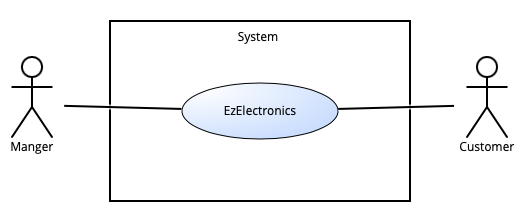
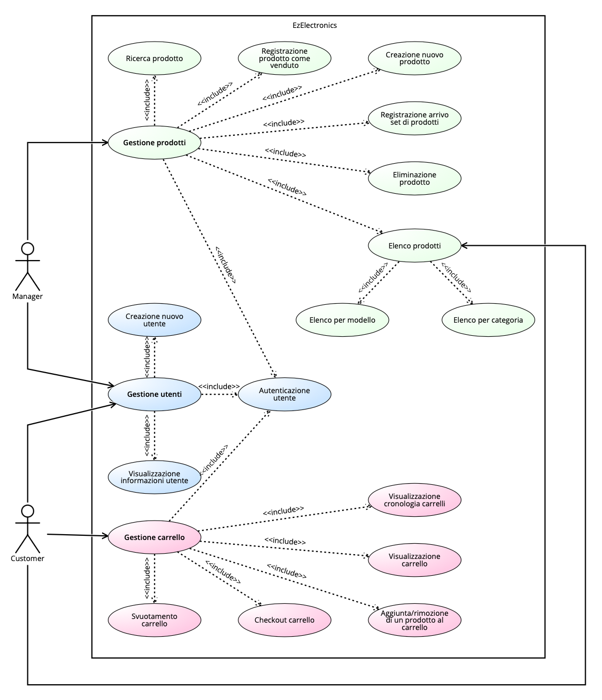
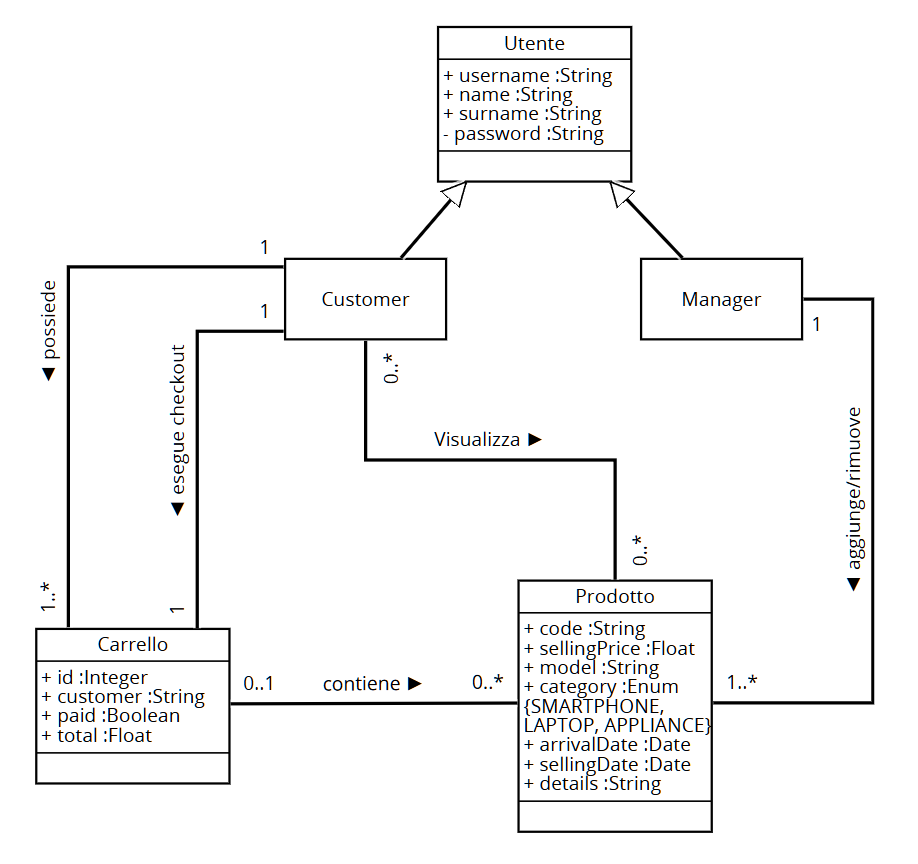

# Requirements Document - current EZElectronics

Date:

Version: V1 - description of EZElectronics in CURRENT form (as received by teachers)

| Version number | Change |
| :------------: | :----: |
|       6        |  Glossary |

# Contents

- [Requirements Document - current EZElectronics](#requirements-document---current-ezelectronics)
- [Contents](#contents)
- [Informal description](#informal-description)
- [Stakeholders](#stakeholders)
- [Context Diagram and interfaces](#context-diagram-and-interfaces)
  - [Context Diagram](#context-diagram)
  - [Interfaces](#interfaces)
- [Stories and personas](#stories-and-personas)
- [Functional and non functional requirements](#functional-and-non-functional-requirements)
  - [Functional Requirements](#functional-requirements)
  - [Non Functional Requirements](#non-functional-requirements)
- [Use case diagram and use cases](#use-case-diagram-and-use-cases)
  - [Use case diagram](#use-case-diagram)
  - [Use cases](#use-cases)
    - [UC1, Login](#use-case-1-uc1-login)
    - [UC2, Logout](#use-case-2-uc2-logout)
    - [UC3, Stampa informazioni utente](#use-case-3-uc3-stampa-informazioni-utente)
    - [UC4, Creazione di un nuovo utente](#use-case-4-uc4-creazione-di-un-nuovo-utente)
    - [UC5, Creazione di un nuovo prodotto](#use-case-5-uc5-creazione-di-un-nuovo-prodotto)
    - [UC6, Registrazione arrivo di un set di prodotti](#use-case-6-uc6-registrazione-arrivo-di-un-set-di-prodotti)
    - [UC7, Registrazione prodotto come venduto](#use-case-7-uc7-registrazione-prodotto-come-venduto)
    - [UC8, Elenco prodotti](#use-case-8-uc8-elenco-prodotti)
    - [UC9, Ricerca prodotto](#use-case-9-uc9-ricerca-prodotto)
    - [UC10, Elenco prodotti data la categoria](#use-case-10-uc10-elenco-prodotti-data-la-categoria)
    - [UC11, Elenco prodotti dato il modello](#use-case-11-uc11-elenco-prodotti-dato-il-modello)
    - [UC12, Eliminazione prodotto](#use-case-12-uc12-eliminazione-prodotto)
    - [UC13, Visualizzazione carrello](#use-case-13-uc13-visualizzazione-carrello)
    - [UC14, Aggiunta al carrello](#use-case-14-uc14-aggiunta-al-carrello)
    - [UC15, Checkout carrello](#use-case-15-uc15-checkout-carrello)
    - [UC16, Cronologia carrelli](#use-case-16-uc16-cronologia-carrelli)
    - [UC17, Rimozione dal carrello](#use-case-17-uc17-rimozione-dal-carrello)
    - [UC18, Svuotamento carrello](#use-case-18-uc18-svuotamento-carrello)
- [Glossary](#glossary)
- [System Design](#system-design)
- [Deployment Diagram](#deployment-diagram)

# Informal description

EZElectronics (read EaSy Electronics) is a software application designed to help managers of electronics stores to manage their products and offer them to customers through a dedicated website. Managers can assess the available products, record new ones, and confirm purchases. Customers can see available products, add them to a cart and see the history of their past purchases.

# Stakeholders

| Stakeholder name | Description |
| :--------------: | :---------: |
| Manager          | Principale utente dell'applicazione, ha un interesse diretto nel suo funzionamento ottimale per gestire efficacemente i prodotti e le vendite del suo negozio. |
| Customer         | Acquirente che utilizza il sito web dedicato per visualizzare e acquistare prodotti. Ha un interesse nell'esperienza utente, nella facilità di navigazione, e nella consistenza sui dati dei prodotti. |
| Employee         | Commesso del negozio, deve gestire il negozio sia nella sua parte fisica sia nella parte online, potendo aggiungere prodotti e segnare le vendite o i resi. |
| Servizi di pagamento         | L'applicazione include transazioni finanziarie, i fornitori di servizi di pagamento si occupano di gestire i pagamenti dei prodotti |
| Sviluppatori software | Responsabili della creazione, manutenzione e aggiornamento dell'applicazione. |

# Context Diagram and interfaces

## Context Diagram

## Interfaces

|   Actor   | Logical Interface | Physical Interface |
| :-------: | :---------------: | :----------------: |
| Manager | Pc                  | GUI                    |
| Customer | Smartphone, Pc | GUI |

# Stories and personas

## Personas

|   **Manager**   |  |
| :-------: | :---------------: |
| Età| 37 anni|
| Occupazione| Manager di un negozio di elettronica|
|Comportamento| Organizzato, interessato alle vendite|
|Obiettivi| Monitorare le vendite, gestire l'inventario e i prodotti del negozio|
|Necessità| Dashboard per le vendite, gestione dell'inventario|

|   **Customer**   |  |
| :-------: | :---------------: |
| Età| 28 anni|
| Occupazione| Graphic designer|
|Comportamento|  Attenta ai dettagli, interessata ai prodotti di qualità|
|Obiettivi| Acquistare prodotti di qualità e visualizzare i propri ordini precedenti|
|Necessità| Navigazione intuitiva, acquisti sicuri|

## Stories

|  **Manager**  |
| :-------  |
|Come manager voglio inserire uno o più prodotti appartententi ad uno stesso modello, rimuovere un prodotto dall’inventario o contrassegnarle un prodotto come venduto |
|Come manager voglio poter visualizzare tutti i prodotti nell’inventario, un singolo prodotto tramite il relativo codice o prodotti  appartenenti ad una specifica categoria o modello |

|  **Customer** |
| :-------  |
|Come customer voglio poter aggiungere/rimuovere/visualizzare i prodotti del carrello |
|Come customer voglio effettuare l’ordine relativo al mio carrello in semplici passi|
|Come customer voglio poter visualizzare la cronologia dei miei ordini |
|Come customer voglio poter visualizzare tutti i prodotti nell’inventario, un singolo prodotto tramite il relativo codice o i prodotti appartenenti ad una specifica categoria o modello |

# Functional and non functional requirements

## Functional Requirements

|  ID   | Description                                                         |
| :---: | :---------                                                          |
| **FR1** |      **Gestione Utenti**                                          |
| FR1.1 | Chiunque può creare un account                                      |
| FR1.2 | Un utente può effettuare login e logout                             |
| FR1.3 | Un utente può visualizzare le informazioni del proprio profilo      |
| **FR2** |    **Gestione Prodotti**                                          |
| FR2.1 | Un manager può registrare un nuovo prodotto                               |
| FR2.2 | Un manager può registrare l'arrivo di un insieme di prodotti dello stesso modello |
| FR2.3 | Un manager può segnare un prodotto come venduto                     |
| FR2.4 | Qualsiasi utente autenticato può ottenere l'elenco di tutti i prodotti  |
| FR2.5 | Qualsiasi utente autenticato può ottenere un prodotto dato il codice    |
| FR2.6 | Qualsiasi utente autenticato può ottenere l'elenco di tutti i prodotti appartenenti ad una specifica categoria |
| FR2.7 | Qualsiasi utente autenticato può recuperare l'elenco di tutti i prodotti appartenenti ad uno specifico modello |
| FR2.8 | Un utente manager può eliminare un prodotto                         |
| **FR3** | **Gestione Carrello**                                             |
| FR3.1 | Un customer può visualizzare il proprio carrello                    |
| FR3.2 | Un customer può aggiungere un prodotto al proprio carrello          |
| FR3.3 | Un customer può eseguire il checkout del proprio carrello           |
| FR3.4 | Un customer può visualizzare la propria cronologia carrelli         |
| FR3.5 | Un customer può rimuovere un prodotto dal carrello                  |
| FR3.6 | Un customer può svuotare il proprio carrello              |

## Non Functional Requirements

|   ID    | Type (efficiency, reliability, ..) | Description | Refers to |
| :-----: | :--------------------------------: | :---------  | :-------: |
| NFR1    | Usabilitá      | Un nuovo customer che visita per la prima volta il sito deve poter utilizzare tutte le funzionalità basilari (ricerca prodotti, aggiunta al carrello e checkout) senza alcun tipo di training. Un nuovo manager deve essere in grado di sfruttare tutte le funzionalità del sito dopo un massimo di due ore di training. | FR1-FR3 |
| NFR2    | Usabilitá      | Il carrello di un utente non deve essere cancellato quando esso effettua log out ma deve essere persistente, finchè non viene eseguito il checkout | FR3 |
| NFR3    | Prestazioni    | Il sito deve essere in grado di gestire e portare a compimento un minimo di 10 transazioni al secondo. Il tempo di risposta ad un evento (come click su un pulsante) in condizioni ottimali di velocità della connessione non deve superare i due secondi. | FR1-FR3 |
| NFR3    | Affidabilità   | Il tempo di disponibilitá del servizio durante un mese deve essere almeno del 99.95%. | FR1-FR3  |
| NFR4    | Robustezza     | non possono verificarsi più di 5 guasti all’anno e, nel caso se ne verifichi uno, il tempo richiesto affinché il sito torni online non deve superare le 12h | FR1-FR3 |
| NFR5    | Portabilità    | Il sito deve poter essere visualizzato su tutte le versioni degli ultimi 4 anni di almeno cinque dei browser più utilizzati. | FR1-FR3 |
| NFR6    | Sicurezza      | Le fughe di dati non possono verificarsi più frequentemente di una volta ogni 20 anni. | FR1-FR3 |

Nota: la scrittura FRX-FRY signfica che il relativo NFR si riferisce a tutti i FR da FRX a FRY compresi. La dicitura FRX, FRY significa che il relativo NFR si riferisce separatamente a FRX e FRY.

# Use case diagram and use cases

## Use case diagram

## Use cases

### Use case 1, UC1, Login

| Actors Involved  |           Utente (customer o manager)         |
| :--------------: | :------------------------------------------------------------------: |
|   Precondition   |  Utente non autenticato  |
|  Post condition  |  Utente autenticato e autorizzato   |
| Nominal Scenario |  Login dell'utente |
|     Variants     |  Nessuna  |
|    Exceptions    |  Username o password non riconosciuti, errore interno  |

|  Scenario 1.1  |  Login corretto  |
| :------------: | :------------------------------------------------------------------------: |
|  Precondition  | Utente non autenticato |
| Post condition | Utente autenticato e autorizzato    |
|     Step#      |           Description     |
|       1        | Il sistema chiede all'utente di inserire username e password |
|       2        | L'utente fornisce username e password nei campi appositi e clicca su "Accedi" |
|       3        | Il sistema cerca l' username nel database |
|       4        | Il sistema confronta la password inserita con quella salvata |
|       5        | Il sistema esegue il login utente (status: 200)  |

|  Scenario 1.2  |  Username inesistente |
| :------------: | :------------------------------------------------------------------------: |
|  Precondition  | Username inesistente |
| Post condition | Utente non autenticato    |
|     Step#      |             Description     |
|       1        | Il sistema richiede all'utente di inserire username e password |
|       2        | L'utente fornisce username e password nei campi appositi e clicca su "Accedi" |
|       3        | Il sistema cercan lo username nel database |
|       4        | Il sistema non autorizza l’utente (status: 404) e mostra “Credenziali non valide” |

|  Scenario 1.3  |  Password errata |
| :------------: | :------------------------------------------------------------------------: |
|  Precondition  | Password errata |
| Post condition | Utente non autenticato    |
|     Step#      |                                Description     |
|       1        | Il sistema richiede all'utente di inserire username e password |
|       2        | L'utente fornisce username e password nei campi appositi e clicca su "Accedi" |
|       3        | Il sistema cerca lo username nel database |
|       4        | Il sistema confronta la password inserita con quella salvata |
|       5        | Il sistema non autorizza l’utente (status: 404) e mostra “Credenziali non valide” |

|  Scenario 1.4  |  Errore interno |
| :------------: | :----------------------------------------------------------------------: |
| Precondition   | L'utente ha avviato la richiesta |
| Post condition | L'operazione viene annullata |
|     Step#      |   Description    |
|       1        | Il sistema annulla ogni modifica nel database e mostra il messaggio di errore |

### Use case 2, UC2, Logout

| Actors Involved  |           Utente (customer o manager)         |
| :--------------: | :------------------------------------------------------------------: |
|   Precondition   | Utente autenticato  |
|  Post condition  | Utente non più autorizzato   |
| Nominal Scenario | L’utente effettua il logout dal sito |
|     Variants     | Nessuna  |
|    Exceptions    | Errore interno  |

|  Scenario 2.1  |  Logout con successo |
| :------------: | :------------------------------------------------------------------------: |
|  Precondition  | Utente autenticato |
| Post condition | Utente non più autorizzato    |
|     Step#      |                                Description     |
|       1        | L'utente clicca sul link per il logout (barra in alto) |
|       2        | Il sistema risponde eseguendo il logout utente (status: 200) |

|  Scenario 2.2  |  Errore interno |
| :------------: | :----------------------------------------------------------------------: |
| Precondition   | L'utente ha avviato la richiesta |
| Post condition | L'operazione viene annullata |
|     Step#      |   Description    |
|       1        | Il sistema annulla ogni modifica nel database e stampa il messaggio di errore |

### Use case 3, UC3, Stampa informazioni utente

| Actors Involved  |           Utente (customer o manager)         |
| :--------------: | :------------------------------------------------------------------: |
|   Precondition   | Utente autenticato  |
|  Post condition  | Stampa delle informazioni utente a video   |
| Nominal Scenario | Informazioni utente visualizzaate sullo schermo |
|     Variants     | Nessuna  |
|    Exceptions    | Errore interno  |

|  Scenario 3.1  |  Visualizzazione con successo |
| :------------: | :------------------------------------------------------------------------: |
|  Precondition  | Utente autenticato |
| Post condition | Stampa delle informazioni utente a video   |
|     Step#      |                                Description     |
|       1        | L'utente clicca sull’icona del profilo in alto |
|       2        | Il sistema preleva dal database le informazioni-utente |
|       3        | Il sistema stampa le informazioni appena prelevate a video (status: 200)  |

|  Scenario 3.2  |  Errore interno |
| :------------: | :----------------------------------------------------------------------: |
| Precondition   | L'utente ha avviato la richiesta |
| Post condition | L'operazione viene annullata |
|     Step#      |   Description    |
|       1        | Il sistema annulla ogni modifica nel database e stampa il messaggio di errore |

### Use case 4, UC4 Creazione di un nuovo utente

| Actors Involved  |                     Chiunque         |
| :--------------: | :------------------------------------------------------------------: |
|   Precondition   |  Utente non autenticato                                    |
|  Post condition  |  Nuovo utente viene creato e inserito nel database                        |
| Nominal Scenario |  Creazione utente |
|     Variants     |  Nessuna |
|    Exceptions    |  Username già esistente, errore interno |

|  Scenario 4.1  | Creazione nuovo utente  |
| :------------: | :------------------------------------------------------------------------: |
|  Precondition  | Utente non autenticato |
| Post condition | Nuovo utente viene creato e inserito nel database   |
|     Step#      |                                Description                                 |
|       1        | L'utente richiede al sistema di creare un nuovo utente cliccando sul link in basso |
|       2        | Il sistema chiede all’utente di inserire username, nome, cognome, password e ruolo |
|       3        | L'utente inserisce le informazioni richieste dal sistema e clicca su "Registrati" |
|       4        | Il sistema controlla se nel database è già presente lo username passato |
|       5        | Il sistema applica un algoritmo di hash della password |
|       6        | Il sistema inserisce le informazioni in una nuova lineea nel database |
|       7        | Il sistema risponde con il messaggio di successo (status: 200) |

|  Scenario 4.2  | Creazione di un utente già presente  |
| :------------: | :------------------------------------------------------------------------: |
|  Precondition  | Utente non autenticato, lo username è già presente nel database |
| Post condition | Un messaggio di errore viene mostrato a schermo, non viene creato l’utente   |
|     Step#      |                                Description                                 |
|       1        | L'utente richiede al sistema di creare un nuovo utente cliccando sul link in basso |
|       2        | Il sistema chiede all’utente di inserire username, nome, cognome, password e ruolo |
|       3        | L'utente inserisce le informazioni richieste dal sistema e clicca su "Registrati" |
|       4        | Il sistema controlla se nel database è già presente lo username passato |
|       5        | La richiesta fallisce e Il sistema mostra a video un messaggio di errore (status: 404) |

|  Scenario 4.3  |  Errore interno |
| :------------: | :----------------------------------------------------------------------: |
| Precondition   | L'utente ha avviato la richiesta |
| Post condition | L'operazione viene annullata |
|     Step#      |   Description    |
|       1        | Il sistema annulla ogni modifica nel database e stampa il messaggio di errore |

### Use case 5, UC5, Creazione di un nuovo prodotto

| Actors Involved  |                     Utente manager         |
| :--------------: | :------------------------------------------------------------------: |
|   Precondition   |  Utente autenticato come manager                                   |
|  Post condition  |  Nuovo prodotto creato e inserito nel database                        |
| Nominal Scenario |  Creazione di un nuovo prodotto date le sue informazioni |
|     Variants     |  Data non inserita |
|    Exceptions    |  Codice prodotto già esistente, data non valida, uno o più campi non inseriti o non validi, errore interno |

|  Scenario 5.1  | Creazione nuovo prodotto con successo (con data)  |
| :------------: | :------------------------------------------------------------------------: |
|  Precondition  | Utente autenticato come manager |
| Post condition | Nuovo prodotto creato e inserito nel database   |
|     Step#      |                                Description                                 |
|       1        | L'utente richiede al sistema di creare un nuovo prodotto cliccando sul pulsante apposito |
|       2        | Il sistema chiede di inserire code,sellingPrice,model,category,details,arrivalDate |
|       3        | L'utente inserisce le informazioni richieste dal sistema |
|       4        | Il sistema controlla se nel database è già presente il codice inserito e se la data non è successiva a oggi |
|       5        | Il sistema inserisce nel database il nuovo prodotto con i campi passati |
|       6        | Il sistema risponde con il messaggio di successo in cui scrive il nuovo codice (status: 200) |

|  Scenario 5.2  | Creazione nuovo prodotto con successo (senza data)  |
| :------------: | :------------------------------------------------------------------------: |
|  Precondition  | Utente autenticato come manager |
| Post condition | Nuovo prodotto creato e inserito nel database   |
|     Step#      |                                Description                                 |
|       1        | L'utente richiede al sistema di creare un nuovo prodotto cliccando sul pulsante apposito |
|       2        | Il sistema chiede di inserire code,sellingPrice,model,category,details,arrivalDate |
|       3        | L'utente inserisce le informazioni richieste dal sistema, ma non la arrivalDate |
|       4        | Il sistema controlla se nel database è già presente il codice inserito |
|       5        | Il sistema inserisce nel database il nuovo prodotto con i campi passati e arrivalDate=oggi |
|       6        | Il sistema risponde con il messaggio di successo in cui scrive il nuovo codice (status: 200) |

|  Scenario 5.3  | Codice prodotto già presente nel database  |
| :------------: | :------------------------------------------------------------------------: |
|  Precondition  | Utente autenticato come manager, codice già presente nel database |
| Post condition | Prodotto non creato   |
|     Step#      |                                Description                                 |
|       1        | L'utente richiede al sistema di creare un nuovo prodotto cliccando sul pulsante apposito |
|       2        | Il sistema chiede di inserire code,sellingPrice,model,category,details,arrivalDate |
|       3        | L'utente inserisce le informazioni richieste dal sistema, con o senza arrivalDate |
|       4        | Il sistema controlla se nel database è già presente il codice inserito |
|       5        | Il sistema non inserisce il prodotto e risponde con il messaggio di fallimento |

|  Scenario 5.4  | Data successiva alla data corrente |
| :------------: | :------------------------------------------------------------------------: |
|  Precondition  | Utente autenticato come manager, data non valida |
| Post condition | Prodotto non creato   |
|     Step#      |                                Description                                 |
|       1        | L'utente richiede al sistema di creare un nuovo prodotto cliccando sul pulsante apposito |
|       2        | Il sistema chiede di inserire code,sellingPrice,model,category,details,arrivalDate |
|       3        | L'utente inserisce le informazioni richieste dal sistema |
|       4        | Il sistema controlla se nel database è già presente il codice inserito e se la data è valida |
|       5        | Il sistema non inserisce il prodotto e risponde con il messaggio di fallimento |

|  Scenario 5.5  | Campo/i non inserito |
| :------------: | :------------------------------------------------------------------------: |
|  Precondition  | Utente autenticato come manager, campo/i non inserito |
| Post condition | Prodotto non creato   |
|     Step#      |                                Description                                 |
|       1        | L'utente richiede al sistema di creare un nuovo prodotto cliccando sul pulsante apposito |
|       2        | Il sistema chiede di inserire code,sellingPrice,model,category,details,arrivalDate |
|       3        | L'utente inserisce le informazioni richieste dal sistema tranne uno o più campi |
|       4        | Il sistema non inserisce il prodotto e risponde con il messaggio di fallimento |

|  Scenario 5.6  | sellingPrice non positivo |
| :------------: | :------------------------------------------------------------------------: |
|  Precondition  | Utente autenticato come manager, sellingPrice non positivo |
| Post condition | Prodotto non creato   |
|     Step#      |                                Description                                 |
|       1        | L'utente richiede al sistema di creare un nuovo prodotto cliccando sul pulsante apposito |
|       2        | Il sistema chiede di inserire code,sellingPrice,model,category,details,arrivalDate |
|       3        | L'utente inserisce le informazioni richieste dal sistema e inserisce un prezzo negativo |
|       4        | Il sistema non inserisce il prodotto e risponde con il messaggio di fallimento |

|  Scenario 5.7  |  Errore interno |
| :------------: | :----------------------------------------------------------------------: |
| Precondition   | L'utente ha avviato la richiesta |
| Post condition | L'operazione viene annullata |
|     Step#      |   Description    |
|       1        | Il sistema annulla ogni modifica nel database e stampa il messaggio di errore |

### Use case 6, UC6, Registrazione arrivo di un set di prodotti

| Actors Involved  |                     Utente manager         |
| :--------------: | :------------------------------------------------------------------: |
|   Precondition   |  Utente autenticato come manager                                   |
|  Post condition  |  Insieme di prodotti creato e inserito nel database                        |
| Nominal Scenario |  Creazione di un insieme di prodotti |
|     Variants     |  Data non inserita |
|    Exceptions    |  Data non valida, uno o più campi omessi o non validi, errore interno |

|  Scenario 6.1  | Creazione nuovo set con successo (con data)  |
| :------------: | :------------------------------------------------------------------------: |
|  Precondition  | Utente autenticato come manager |
| Post condition | Nuovi prodotti creati e inseriti nel database   |
|     Step#      |                                Description                                 |
|       1        | L'utente richiede al sistema di caricare un nuovo set di prodotti cliccando sul pulsante apposito |
|       2        | Il sistema chiede di inserire model,category,details,quantity,arrivalDate,sellingPrice |
|       3        | L'utente inserisce le informazioni richieste dal sistema |
|       4        | Il sistema controlla se tutti i campi sono validi e se la data non è successiva a oggi |
|       5        | Il sistema inserisce nel database il nuovo set di prodotti con i campi passati |
|       6        | Il sistema risponde con il messaggio di successo (status: 200) |

|  Scenario 6.2  | Creazione nuovo set con successo (senza data)  |
| :------------: | :------------------------------------------------------------------------: |
|  Precondition  | Utente autenticato come manager |
| Post condition | Nuovi prodotti creati e inseriti nel database   |
|     Step#      |                                Description                                 |
|       1        | L'utente richiede al sistema di caricare un nuovo set di prodotti cliccando sul pulsante apposito |
|       2        | Il sistema chiede di inserire model,category,details,quantity,arrivalDate,sellingPrice |
|       3        | L'utente inserisce le informazioni richieste dal sistema tranne la arrivalDate |
|       4        | Il sistema controlla se tutti i campi sono validi |
|       5        | Il sistema inserisce nel database il nuovo set di prodotti con i campi passati e la data odierna |
|       6        | Il sistema risponde con il messaggio di successo (status: 200) |

|  Scenario 6.3  | Data successiva alla data corrente  |
| :------------: | :------------------------------------------------------------------------: |
|  Precondition  | Utente autenticato come manager, data non valida |
| Post condition | Operazione annullata   |
|     Step#      |                                Description                                 |
|       1        | L'utente richiede al sistema di caricare un nuovo set di prodotti cliccando sul pulsante apposito |
|       2        | Il sistema chiede di inserire model,category,details,quantity,arrivalDate,sellingPrice |
|       3        | L'utente inserisce le informazioni richieste dal sistema tranne la arrivalDate |
|       4        | Il sistema controlla se tutti i campi sono validi e nota che la data è futura ad oggi |
|       5        | Il sistema non inserisce il set e risponde con il messaggio di fallimento |

|  Scenario 6.4  | Campo/i non inserito |
| :------------: | :------------------------------------------------------------------------: |
|  Precondition  | Utente autenticato come manager, campo/i non inserito |
| Post condition | Operazione annullata   |
|     Step#      |                                Description                                 |
|       1        | L'utente richiede al sistema di caricare un nuovo set di prodotti cliccando sul pulsante apposito |
|       2        | Il sistema chiede di inserire model,category,details,quantity,arrivalDate,sellingPrice |
|       3        | L'utente inserisce le informazioni richieste dal sistema tranne uno o più campi |
|       4        | Il sistema non procede e risponde con il messaggio di fallimento |

|  Scenario 6.5  | Campo/i non valido/i |
| :------------: | :------------------------------------------------------------------------: |
|  Precondition  | Utente autenticato come manager, campo/i non valido/i |
| Post condition | Operazione annullata   |
|     Step#      |                                Description                                 |
|       1        | L'utente richiede al sistema di caricare un nuovo set di prodotti cliccando sul pulsante apposito |
|       2        | Il sistema chiede di inserire model,category,details,quantity,arrivalDate,sellingPrice |
|       3        | L'utente inserisce le informazioni richieste dal sistema con alcuni campi non validi (es sellingPrice<=0.0) |
|       4        | Il sistema non procede e risponde con il messaggio di fallimento |

|  Scenario 6.6  |  Errore interno |
| :------------: | :----------------------------------------------------------------------: |
| Precondition   | L'utente ha avviato la richiesta |
| Post condition | L'operazione viene annullata |
|     Step#      |   Description    |
|       1        | Il sistema annulla ogni modifica nel database e stampa il messaggio di errore |

### Use case 7, UC7, Registrazione prodotto come venduto

| Actors Involved  |                     Utente manager         |
| :--------------: | :------------------------------------------------------------------: |
|   Precondition   |  Utente autenticato come manager                                   |
|  Post condition  |  Prodotto venduto                       |
| Nominal Scenario |  Prodotto segnato nel database come venduto |
|     Variants     |  Data non inserita |
|    Exceptions    |  Uno o più campi omessi o non validi, errore interno |

|  Scenario 7.1  | Il prodotto viene registrato come venduto nel database (con data)|
| :------------: | :------------------------------------------------------------------------: |
|  Precondition  | Utente autenticato come manager |
| Post condition | Prodotto contrassegnato come venduto  |
|     Step#      |                                Description                                 |
|       1        | L'utente richiede al sistema di contrassegnare il prodotto selezionato come venduto |
|       2        | Il sistema richiede di specificare opzionalmente la data di vendita |
|       3        | L’utente inserisce la data e conferma la modifica del prodotto |
|       4        | Il sistema contrassegna come venduto il prodotto con il codice passato (status: 200) |

|  Scenario 7.2  | Il prodotto viene registrato come venduto nel database (senza data)|
| :------------: | :------------------------------------------------------------------------: |
|  Precondition  | Utente autenticato come manager |
| Post condition | Prodotto contrassegnato come venduto  |
|     Step#      |                                Description                                 |
|       1        | L'utente richiede al sistema di contrassegnare il prodotto selezionato come venduto |
|       2        | Il sistema richiede di specificare opzionalmente la data di vendita |
|       3        | L’utente non inserisce la data e conferma la modifica del prodotto |
|       4        | Il sistema contrassegna come venduto il prodotto con il codice passato in data odierna (status: 200) |

|  Scenario 7.3  | Codice riferito ad un prodotto venduto |
| :------------: | :------------------------------------------------------------------------: |
|  Precondition  | Il codice si riferisce ad un prodotto venduto |
| Post condition | Il caso termina con un fallimento  |
|     Step#      |                                Description                                 |
|       1        | L'utente richiede al sistema di contrassegnare il prodotto come venduto |
|       2        | Il sistema richiede di specificare opzionalmente la data di vendita |
|       3        | L’utente conferma la modifica del prodotto, inserendo o meno la data |
|       4        | Il sistema non esegue la richiesta in quanto il prodotto è già contrassegnato come venduto|
|       5        | Il sistema mostra un messaggio di errore |

|  Scenario 7.4  | Data di vendita conseguente alla data odierna o antecedente alla data di arrivo del prodotto|
| :------------: | :------------------------------------------------------------------------: |
|  Precondition  | La data di vendita inserita non è valida |
| Post condition | Il prodotto non viene contrassegnato come venduto  |
|     Step#      |                                Description                                 |
|       1        | L'utente richiede al sistema di contrassegnare il prodotto come venduto |
|       2        | Il sistema richiede di specificare opzionalmente la data di vendita |
|       3        | L’utente inserisce una data di vendita non valida |
|       4        | La richiesta fallisce e il sistema mostra un messaggio di errore |

|  Scenario 7.5  |  Errore interno |
| :------------: | :----------------------------------------------------------------------: |
| Precondition   | L'utente ha avviato la richiesta |
| Post condition | L'operazione viene annullata |
|     Step#      |   Description    |
|       1        | Il sistema annulla ogni modifica nel database e stampa il messaggio di errore |

### Use case 8, UC8, Elenco prodotti

| Actors Involved  |                     Utente (customer o manager)         |
| :--------------: | :------------------------------------------------------------------: |
|   Precondition   |  Utente autenticato            |
|  Post condition  |  Elenco prodotti a schermo                       |
| Nominal Scenario |  L'utente visualizza a schermo l'elenco dei prodotti disponibili |
|     Variants     |  Parametro opzionale sold (yes o no, default=null) |
|    Exceptions    |  Errore interno |

|  Scenario 8.1  | Visualizzazione con successo (senza parametro sold) |
| :------------: | :------------------------------------------------------------------------: |
|  Precondition  | Utente autenticato |
| Post condition | Elenco prodotti a schermo    |
|     Step#      |                                Description                                 |
|       1        | Il sistema preleva dal database tutti i prodotti creati |
|       2        | Il sistema stampa i vari prodotti sulla pagina principale (status: 200) |

|  Scenario 8.2  | Visualizzazione con successo (sold=yes) |
| :------------: | :------------------------------------------------------------------------: |
|  Precondition  | Utente autenticato, stampa di tutti i prodotti effettuata |
| Post condition | Elenco prodotti a schermo    |
|     Step#      |                                Description                                 |
|       1        | L'utente seleziona "yes" nella tendina laterale |
|       2        | Il sistema filtra i vari prodotti mantenendo solo quelli venduti (status: 200) |

|  Scenario 8.3  | Visualizzazione con successo (sold=no) |
| :------------: | :------------------------------------------------------------------------: |
|  Precondition  | Utente autenticato |
| Post condition | Utente autenticato, stampa di tutti i prodotti effettuata     |
|     Step#      |                                Description                                 |
|       1        | L'utente seleziona "no" nella tendina laterale |
|       2        | Il sistema filtra i vari prodotti mantenendo solo quelli non venduti (status: 200) |

|  Scenario 8.4  |  Errore interno |
| :------------: | :----------------------------------------------------------------------: |
| Precondition   | L'utente ha avviato la richiesta |
| Post condition | L'operazione viene annullata |
|     Step#      |   Description    |
|       1        | Il sistema annulla ogni modifica nel database e stampa il messaggio di errore |

### Use case 9, UC9, Ricerca prodotto

| Actors Involved  |                     Utente (customer o manager)         |
| :--------------: | :------------------------------------------------------------------: |
|   Precondition   |  Utente autenticato            |
|  Post condition  |  Informazioni prodotto a schermo                       |
| Nominal Scenario |  L'utente visualizza a schermo le informazioni riguardanti il prodotto cercato |
|     Variants     |  Nessuna |
|    Exceptions    |  Codice omesso o inesistente, errore interno |

|  Scenario 9.1  | Visualizzazione con successo |
| :------------: | :------------------------------------------------------------------------: |
|  Precondition  | Utente autenticato |
| Post condition | Informazioni prodotto a schermo         |
|     Step#      |                                Description                                 |
|       1        | L'utente inserisce il codice di un prodotto nella barra e clicca sul pulsante della ricerca per codice |
|       2        | Il sistema cerca nel database il prodotto con il codice richiesto e lo stampa a video (status: 200) |

|  Scenario 9.2  | Codice omesso |
| :------------: | :------------------------------------------------------------------------: |
|  Precondition  | Utente autenticato |
| Post condition | Nessun prodotto stampato        |
|     Step#      |                                Description                                 |
|       1        | L'utente clicca sul pulsante della ricerca per codice |
|       2        | Il sistema risponde con un messaggio di errore |

|  Scenario 9.3  | Codice inesistente |
| :------------: | :------------------------------------------------------------------------: |
|  Precondition  | Utente autenticato |
| Post condition | Nessun prodotto stampato        |
|     Step#      |                                Description                                 |
|       1        | L'utente inserisce il codice di un prodotto non valido e clicca sul pulsante della ricerca per codice |
|       2        | Il sistema non trova nel database il prodotto richiesto e risponde con un messaggio di errore |

|  Scenario 9.4  |  Errore interno |
| :------------: | :----------------------------------------------------------------------: |
| Precondition   | L'utente ha avviato la richiesta |
| Post condition | L'operazione viene annullata |
|     Step#      |   Description    |
|       1        | Il sistema annulla ogni modifica nel database e stampa il messaggio di errore |

### Use case 10, UC10, Elenco prodotti data la categoria

| Actors Involved  |                     Utente (customer o manager)         |
| :--------------: | :------------------------------------------------------------------: |
|   Precondition   |  Utente autenticato            |
|  Post condition  |  Elenco prodotti a schermo                       |
| Nominal Scenario |  L'utente visualizza a schermo l'elenco dei prodotti appartenenti ad una specifica categoria |
|     Variants     |  Parametro opzionale sold (yes o no) |
|    Exceptions    |  Errore interno |

|  Scenario 10.1 | Visualizzazione con successo (senza parametro sold) |
| :------------: | :------------------------------------------------------------------------: |
|  Precondition  | Utente autenticato |
| Post condition | Elenco prodotti a schermo    |
|     Step#      |                                Description                                 |
|       1        | L'utente seleziona dalla barra laterale una tra le categorie proposte |
|       1        | Il sistema preleva dal database tutti i prodotti inerenti a quella categoria |
|       2        | Il sistema stampa i vari prodotti (status: 200) |

|  Scenario 10.2 | Visualizzazione con successo (sold=yes) |
| :------------: | :------------------------------------------------------------------------: |
|  Precondition  | Utente autenticato, filtro per categoria effettuato |
| Post condition | Elenco prodotti a schermo    |
|     Step#      |                                Description                                 |
|       1        | L'utente seleziona "yes" dalla barra laterale |
|       1        | Il sistema filtra i prodotti stampati mantenendo solo quelli venduti (status:200) |

|  Scenario 10.3 | Visualizzazione con successo (sold=no) |
| :------------: | :------------------------------------------------------------------------: |
|  Precondition  | Utente autenticato, filtro per categoria effettuato |
| Post condition | Elenco prodotti a schermo    |
|     Step#      |                                Description                                 |
|       1        | L'utente seleziona "no" dalla barra laterale |
|       1        | Il sistema filtra i prodotti stampati mantenendo solo quelli non venduti (status:200) |

|  Scenario 10.4  |  Errore interno |
| :------------: | :----------------------------------------------------------------------: |
| Precondition   | L'utente ha avviato la richiesta |
| Post condition | L'operazione viene annullata |
|     Step#      |   Description    |
|       1        | Il sistema annulla ogni modifica nel database e stampa il messaggio di errore |

### Use case 11, UC11, Elenco prodotti dato il modello

| Actors Involved  |                     Utente (customer o manager)         |
| :--------------: | :------------------------------------------------------------------: |
|   Precondition   |  Utente autenticato            |
|  Post condition  |  Elenco prodotti a schermo                       |
| Nominal Scenario |  L'utente visualizza a schermo l'elenco dei prodotti appartenenti ad uno specifico modello |
|     Variants     |  Parametro opzionale sold (yes o no) |
|    Exceptions    |  Modello non valido o mancante, errore interno |

|  Scenario 11.1 | Visualizzazione con successo (senza parametro sold) |
| :------------: | :------------------------------------------------------------------------: |
|  Precondition  | Utente autenticato |
| Post condition | Elenco prodotti a schermo    |
|     Step#      |                                Description                                 |
|       1        | L'utente inserisce un modello nella barra in alto e clicca sul pulsaante "modello" |
|       2        | Il sistema preleva dal database tutti i prodotti inerenti a quel modello |
|       3        | Il sistema stampa i vari prodotti (status: 200) |

|  Scenario 11.2 | Visualizzazione con successo (sold=yes) |
| :------------: | :------------------------------------------------------------------------: |
|  Precondition  | Utente autenticato, filtro per modello effettuato |
| Post condition | Elenco prodotti a schermo    |
|     Step#      |                                Description                                 |
|       1        | L'utente seleziona "yes" dalla barra laterale |
|       1        | Il sistema filtra i prodotti stampati mantenendo solo quelli venduti (status:200) |

|  Scenario 11.3 | Visualizzazione con successo (sold=no) |
| :------------: | :------------------------------------------------------------------------: |
|  Precondition  | Utente autenticato, filtro per modello effettuato |
| Post condition | Elenco prodotti a schermo    |
|     Step#      |                                Description                                 |
|       1        | L'utente seleziona "no" dalla barra laterale |
|       1        | Il sistema filtra i prodotti stampati mantenendo solo quelli non venduti (status:200) |

|  Scenario 11.4  |  Errore interno |
| :------------: | :----------------------------------------------------------------------: |
| Precondition   | L'utente ha avviato la richiesta |
| Post condition | L'operazione viene annullata |
|     Step#      |   Description    |
|       1        | Il sistema annulla ogni modifica nel database e stampa il messaggio di errore |

### Use case 12, UC12, Eliminazione prodotto

| Actors Involved  |                     Utente manager         |
| :--------------: | :------------------------------------------------------------------: |
|   Precondition   |  Utente autenticato come manager            |
|  Post condition  |  Prodotto eliminato                     |
| Nominal Scenario |  L'utente elimina il prodotto con codice scelto |
|     Variants     |  Nessuna |
|    Exceptions    |  Errore prodotto |

|  Scenario 12.1 | Eliminazione con successo |
| :------------: | :------------------------------------------------------------------------: |
|  Precondition  | Utente autenticato come manager |
| Post condition | Elenco prodotti a schermo    |
|     Step#      |                                Description                                 |
|       1        | L'utente seleziona un prodotto singolo e clicca sul cestino |
|       2        | Il sistema elimina dal database il prodotto con il codice coincidente a quello selezionato |

|  Scenario 12.2  |  Errore interno |
| :------------: | :----------------------------------------------------------------------: |
| Precondition   | L'utente ha avviato la richiesta |
| Post condition | L'operazione viene annullata |
|     Step#      |   Description    |
|       1        | Il sistema annulla ogni modifica nel database e stampa il messaggio di errore |

Nota: L'eliminazione del prodotto avviene solo dopo aver selezionato il prodotto tra quelli a video che di conseguenza esiste nel db.

### Use case 13, UC13, Visualizzazione carrello

| Actors Involved  |                     Utente customer        |
| :--------------: | :------------------------------------------------------------------: |
|   Precondition   |  Utente autenticato come customer            |
|  Post condition  |  Visualizzazione carrello                  |
| Nominal Scenario |  L'utente visualizza il proprio carrello |
|     Variants     |  Nessuna |
|    Exceptions    |  Errore interno |

|  Scenario 13.1 | Visualizzazione con successo |
| :------------: | :------------------------------------------------------------------------: |
|   Precondition   |  Utente autenticato come customer            |
|  Post condition  |  Visualizzazione carrello                  |
|     Step#      |                                Description                                 |
|       1        | L'utente clicca sull'icona del carrello in alto |
|       2        | Il sistema cerca nel database tutti i prodotti con i codici presenti nel carrello utente |
|       3        | Il sistema mostra a video i prodotti appena trovati o un messaggio di carrello vuoto (status: 200) |

|  Scenario 13.2  |  Errore interno |
| :------------: | :----------------------------------------------------------------------: |
| Precondition   | L'utente ha avviato la richiesta |
| Post condition | L'operazione viene annullata |
|     Step#      |   Description    |
|       1        | Il sistema annulla ogni modifica nel database e stampa il messaggio di errore |

### Use case 14, UC14, Aggiunta al carrello

| Actors Involved  |                     Utente customer        |
| :--------------: | :------------------------------------------------------------------: |
|   Precondition   |  Utente autenticato come customer, selezione di un prodotto            |
|  Post condition  |  Aggiunta prodotto al carrello                  |
| Nominal Scenario |  L'utente visualizza il proprio carrello |
|     Variants     |  Nessuna |
|    Exceptions    |  Prodotto già aggiunto, errore interno |

|  Scenario 14.1 | Aggiunta con successo |
| :------------: | :------------------------------------------------------------------------: |
|   Precondition   |  Utente autenticato come customer, selezione di un prodotto              |
|  Post condition  |  Aggiunta prodotto al carrello                  |
|     Step#      |                                Description                                 |
|       1        | L'utente clicca sull'icona per aggiungere il prodotto al carrello |
|       2        | Il sistema accerta che il codice del prodotto non sia già stato inserito nel carrello di un utente |
|       3        | Il sistema mostra a video un messaggio di successo (status: 200) |

|  Scenario 14.2 | Fallimento operazione |
| :------------: | :------------------------------------------------------------------------: |
|   Precondition   |  Utente autenticato come customer, selezione di un prodotto              |
|  Post condition  |  Prodotto non aggiunto                  |
|     Step#      |                                Description                                 |
|       1        | L'utente clicca sull'icona per aggiungere il prodotto al carrello |
|       2        | Il sistema si accorge che il codice del prodotto è già stato inserito nel carrello (di qualunque utente) |
|       3        | Il sistema mostra a video un messaggio di errore |

|  Scenario 14.3 |  Errore interno |
| :------------: | :----------------------------------------------------------------------: |
| Precondition   | L'utente ha avviato la richiesta |
| Post condition | L'operazione viene annullata |
|     Step#      |   Description    |
|       1        | Il sistema annulla ogni modifica nel database e stampa il messaggio di errore |

Nota: il prodotto selezionato (quindi esistente) potrebbe essere già stato aggiunto al carrello di un altro utente e non essere stato ancora settato come venduto.

### Use case 15, UC15, Checkout carrello

| Actors Involved  |                     Utente customer        |
| :--------------: | :------------------------------------------------------------------: |
|   Precondition   |  Utente autenticato come customer         |
|  Post condition  |  Checkout e svuotamento carrello                  |
| Nominal Scenario |  L'utente effettua l'ordine e svuota il carrello |
|     Variants     |  Nessuna |
|    Exceptions    |  Carrello vuoto, errore interno |

|  Scenario 15.1 | Checkout con successo |
| :------------: | :------------------------------------------------------------------------: |
|   Precondition   |  Utente autenticato come customer         |
|  Post condition  |  Checkout e svuotamento carrello        |
|     Step#      |                                Description                                 |
|       1        | L'utente clicca sull'icona per completare l'acquisto |
|       2        | Il sistema registra tutti i prodotti del carrello come venduti e svuota il carrello |
|       3        | Il sistema mostra a video un messaggio di successo (status: 200) |

|  Scenario 15.2 | Carrello vuoto |
| :------------: | :------------------------------------------------------------------------: |
|   Precondition   |  Utente autenticato come customer         |
|  Post condition  |  Checkout e svuotamento carrello                     |
|     Step#      |                                Description                                 |
|       1        | L'utente clicca sull'icona per completare l'acquisto |
|       2        | Il sistema mostra un messaggio di errore relativo al carrello vuoto |

|  Scenario 15.3  |  Errore interno |
| :------------: | :----------------------------------------------------------------------: |
| Precondition   | L'utente ha avviato la richiesta |
| Post condition | L'operazione viene annullata |
|     Step#      |   Description    |
|       1        | Il sistema annulla ogni modifica nel database e stampa il messaggio di errore |

### Use case 16, UC16, Cronologia carrelli

| Actors Involved  |                     Utente customer        |
| :--------------: | :------------------------------------------------------------------: |
|   Precondition   |  Utente autenticato come customer         |
|  Post condition  |  Elenco carrelli stampato a video             |
| Nominal Scenario |  L'utente visualizza la history di tutti i carrelli per cui ha eseguito il checkout |
|     Variants     |  Nessuna |
|    Exceptions    |  Errore interno |

|  Scenario 16.1 | Visualizzazione |
| :------------: | :------------------------------------------------------------------------: |
|   Precondition   |  Utente autenticato come customer         |
|  Post condition  |  Elenco carrelli stampato a video             |
|     Step#      |                                Description                                 |
|       1        | L'utente clicca sull'icona delsuo profilo |
|       2        | Il sistema filtra ttti i carrelli già completati presenti nel database cercando quelli dell'utente |
|       3        | Il sistema mostra a video le informazioni appena trovate o un messaggio se non sono presenti (status: 200) |

|  Scenario 16.2 |  Errore interno |
| :------------: | :----------------------------------------------------------------------: |
| Precondition   | L'utente ha avviato la richiesta |
| Post condition | L'operazione viene annullata |
|     Step#      |   Description    |
|       1        | Il sistema annulla ogni modifica nel database e stampa il messaggio di errore |

### Use case 17, UC17, Rimozione dal carrello

| Actors Involved  |                     Utente customer        |
| :--------------: | :------------------------------------------------------------------: |
|   Precondition   |  Utente autenticato come customer, carrello corrente visualizzato         |
|  Post condition  |  Prodotto selezionato rimosso dal carrello             |
| Nominal Scenario |  L'utente rimuove dal proprio carrello uno dei prodotti mostrati |
|     Variants     |  Nessuna |
|    Exceptions    |  Errore interno |

|  Scenario 17.1 | Cancellazione avvenuta con successo |
| :------------: | :------------------------------------------------------------------------: |
|   Precondition   |  Utente autenticato come customer         |
|  Post condition  |  Prodotto selezionato rimosso dal carrello              |
|     Step#      |                                Description                                 |
|       1        | L'utente sceglie uno dei prodotti elencati nel suo carrello e clicca per rimuoverlo |
|       2        | Il sistema usa il codice del prodotto per eliminarlo dal carrello utente di cui ha l'id |
|       3        | Il sistema restituisce il successo (status: 200) |

|  Scenario 17.2  |  Errore interno |
| :------------: | :----------------------------------------------------------------------: |
| Precondition   | L'utente ha avviato la richiesta |
| Post condition | L'operazione viene annullata |
|     Step#      |   Description    |
|       1        | Il sistema annulla ogni modifica nel database e stampa il messaggio di errore |

Nota: la rimozione viene applicata sul carrello dell'utente (da login so il codice del carrello) su un prodotto presente nel carrello che perciò esiste per forza nel database.

### Use case 18, UC18, Svuotamento carrello

| Actors Involved  |                     Utente customer        |
| :--------------: | :------------------------------------------------------------------: |
|   Precondition   |  Utente autenticato come customer, carrello corrente visualizzato         |
|  Post condition  |  Carrello svuotato             |
| Nominal Scenario |  L'utente rimuove dal proprio carrello ogni prodotto |
|     Variants     |  Nessuna |
|    Exceptions    |  Errore interno |

|  Scenario 18.1 | Cancellazione avvenuta con successo |
| :------------: | :------------------------------------------------------------------------: |
|   Precondition   |  Utente autenticato come customer         |
|  Post condition  |  Carrello svuotato              |
|     Step#      |                                Description                                 |
|       1        | L'utente richiede l'eliminazione di tutto il carrello cliccando sul pulsante apposito |
|       2        | Il sistema accede al codice del carrello e elimina ogni entry dalla tabella del carrello  |
|       3        | Il sistema restituisce il successo (status: 200) |

|  Scenario 18.2  |  Errore interno |
| :------------: | :----------------------------------------------------------------------: |
| Precondition   | L'utente ha avviato la richiesta |
| Post condition | L'operazione viene annullata |
|     Step#      |   Description    |
|       1        | Il sistema annulla ogni modifica nel database e stampa il messaggio di errore |

# Glossary

- **Manager**: Persona responsabile della gestione del negozio di elettronica.
- **Customer**: Persona che utilizza l'applicazione per acquistare prodotti elettronici.
- **Carrello**: Sezione dell'applicazione dedicata alla temporanea memorizzazione dei prodotti selezionati dai clienti prima di completare il processo di acquisto.
- **Prodotto**: Qualsiasi articolo offerto in vendita all'interno dell'applicazione di e-commerce.
- **Vendita**: Transazione conclusa dal cliente per l'acquisto di uno o più prodotti all'interno dell'applicazione.
- **Checkout**: Procedura durante la quale il cliente inserisce i dati necessari per la consegna, seleziona la modalità di pagamento e visualizza un riepilogo dettagliato dell'ordine prima di confermarlo.
- **Categoria prodotto**: Raggruppamento di prodotti elettronici simili all'interno dell'applicazione, basato su caratteristiche comuni.

# System Design

# Deployment Diagram

