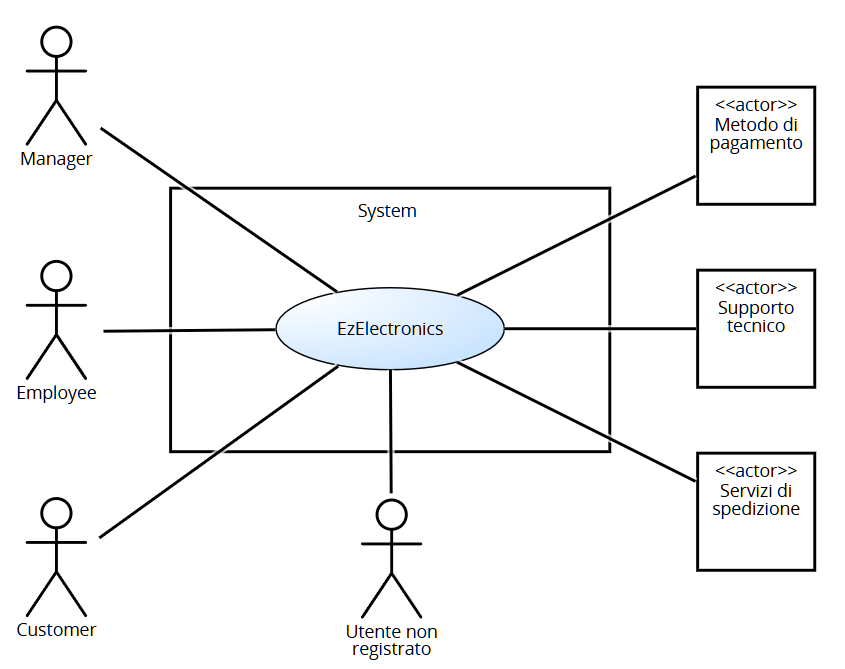
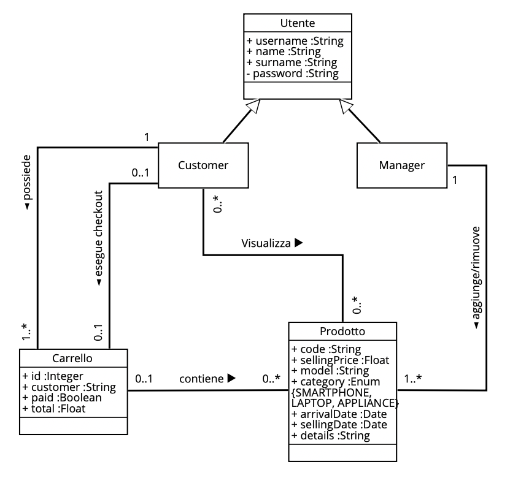

# Requirements Document - current EZElectronics

Date: 01/05/2024

Version: V2 - description of EZElectronics in NEW form (as decided in group)

| Version number | Change |
| :------------: | :----: |
|       7        | Fine casi d'uso e fix minori |

# Contents

- [Requirements Document - current EZElectronics](#requirements-document---current-ezelectronics)
- [Contents](#contents)
- [Informal description](#informal-description)
- [Stakeholders](#stakeholders)
- [Context Diagram and interfaces](#context-diagram-and-interfaces)
  - [Context Diagram](#context-diagram)
  - [Interfaces](#interfaces)
- [Stories and personas](#stories-and-personas)
- [Functional and non functional requirements](#functional-and-non-functional-requirements)
  - [Functional Requirements](#functional-requirements)
  - [Non Functional Requirements](#non-functional-requirements)
  - [Test requirements](#test-requirements)
  - [Table of rights](#table-of-rights)
- [Use case diagram and use cases](#use-case-diagram-and-use-cases)
  - [Use case diagram](#use-case-diagram)
  - [Use cases](#use-cases)
    - [UC1, Login](#use-case-1-uc1-login)
    - [UC2, Logout](#use-case-2-uc2-logout)
    - [UC3, Stampa informazioni utente](#use-case-3-uc3-stampa-informazioni-utente)
    - [UC4, Creazione di un nuovo utente](#use-case-4-uc4-creazione-di-un-nuovo-utente)
    - [UC5, Creazione di un nuovo prodotto](#use-case-5-uc5-creazione-di-un-nuovo-prodotto)
    - [UC6, Registrazione arrivo di un set di prodotti](#use-case-6-uc6-registrazione-arrivo-di-un-set-di-prodotti)
    - [UC7, Registrazione prodotto come venduto](#use-case-7-uc7-registrazione-prodotto-come-venduto)
    - [UC8, Elenco prodotti](#use-case-8-uc8-elenco-prodotti)
    - [UC9, Ricerca prodotto](#use-case-9-uc9-ricerca-prodotto)
    - [UC10, Elenco prodotti data la categoria](#use-case-10-uc10-elenco-prodotti-data-la-categoria)
    - [UC11, Elenco prodotti dato il modello](#use-case-11-uc11-elenco-prodotti-dato-il-modello)
    - [UC12, Eliminazione prodotto](#use-case-12-uc12-eliminazione-prodotto)
    - [UC13, Visualizzazione carrello](#use-case-13-uc13-visualizzazione-carrello)
    - [UC14, Aggiunta al carrello](#use-case-14-uc14-aggiunta-al-carrello)
    - [UC15, Checkout carrello](#use-case-15-uc15-checkout-carrello)
    - [UC16, Cronologia carrelli](#use-case-16-uc16-cronologia-carrelli)
    - [UC17, Rimozione dal carrello](#use-case-17-uc17-rimozione-dal-carrello)
    - [UC18, Svuotamento carrello](#use-case-18-uc18-svuotamento-carrello)
- [Glossary](#glossary)
- [System Design](#system-design)
- [Deployment Diagram](#deployment-diagram)

# Informal description

EZElectronics (read EaSy Electronics) is a software application designed to help managers of electronics stores to manage their products and offer them to customers through a dedicated website. Managers can assess the available products, record new ones, and confirm purchases. Employees help managers and have similar tasks. Customers can see available products, add them to a cart and see the history of their past purchases.

# Stakeholders

| Stakeholder name | Description |
| :--------------: | :---------: |
| Manager          | Principale utente dell'applicazione, ha un interesse diretto nel suo funzionamento ottimale per gestire efficacemente i prodotti e le vendite del suo negozio. Può modificare le informazioni generali del negozio e gestire il profilo degli Employee. |
| Customer         | Acquirente che utilizza il sito web dedicato per visualizzare e acquistare prodotti. Ha un interesse nell'esperienza utente, nella facilità di navigazione, e nella consistenza sui dati dei prodotti. |
| Employee         | Commesso del negozio, deve gestire il negozio sia nella sua parte fisica sia nella parte online, potendo aggiungere prodotti e segnare le vendite o i resi. |
| Utente non registrato | Visistatore del sito web che non ha ancora creato un account. È interessato a visualizzare e cercare i modelli che il sito permette di acquistare. |
| Servizi di pagamento | Servizi terzi che permettono ai customer di effettuare transazioni in modo sicuro. |
| Supporto tecnico | Responsabile della creazione, manutenzione e aggiornamento dell'applicazione. |
| Servizi di spedizione | Servizi terzi che si incaricano di consegnare i prodotti acquistati dagli utenti presso l'indirizzo da loro specificato.  |

# Context Diagram and interfaces

## Context Diagram

## Interfaces

|   Actor   | Logical Interface | Physical Interface |
| :-------: | :---------------: | :----------------: |
| Manager   | Pc                | GUI                |
| Customer  | Smartphone, Pc    | GUI                |
| Employee  | Pc, Scanner codici a barre    | GUI    |
| Utente non registrato | Smartphone, pc | GUI |
| Servizi di pagamento | Internet   | <https://satispay.com/>, <https://paypal.com/>, <https://visa.com/>, <https://mastercard.com/> |
| Supporto tecnico  | Pc    | GUI  |
| Servizi di spedizione  | Internet    | <https://gsped.com/api/> |

# Stories and personas

## Personas

|   **Manager**   |  |
| :-------: | :---------------: |
| Età| 37 anni|
| Occupazione| Manager di un negozio di elettronica|
|Comportamento| Organizzato, interessato alle vendite|
|Obiettivi| Monitorare le vendite, gestire l'inventario e i prodotti del negozio|
|Necessità| Dashboard per le vendite, gestione dell'inventario|

|   **Employee**   |  |
| :-------: | :---------------: |
| Età| 28 anni|
| Occupazione| Dipendente di un negozio di elettronica|
|Comportamento| Puntuale, organizzato, affidabile|
|Obiettivi| Gestire l’inventario prodotti, revisione ordini, preparazione ordini|
|Necessità| Gestione dell'inventario e delle vendite, dashboard ordini|

|   **Customer**   |  |
| :-------: | :---------------: |
| Età| 28 anni|
| Occupazione| Graphic designer|
|Comportamento|  Attenta ai dettagli, interessata ai modelli di qualità|
|Obiettivi| Acquistare modelli di qualità e visualizzare i propri ordini precedenti|
|Necessità| Navigazione intuitiva, acquisti sicuri|

|   **Utente non registrato**   |  |
| :-------: | :---------------: |
| Età| 40 anni|
| Occupazione| Imprenditore|
|Comportamento|  Pratico, interessato agli affari, interessato alla qualità |
|Obiettivi| Trovare informazioni sui modelli, confrontare prezzi|
|Necessità| Accesso facile ai modelli, dettagli dei modelli senza registrazione|

## Stories

|  **Manager**  |
| :-------  |
| Come manager voglio inserire uno o più prodotti appartententi ad uno stesso modello, rimuovere un prodotto dall’inventario o contrassegnarle un prodotto come venduto |
| Come manager voglio poter visualizzare tutti i prodotti nell’inventario, un singolo prodotto tramite il relativo codice o prodotti  appartenenti ad una specifica categoria o modello |
| Come manager voglio poeter visualizzare la lista di tutti i modelli in vendita nel sito |
| Come manager voglio poter modificare i dettagli di un modello in vendita |
| Come manager voglio poter modificare i dettagli profilo degli utenti registrati | 
| Come manager voglio poter creare gli account degli employee |

|  **Employee** |
| :-------  |
| Come employee voglio registrare l’arrivo di prodotti in magazzino, segnare le vendite e i resi dei prodotti|
| Come employee voglio visualizzare la lista di tutti i prodotti venduti e non |
| Come employee voglio visualizzare la lista di tutti i modelli disponibili e non|

|  **Customer** |
| :-------  |
| Come customer voglio poter aggiungere/rimuovere/visualizzare i modelli del carrello |
| Come customer voglio effettuare l’ordine relativo al mio carrello in semplici passi |
| Come customer voglio poter visualizzare la cronologia dei miei ordini |
| Come customer voglio poter visualizzare tutti i modelli nell’inventario/appartenenti a una data categoria |
| Come customer voglio poter modificare i dettagli del mio profilo |

|  **Utente non registrato** |
| :-------  |
| Come utente non registrato voglio poter visualizzare tutti i modelli nell’inventario/appartenenti a una data categoria e visualizzare le loro recensioni senza dovermi registrare |
| Come utente non registrato, voglio poter creare un account in pochi passi. |

# Functional and non functional requirements

## Functional Requirements

|  ID   | Description                                                         |
| :---: | :---------                                                          |
| **FR1** |      **Gestione utenti**                                          |
| FR1.1 | Chiunque può creare un account customer                             |
| FR1.2 | Un utente può effettuare login e logout                             |
| FR1.3 | Un utente può visualizzare le informazioni del proprio profilo      |
| FR1.4 | Un manager può creare il profilo di un employee                     |
| FR1.5 | Un manager può modificare il profilo di un employee                 |
| FR1.6 | Un manager può eliminare il profilo di un employee                  |
| FR1.7 | Un manager può eliminare il profilo di un customer                  | 
| FR1.8 | Un customer può eliminare il proprio profilo                        |
| FR1.9 | Un manager o employee  può visualizzare la lista di tutti i profili registrati  |
| FR1.10| Un manager o employee può filtrare la lista dei profili registrati per ruolo   |
| FR1.12| Un manager o employee possono visualizzare il profilo di un altro utente | 
| FR1.11| Un manager o employee può cercare il profilo di un utente dato lo username     |
| FR1.13| Un manager può modificare le informazioni sul negozio               |
| **FR2** |    **Gestione prodotti**                                          |
| FR2.1 | Un manager o un employee possono registrare un nuovo prodotto       |
| FR2.2 | Un manager o un employee possono registrare l'arrivo di un insieme di prodotti dello stesso modello |
| FR2.3 | Un manager o un employee possono segnare un prodotto come venduto   |
| FR2.4 | Un manager o un employee possono cercare un prdotto tramite codice  |
| FR2.5 | Un manager o un employee possono ottenere l'elenco di tutti i prodotti |
| FR2.6 | Un manager o un employee possono filtrarte l'elenco di tutti prodotti per categoria |
| FR2.7 | Un manager o un employee possono filtrarte l'elenco di tutti prodotti per modello |
| FR2.8 | Un manager o un employee possono eliminare un prodotto              |
| **FR3**| **Gestione modelli**                                               |
| FR3.1 | Un manager o un employee possono creare un nuovo modello            |
| FR3.2 | Un manager o un employee possono modificare un modello              |
| FR3.3 | Un manager o un employee possono possono eliminare un modello       |
| FR3.4 | Qualsiasi utente può ottenere l'elenco di tutti i modelli disponibili |
| FR3.5 | Qualsiasi utente può filtrarte l'elenco dei modelli disponibili per categoria |
| FR3.6 | Qualisasi utente può cercare un modello per nome                    |
| **FR4** | **Gestione carrello**                                             |
| FR4.1 | Un customer può visualizzare il proprio carrello                    |
| FR4.2 | Un customer può aggiungere un modello al proprio carrello, specificando la quantità di prodotti che desidera acquistare |
| FR4.3 | Un customer può eseguire il checkout del proprio carrello           |
| FR4.4 | Un customer può rimuovere un modello dal carrello                   |
| FR4.5 | Un customer può svuotare il proprio carrello                        |
| **FR5** | **Gestione ordini**                                               |
| FR5.1 | Un customer decide se ritirare il proprio ordine in negozio o riceverlo a casa tramite corriere|
| FR5.2 | Se l'utente decide di ricevere tutto tramite corriere deve essere reindirizzato alla pagina del pagamento |
| FR5.3 | Un customer può visualizzare lo stato del proprio ordine            |
| FR5.4 | Un customer può cercare un proprio ordine tramite id                |
| FR5.5 | Il sito deve mostrare a un manager e a un employee una notifica quando un customer completa un nuovo checkout |
| FR5.6 | Un manager o un employee possono modificare lo stato di un ordine   |
| FR5.7 | Un manager o un employee possono cercare un ordine tramite id       |
| FR5.8 | Un manager o un employee possono ottenere lo storico di tutti gli ordini    |
| FR5.9 | Un manager o un employee possono filtrare lo storico degli ordini per stato |
| FR5.10| Un customer può visualizzare la propria cronologia ordini           |
| **FR6** | **Gestione recensioni**                                           |
| FR6.1 | Un customer che abbia acquistato un determinato prodotto può recensirne il modello |
| FR6.2 | Qualsiasi utente può visualizzare le recensioni di un determinato modello |
| FR6.3 | Un customer può eliminare una propria recensione                    |
| FR6.4 | Un manager o un employee possono eliminare una recensione           |
| **FR7** | **Gestione resi - *!in sospeso!***                                |
| FR7.1 | Un customer può effettuare il reso di un ordine entro 14 giorni dal suo pagamento |
| FR7.2 | Un manager o un employee possono accettare o rifiutare una richiesta di reso|
| FR7.3 | Un customer può visualizzare lo stato del proprio reso              |

- Nota: il requisito FR1.1 sottolinea la possibilità di creare solo utenti customer; gli utenti manager devono essere già presenti nel database al momento dell'avvio, mentre gli utente Employee devono essere creati da un utente Manager.
- Nota: il requisito FR6.4 può far sorgere dubbi di natura etica, tuttavia lo si ritiene necessario per motivi di moderazione.
- Nota: i requisiti FR1.7 e FR1.8 comportano l'eliminazione dal database di tutte le informazioni personali (nome, cognome, username, numero di telefono, email, indirizzo, CAP, città, stato, foto profilo e password) e tutte le recensioni che ha scritto. Tuttavia, va mantenuto per motivi legali lo storico degli ordini effettuati a cui l'utente non può avere accesso.
- Nota: il requisito FR3.3 comporta l'eliminazione dal database di tutte le informazioni (nome, specifiche tecniche, immagini, prezzo, recensioni, valutazione). Tuttavia, va mantenuto per motivi legali lo storico di tutti gli ordini per quel modello.

## Non Functional Requirements

|   ID    | Type (efficiency, reliability, ..) | Description | Refers to |
| :-----: | :--------------------------------: | :---------  | :-------: |
| NFR1    | Usabilitá      | Un nuovo customer che visita per la prima volta il sito deve poter utilizzare tutte le funzionalità basilari (ricerca prodotti, aggiunta al carrello e checkout) senza alcun tipo di training. Un nuovo manager deve essere in grado di sfruttare tutte le funzionalità del sito dopo un massimo di due ore di training. Un employee | FR1-FR3 |
| NFR2    | Usabilitá      | Il carrello di un utente non deve essere cancellato quando esso effettua log out ma deve essere persistente, finchè non viene eseguito il checkout | FR3 |
| NFR3    | Prestazioni    | Il sito deve essere in grado di gestire e portare a compimento un minimo di 10 transazioni al secondo. Il tempo di risposta ad un evento (come click su un pulsante) in condizioni ottimali di velocità della connessione non deve superare i due secondi. | FR1-FR3 |
| NFR3    | Affidabilità   | Il tempo di disponibilitá del servizio durante un mese deve essere almeno del 99.95%. | FR1-FR3  |
| NFR4    | Robustezza     | non possono verificarsi più di 5 guasti all’anno e, nel caso se ne verifichi uno, il tempo richiesto affinché il sito torni online non deve superare le 12h | FR1-FR3 |
| NFR5    | Portabilità    | Il sito deve poter essere visualizzato su tutte le versioni degli ultimi 4 anni di almeno cinque dei browser più utilizzati. | FR1-FR3 |
| NFR6    | Sicurezza      | Le fughe di dati non possono verificarsi più frequentemente di una volta ogni 20 anni. | FR1-FR3 |

Nota: la scrittura FRX-FRY signfica che il relativo NFR si riferisce a tutti i FR da FRX a FRY compresi. La dicitura FRX, FRY significa che il relativo NFR si riferisce separatamente a FRX e FRY.

### Table of rights

| FR  |  Customer  |  Manager  |  Employee  | Servizi di pagamento | Servizi di spedizione |
| :-: |  :------:  |  :-----:  |  :-------: | :------------------: | :-------------------: |
| 1.1 |     X      |     X     |     X      |                      |                       |
| 1.2 |     X      |     X     |     X      |                      |                       |
| 1.3 |     X      |     X     |     X      |                      |                       |
| 1.4 |            |     X     |            |                      |                       |
| 1.5 |            |     X     |            |                      |                       |
| 1.6 |            |     X     |            |                      |                       |
| 1.7 |            |     X     |            |                      |                       |
| 1.8 |     X      |     X     |            |                      |                       |
| 1.9 |            |     X     |            |                      |                       |
| 1.10|            |     X     |            |                      |                       |
| 1.11|            |     X     |            |                      |                       |
| 1.12|            |     X     |            |                      |                       |
| 1.13|            |     X     |            |                      |                       |
| 2.1 |            |     X     |     X      |                      |                       |
| 2.2 |            |     X     |     X      |                      |                       |
| 2.3 |            |     X     |     X      |                      |                       |
| 2.4 |            |     X     |     X      |                      |                       |
| 2.5 |     X      |     X     |     X      |                      |                       |
| 2.6 |     X      |     X     |     X      |                      |                       |
| 2.7 |     X      |     X     |     X      |                      |                       |
| 2.8 |            |     X     |     X      |                      |                       |
|  3  |     X      |           |            |                      |                       |
| 4.1 |     X      |           |            |                      |                       |
| 4.2 |     X      |     X     |     X      |                      |                       |
| 4.3 |     X      |           |            |                      |                       |
| 4.4 |     X      |           |            |                      |                       |
| 4.5 |            |     X     |     X      |                      |                       |
| 5.1 |     X      |           |            |                      |                       |
| 5.2 |     X      |           |            |         X            |            X          |
| 5.3 |     X      |           |            |                      |                       |
| 5.4 |     X      |           |            |                      |                       |
| 5.5 |     X      |           |            |                      |                       |
| 5.6 |            |     X     |     X      |                      |                       |
| 5.7 |            |     X     |     X      |                      |                       |
| 5.8 |            |     X     |     X      |                      |                       |
| 5.9 |            |     X     |     X      |                      |                       |
| 5.10|     X      |           |            |                      |                       |

# Use case diagram and use cases

## Use case diagram

## Use cases

### Use case 1, UC1, Login

| Actors Involved  |           Utente (customer, manager o employee)         |
| :--------------: | :----------------------------------------------------: |
|   Precondition   |  Utente non autenticato                                |
|  Post condition  |  Utente autenticato e autorizzato                      |
| Nominal Scenario |  Login dell'utente                                     |
|     Variants     |  Nessuna                                               |
|    Exceptions    |  Username o password non riconosciuti, errore interno  |

|  Scenario 1.1  | Login corretto                                           |
| :------------: | :------------------------------------------------------: |
|  Precondition  | Utente non autenticato                                   |
| Post condition | Utente autenticato e autorizzato                         |
|      Step#     |         Description                                      |
|       1        | Il sistema chiede all'utente di inserire username e password |
|       2        | L'utente fornisce username e password nei campi appositi e clicca su "Accedi" |
|       3        | Il sistema cerca lo username nel database                |
|       4        | Il sistema confronta la password inserita con quella salvata |
|       5        | Il sistema esegue il login utente (status: 200)          |

|  Scenario 1.2  | Username inesistente                                     |
| :------------: | :------------------------------------------------------: |
|  Precondition  | Username inesistente                                     |
| Post condition | Utente non autenticato                                   |
|     Step#      |             Description     |
|       1        | Il sistema richiede all'utente di inserire username e password |
|       2        | L'utente fornisce username e password nei campi appositi e clicca su "Accedi" |
|       3        | Il sistema cerca lo username nel database |
|       4        | Il sistema non autorizza l’utente (status: 404) e mostra “Credenziali non valide” |

|  Scenario 1.3  |  Password errata |
| :------------: | :------------------------------------------------------------------------: |
|  Precondition  | Password errata |
| Post condition | Utente non autenticato    |
|     Step#      |                                Description     |
|       1        | Il sistema richiede all'utente di inserire username e password |
|       2        | L'utente fornisce username e password nei campi appositi e clicca su "Accedi" |
|       3        | Il sistema cerca lo username nel database |
|       4        | Il sistema confronta la password inserita con quella salvata |
|       5        | Il sistema non autorizza l’utente (status: 404) e mostra “Credenziali non valide” |

|  Scenario 1.4  |  Errore interno |
| :------------: | :----------------------------------------------------------------------: |
| Precondition   | L'utente ha avviato la richiesta |
| Post condition | L'operazione viene annullata |
|     Step#      |   Description    |
|       1        | Il sistema non autorizza l'utente e mostra il messaggio di errore |

### Use case 2, UC2, Logout

| Actors Involved  |           Utente (customer, manager o employee)         |
| :--------------: | :------------------------------------------------------------------: |
|   Precondition   | Utente autenticato  |
|  Post condition  | Utente non più autorizzato   |
| Nominal Scenario | L’utente effettua il logout dal sito |
|     Variants     | Nessuna  |
|    Exceptions    | Errore interno  |

|  Scenario 2.1  |  Logout con successo |
| :------------: | :------------------------------------------------------------------------: |
|  Precondition  | Utente autenticato |
| Post condition | Utente non più autorizzato    |
|     Step#      |                                Description     |
|       1        | L'utente clicca sul link per il logout (barra in alto) |
|       2        | Il sistema risponde eseguendo il logout utente (status: 200) |

|  Scenario 2.2  |  Errore interno |
| :------------: | :----------------------------------------------------------------------: |
| Precondition   | L'utente ha avviato la richiesta |
| Post condition | L'operazione viene annullata |
|     Step#      |   Description    |
|       1        | Il sistema non esegue il Logout e stampa il messaggio di errore |

### Use case 3, UC3, Stampa informazioni utente

| Actors Involved  |           Utente (customer, manager o employee)         |
| :--------------: | :------------------------------------------------------------------: |
|   Precondition   | Utente autenticato  |
|  Post condition  | Stampa delle informazioni utente a video   |
| Nominal Scenario | Informazioni utente visualizzate sullo schermo |
|     Variants     | Nessuna  |
|    Exceptions    | Errore interno  |

|  Scenario 3.1  |  Visualizzazione con successo |
| :------------: | :------------------------------------------------------------------------: |
|  Precondition  | Utente autenticato |
| Post condition | Stampa delle informazioni utente a video   |
|     Step#      |                                Description     |
|       1        | L'utente clicca sull’icona del profilo in alto |
|       2        | Il sistema preleva dal database le informazioni-utente |
|       3        | Il sistema stampa le informazioni appena prelevate a video (status: 200)  |

|  Scenario 3.2  |  Errore interno |
| :------------: | :----------------------------------------------------------------------: |
| Precondition   | L'utente ha avviato la richiesta |
| Post condition | L'operazione viene annullata |
|     Step#      |   Description    |
|       1        | Il sistema stampa il messaggio di errore |

### Use case 4, UC4 Creazione di un nuovo utente customer

| Actors Involved  |                     Chiunque         |
| :--------------: | :------------------------------------------------------------------: |
|   Precondition   |  Utente non autenticato                                    |
|  Post condition  |  Un nuovo utente customer viene creato e inserito nel database       |
| Nominal Scenario |  Creazione utente customer |
|     Variants     |  Nessun inserimento immagine di profilo |
|    Exceptions    |  Username già esistente, errore interno |

|  Scenario 4.1  | Creazione nuovo utente (con immagine)  |
| :------------: | :------------------------------------------------------------------------: |
|  Precondition  | Utente non autenticato |
| Post condition | Nuovo utente viene creato e inserito nel database   |
|     Step#      |                                Description                                 |
|       1        | L'utente richiede al sistema di creare un nuovo utente cliccando sul link in basso |
|       2        | Il sistema chiede all’utente di inserire username, name, surname, password, indirizzo, città, stato, CAP, email, cellulare, immagine |
|       3        | L'utente inserisce le informazioni richieste dal sistema e clicca su "Registrati" |
|       4        | Il sistema controlla se nel database è già presente un altro utente con lo stesso username |
|       5        | Il sistema applica un algoritmo di hash della password |
|       6        | Il sistema inserisce le informazioni in una nuova linea nel database |
|       7        | Il sistema risponde con il messaggio di successo (status: 200) |

|  Scenario 4.2  | Creazione nuovo utente (senza immagine)  |
| :------------: | :------------------------------------------------------------------------: |
|  Precondition  | Utente non autenticato |
| Post condition | Un nuovo utente customer viene creato e inserito nel database   |
|     Step#      |                                Description                                 |
|       1        | L'utente richiede al sistema di creare un nuovo utente cliccando sul link in basso |
|       2        | Il sistema chiede all’utente di inserire username, name, surname, password, indirizzo, città, stato, CAP, email, cellulare, immagine |
|       3        | L'utente inserisce le informazioni richieste dal sistema, tranne l'immagine, e clicca su "Registrati" |
|       4        | Il sistema controlla se nel database è già presente un altro utente con lo stesso username |
|       5        | Il sistema applica un algoritmo di hash della password |
|       6        | Il sistema inserisce le informazioni in una nuova linea nel database |
|       7        | Il sistema risponde con il messaggio di successo (status: 200) |

|  Scenario 4.3  | Creazione di un utente già presente  |
| :------------: | :------------------------------------------------------------------------: |
|  Precondition  | Utente non autenticato, lo username è già presente nel database |
| Post condition | Un messaggio di errore viene mostrato a schermo, non viene creato l’utente   |
|     Step#      |                                Description                                 |
|       1        | L'utente richiede al sistema di creare un nuovo utente cliccando sul link in basso |
|       2        | Il sistema chiede all’utente di inserire username, name, surname, password, indirizzo, città, stato, CAP, email, cellulare, immagine |
|       3        | L'utente inserisce le informazioni richieste dal sistema e clicca su "Registrati" |
|       4        | Il sistema controlla se nel database è già presente lo username passato |
|       5        | La richiesta fallisce e Il sistema mostra a video un messaggio di errore (status: 404) |

|  Scenario 4.4  | Omissione di campi obbligatori  |
| :------------: | :------------------------------------------------------------------------: |
|  Precondition  | Utente non autenticato |
| Post condition | Un messaggio di errore viene mostrato a schermo, non viene creato l’utente   |
|     Step#      |                                Description                                 |
|       1        | L'utente richiede al sistema di creare un nuovo utente cliccando sul link in basso |
|       2        | Il sistema chiede all’utente di inserire username, name, surname, password, indirizzo, città, stato, CAP, email, cellulare, immagine |
|       3        | L'utente inserisce le informazioni richieste dal sistema, ma ne omette alcune e clicca su "Registrati" |
|       4        | La richiesta fallisce e Il sistema mostra a video un messaggio di errore (status: 404)|

|  Scenario 4.5  |  Errore interno |
| :------------: | :----------------------------------------------------------------------: |
| Precondition   | L'utente ha avviato la richiesta |
| Post condition | L'operazione viene annullata |
|     Step#      |   Description    |
|       1        | Il sistema annulla ogni modifica nel database e stampa il messaggio di errore |

### Use case 5, UC5, Creazione di un nuovo prodotto

| Actors Involved  |                     Utente manager o employee         |
| :--------------: | :------------------------------------------------------------------: |
|   Precondition   |  Utente autenticato come manager o employee                          |
|  Post condition  |  Nuovo prodotto creato e inserito nel database                        |
| Nominal Scenario |  Creazione di un nuovo prodotto date le sue informazioni |
|     Variants     |  Nessuna |
|    Exceptions    |  Uno o più campi non inseriti o non validi, errore interno |

|  Scenario 5.1  | Creazione nuovo prodotto con successo |
| :------------: | :------------------------------------------------------------------------: |
|  Precondition  | Utente autenticato come manager o employee |
| Post condition | Nuovo prodotto creato e inserito nel database   |
|     Step#      |                                Description                                 |
|       1        | L'utente richiede al sistema di creare un nuovo prodotto cliccando sul pulsante apposito |
|       2        | Il sistema chiede di inserire sellingPrice, model, category, details, foto |
|       3        | L'utente inserisce le informazioni richieste dal sistema |
|       4        | Il sistema inserisce nel database il nuovo prodotto con i campi passati, aggiungendo il codice prodotto generato autoamaticamente e arrivalDate=data_corrente |
|       6        | Il sistema risponde con il messaggio di successo in cui scrive il nuovo codice (status: 200) |

|  Scenario 5.2  | Campo/i non inserito |
| :------------: | :------------------------------------------------------------------------: |
|  Precondition  | Utente autenticato come manager o employee |
| Post condition | Prodotto non creato   |
|     Step#      |                                Description                                 |
|       1        | L'utente richiede al sistema di creare un nuovo prodotto cliccando sul pulsante apposito |
|       2        | Il sistema chiede di inserire sellingPrice, model, category, details, foto |
|       3        | L'utente inserisce le informazioni richieste dal sistema tranne uno o più campi |
|       4        | Il sistema non inserisce il prodotto e risponde con il messaggio di fallimento |

|  Scenario 5.3  | campo/i non valido/i |
| :------------: | :------------------------------------------------------------------------: |
|  Precondition  | Utente autenticato come manager |
| Post condition | Prodotto non creato   |
|     Step#      |                                Description                                 |
|       1        | L'utente richiede al sistema di creare un nuovo prodotto cliccando sul pulsante apposito |
|       2        | Il sistema chiede di inserire sellingPrice, model, category, details, foto |
|       3        | L'utente inserisce le informazioni richieste dal sistema, ma alcuni non sono validi |
|       4        | Il sistema non inserisce il prodotto e risponde con il messaggio di fallimento |

|  Scenario 5.4  |  Errore interno |
| :------------: | :----------------------------------------------------------------------: |
| Precondition   | L'utente ha avviato la richiesta |
| Post condition | L'operazione viene annullata |
|     Step#      |   Description    |
|       1        | Il sistema annulla ogni modifica nel database e stampa il messaggio di errore |

### Use case 6, UC6, Registrazione arrivo di un set di prodotti dello stesso modello

| Actors Involved  |                     Utente manager o employee         |
| :--------------: | :------------------------------------------------------------------: |
|   Precondition   |  Utente autenticato come manager o employee               |
|  Post condition  |  Insieme di prodotti creato e inserito nel database                        |
| Nominal Scenario |  Creazione di un insieme di prodotti di uno stesso modello |
|     Variants     |  Nessuna |
|    Exceptions    |  Uno o più campi omessi o non validi, errore interno |

|  Scenario 6.1  | Creazione nuovo set con successo  |
| :------------: | :------------------------------------------------------------------------: |
|  Precondition  | Utente autenticato come manager o employee |
| Post condition | Nuovi prodotti creati e inseriti nel database   |
|     Step#      |                                Description                                 |
|       1        | L'utente richiede al sistema di caricare un nuovo set di prodotti cliccando sul pulsante apposito |
|       2        | Il sistema chiede di inserire sellingPrice, model, category, details, foto |
|       3        | L'utente inserisce le informazioni richieste dal sistema |
|       4        | Il sistema controlla se tutti i campi sono validi |
|       5        | Il sistema inserisce nel database il nuovo set di prodotti con i campi passati, aggiungendo i codici prodotto generati automaticamente e arrivalDate=data_corrente |
|       6        | Il sistema risponde con il messaggio di successo (status: 200) |

|  Scenario 6.2  | Campo/i non inserito |
| :------------: | :------------------------------------------------------------------------: |
|  Precondition  | Utente autenticato come manager o employee, campo/i non inserito |
| Post condition | Operazione annullata   |
|     Step#      |                                Description                                 |
|       1        | L'utente richiede al sistema di caricare un nuovo set di prodotti cliccando sul pulsante apposito |
|       2        | Il sistema chiede di inserire sellingPrice, model, category, details, foto |
|       3        | L'utente inserisce le informazioni richieste dal sistema tranne uno o più campi |
|       4        | Il sistema non procede e risponde con il messaggio di fallimento |

|  Scenario 6.3  | Campo/i non valido/i |
| :------------: | :------------------------------------------------------------------------: |
|  Precondition  | Utente autenticato come manager o employee, campo/i non valido/i |
| Post condition | Operazione annullata   |
|     Step#      |                                Description                                 |
|       1        | L'utente richiede al sistema di caricare un nuovo set di prodotti cliccando sul pulsante apposito |
|       2        | Il sistema chiede di inserire sellingPrice, model, category, details, foto |
|       3        | L'utente inserisce le informazioni richieste dal sistema con alcuni campi non validi (es sellingPrice<=0.0) |
|       4        | Il sistema non procede e risponde con il messaggio di fallimento |

|  Scenario 6.4  |  Errore interno |
| :------------: | :----------------------------------------------------------------------: |
| Precondition   | L'utente ha avviato la richiesta |
| Post condition | L'operazione viene annullata |
|     Step#      |   Description    |
|       1        | Il sistema annulla ogni modifica nel database e stampa il messaggio di errore |

### Use case 7, UC7, Creazione profilo dell'employee da parte del manager

| Actors Involved  |                     Utente manager         |
| :--------------: | :------------------------------------------------------------------: |
|   Precondition   |  Utente autenticato come manager                                    |
|  Post condition  |  Un nuovo utente employee viene creato e inserito nel database                        |
| Nominal Scenario |  Creazione employee |
|     Variants     |  Nessun inserimento immagine di profilo |
|    Exceptions    |  Username già esistente, omissione di campi obbligatori, errore interno |

|  Scenario 7.1  | Creazione nuovo employee  |
| :------------: | :------------------------------------------------------------------------: |
|  Precondition  | Utente autenticato come manager|
| Post condition | Nuovo utente employee creato e inserito nel database   |
|     Step#      |                                Description                                 |
|       1        | L'utente manager richiede al sistema di creare un nuovo utente employee dall'apposito link |
|       2        | Il sistema chiede all’utente di inserire username, name, surname, password, email, cellulare, immagine |
|       3        | L'utente inserisce le informazioni richieste dal sistema e invia la richiesta |
|       4        | Il sistema controlla se nel database è già presente un employee con stesso username |
|       5        | Il sistema applica un algoritmo di hash della password |
|       6        | Il sistema inserisce le informazioni in una nuova linea nel database |
|       7        | Il sistema risponde con il messaggio di successo (status: 200) |

Nota: Se il manager non inserisce nessuna immagine profilo, viene usato l'avatar di default

|  Scenario 7.2  | Creazione di un employee già presente  |
| :------------: | :------------------------------------------------------------------------: |
|  Precondition  | Utente autenticato come manager, lo username è già presente nel database |
| Post condition | Un messaggio di errore viene mostrato a schermo, non viene creato l'employee   |
|     Step#      |                                Description                                 |
|       1        | L'utente richiede al sistema di creare un nuovo utente employee dall'apposito link |
|       2        | Il sistema chiede all’utente di inserire username, name, surname, password, email, cellulare, immagine |
|       3        | L'utente inserisce le informazioni richieste dal sistema e invia la richiesta |
|       4        | Il sistema controlla se nel database è già presente un employee con stesso username |
|       5        | La richiesta fallisce e Il sistema mostra a video un messaggio di errore (status: 404) |

|  Scenario 7.3  | Omissione di campi obbligatori  |
| :------------: | :------------------------------------------------------------------------: |
|  Precondition  | Utente non autenticato |
| Post condition | Un messaggio di errore viene mostrato a schermo, non viene creato l’utente   |
|     Step#      |                                Description                                 |
|       1        | L'utente richiede al sistema di creare un nuovo utente employee dall'apposito link |
|       2        | Il sistema chiede all’utente di inserire username, name, surname, password, email, cellulare, immagine |
|       3        | L'utente inserisce le informazioni richieste dal sistema, ma ne omette alcune e invia la richiesta |
|       4        | La richiesta fallisce e Il sistema mostra a video un messaggio di errore (status: 404)|

|  Scenario 7.4  |  Errore interno |
| :------------: | :----------------------------------------------------------------------: |
| Precondition   | L'utente ha inserito tutte le informazioni e ha inviato la richiesta |
| Post condition | L'operazione viene annullata |
|     Step#      |   Description    |
|       1        | Il sistema annulla ogni modifica nel database e stampa il messaggio di errore |

### Use case 8, UC8, Modifica profilo dell'employee da parte del manager

Nota: modifica non eseguibile sul campo username

| Actors Involved  |                     Utente manager         |
| :--------------: | :------------------------------------------------------------------: |
|   Precondition   |  Utente autenticato come manager, visualizzazione del profilo desiderato |
|  Post condition  |  Modifica al profilo dell'employee selezionato                        |
| Nominal Scenario |  Modifica employee |
|     Variants     |  Nessun inserimento immagine di profilo |
|    Exceptions    |  Omissione di campi obbligatori, errore interno |

|  Scenario 8.1  | Modifica profilo employee (con immagine)  |
| :------------: | :------------------------------------------------------------------------: |
|  Precondition  | Utente autenticato come manager, visualizzazione del profilo desiderato|
| Post condition | Utente employee modificato nel database   |
|     Step#      |                                Description                                 |
|       1        | L'utente ha viisualizzato il profilo di un employee e clicca sul link per modificarlo |
|       2        | Il sistema chiede all’utente di inserire name,surname,password,email,cellulare,immagine |
|       3        | L'utente inserisce le informazioni richieste dal sistema e invia la richiesta |
|       5        | Il sistema applica un algoritmo di hash della password |
|       6        | Il sistema sovrascrive le informazioni nella linea nel database identificata dallo username |
|       7        | Il sistema risponde con il messaggio di successo (status: 200) |

Nota: Se il manager non inserisce nessuna immagine profilo, viene usato l'avatar di default

|  Scenario 8.2  | Omissione di campi obbligatori  |
| :------------: | :------------------------------------------------------------------------: |
|  Precondition  | Utente autenticato come manager, visualizzazione del profilo desiderato|
| Post condition | Utente employee non modificato nel database   |
|     Step#      |                                Description                                 |
|       1        | L'utente ha viisualizzato il profilo di un employee e clicca sul link per modificarlo |
|       2        | Il sistema chiede all’utente di inserire name,surname,password,email,cellulare,immagine |
|       3        | L'utente inserisce le informazioni richieste dal sistema tranne alcuni obbligatori e invia la richiesta |
|       4        | La richiesta fallisce e il sistema stampa un messaggio di errore (status: 404)|

|  Scenario 8.3  |  Errore interno |
| :------------: | :----------------------------------------------------------------------: |
| Precondition   | L'utente ha inserito tutte le informazioni e ha inviato la richiesta |
| Post condition | L'operazione viene annullata |
|     Step#      |   Description    |
|       1        | Il sistema annulla ogni modifica nel database e stampa il messaggio di errore |

### Use case 9, UC9, Eliminazione profilo dell'employee da parte del manager

| Actors Involved  |                     Utente manager         |
| :--------------: | :------------------------------------------------------------------: |
|   Precondition   |  Utente autenticato come manager, visualizzazione del profilo desiderato |
|  Post condition  |  Eliminazione del profilo dell'employee selezionato                        |
| Nominal Scenario |  Eliminazione corretta |
|     Variants     |  Nessuna |
|    Exceptions    |  Errore interno, operazione annullata |

|  Scenario 9.1  | Eliminazione con successo  |
| :------------: | :------------------------------------------------------------------------: |
|  Precondition  | Utente autenticato come manager, visualizzazione del profilo desiderato|
| Post condition | Utente employee eliminato dal database   |
|     Step#      |                                Description                                 |
|       1        | L'utente ha visualizzato il profilo di un employee e clicca sul link per cancellarlo |
|       2        | Il sistema chiede conferma dell'operazione e, dopo l'ok, cancella l'utente selezionato dal database |
|       3        | Il sistema risponde con il messaggio di successo (status: 200)|

|  Scenario 9.2  | Eliminazione annullata  |
| :------------: | :------------------------------------------------------------------------: |
|  Precondition  | Utente autenticato come manager, visualizzazione del profilo desiderato|
| Post condition | Utente employee non eliminato dal database   |
|     Step#      |                                Description                                 |
|       1        | L'utente ha visualizzato il profilo di un employee e clicca sul link per cancellarlo |
|       2        | Il sistema chiede conferma dell'operazione  |
|       3        | L'utente annulla l'operazione |

|  Scenario 9.3  |  Errore interno |
| :------------: | :----------------------------------------------------------------------: |
| Precondition   | L'utente ha avviato la richiesta di eliminazione |
| Post condition | L'operazione viene annullata |
|     Step#      |   Description    |
|       1        | Il sistema annulla ogni modifica nel database e stampa il messaggio di errore |

### use case 10, UC10, Eliminazione profilo customer da parte di un manager

| Actors Involved  |                     Utente manager         |
| :--------------: | :------------------------------------------------------------------: |
|   Precondition   |  Utente autenticato come manager, visualizzazione del profilo desiderato |
|  Post condition  |  Eliminazione del profilo del customer selezionato                        |
| Nominal Scenario |  Eliminazione corretta |
|     Variants     |  Nessuna |
|    Exceptions    |  Errore interno, operazione annullata |

|  Scenario 10.1  | Eliminazione con successo  |
| :------------: | :------------------------------------------------------------------------: |
|  Precondition  | Utente autenticato come manager, visualizzazione del profilo desiderato|
| Post condition | Utente customer eliminato dal database   |
|     Step#      |                                Description                                 |
|       1        | L'utente ha visualizzato il profilo di un customer e clicca sul link per cancellarlo |
|       2        | Il sistema chiede conferma dell'operazione e, dopo l'ok, cancella l'utente selezionato dal database |
|       3        | Il sistema risponde con il messaggio di successo (status: 200)|

|  Scenario 10.2  | Eliminazione annullata  |
| :------------: | :------------------------------------------------------------------------: |
|  Precondition  | Utente autenticato come manager, visualizzazione del profilo desiderato|
| Post condition | Utente customer non eliminato dal database   |
|     Step#      |                                Description                                 |
|       1        | L'utente ha visualizzato il profilo di un customer e clicca sul link per cancellarlo |
|       2        | Il sistema chiede conferma dell'operazione  |
|       3        | L'utente annulla l'operazione |

|  Scenario 10.3  |  Errore interno |
| :------------: | :----------------------------------------------------------------------: |
| Precondition   | L'utente ha avviato la richiesta di eliminazione|
| Post condition | L'operazione viene annullata |
|     Step#      |   Description    |
|       1        | Il sistema annulla ogni modifica nel database e stampa il messaggio di errore |

### Use case 11, UC11, Eliminazione del proprio profilo

| Actors Involved  |                     Utente manager o customer         |
| :--------------: | :------------------------------------------------------------------: |
|   Precondition   |  Utente autenticato customer |
|  Post condition  |  Eliminazione del proprio profilo                        |
| Nominal Scenario |  Eliminazione corretta |
|     Variants     |  Nessuna |
|    Exceptions    |  Errore interno, operazione annullata |

|  Scenario 11.1  | Eliminazione con successo  |
| :------------: | :------------------------------------------------------------------------: |
|  Precondition  | Utente autenticato customer|
| Post condition | Utente eliminato dal database   |
|     Step#      |                                Description                                 |
|       1        | L'utente clicca sul link per cancellare il proprio profilo |
|       2        | Il sistema chiede conferma dell'operazione e, dopo l'ok, cancella l'utente dal database |
|       3        | Il sistema risponde con il messaggio di successo (status: 200) e effettua il logout utente|

|  Scenario 11.2 | Eliminazione annullata  |
| :------------: | :------------------------------------------------------------------------: |
|  Precondition  | Utente autenticato customer|
| Post condition | Utente non eliminato dal database   |
|     Step#      |                                Description                                 |
|       1        | L'utente clicca sul link per cancellare il proprio profilo |
|       2        | Il sistema chiede conferma dell'operazione |
|       3        | L'utente annulla l'operazione |

|  Scenario 11.3  |  Errore interno |
| :------------: | :----------------------------------------------------------------------: |
| Precondition   | L'utente ha avviato la richiesta |
| Post condition | L'operazione viene annullata |
|     Step#      |   Description    |
|       1        | Il sistema annulla ogni modifica nel database e stampa il messaggio di errore |

### Use case 12, UC12, Visualizzazione di tutti gli utenti

| Actors Involved  |                     Utente manager       |
| :--------------: | :------------------------------------------------------------------: |
|   Precondition   |  Utente autenticato come manager o employee |
|  Post condition  |  Visualizzazione di tutti gli utenti                        |
| Nominal Scenario |  Visualizzazione corretta |
|     Variants     |  Filtro per ruolo, Ricerca singolo utente |
|    Exceptions    |  Errore interno |

|  Scenario 12.1 | Visualizzazione corretta  |
| :------------: | :------------------------------------------------------------------------: |
|  Precondition  | Utente autenticato come manager o employee|
| Post condition | Visualizzazione di tutti gli utenti    |
|     Step#      |                                Description                                 |
|       1        | L'utente clicca sul link per visualizzare tutti gli utenti registrati |
|       2        | Il sistema risponde stampando a video l'elenco di utenti |

|  Scenario 12.2 | Visualizzazione utenti filtrati per ruolo  |
| :------------: | :------------------------------------------------------------------------: |
|  Precondition  | Utente autenticato come manager o employee|
| Post condition | Visualizzazione di tutti gli utenti dato il ruolo   |
|     Step#      |                                Description                                 |
|       1        | L'utente clicca sul filtro ruolo |
|       2        | Il sistema risponde filtrando gli utenti per il ruolo selezionato |

|  Scenario 12.3 | Ricerca singolo utente tramite username  |
| :------------: | :------------------------------------------------------------------------: |
|  Precondition  | Utente autenticato come manager o employee|
| Post condition | Visualizzazione dell'utente con username specificato   |
|     Step#      |                                Description                                 |
|       1        | L'utente inserisce uno username nella barra du ricerca e clicca sul pulsante per avviare l'operazione |
|       2        | Il sistema risponde stampando a video il profilo dell'utente cercato |

|  Scenario 12.4 | Utente non esistente  |
| :------------: | :------------------------------------------------------------------------: |
|  Precondition  | Utente autenticato come manager o employee|
| Post condition | Nessuna visualizzazione dell'utente con username scelto   |
|     Step#      |                                Description                                 |
|       1        | L'utente inserisce uno username nella barra di ricerca e clicca sul pulsante per avviare l'operazione |
|       2        | Il sistema non trova l'utente e risponde stampando a video un messaggio di errore (status: 404) |

|  Scenario 12.5  |  Errore interno |
| :------------: | :----------------------------------------------------------------------: |
| Precondition   | L'utente ha avviato la richiesta |
| Post condition | L'operazione viene annullata |
|     Step#      |   Description    |
|       1        | Il sistema stampa il messaggio di errore |

### Use case 13, UC13, Visualizzazione dettagli utente

| Actors Involved  |                     Utente manager       |
| :--------------: | :------------------------------------------------------------------: |
|   Precondition   |  Utente autenticato come manager o employee |
|  Post condition  |  Visualizzazione dettagli utente                       |
| Nominal Scenario |  Visualizzazione corretta |
|     Variants     |   |
|    Exceptions    |  Errore interno |

|  Scenario 13.1 | Visualizzazione corretta  |
| :------------: | :------------------------------------------------------------------------: |
|  Precondition  | Utente autenticato come manager o employee|
| Post condition | Visualizzazione di tutti i dettagli dell'utente selezionato    |
|     Step#      |                                Description                                 |
|       1        | L'utente clicca sul link per visualizzare i dettagli dell'utente |
|       2        | Il sistema risponde stampando a video l'elenco dei dettagli utente |

|  Scenario 13.2  |  Errore interno |
| :------------: | :----------------------------------------------------------------------: |
| Precondition   | L'utente ha avviato la richiesta |
| Post condition | L'operazione viene annullata |
|     Step#      |   Description    |
|       1        | Il sistema stampa il messaggio di errore |

### Use case 14, UC14, Modifica le informazioni sul negozio

| Actors Involved  |                     Utente manager         |
| :--------------: | :------------------------------------------------------------------: |
|   Precondition   |  Utente autenticato come manager |
|  Post condition  |  Modifica delle informazioni sul negozio      |
| Nominal Scenario |  Modifica corretta |
|     Variants     |   |
|    Exceptions    |  Errore interno, operazione annullata, campo/i non valido/i |

|  Scenario 14.1  | Modifica con successo  |
| :------------: | :------------------------------------------------------------------------: |
|  Precondition  | Utente autenticato come manager|
| Post condition | Modifica informazioni sul negozio   |
|     Step#      |                                Description                                 |
|       1        | L'utente clicca sul link per modificare le informazioni suul negozio |
|       2        | Il sistema chiede di inserire i campi immagine, nome azienda, link social, p.iva, sede legale, email, numero di telefono |
|       3        | L'utente inserisce i campi richiesti e avvia l'operazione |
|       4        | Il sistema chiede conferma e, una volta ricevuta, avvia l'operazione di modifica |
|       3        | Il sistema risponde con il messaggio di successo (status: 200)|

|  Scenario 14.2 | Modifica annullata |
| :------------: | :------------------------------------------------------------------------: |
|  Precondition  | Utente autenticato come manager|
| Post condition | Nessuna modifica   |
|     Step#      |                                Description                                 |
|       1        | L'utente clicca sul link per modificare le informazioni suul negozio |
|       2        | Il sistema chiede di inserire i campi immagine, nome azienda, link social, p.iva, sede legale, email, numero di telefono |
|       3        | L'utente inserisce i campi richiesti e avvia l'operazione |
|       4        | Il sistema chiede conferma|
|       5        | L'utente annulla l'operazione |

|  Scenario 14.3 | Campo/i non valido/i  |
| :------------: | :------------------------------------------------------------------------: |
|  Precondition  | Utente autenticato come manager|
| Post condition | Nessuna modifica |
|     Step#      |                                Description                                 |
|       1        | L'utente clicca sul link per modificare le informazioni suul negozio |
|       2        | Il sistema chiede di inserire i campi immagine, nome azienda, link social, p.iva, sede legale, email, numero di telefono |
|       3        | L'utente inserisce i campi richiesti, ma ne metta alcuni non validi e avvia l'operazione |
|       4        | Il sistema annulla l'operazione e stampa un messaggio di errore (status: 404) |

|  Scenario 14.4  |  Errore interno |
| :------------: | :----------------------------------------------------------------------: |
| Precondition   | L'utente ha avviato la richiesta |
| Post condition | L'operazione viene annullata |
|     Step#      |   Description    |
|       1        | Il sistema annulla ogni modifica nel database e stampa il messaggio di errore |

### Use case 16, UC16, Registrazione prodotto come venduto

| Actors Involved  |                     Utente manager o employee         |
| :--------------: | :------------------------------------------------------------------: |
|   Precondition   |  Utente autenticato come manager o employee                                 |
|  Post condition  |  Prodotto venduto                       |
| Nominal Scenario |  Prodotto segnato nel database come venduto |
|     Variants     |  Nessuna |
|    Exceptions    |  Errore interno |

|  Scenario 16.1  | Il prodotto viene registrato come venduto nel database|
| :------------: | :------------------------------------------------------------------------: |
|  Precondition  | Utente autenticato come manager, prodotto visualizzato |
| Post condition | Prodotto contrassegnato come venduto  |
|     Step#      |                                Description                                 |
|       1        | L'utente richiede al sistema di contrassegnare il prodotto selezionato come venduto |
|       2        | Il sistema contrassegna come venduto il prodotto con il codice passato in data odierna (status: 200) |

|  Scenario 16.2  |  Errore interno |
| :------------: | :----------------------------------------------------------------------: |
| Precondition   | L'utente ha avviato la richiesta |
| Post condition | L'operazione viene annullata |
|     Step#      |   Description    |
|       1        | Il sistema annulla ogni modifica nel database e stampa il messaggio di errore |

Nota: se il prodotto è già stato venduto al manager non appare la posssibilità dieseguire l'operazione

### Use case 17, UC17, Ricerca prodotto

| Actors Involved  |                     Utente (employee o manager)         |
| :--------------: | :------------------------------------------------------------------: |
|   Precondition   |  Utente autenticato come manager o employee         |
|  Post condition  |  Informazioni prodotto a schermo                       |
| Nominal Scenario |  L'utente visualizza a schermo le informazioni riguardanti il prodotto cercato |
|     Variants     |  Nessuna |
|    Exceptions    |  Codice omesso o inesistente, errore interno |

|  Scenario 17.1  | Visualizzazione con successo |
| :------------: | :------------------------------------------------------------------------: |
|  Precondition  | Utente autenticato come manager o employee|
| Post condition | Informazioni prodotto a schermo         |
|     Step#      |                                Description                                 |
|       1        | L'utente inserisce il codice di un prodotto nella barra e clicca sul pulsante della ricerca per codice |
|       2        | Il sistema cerca nel database il prodotto con il codice richiesto e lo stampa a video (status: 200) |

|  Scenario 17.2  | Codice omesso |
| :------------: | :------------------------------------------------------------------------: |
|  Precondition  | Utente autenticato come manager o employee |
| Post condition | Nessun prodotto stampato        |
|     Step#      |                                Description                                 |
|       1        | L'utente clicca sul pulsante della ricerca per codice |
|       2        | Il sistema risponde con un messaggio di errore |

|  Scenario 17.3  | Codice inesistente |
| :------------: | :------------------------------------------------------------------------: |
|  Precondition  | Utente autenticato come manager o employee |
| Post condition | Nessun prodotto stampato        |
|     Step#      |                                Description                                 |
|       1        | L'utente inserisce il codice di un prodotto non valido e clicca sul pulsante della ricerca per codice |
|       2        | Il sistema non trova nel database il prodotto richiesto e risponde con un messaggio di errore |

|  Scenario 17.4  |  Errore interno |
| :------------: | :----------------------------------------------------------------------: |
| Precondition   | L'utente ha avviato la richiesta |
| Post condition | L'operazione viene annullata |
|     Step#      |   Description    |
|       1        | Il sistema annulla ogni modifica nel database e stampa il messaggio di errore |

### Use case 18, UC18, Elenco prodotti

| Actors Involved  |                     Utente (manager o employee)         |
| :--------------: | :------------------------------------------------------------------: |
|   Precondition   |  Utente autenticato            |
|  Post condition  |  Elenco prodotti a schermo                       |
| Nominal Scenario |  L'utente visualizza a schermo l'elenco dei prodotti disponibili |
|     Variants     |  Parametro opzionale sold (yes o no, default=null) |
|    Exceptions    |  Errore interno |

|  Scenario 18.1  | Visualizzazione con successo (senza parametro sold) |
| :------------: | :------------------------------------------------------------------------: |
|  Precondition  | Utente autenticato |
| Post condition | Elenco prodotti a schermo    |
|     Step#      |                                Description                                 |
|       1        | Il sistema preleva dal database tutti i prodotti creati |
|       2        | Il sistema stampa i vari prodotti sulla pagina principale (status: 200) |

|  Scenario 18.2  | Visualizzazione con successo (sold=yes) |
| :------------: | :------------------------------------------------------------------------: |
|  Precondition  | Utente autenticato, stampa di tutti i prodotti effettuata |
| Post condition | Elenco prodotti a schermo    |
|     Step#      |                                Description                                 |
|       1        | L'utente seleziona "yes" nella tendina laterale |
|       2        | Il sistema filtra i vari prodotti mantenendo solo quelli venduti (status: 200) |

|  Scenario 18.3  | Visualizzazione con successo (sold=no) |
| :------------: | :------------------------------------------------------------------------: |
|  Precondition  | Utente autenticato |
| Post condition | Utente autenticato, stampa di tutti i prodotti effettuata     |
|     Step#      |                                Description                                 |
|       1        | L'utente seleziona "no" nella tendina laterale |
|       2        | Il sistema filtra i vari prodotti mantenendo solo quelli non venduti (status: 200) |

|  Scenario 18.4  |  Errore interno |
| :------------: | :----------------------------------------------------------------------: |
| Precondition   | L'utente ha avviato la richiesta |
| Post condition | L'operazione viene annullata |
|     Step#      |   Description    |
|       1        | Il sistema annulla ogni modifica nel database e stampa il messaggio di errore |

### Use case 19, UC19, Elenco prodotti data la categoria

| Actors Involved  |                     Utente (manager o employee)         |
| :--------------: | :------------------------------------------------------------------: |
|   Precondition   |  Utente autenticato            |
|  Post condition  |  Elenco prodotti a schermo                       |
| Nominal Scenario |  L'utente visualizza a schermo l'elenco dei prodotti appartenenti ad una specifica categoria |
|     Variants     |  Parametro opzionale sold (yes o no) |
|    Exceptions    |  Errore interno |

|  Scenario 19.1 | Visualizzazione con successo (senza parametro sold) |
| :------------: | :------------------------------------------------------------------------: |
|  Precondition  | Utente autenticato |
| Post condition | Elenco prodotti a schermo    |
|     Step#      |                                Description                                 |
|       1        | L'utente seleziona dalla barra laterale una tra le categorie proposte |
|       1        | Il sistema preleva dal database tutti i prodotti inerenti a quella categoria |
|       2        | Il sistema stampa i vari prodotti (status: 200) |

|  Scenario 19.2 | Visualizzazione con successo (sold=yes) |
| :------------: | :------------------------------------------------------------------------: |
|  Precondition  | Utente autenticato, filtro per categoria effettuato |
| Post condition | Elenco prodotti a schermo    |
|     Step#      |                                Description                                 |
|       1        | L'utente seleziona "yes" dalla barra laterale |
|       1        | Il sistema filtra i prodotti stampati mantenendo solo quelli venduti (status:200) |

|  Scenario 19.3 | Visualizzazione con successo (sold=no) |
| :------------: | :------------------------------------------------------------------------: |
|  Precondition  | Utente autenticato, filtro per categoria effettuato |
| Post condition | Elenco prodotti a schermo    |
|     Step#      |                                Description                                 |
|       1        | L'utente seleziona "no" dalla barra laterale |
|       1        | Il sistema filtra i prodotti stampati mantenendo solo quelli non venduti (status:200) |

|  Scenario 19.4  |  Errore interno |
| :------------: | :----------------------------------------------------------------------: |
| Precondition   | L'utente ha avviato la richiesta |
| Post condition | L'operazione viene annullata |
|     Step#      |   Description    |
|       1        | Il sistema annulla ogni modifica nel database e stampa il messaggio di errore |

### Use case 20, UC20, Elenco prodotti dato il modello

| Actors Involved  |                     Utente (manager o employee)         |
| :--------------: | :------------------------------------------------------------------: |
|   Precondition   |  Utente autenticato            |
|  Post condition  |  Elenco prodotti a schermo                       |
| Nominal Scenario |  L'utente visualizza a schermo l'elenco dei prodotti appartenenti ad uno specifico modello |
|     Variants     |  Parametro opzionale sold (yes o no) |
|    Exceptions    |  Modello non valido o mancante, errore interno |

|  Scenario 20.1 | Visualizzazione con successo (senza parametro sold) |
| :------------: | :------------------------------------------------------------------------: |
|  Precondition  | Utente autenticato |
| Post condition | Elenco prodotti a schermo    |
|     Step#      |                                Description                                 |
|       1        | L'utente inserisce un modello nella barra in alto e clicca sul pulsaante "modello" |
|       2        | Il sistema preleva dal database tutti i prodotti inerenti a quel modello |
|       3        | Il sistema stampa i vari prodotti (status: 200) |

|  Scenario 20.2 | Visualizzazione con successo (sold=yes) |
| :------------: | :------------------------------------------------------------------------: |
|  Precondition  | Utente autenticato, filtro per modello effettuato |
| Post condition | Elenco prodotti a schermo    |
|     Step#      |                                Description                                 |
|       1        | L'utente seleziona "yes" dalla barra laterale |
|       1        | Il sistema filtra i prodotti stampati mantenendo solo quelli venduti (status:200) |

|  Scenario 20.3 | Visualizzazione con successo (sold=no) |
| :------------: | :------------------------------------------------------------------------: |
|  Precondition  | Utente autenticato, filtro per modello effettuato |
| Post condition | Elenco prodotti a schermo    |
|     Step#      |                                Description                                 |
|       1        | L'utente seleziona "no" dalla barra laterale |
|       1        | Il sistema filtra i prodotti stampati mantenendo solo quelli non venduti (status:200) |

|  Scenario 20.4  |  Errore interno |
| :------------: | :----------------------------------------------------------------------: |
| Precondition   | L'utente ha avviato la richiesta |
| Post condition | L'operazione viene annullata |
|     Step#      |   Description    |
|       1        | Il sistema annulla ogni modifica nel database e stampa il messaggio di errore |

### Use case 21, UC21, Eliminazione prodotto

| Actors Involved  |                     Utente manager o employee        |
| :--------------: | :------------------------------------------------------------------: |
|   Precondition   |  Utente autenticato come manager o employee           |
|  Post condition  |  Prodotto eliminato                     |
| Nominal Scenario |  L'utente elimina il prodotto con codice scelto |
|     Variants     |  Nessuna |
|    Exceptions    |  Errore interno |

|  Scenario 21.1 | Eliminazione con successo |
| :------------: | :------------------------------------------------------------------------: |
|  Precondition  | Utente autenticato come manager o employee, visualizzazione prodotto |
| Post condition | Elenco prodotti a schermo    |
|     Step#      |                                Description                                 |
|       1        | L'utente seleziona un prodotto singolo e clicca sul cestino |
|       2        | Il sistema elimina dal database il prodotto con il codice coincidente a quello selezionato |

|  Scenario 21.2  |  Errore interno |
| :------------: | :----------------------------------------------------------------------: |
| Precondition   | L'utente ha avviato la richiesta |
| Post condition | L'operazione viene annullata |
|     Step#      |   Description    |
|       1        | Il sistema annulla ogni modifica nel database e stampa il messaggio di errore |

Nota: L'eliminazione del prodotto avviene solo dopo aver selezionato il prodotto tra quelli a video che di conseguenza esiste nel db.

### Use case 22, UC22, Visualizzazione carrello

| Actors Involved  |                     Utente customer        |
| :--------------: | :------------------------------------------------------------------: |
|   Precondition   |  Utente autenticato come customer            |
|  Post condition  |  Visualizzazione carrello                  |
| Nominal Scenario |  L'utente visualizza il proprio carrello |
|     Variants     |  Nessuna |
|    Exceptions    |  Errore interno |

|  Scenario 22.1 | Visualizzazione con successo |
| :------------: | :------------------------------------------------------------------------: |
|   Precondition   |  Utente autenticato come customer            |
|  Post condition  |  Visualizzazione carrello                  |
|     Step#      |                                Description                                 |
|       1        | L'utente clicca sull'icona del carrello in alto |
|       2        | Il sistema cerca nel database tutti i prodotti con i codici presenti nel carrello utente |
|       3        | Il sistema mostra a video i prodotti appena trovati o un messaggio di carrello vuoto (status: 200) |

|  Scenario 22.2  |  Errore interno |
| :------------: | :----------------------------------------------------------------------: |
| Precondition   | L'utente ha avviato la richiesta |
| Post condition | L'operazione viene annullata |
|     Step#      |   Description    |
|       1        | Il sistema annulla ogni modifica nel database e stampa il messaggio di errore |

### Use case 23, UC23, Aggiunta al carrello              DUBBIOSO

| Actors Involved  |                     Utente customer        |
| :--------------: | :------------------------------------------------------------------: |
|   Precondition   |  Utente autenticato come customer, selezione di un prodotto            |
|  Post condition  |  Aggiunta prodotto al carrello                  |
| Nominal Scenario |  L'utente visualizza il proprio carrello |
|     Variants     |  Nessuna |
|    Exceptions    |  Prodotto già aggiunto, errore interno |

|  Scenario 14.1 | Aggiunta con successo |
| :------------: | :------------------------------------------------------------------------: |
|   Precondition   |  Utente autenticato come customer, selezione di un prodotto              |
|  Post condition  |  Aggiunta prodotto al carrello                  |
|     Step#      |                                Description                                 |
|       1        | L'utente clicca sull'icona per aggiungere il prodotto al carrello |
|       2        | Il sistema accerta che il codice del prodotto non sia già stato inserito nel carrello di un utente |
|       3        | Il sistema mostra a video un messaggio di successo (status: 200) |

|  Scenario 14.2 | Fallimento operazione |
| :------------: | :------------------------------------------------------------------------: |
|   Precondition   |  Utente autenticato come customer, selezione di un prodotto              |
|  Post condition  |  Prodotto non aggiunto                  |
|     Step#      |                                Description                                 |
|       1        | L'utente clicca sull'icona per aggiungere il prodotto al carrello |
|       2        | Il sistema si accorge che il codice del prodotto è già stato inserito nel carrello (di qualunque utente) |
|       3        | Il sistema mostra a video un messaggio di errore |

|  Scenario 14.3 |  Errore interno |
| :------------: | :----------------------------------------------------------------------: |
| Precondition   | L'utente ha avviato la richiesta |
| Post condition | L'operazione viene annullata |
|     Step#      |   Description    |
|       1        | Il sistema annulla ogni modifica nel database e stampa il messaggio di errore |

Nota: il prodotto selezionato (quindi esistente) potrebbe essere già stato aggiunto al carrello di un altro utente e non essere stato ancora settato come venduto.

### Use case 24, UC24, Checkout carrello

| Actors Involved  |                     Utente customer        |
| :--------------: | :------------------------------------------------------------------: |
|   Precondition   |  Utente autenticato come customer         |
|  Post condition  |  Checkout e svuotamento carrello                  |
| Nominal Scenario |  L'utente effettua l'ordine e svuota il carrello |
|     Variants     |  Nessuna |
|    Exceptions    |  Carrello vuoto, errore interno |

|  Scenario 24.1 | Checkout con successo |
| :------------: | :------------------------------------------------------------------------: |
|   Precondition   |  Utente autenticato come customer         |
|  Post condition  |  Checkout e svuotamento carrello        |
|     Step#      |                                Description                                 |
|       1        | L'utente clicca sull'icona per completare l'acquisto e decide se ritirare in negozio o farsi spedire il tutto |
|       2        | Il sistema registra tutti i prodotti del carrello come venduti e svuota il carrello, data=data corrente |
|       3        | Il sistema aggiorna tutti i prodotti del carrello da eventuali altri carrelli |
|       4        | Il sistema mostra a video un messaggio di successo (status: 200) |

Nota: con "aggiorna i prodotti in altri carrelli" si intende che il sistema aggiorna il valore del numero pezzi richiesti se non sono presenti abbastanza prodotti da soddisfare quella richiesta (se non ce ne sono proprio il sistema elimina direttamente il modello dai carrelli)

|  Scenario 24.2 | Carrello vuoto |
| :------------: | :------------------------------------------------------------------------: |
|   Precondition   |  Utente autenticato come customer         |
|  Post condition  |  Nessuna  |
|     Step#      |                                Description                                 |
|       1        | L'utente clicca sull'icona per completare l'acquisto |
|       2        | Il sistema mostra un messaggio di errore relativo al carrello vuoto |

|  Scenario 24.3  |  Errore interno |
| :------------: | :----------------------------------------------------------------------: |
| Precondition   | L'utente ha avviato la richiesta |
| Post condition | L'operazione viene annullata |
|     Step#      |   Description    |
|       1        | Il sistema annulla ogni modifica nel database e stampa il messaggio di errore |

### Use case 25, UC25, Cronologia ordini

| Actors Involved  |                     Utente customer        |
| :--------------: | :------------------------------------------------------------------: |
|   Precondition   |  Utente autenticato come customer             |
|  Post condition  |  Elenco ordini stampato a video             |
| Nominal Scenario |  L'utente visualizza la history di tutti gli ordini da lui eseguiti |
|     Variants     |  Nessuna |
|    Exceptions    |  Errore interno |

|  Scenario 25.1 | Visualizzazione |
| :------------: | :------------------------------------------------------------------------: |
|   Precondition   |  Utente autenticato come customer         |
|  Post condition  |  Elenco carrelli stampato a video             |
|     Step#      |                                Description                                 |
|       1        | L'utente clicca sull'icona delsuo profilo |
|       2        | Il sistema filtra ttti i carrelli già completati presenti nel database cercando quelli dell'utente |
|       3        | Il sistema mostra a video le informazioni appena trovate o un messaggio se non sono presenti (status: 200) |

|  Scenario 25.2 |  Errore interno |
| :------------: | :----------------------------------------------------------------------: |
| Precondition   | L'utente ha avviato la richiesta |
| Post condition | L'operazione viene annullata |
|     Step#      |   Description    |
|       1        | Il sistema annulla ogni modifica nel database e stampa il messaggio di errore |

### Use case 26, UC26, Rimozione dal carrello

| Actors Involved  |                     Utente customer        |
| :--------------: | :------------------------------------------------------------------: |
|   Precondition   |  Utente autenticato come customer, carrello corrente visualizzato         |
|  Post condition  |  Prodotto selezionato rimosso dal carrello             |
| Nominal Scenario |  L'utente rimuove dal proprio carrello uno dei prodotti mostrati |
|     Variants     |  Nessuna |
|    Exceptions    |  Errore interno |

|  Scenario 26.1 | Cancellazione avvenuta con successo |
| :------------: | :------------------------------------------------------------------------: |
|   Precondition   |  Utente autenticato come customer         |
|  Post condition  |  Prodotto selezionato rimosso dal carrello              |
|     Step#      |                                Description                                 |
|       1        | L'utente sceglie uno dei modelli elencati nel suo carrello e clicca per ridurre il numero pezzi richiesti |
|       2        | Il sistema elimina i prodotti non più necessari dal carrello utente di cui ha l'id |
|       3        | Il sistema restituisce il successo (status: 200) |

|  Scenario 26.2  |  Errore interno |
| :------------: | :----------------------------------------------------------------------: |
| Precondition   | L'utente ha avviato la richiesta |
| Post condition | L'operazione viene annullata |
|     Step#      |   Description    |
|       1        | Il sistema annulla ogni modifica nel database e stampa il messaggio di errore |

Nota: la rimozione viene applicata sul carrello dell'utente (da login so il codice del carrello) su un prodotto presente nel carrello che perciò esiste per forza nel database.

### Use case 27, UC27, Svuotamento carrello

| Actors Involved  |                     Utente customer        |
| :--------------: | :------------------------------------------------------------------: |
|   Precondition   |  Utente autenticato come customer, carrello corrente visualizzato         |
|  Post condition  |  Carrello svuotato             |
| Nominal Scenario |  L'utente rimuove dal proprio carrello ogni prodotto |
|     Variants     |  Nessuna |
|    Exceptions    |  Errore interno |

|  Scenario 27.1 | Cancellazione avvenuta con successo |
| :------------: | :------------------------------------------------------------------------: |
|   Precondition   |  Utente autenticato come customer         |
|  Post condition  |  Carrello svuotato              |
|     Step#      |                                Description                                 |
|       1        | L'utente richiede l'eliminazione di tutto il carrello cliccando sul pulsante apposito |
|       2        | Il sistema accede al codice del carrello e elimina ogni entry dalla tabella del carrello  |
|       3        | Il sistema restituisce il successo (status: 200) |

|  Scenario 27.2  |  Errore interno |
| :------------: | :----------------------------------------------------------------------: |
| Precondition   | L'utente ha avviato la richiesta |
| Post condition | L'operazione viene annullata |
|     Step#      |   Description    |
|       1        | Il sistema annulla ogni modifica nel database e stampa il messaggio di errore |

### Use case 28, UC28, Inserimento recensione al modello

| Actors Involved  |                     Utente customer       |
| :--------------: | :------------------------------------------------------------------: |
|   Precondition   |  Utente autenticato come customer, checkout effettuato           |
|  Post condition  |  Recensioni ai modelli                    |
| Nominal Scenario |  L'utente recensisce i vari modelli di prodotti acquistati |
|     Variants     |  Recensione non inserita perr un modello |
|    Exceptions    |  Errore interno |

|  Scenario 28.1 | Recensioni inserite con successo |
| :------------: | :------------------------------------------------------------------------: |
|  Precondition  | Utente autenticato come customer, checkout effettuato |
| Post condition | Recensioni ai modelli    |
|     Step#      |                                Description                                 |
|       1        | L'utente effettua il checkout del proprio carrello |
|       2        | Una volta completata l'operazione il sistema chiede, per ogni modello presente nel carrello, se l'utente vuole lasciare una recensione |
|       3        | L'utente scrive le recensioni da salvare per i modelli desiderati e clicca sul link per terminare l'operazione |
|       4        | Il sistema salva le varie recensioni in data corrente e termina l'operazione con successo (status: 200) |

|  Scenario 28.2 | Recensioni non inserite |
| :------------: | :------------------------------------------------------------------------: |
|  Precondition  | Utente autenticato come customer, checkout effettuato |
| Post condition | Nessuna recensione    |
|     Step#      |                                Description                                 |
|       1        | L'utente effettua il checkout del proprio carrello |
|       2        | Una volta completata l'operazione il sistema chiede, per ogni modello presente nel carrello, se l'utente vuole lasciare una recensione |
|       3        | L'utente clicca sul link per terminare l'operazione |
|       4        | Il sistema termina l'operazione con successo (status: 200) |

| Scenario 28.3 | Errore interno |
| :------------: | :----------------------------------------------------------------------: |
| Precondition   | L'utente ha avviato la richiesta |
| Post condition | L'operazione viene annullata |
|     Step#      |   Description    |
|       1        | Il sistema annulla ogni modifica nel database e stampa il messaggio di errore |

### Use case 29, UC29, Visualizzazione recensioni del modello

| Actors Involved  |                     Utente qualunque       |
| :--------------: | :------------------------------------------------------------------: |
|   Precondition   |  Utente autenticato, modello selezionato           |
|  Post condition  |  Recensioni stampate a schermo                    |
| Nominal Scenario |  L'utente visualizza le recensioni inserite per un dato modello |
|     Variants     |  Nessuna |
|    Exceptions    |  Errore interno |

|  Scenario 29.1 | Recensioni visualizzate con successo |
| :------------: | :------------------------------------------------------------------------: |
|   Precondition   |  Utente autenticato, modello selezionato           |
|  Post condition  |  Recensioni stampate a schermo                    |
|     Step#      |                                Description                                 |
|       1        | L'utente seleziona il modello desiderato e clica per visualizzare le recensioni inserite |
|       2        | Il sistema preleva dal database tutte le recensioni riferite al modello selezionato e le stampa (status: 200) |

| Scenario 29.2 | Errore interno |
| :------------: | :----------------------------------------------------------------------: |
| Precondition   | L'utente ha avviato la richiesta |
| Post condition | L'operazione viene annullata |
|     Step#      |   Description    |
|       1        | Il sistema annulla ogni modifica nel database e stampa il messaggio di errore |

### Use case 30, UC30, Modifica recensione

| Actors Involved  |                     Utente customer       |
| :--------------: | :------------------------------------------------------------------: |
|   Precondition   |  Utente autenticato come customer, selezionato un carrello dalla cronologia           |
|  Post condition  |  Recensione modificata                    |
| Nominal Scenario |  L'utente modifica una o più recensioni |
|     Variants     |  Operazione annullata |
|    Exceptions    |  Errore interno |

|  Scenario 30.1 | Recensione modificata con successo |
| :------------: | :------------------------------------------------------------------------: |
|   Precondition   |  Utente autenticato come customer, selezionato un carrello dalla cronologia           |
|  Post condition  |  Recensione modificata   |
|     Step#      |                                Description                                 |
|       1        | L'utente seleziona nella barra in basso la recensione che intende modificare |
|       2        | L'utente inserisce una nuova recensione |
|       3        | Il sistema sovrascrive la recensione in data odierna (status: 200) |

|  Scenario 30.2 | Operazione annullata |
| :------------: | :------------------------------------------------------------------------: |
|   Precondition   |  Utente autenticato come customer, selezionato un carrello dalla cronologia           |
|  Post condition  |  Recensione non modificata   |
|     Step#      |                                Description                                 |
|       1        | L'utente seleziona nella barra in basso la recensione che intende modificare |
|       2        | L'utente inserisce una nuova recensione e annulla la modifica |
|       3        | Il sistema non sovrascrive la recensione |

| Scenario 30.3 | Errore interno |
| :------------: | :----------------------------------------------------------------------: |
| Precondition   | L'utente ha avviato la richiesta |
| Post condition | L'operazione viene annullata |
|     Step#      |   Description    |
|       1        | Il sistema annulla ogni modifica nel database e stampa il messaggio di errore |

### Use case 31, UC31, Eliminazione recensione da parte del customer

| Actors Involved  |                     Utente customer       |
| :--------------: | :------------------------------------------------------------------: |
|   Precondition   |  Utente autenticato come customer, selezionato un carrello dalla cronologia           |
|  Post condition  |  Recensione eliminata                   |
| Nominal Scenario |  L'utente Elimina una o più recensioni |
|     Variants     |  Operazione annullata |
|    Exceptions    |  Errore interno |

|  Scenario 31.1 | Recensione eliminata con successo |
| :------------: | :------------------------------------------------------------------------: |
|   Precondition   |  Utente autenticato come customer, selezionato un carrello dalla cronologia           |
|  Post condition  |  Recensione eliminata   |
|     Step#      |                                Description                                 |
|       1        | L'utente seleziona nella barra in basso la recensione che intende eliminare |
|       2        | Il sistema attende conferma e se la riceve elimina dal database la recensione selezionata |
|       3        | Il sistema mostra un messggio di successo(status: 200) |

|  Scenario 31.2 | Operazione annullata con successo |
| :------------: | :------------------------------------------------------------------------: |
|   Precondition   |  Utente autenticato come customer, selezionato un carrello dalla cronologia           |
|  Post condition  |  Recensione non eliminata   |
|     Step#      |                                Description                                 |
|       1        | L'utente seleziona nella barra in basso la recensione che intende eliminare |
|       2        | Il sistema attende conferma |
|       3        | L'utente annulla l'operazione |

| Scenario 31.3 | Errore interno |
| :------------: | :----------------------------------------------------------------------: |
| Precondition   | L'utente ha avviato la richiesta |
| Post condition | L'operazione viene annullata |
|     Step#      |   Description    |
|       1        | Il sistema annulla ogni modifica nel database e stampa il messaggio di errore |

### Use case 32, UC32, Eliminazione recensione da parte del manager/employee

| Actors Involved  |                     Utente manager o employee      |
| :--------------: | :------------------------------------------------------------------: |
|   Precondition   |  Utente autenticato come manager/employee, visualizzazione recensioni dato un modello           |
|  Post condition  |  Recensione eliminata                   |
| Nominal Scenario |  L'utente elimina una o più recensioni |
|     Variants     |  Operazione annullata |
|    Exceptions    |  Errore interno |

|  Scenario 32.1 | Recensione eliminata con successo |
| :------------: | :------------------------------------------------------------------------: |
|   Precondition   |  Utente autenticato come manager/employee, visualizzazione recensioni dato un modello           |
|  Post condition  |  Recensione eliminata                   |
|     Step#      |                                Description                                 |
|       1        | L'utente seleziona la recensione che intende eliminare |
|       2        | Il sistema attende conferma e se la riceve elimina dal database la recensione selezionata |
|       3        | Il sistema mostra un messggio di successo (status: 200) |

|  Scenario 32.2 | Operazione annullata con successo |
| :------------: | :------------------------------------------------------------------------: |
|   Precondition   |  Utente autenticato come manager/employee, visualizzazione recensioni dato un modello           |
|  Post condition  |  Recensione non eliminata                   |
|     Step#      |                                Description                                 |
|       1        | L'utente seleziona la recensione che intende eliminare |
|       2        | Il sistema attende conferma |
|       3        | L'utente annulla l'operazione |

| Scenario 32.3 | Errore interno |
| :------------: | :----------------------------------------------------------------------: |
| Precondition   | L'utente ha avviato la richiesta |
| Post condition | L'operazione viene annullata |
|     Step#      |   Description    |
|       1        | Il sistema annulla ogni modifica nel database e stampa il messaggio di errore |

### Use case 33, UC33, Pagamento online

| Actors Involved  |                     Utente customer,Servizi di pagamento e spedizione      |
| :--------------: | :------------------------------------------------------------------: |
|   Precondition   |  Utente autenticato come customer, checkout avviato e selezione pagamento online     |
|  Post condition  |  Checkout concluso                  |
| Nominal Scenario |  Checkout concluso  con pagamento online |
|     Variants     |  Operazione annullata |
|    Exceptions    |  Errore interno |

|  Scenario 33.1 | Checkout concluso con pagamento online |
| :------------: | :------------------------------------------------------------------------: |
|   Precondition   |  Utente autenticato come customer, checkout avviato e selezione pagamento online           |
|  Post condition  |  Pagamento concluso                   |
|     Step#      |                                Description                                 |
|       1        | L'utente viene reindirizzato alla pagina del pagamento gestita da un servizio terzo affiliato all'azienda |
|       2        | IL'utente conclude la procedura sul sito terzo e gli utenti manager e employee ricevono un nuovo ordine in data odierna con tutte le informazioni su utente e carrello. Spetterà poi al manager gestire, con il servizio di spedizione, la consegna |
|       3        | Il sistema mostra un messaggio di successo con l'id dell'ordine. Stato dell'ordine: "Ricevuto" (status: 200) |

Nota: l'indirizzo di recapito è sottointeso essere l'indirizzo dell'utente

|  Scenario 33.2 | Operazione annullata con successo |
| :------------: | :------------------------------------------------------------------------: |
|   Precondition   |  Utente autenticato come customer, checkout avviato e selezione pagamento online           |
|  Post condition  |  Pagamento bob concluso                   |
|     Step#      |                                Description                                 |
|       1        | L'utente viene reindirizzato alla pagina del pagamento gestita da un servizio terzo affiliato all'azienda |
|       2        | IL'utente annulla la procedura sul sito terzo e il chckout non prosegue |
|       3        | Il sistema mostra un messggio di errore (status: 404) |

| Scenario 33.3 | Errore interno |
| :------------: | :----------------------------------------------------------------------: |
| Precondition   | L'utente ha avviato la richiesta |
| Post condition | L'operazione viene annullata |
|     Step#      |   Description    |
|       1        | Il sistema annulla ogni modifica nel database e stampa il messaggio di errore |

### Use case 34, UC34, Visualizzazione ordine

| Actors Involved  |                     Utente customer      |
| :--------------: | :------------------------------------------------------------------: |
|   Precondition   |  Utente autenticato come customer, checkout concluso |
|  Post condition  |  Visualizzazione stato                  |
| Nominal Scenario |  Visualizzazione stato ordine |
|     Variants     |  Nessuna |
|    Exceptions    |  Errore interno |

|  Scenario 34.1 | Visualizzazione stato |
| :------------: | :------------------------------------------------------------------------: |
|   Precondition   |  Utente autenticato come customer, checkout concluso |
|  Post condition  |  Visualizzazione stato                 |
|     Step#      |                                Description                                 |
|       1        | L'utente accede alla cronologia ordini e cerca uno specifico ordine |
|       2        | Il sistema mostra le informazioni generali e lo stato dell'ordine tra: "Ricevuto","In consegna","Consegnato" o "pronto da ritirare" nel caso si scelga il ritiro in negozio, "Reso richiesto", "Reso approvato" o "Reso Respinto", "Reso concluso" (status: 200) |

|  Scenario 34.2 | Errore interno |
| :------------: | :----------------------------------------------------------------------: |
| Precondition   | L'utente ha avviato la richiesta |
| Post condition | L'operazione viene annullata |
|     Step#      |   Description    |
|       1        | Il sistema annulla ogni modifica nel database e stampa il messaggio di errore |

### Use case 35, UC35, Ricerca ordine

| Actors Involved  |                     Utente customer      |
| :--------------: | :------------------------------------------------------------------: |
|   Precondition   |  Utente autenticato come customer, visualizzazione cronologia |
|  Post condition  |  Ricerca ordine                  |
| Nominal Scenario |  Ricerca ordine dato l'id |
|     Variants     |  Nessuna |
|    Exceptions    |  Omissione codice, ordine non trovato, errore interno |

|  Scenario 35.1 | Visualizzazione ordine |
| :------------: | :------------------------------------------------------------------------: |
|   Precondition   |  Utente autenticato come customer, visualizzazione cronologia         |
|  Post condition  |  Visualizzazione ordine                 |
|     Step#      |                                Description                                 |
|       1        | L'utente inserisce nella barra di ricerca il codice dell'ordine richiesto e avvia la ricerca |
|       2        | Il sistema mostra le informazioni generali dell'ordine corrispondente (status:200) |

|  Scenario 35.2 | Omissione codice |
| :------------: | :------------------------------------------------------------------------: |
|   Precondition   |  Utente autenticato come customer, visualizzazione cronologia         |
|  Post condition  |  Nessuna visualizzazione   |
|     Step#      |                                Description                                 |
|       1        | L'utente avvia la ricerca |
|       2        | Il sistema stampa un messaggio di errore (status:404) |

|  Scenario 35.3 | Ordine non trovato |
| :------------: | :------------------------------------------------------------------------: |
|   Precondition   |  Utente autenticato come customer, visualizzazione cronologia         |
|  Post condition  |  Nessuna visualizzazione   |
|     Step#      |                                Description                                 |
|       1        | L'utente inserisce un codice relativo ad un ordine inesistente o non effettuato da lui e avvia la ricerca |
|       2        | Il sistema stampa un messaggio di errore (status:404) |

|  Scenario 35.4 | Errore interno |
| :------------: | :----------------------------------------------------------------------: |
| Precondition   | L'utente ha avviato la richiesta |
| Post condition | L'operazione viene annullata |
|     Step#      |   Description    |
|       1        | Il sistema annulla ogni modifica nel database e stampa il messaggio di errore |

### Use case 36, UC36-37, Reso                      IN SOSPESO

### Use case 38, UC38, Storico ordini

| Actors Involved  |                     Utente manager o employee      |
| :--------------: | :------------------------------------------------------------------: |
|   Precondition   |  Utente autenticato come manager o employee |
|  Post condition  |  Visualizzazione ordini                 |
| Nominal Scenario |  Visualizzazione di tutti gli ordini effettuati |
|     Variants     |  Nessuna |
|    Exceptions    |  Errore interno |

|  Scenario 38.1 | Visualizzazione ordini |
| :------------: | :------------------------------------------------------------------------: |
|   Precondition   |  Utente autenticato come manager o employee |
|  Post condition  |  Visualizzazione ordini                 |
|     Step#      |                                Description                                 |
|       1        | L'utente chiede di visualizzare l'elenco ordini effettuati tramite apposito link |
|       2        | Il sistema mostra le informazioni richieste sullo schermo (status:200) |

|  Scenario 38.2 | Errore interno |
| :------------: | :----------------------------------------------------------------------: |
| Precondition   | L'utente ha avviato la richiesta |
| Post condition | L'operazione viene annullata |
|     Step#      |   Description    |
|       1        | Il sistema annulla ogni modifica nel database e stampa il messaggio di errore |

### Use case 39, UC39, Storico ordini per stato

| Actors Involved  |                     Utente manager o employee      |
| :--------------: | :------------------------------------------------------------------: |
|   Precondition   |  Utente autenticato come manager o employee, visualizzazione storico ordini |
|  Post condition  |  Visualizzazione ordini dato lo stato                |
| Nominal Scenario |  Visualizzazione di tutti gli ordini effettuati dato lo stato |
|     Variants     |  Nessuna |
|    Exceptions    |  Errore interno |

|  Scenario 39.1 | Visualizzazione ordini |
| :------------: | :------------------------------------------------------------------------: |
|   Precondition   |  Utente autenticato come manager o employee, visualizzazione ordini |
|  Post condition  |  Visualizzazione ordini dato lo stato                |
|     Step#      |                                Description                                 |
|       1        | L'utente chiede di visualizzare l'elenco ordini effettuati con uno stato tra quelli proposti tramite apposito link |
|       2        | Il sistema filtra gli ordini mantenendo solo queli con lo stato richiesto (status:200) |

|  Scenario 39.2 | Errore interno |
| :------------: | :----------------------------------------------------------------------: |
| Precondition   | L'utente ha avviato la richiesta |
| Post condition | L'operazione viene annullata |
|     Step#      |   Description    |
|       1        | Il sistema annulla ogni modifica nel database e stampa il messaggio di errore |

# Glossary

- **Carrello**: Sezione dell'applicazione dedicata alla memorizzazione dei prodotti selezionati dai clienti prima di completare il processo di acquisto.
- **Categoria prodotto**: Raggruppamento di modelli elettronici simili all'interno dell'applicazione, basato su caratteristiche comuni.
- **Checkout**: Procedura durante la quale il cliente inserisce i dati necessari per la consegna, seleziona la modalità di pagamento e visualizza un riepilogo dettagliato dell'ordine prima di confermarlo.
- **Customer**: Utente autenticato che utilizza l'applicazione per acquistare prodotti elettronici.
- **Employee**: Utente autenticato, commesso del negozio che aiuta il manager a svolgere i suoi compiti.
- **Manager**: Utente autenticato responsabile della gestione del negozio di elettronica.
- **Modello**: Designazione distintiva di una particolare variante di un prodotto, che può includere specifiche come marca, serie, e altri dettagli tecnici. 
- **Ordine**: Transazione conclusa dal cliente per l'acquisto di uno o più prodotti.
- **Prodotto**: Entità fisica unica e irripetibile che può essere acquistata, caratterizzata da un codice univoco.
- **Profilo utente**: Pagina riassuntiva di tutte le informazioni di un qualsiasi utente memorizzate.
- **Recensione**: Commento scritto che riporta le opinioni di un determinato utente su un prodotto da lui acquistato.
- **Ruolo**: Posizione che un utente assume all'interno del sito. Ogni ruolo conferisce specifici privilegi, accessi o responsabilità all'utente in base alle sue necessità e alle sue autorizzazioni. I ruoli sono: Manager, Emplopyee, Customer e Utente non registrato. 
- **Servizio di pagamento**: insieme di strumenti e circuiti di regolamento e norme che permettono di trasferire la moneta da un soggetto a un altro.
- **Servizio di spedizione**: insieme di strumenti che mettono in comunicazione il corriere e il negozio.
- **Supporto tecnico**: team di sviluppo del software che può essere contattato per risolvere problemi e bug del sito.
- **Utente non registrato**: Utente non autenticato che visita il sito.
- **Utente**: Persona, di qualsiasi ruolo, che è connessa al sito in un determinato momento.
- **Valutazine**: Grado di soddisfazione su una scala da 1 (minimo) a 5 (massimo) espresso da un utente riguardo a un prodotto da lui acquistato.

# System Design

# Deployment Diagram

