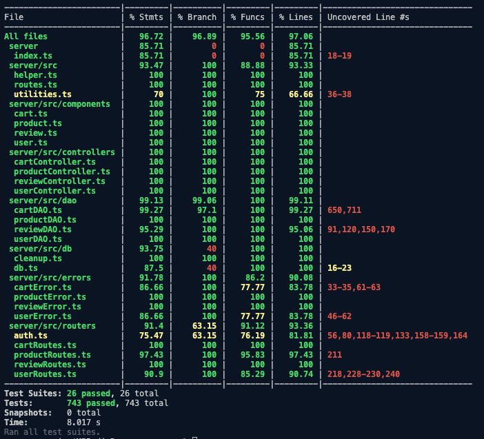

# Test Report

<The goal of this document is to explain how the application was tested, detailing how the test cases were defined and what they cover>

# Contents

- [Test Report](#test-report)
- [Contents](#contents)
- [Dependency graph](#dependency-graph)
- [Integration approach](#integration-approach)
  - [Sequenza di Integrazione](#sequenza-di-integrazione)
  - [Descrizione dell'Approccio di Integrazione per EZElectronics](#descrizione-dellapproccio-di-integrazione-per-ezelectronics)
- [Tests](#tests)
  - [User](#user)
    - [UserDAO](#userdao)
  - [Product](#product)
    - [ProductDAO](#productdao)
      - [Unit](#unit)
      - [Integration](#integration)
    - [Product Controller](#product-controller)
      - [Unit](#unit-1)
      - [Integration](#integration-1)
    - [Product Routes](#product-routes)
      - [Unit](#unit-2)
      - [Integration](#integration-2)
  - [Cart](#cart)
    - [CartDAO](#cartdao)
    - [CartController](#cartcontroller)
    - [CartRoute](#cartroute)
  - [Review](#review)
    - [ReviewDAO](#reviewdao)
      - [Unit](#unit-3)
      - [Integration](#integration-3)
    - [ReviewController](#reviewcontroller)
    - [ReviewRoute](#reviewroute)
- [Coverage](#coverage)
  - [Coverage of FR](#coverage-of-fr)
  - [Coverage white box](#coverage-white-box)

# Dependency graph

# Integration approach
## Sequenza di Integrazione

1. **Test dell'Unità**

   - **Step 1:** Test dell'Unità A (Gestione Prodotti)
   - **Step 2:** Test dell'Unità B (Gestione Clienti)
   - **Step 3:** Test dell'Unità C (Elaborazione Ordini)
   - **Step 4:** Test dell'Unità D (Gestione Recensioni)
   - **Step 5:** Test dell'Unità E (Gestione Amministratori)

2. **Integrazione Incrementale**

   - **Step 6:** Integrazione e test delle Unità A e B (Gestione Prodotti + Gestione Clienti)
   - **Step 7:** Integrazione e test delle Unità A, B e C (Gestione Prodotti + Gestione Clienti + Elaborazione Ordini)
   - **Step 8:** Integrazione e test delle Unità A, B, C e D (Gestione Prodotti + Gestione Clienti + Elaborazione Ordini + Gestione Recensioni)
   - **Step 9:** Integrazione e test delle Unità A, B, C, D e E (Gestione Prodotti + Gestione Clienti + Elaborazione Ordini + Gestione Recensioni + Gestione Amministratori)

3. **Test dell'API**
   - **Step 10:** Eseguire un test completo dell'API, concentrandosi sulle route per garantire che tutti gli endpoint dell'API funzionino correttamente e come previsto.

## Descrizione dell'Approccio di Integrazione per EZElectronics

Lo sviluppo e l'integrazione dell'applicazione EZElectronics hanno coinvolto diversi passaggi critici per garantire che tutti i componenti funzionino senza problemi insieme. L'approccio di integrazione mista ha facilitato sia il test isolato delle singole unità (Unit test) che la loro integrazione progressiva in un sistema completamente funzionante (Integration test).

1. **Test dell'Unità:**

   - **Unità A (Gestione Prodotti):** Funzionalità testate per valutare, registrare e gestire i prodotti.
   - **Unità B (Gestione Clienti):** Funzionalità testate per la creazione, il login e la gestione degli account cliente.
   - **Unità C (Elaborazione Ordini):** Funzionalità testate per la gestione dei carrelli della spesa, l'elaborazione degli ordini e la conferma degli acquisti.
   - **Unità D (Gestione Recensioni):** Funzionalità testate per consentire ai clienti di lasciare e visualizzare recensioni sui prodotti.
   - **Unità E (Gestione Amministratori):** Funzionalità testate per la valutazione dello stato del sistema e la gestione dei dati da parte degli amministratori.

2. **Integrazione Incrementale:**

   - Le unità sono state integrate in modo incrementale per garantire che ogni componente aggiunto funzionasse correttamente con il sistema esistente. Questo metodo ha aiutato a identificare e risolvere i problemi di integrazione in ogni fase, semplificando il debug e migliorando la stabilità del sistema.
   - **Passaggi di Integrazione:**
     - Prima, le unità di gestione dei prodotti e dei clienti sono state integrate e testate insieme.
     - Successivamente, l'unità di elaborazione degli ordini è stata aggiunta e testata in combinazione con le unità di gestione dei prodotti e dei clienti.
     - L'unità di gestione delle recensioni è stata integrata in seguito, garantendo che i clienti potessero lasciare e visualizzare recensioni mentre gestivano i loro prodotti e ordini.
     - Infine, l'unità di gestione degli amministratori è stata integrata, consentendo agli amministratori di gestire il sistema e i dati in modo completo.

3. **Test dell'API:**
   - L'ultimo passaggio ha coinvolto un test approfondito degli endpoint dell'API definiti in route.js. Questo passaggio ha garantito che tutte le funzionalità esposte tramite l'API fossero accessibili e funzionassero come previsto.
   - I test completi dell'API hanno verificato che l'applicazione client potesse interagire senza problemi con il server, soddisfacendo tutte le funzionalità richieste.

# Tests

## User

### UserDAO

This table describes the tests that provide reports for the UserDAO class

|                                 Test case name                                  |             Object(s) tested             | Test level  |    Technique used     |
| :-----------------------------------------------------------------------------: | :--------------------------------------: | :---------: | :-------------------: |
|                            createUser resolves true                             |       createUser method of UserDAO       |    Unit     | WB/statement coverage |
|          getIsUserAuthenticated returns false for unauthenticated user          | getIsUserAuthenticated method of UserDAO |    Unit     | WB/statement coverage |
|                getIsUserAuthenticated rejects on database error                 | getIsUserAuthenticated method of UserDAO |    Unit     | WB/statement coverage |
|                    createUser throws UserAlreadyExistsError                     |       createUser method of UserDAO       |    Unit     | WB/statement coverage |
|                           createUser raises an error                            |       createUser method of UserDAO       |    Unit     | WB/statement coverage |
|                   getUserByUsername returns user by username                    |   getUserByUsername method of UserDAO    |    Unit     | WB/statement coverage |
|                   getUserByUsername throws UserNotFoundError                    |   getUserByUsername method of UserDAO    |    Unit     | WB/statement coverage |
|                        getUserByUsername raises an error                        |   getUserByUsername method of UserDAO    |    Unit     | WB/statement coverage |
|       getUserByUsername throws InvalidParametersError for empty username        |   getUserByUsername method of UserDAO    |    Unit     | WB/statement coverage |
|                          getUsers resolves with users                           |        getUsers method of UserDAO        |    Unit     | WB/statement coverage |
|                       getUsers rejects on database error                        |        getUsers method of UserDAO        |    Unit     | WB/statement coverage |
|                     getUsersByRole throws UserNotFoundError                     |     getUsersByRole method of UserDAO     |    Unit     | WB/statement coverage |
|                    getUsersByRole rejects on database error                     |     getUsersByRole method of UserDAO     |    Unit     | WB/statement coverage |
|                      getUsersByRole returns users by role                       |     getUsersByRole method of UserDAO     |    Unit     | WB/statement coverage |
|                       deleteUser rejects in get function                        |       deleteUser method of UserDAO       |    Unit     | WB/statement coverage |
|                       deleteUser rejects in run function                        |       deleteUser method of UserDAO       |    Unit     | WB/statement coverage |
|                      deleteUser deletes user successfully                       |       deleteUser method of UserDAO       |    Unit     | WB/statement coverage |
|                       deleteUser throws UserNotFoundError                       |       deleteUser method of UserDAO       |    Unit     | WB/statement coverage |
|                    deleteUserAsAdmin rejects in get function                    |   deleteUserAsAdmin method of UserDAO    |    Unit     | WB/statement coverage |
|                       deleteUserAsAdmin not find anything                       |   deleteUserAsAdmin method of UserDAO    |    Unit     | WB/statement coverage |
|                        deleteUserAsAdmin raises an error                        |   deleteUserAsAdmin method of UserDAO    |    Unit     | WB/statement coverage |
|                    deleteUserAsAdmin rejects in run function                    |   deleteUserAsAdmin method of UserDAO    |    Unit     | WB/statement coverage |
|                   deleteUserAsAdmin deletes user successfully                   |   deleteUserAsAdmin method of UserDAO    |    Unit     | WB/statement coverage |
|                    deleteUserAsAdmin throws UserIsAdminError                    |   deleteUserAsAdmin method of UserDAO    |    Unit     | WB/statement coverage |
|                         deleteAllUsers raises an error                          |     deleteAllUsers method of UserDAO     |    Unit     | WB/statement coverage |
|                  deleteAllUsers deletes all users successfully                  |     deleteAllUsers method of UserDAO     |    Unit     | WB/statement coverage |
|                     deleteAllUsers throws UserNotFoundError                     |     deleteAllUsers method of UserDAO     |    Unit     | WB/statement coverage |
|                      updateUser updates user successfully                       |       updateUser method of UserDAO       |    Unit     | WB/statement coverage |
|                           updateUser raises an error                            |       updateUser method of UserDAO       |    Unit     | WB/statement coverage |
|                       updateUser rejects in get function                        |       updateUser method of UserDAO       |    Unit     | WB/statement coverage |
|                       updateUser rejects in run function                        |       updateUser method of UserDAO       |    Unit     | WB/statement coverage |
|                       updateUser throws UserNotFoundError                       |       updateUser method of UserDAO       |    Unit     | WB/statement coverage |
|                       updateUserAsAdmin not find any user                       |   updateUserAsAdmin method of UserDAO    |    Unit     | WB/statement coverage |
|             updateUserAsAdmin not find any user who is not an admin             |   updateUserAsAdmin method of UserDAO    |    Unit     | WB/statement coverage |
|                     updateUserAsAdmin get-function rejects                      |   updateUserAsAdmin method of UserDAO    |    Unit     | WB/statement coverage |
|                     updateUserAsAdmin run-function rejects                      |   updateUserAsAdmin method of UserDAO    |    Unit     | WB/statement coverage |
|                        updateUserAsAdmin raises an error                        |   updateUserAsAdmin method of UserDAO    |    Unit     | WB/statement coverage |
|                   updateUserAsAdmin updates user successfully                   |   updateUserAsAdmin method of UserDAO    |    Unit     | WB/statement coverage |
|           createUser should insert a user customer into the database            |           `UserDAO.createUser`           | Integration |        Mocking        |
|      createUser should throw UserAlreadyExistsError for duplicate username      |           `UserDAO.createUser`           | Integration |    Error handling     |
|        getIsUserAuthenticated should return true for correct credentials        |     `UserDAO.getIsUserAuthenticated`     | Integration |        Mocking        |
|        getIsUserAuthenticated should return false for incorrect password        |     `UserDAO.getIsUserAuthenticated`     | Integration |        Mocking        |
|           getUserByUsername should retrieve a user from the database            |       `UserDAO.getUserByUsername`        | Integration |        Mocking        |
|     getUserByUsername should throw UserNotFoundError for non-existing user      |       `UserDAO.getUserByUsername`        | Integration |    Error handling     |
|              getUsers should retrieve all users from the database               |            `UserDAO.getUsers`            | Integration |        Mocking        |
| getUsersByRole should retrieve all users with a specific role from the database |         `UserDAO.getUsersByRole`         | Integration |        Mocking        |
|                deleteUser should remove a user from the database                |           `UserDAO.deleteUser`           | Integration |        Mocking        |
|         deleteUser should throw UserNotFoundError for non-existing user         |           `UserDAO.deleteUser`           | Integration |    Error handling     |
|      deleteUserAsAdmin should remove a user from the database as an admin       |       `UserDAO.deleteUserAsAdmin`        | Integration |        Mocking        |
|  deleteUserAsAdmin should throw UserIsAdminError if trying to delete an admin   |       `UserDAO.deleteUserAsAdmin`        | Integration |    Error handling     |
|              updateUser should update user details in the database              |           `UserDAO.updateUser`           | Integration |        Mocking        |
|         updateUser should throw UserNotFoundError for non-existing user         |           `UserDAO.updateUser`           | Integration |    Error handling     |
|            updateUserAsAdmin should update user details as an admin             |       `UserDAO.updateUserAsAdmin`        | Integration |        Mocking        |
|  updateUserAsAdmin should throw UserIsAdminError if trying to update an admin   |       `UserDAO.updateUserAsAdmin`        | Integration |    Error handling     |

This table describes the tests that provide reports for the UserController class

|                                    Test case name                                     |            Object(s) tested            | Test level  |                Technique used                 |
| :-----------------------------------------------------------------------------------: | :------------------------------------: | :---------: | :-------------------------------------------: |
|                                  Should return true                                   |              `createUser`              |    Unit     |                    Mocking                    |
|                          Should throw InvalidParametersError                          |              `createUser`              |    Unit     |                Error handling                 |
|                 Should throw InvalidParametersError for empty surname                 |              `createUser`              |    Unit     |                Error handling                 |
|                             Should throw InvalidRoleError                             |              `createUser`              |    Unit     |                Error handling                 |
|                                Should return all users                                |               `getUsers`               |    Unit     |                    Mocking                    |
|                          Should throw InvalidParametersError                          |          `getUserByUsername`           |    Unit     |                Error handling                 |
|                          Should throw UnauthorizedUserError                           |          `getUserByUsername`           |    Unit     |                Error handling                 |
|                           Should return a user by username                            |          `getUserByUsername`           |    Unit     |                    Mocking                    |
|                     Should return all users with a specific role                      |            `getUsersByRole`            |    Unit     |                    Mocking                    |
|                             Should throw InvalidRoleError                             |            `getUsersByRole`            |    Unit     |                Error handling                 |
|                          Should throw UnauthorizedUserError                           |              `deleteUser`              |    Unit     |                Error handling                 |
|                                 Should delete a user                                  |              `deleteUser`              |    Unit     |                    Mocking                    |
|                             Should delete a user as admin                             |              `deleteUser`              |    Unit     |                    Mocking                    |
|                 Should throw InvalidParametersError if user not found                 |              `deleteUser`              |    Unit     |                Error handling                 |
|                                Should delete all users                                |            `deleteAllUsers`            |    Unit     |                    Mocking                    |
|                          Should update a user's information                           |            `updateUserInfo`            |    Unit     |                    Mocking                    |
|                 Should throw InvalidParametersError for invalid name                  |            `updateUserInfo`            |    Unit     |                Error handling                 |
|                             Should throw ArrivalDateError                             |            `updateUserInfo`            |    Unit     |                Error handling                 |
|                      Should update a user's information as admin                      |            `updateUserInfo`            |    Unit     |                    Mocking                    |
|                          Should throw UnauthorizedUserError                           |            `updateUserInfo`            |    Unit     |                Error handling                 |
|              Should throw InvalidParametersError for invalid parameters               |            `updateUserInfo`            |    Unit     |                Error handling                 |
|                    createUser should create a user in the database                    |           UserController, db           | Integration |        CRUD operation, Data validation        |
|           createUser should throw an error if the username is already taken           | UserController, UserAlreadyExistsError | Integration |     Exception handling, Negative testing      |
|                          getUsers should retrieve all users                           |           UserController, db           | Integration |        CRUD operation, Data validation        |
|             getUsersByRole should retrieve all users with a specific role             |   UserController, db, Role.CUSTOMER    | Integration |        CRUD operation, Data filtering         |
|             getUsersByRole should throw an error if the role is not valid             |    UserController, InvalidRoleError    | Integration |     Exception handling, Negative testing      |
|                   getUserByUsername should retrieve a specific user                   |        UserController, db, User        | Integration |        CRUD operation, Data retrieval         |
|    getUserByUsername should throw InvalidParametersError if parameters are invalid    | UserController, InvalidParametersError | Integration |     Exception handling, Negative testing      |
|    getUserByUsername should throw UnauthorizedUserError if user is not authorized     | UserController, UnauthorizedUserError  | Integration |     Exception handling, Negative testing      |
|                       deleteUser should delete a specific user                        |        UserController, db, User        | Integration |         CRUD operation, Data deletion         |
|       deleteUser should throw InvalidParametersError if parameters are invalid        | UserController, InvalidParametersError | Integration |     Exception handling, Negative testing      |
|        deleteUser should throw UnauthorizedUserError if user is not authorized        | UserController, UnauthorizedUserError  | Integration |     Exception handling, Negative testing      |
|                   deleteAllUsers should delete all non-Admin users                    |  UserController, db, User, Role.ADMIN  | Integration | CRUD operation, Data deletion, Data filtering |
|            updateUserInfo should update the information of a specific user            |        UserController, db, User        | Integration |          CRUD operation, Data update          |
| updateUserInfo should throw InvalidParametersError if parameters are missing or empty | UserController, InvalidParametersError | Integration |     Exception handling, Negative testing      |
|      updateUserInfo should throw UnauthorizedUserError if user is not authorized      | UserController, UnauthorizedUserError  | Integration |     Exception handling, Negative testing      |

This table describes the tests that provide reports for the UserRoute class

|                          Test case name                           |                Object(s) tested                | Test level  |          Technique used          |
| :---------------------------------------------------------------: | :--------------------------------------------: | :---------: | :------------------------------: |
|                It should return a 200 success code                |                 `POST /users`                  |    Unit     |             Mocking              |
|   It should return a InvalidParametersError for missing fields    |                 `POST /users`                  |    Unit     |          Error handling          |
|   It should return UserAlreadyExistsError for existing username   |                 `POST /users`                  |    Unit     |      Mocking/Error handling      |
|                     It should raise an error                      |                  `GET /users`                  |    Unit     |      Mocking/Error handling      |
|                It should return an array of users                 |                  `GET /users`                  |    Unit     |             Mocking              |
|    It should return a 401 error code without admin privileges     |                  `GET /users`                  |    Unit     |          Error handling          |
|                     It should raise an error                      |          `GET /users/roles/Customer`           |    Unit     |      Mocking/Error handling      |
|            It should return an array of users by role             |          `GET /users/roles/Customer`           |    Unit     |             Mocking              |
|                     It should raise an error                      |               `GET /users/user`                |    Unit     |      Mocking/Error handling      |
|                It should return a user by username                |               `GET /users/user`                |    Unit     |             Mocking              |
|      It should return a 200 success code for deleting a user      |              `DELETE /users/user`              |    Unit     |             Mocking              |
| It should return a 503 error code for deleting a user with error  |              `DELETE /users/user`              |    Unit     |      Mocking/Error handling      |
|               It should work for deleting all users               |                `DELETE /users`                 |    Unit     |             Mocking              |
|       It should not work for deleting all users with error        |                `DELETE /users`                 |    Unit     |      Mocking/Error handling      |
| It should return a 200 success code for updating user information |              `PATCH /users/user`               |    Unit     |             Mocking              |
|    It should return a 401 error code without admin privileges     |              `PATCH /users/user`               |    Unit     |          Error handling          |
|          It should return a 503 error code with an error          |              `PATCH /users/user`               |    Unit     |      Mocking/Error handling      |
|       It should return a 404 error code for missing fields        |              `PATCH /users/user`               |    Unit     |      Mocking/Error handling      |
|        It should return a 400 error code for invalid role         |              `PATCH /users/user`               |    Unit     |      Mocking/Error handling      |
|              Integration test for createUser routes               |   `userCustomer`, `userManager`, `userAdmin`   | Integration | HTTP request/response validation |
|               Integration test for getUsers routes                |   `userCustomer`, `userManager`, `userAdmin`   | Integration | HTTP request/response validation |
|           Integration test for getUserByUsername routes           |                 `userCustomer`                 | Integration | HTTP request/response validation |
|              Integration test for deleteUser routes               |          `userCustomer`, `userAdmin`           | Integration | HTTP request/response validation |
|              Integration test for updateUser routes               |                 `userCustomer`                 | Integration | HTTP request/response validation |
|           It should return 200 for creating a Customer            |                 `userCustomer`                 | Integration | Function return value validation |
|              It should return 422 for missing fields              |                      N/A                       | Integration |  Function parameter validation   |
|               It should return 422 for invalid role               |        `userCustomer` with invalid role        | Integration |  Function parameter validation   |
|            It should return 401 for non-existent user             | `getUserByUsername` with non-existent username | Integration |  Function parameter validation   |
|         It should return 200 and delete user by username          |        `deleteUser` with existing user         | Integration | Function side-effect validation  |
|            It should return 404 for non-existent user             |    `deleteUser` with non-existent username     | Integration |  Function parameter validation   |
|             It should return 200 and update user info             |        `updateUser` with existing user         | Integration | Function side-effect validation  |
|         It should return 422 for missing fields in update         |        `updateUser` with missing fields        | Integration |  Function parameter validation   |
|       It should return 404 for non-existent user in update        |    `updateUser` with non-existent username     | Integration |  Function parameter validation   |

## Product

### ProductDAO

These tables describe the tests that provide reports for the ProductDAO class

#### Unit

| Test case name                                                                                               |       Object(s) tested       | Test level |    Technique used     |
| ------------------------------------------------------------------------------------------------------------ | :--------------------------: | :--------: | :-------------------: |
| It should register a product                                                                                 |    registerProduct method    |    Unit    | WB/statement coverage |
| It should throw an error if product already exists                                                           |              "               |     "      |           "           |
| It should register a product without details                                                                 |              "               |     "      |           "           |
| It should register a prodcut without arrival date                                                            |              "               |     "      |           "           |
| It should throw an error if database fails                                                                   |              "               |     "      |           "           |
| It should throw an error if an error is thrown in the try block                                              |              "               |     "      |           "           |
| It should change the product quantity                                                                        | changeProductQuantity method |    Unit    | WB/statement coverage |
| It should change the product quantity if the changeDate is not specified                                     |              "               |     "      |           "           |
| It should throw an error if product not found                                                                |              "               |     "      |           "           |
| It should throw an error if change date is before the arrival date                                           |              "               |     "      |           "           |
| It should throw an error if change date is after the current date                                            |              "               |     "      |           "           |
| It should throw an error if the database fails to recover the requested model                                |              "               |     "      |           "           |
| It should throw an error if the database fails to update the product quantity                                |              "               |     "      |           "           |
| It should throw an error if an error is thrown in the try block                                              |              "               |     "      |           "           |
| It should sell a product                                                                                     |      sellProduct method      |    Unit    | WB/statement coverage |
| It should sell a product if the sellingDate is not specified                                                 |              "               |     "      |           "           |
| It should throw an error if product not found                                                                |              "               |     "      |           "           |
| It should throw an error if the product stock is already 0                                                   |              "               |     "      |           "           |
| It should throw an error if the quantity to sell is greater than the stock                                   |              "               |     "      |           "           |
| It should throw an error if sell date is before the arrival date                                             |              "               |     "      |           "           |
| It should throw an error if sell date is after the current date                                              |              "               |     "      |           "           |
| It should throw an error if the database fails to recover the requested model                                |              "               |     "      |           "           |
| It should throw an error if the database fails to update the product quantity                                |              "               |     "      |           "           |
| It should throw an error if an error is thrown in the try block                                              |              "               |     "      |           "           |
| It should get all products in the database if the three parameters are null                                  |      getProducts method      |    Unit    | WB/statement coverage |
| It should get all products in the database if the grouping is 'category' and the category is valid           |              "               |     "      |           "           |
| It should get all products in the database if the grouping is 'model' and the model is valid                 |              "               |     "      |           "           |
| It should throw a FiltersError if grouping is null and category or model is provided                         |              "               |     "      |           "           |
| It should throw a FiltersError if grouping is 'category' and category is not provided or model is provided   |              "               |     "      |           "           |
| It should throw a FiltersError if grouping is 'model' and model is not provided or category is provided      |              "               |     "      |           "           |
| It should throw a FiltersError if grouping is not 'category', 'model', null, or undefined                    |              "               |     "      |           "           |
| It should throw a ProductNotFoundError if no product is found for the given model                            |              "               |     "      |           "           |
| It should throw an Error if the database fails to get the products (get method)                              |              "               |     "      |           "           |
| It should throw an Error if the database fails to get the products (all method)                              |              "               |     "      |           "           |
| It should throw an Error if an error is thrown in the try block                                              |              "               |     "      |           "           |
| It should get all available products in the database if the three parameters are null                        | getAvailableProducts method  |    Unit    | WB/statement coverage |
| It should get all available products in the database if the grouping is 'category' and the category is valid |              "               |     "      |           "           |
| It should get the available product in the database if the grouping is 'model' and the model is valid        |              "               |     "      |           "           |
| It should throw a FiltersError if grouping is null and category or model is provided                         |              "               |     "      |           "           |
| It should throw a FiltersError if grouping is 'category' and category is not provided or model is provided   |              "               |     "      |           "           |
| It should throw a FiltersError if grouping is 'model' and model is not provided or category is provided      |              "               |     "      |           "           |
| It should throw a FiltersError if grouping is not 'category', 'model', null, or undefined                    |              "               |     "      |           "           |
| It should throw a ProductNotFoundError if no product is found for the given model                            |              "               |     "      |           "           |
| It should throw an Error if the database fails to get the products (get method)                              |              "               |     "      |           "           |
| It should throw an Error if the database fails to get the products (all method)                              |              "               |     "      |           "           |
| It should throw an Error if an error is thrown in the try block                                              |              "               |     "      |           "           |
| It should throw an EmptyProductStockError if the requested model is out of stock                             |              "               |     "      |           "           |
| It should delete all products                                                                                |   deleteAllProducts method   |    Unit    | WB/statement coverage |
| It should throw an Error if the database fails to delete the products                                        |              "               |     "      |           "           |
| It should throw an Error if an error is thrown in the try block                                              |              "               |     "      |           "           |
| It should delete the product if the model is valid                                                           |     deleteProduct method     |    Unit    | WB/statement coverage |
| It should throw a ProductNotFoundError if the model is not found                                             |              "               |     "      |           "           |
| It should throw an Error if the database fails to get the product                                            |              "               |     "      |           "           |
| It should throw an Error if the database fails to delete the product                                         |              "               |     "      |           "           |
| It should throw an Error if an error is thrown in the try block                                              |              "               |     "      |           "           |

#### Integration

| Test case name                                                                                                            |         Object(s) tested          | Test level  |    Technique used     |
| ------------------------------------------------------------------------------------------------------------------------- | :-------------------------------: | :---------: | :-------------------: |
| registerProducts should insert a product into the database                                                                |   registerProducts method / db    | Integration | WB/statement coverage |
| registerProducts should insert a product into the database if detatails are not provided                                  |                 "                 |      "      |           "           |
| registerProducts should insert a product into the database if arrivalDate is not provided                                 |                 "                 |      "      |           "           |
| registerProducts should throw ProductAlreadyExistsError error if the product already exists                               |                 "                 |      "      |           "           |
| changeProductQuantity should update the quantity of a product in the database                                             | changeProductQuantity method / db | Integration | WB/statement coverage |
| changeProductQuantity should update the quantity of a product in the database and update arrivalDate                      |                 "                 |      "      |           "           |
| changeProductQuantity should throw an error if the product does not exist                                                 |                 "                 |      "      |           "           |
| changeProductQuantity should throw an error if the changeDate is in the future                                            |                 "                 |      "      |           "           |
| changeProductQuantity should throw an error if changeDate is before arrivalDate                                           |                 "                 |      "      |           "           |
| sellProduct should update the quantity of a product in the database                                                       |      sellProduct method / db      | Integration | WB/statement coverage |
| sellProduct should update the quantity of a product in the database with sellDate set to the current date if not provided |                 "                 |      "      |           "           |
| sellProduct should throw an error if the product does not exist                                                           |                 "                 |      "      |           "           |
| sellProduct should throw an error if the sellDate is in the future                                                        |                 "                 |      "      |           "           |
| sellProduct should throw an error if sellDate is before arrivalDate                                                       |                 "                 |      "      |           "           |
| sellProduct should throw an error if the quantity in stock is zero                                                        |                 "                 |      "      |           "           |
| sellProduct should throw an error if the quantity to sell is greater than the quantity in stock                           |                 "                 |      "      |           "           |
| getProduct should return the product from the database                                                                    |      getProducts method / db      | Integration | WB/statement coverage |
| getProduct should return the product from the database filtered by model                                                  |                 "                 |      "      |           "           |
| getProduct should return the product from the database filtered by category                                               |                 "                 |      "      |           "           |
| getProduct should throw an error if grouping is not a valid field                                                         |                 "                 |      "      |           "           |
| getProduct should throw an error if the grouping is set to model but a model is not provided                              |                 "                 |      "      |           "           |
| getProduct should throw an error if the grouping is set to category but a category is not provided                        |                 "                 |      "      |           "           |
| getProduct should throw an error if both model and category are provided                                                  |                 "                 |      "      |           "           |
| getProduct should throw an error if the category does not exist                                                           |                 "                 |      "      |           "           |
| getProduct should throw an error if the model does not exist                                                              |                 "                 |      "      |           "           |
| getAvailableProduct should return the product with quantity is > 0 from the database                                      | getAvailableProducts method / db  | Integration | WB/statement coverage |
| getAvailableProduct should return the product from the database filtered by model                                         |                 "                 |      "      |           "           |
| getAvailableProduct should return the product from the database filtered by category                                      |                 "                 |      "      |           "           |
| getAvailableProduct should return an empty array if no model is available                                                 |                 "                 |      "      |           "           |
| getAvailableProduct should return an empty array if no model is available for the specified category                      |                 "                 |      "      |           "           |
| getAvailableProduct should throw an error if the model requested is not available                                         |                 "                 |      "      |           "           |
| getAvailableProduct should throw an error if grouping is not a valid field                                                |                 "                 |      "      |           "           |
| getAvailableProduct should throw an error if the grouping is set to model but a model is not provided                     |                 "                 |      "      |           "           |
| getAvailableProduct should throw an error if the grouping is set to category but a category is not provided               |                 "                 |      "      |           "           |
| getAvailableProduct should throw an error if both model and category are provided                                         |                 "                 |      "      |           "           |
| getAvailableProduct should throw an error if the category does not exist                                                  |                 "                 |      "      |           "           |
| getAvailableProduct should throw an error if the model does not exist                                                     |                 "                 |      "      |           "           |
| deleteAllProducts should delete all products from the database                                                            |   deleteAllProducts method / db   | Integration | WB/statement coverage |
| deleteAllProducts should delete all products from the database even if there are no products                              |                 "                 |      "      |           "           |
| deleteProduct should delete a product from the database                                                                   |     deleteProduct method / db     | Integration | WB/statement coverage |
| deleteProduct should throw an error if the product does not exist                                                         |                 "                 |      "      |           "           |
| deleteProduct should throw an error if the model is not provided                                                          |                 "                 |      "      |           "           |

### Product Controller

These tables describe the tests that provide reports for the ProductController class

#### Unit

| Test case name                                                                                                             |       Object(s) tested       | Test level |    Technique used     |
| -------------------------------------------------------------------------------------------------------------------------- | :--------------------------: | :--------: | :-------------------: |
| It should register a product                                                                                               |   registerProducts method    |    Unit    | WB/statement coverage |
| It should register a product if the details are not provided                                                               |              "               |     "      |           "           |
| It should register a product if the arrivalDate is not provided                                                            |              "               |     "      |           "           |
| It should throw InvalidParametersError when category is not a string or is not one of the allowed categories               |              "               |     "      |           "           |
| It should throw InvalidParametersError when quantity is not a number or is not an integer or is less than or equal to 0    |              "               |     "      |           "           |
| It should throw InvalidParametersError when details is not a string or is undefined                                        |              "               |     "      |           "           |
| It should throw InvalidParametersError when sellingPrice is not a number or is less than or equal to 0                     |              "               |     "      |           "           |
| It should throw InvalidParametersError when arrivalDate is not in 'YYYY-MM-DD' format or is not a date                     |              "               |     "      |           "           |
| It should throw ArrivalDateError when arrivalDate is in the future                                                         |              "               |     "      |           "           |
| It should change the quantity of a product                                                                                 | changeProductQuantity method |     "      | WB/statement coverage |
| It should change the quantity of a product if the changeDate is not provided                                               |              "               |     "      |           "           |
| It should throw InvalidParametersError when model is not a string or is empty                                              |              "               |     "      |           "           |
| It should throw InvalidParametersError when newQuantity is not a number or is not an integer or is less than or equal to 0 |              "               |     "      |           "           |
| It should throw InvalidParametersError when changeDate is not a string                                                     |              "               |     "      |           "           |
| It should throw InvalidParametersError when changeDate is not in 'YYYY-MM-DD' format or is not a date                      |              "               |     "      |           "           |
| It should throw ArrivalDateError when changeDate is in the future                                                          |              "               |     "      |           "           |
| It should sell a product                                                                                                   |      sellProduct method      |     "      | WB/statement coverage |
| It should sell a product if the sellingDate is not provided                                                                |              "               |     "      |           "           |
| It should throw InvalidParametersError when model is not a string or is empty                                              |              "               |     "      |           "           |
| It should throw InvalidParametersError when quantity is not a number or is not an integer or is less than or equal to 0    |              "               |     "      |           "           |
| It should throw InvalidParametersError when sellingDate is not in 'YYYY-MM-DD' format or is not a date                     |              "               |     "      |           "           |
| It should throw ArrivalDateError when sellingDate is in the future                                                         |              "               |     "      |           "           |
| It should get all products                                                                                                 |      getProducts method      |     "      | WB/statement coverage |
| It should get all products filtered by category                                                                            |              "               |     "      |           "           |
| It should throw FiltersError when category is not one of the allowed values                                                |              "               |     "      |           "           |
| It should throw FiltersError when category is not provided                                                                 |              "               |     "      |           "           |
| It should get all products filtered by model                                                                               |              "               |     "      |           "           |
| It should throw FiltersError when model is not provided                                                                    |              "               |     "      |           "           |
| It should throw FiltersError when category is provided with model                                                          |              "               |     "      |           "           |
| It should throw FiltersError when model is empty                                                                           |              "               |     "      |           "           |
| It should throw FiltersError when model is not provided                                                                    |              "               |     "      |           "           |
| It should get all available products                                                                                       | getAvailableProducts method  |     "      | WB/statement coverage |
| It should get all available products grouped by category                                                                   |              "               |     "      |           "           |
| It should throw FiltersError when category is not one of the allowed values                                                |              "               |     "      |           "           |
| It should get all available products grouped by model                                                                      |              "               |     "      |           "           |
| It should throw FiltersError when model is not provided                                                                    |              "               |     "      |           "           |
| It should throw FiltersError when category is provided with model                                                          |              "               |     "      |           "           |
| It should throw FiltersError when model is empty                                                                           |              "               |     "      |           "           |
| It should throw FiltersError when model is not provided                                                                    |              "               |     "      |           "           |
| It should delete all products                                                                                              |   deleteAllProducts method   |     "      | WB/statement coverage |
| It should delete a product                                                                                                 |     deleteProduct method     |     "      | WB/statement coverage |
| It should throw InvalidParametersError when model is not a string or is empty                                              |              "               |     "      |           "           |

#### Integration

| Test case name                                                                                                        |                                  Object(s) tested                                   | Test level  |    Technique used     |
| --------------------------------------------------------------------------------------------------------------------- | :---------------------------------------------------------------------------------: | :---------: | :-------------------: |
| registerProducts should register a new product in the database                                                        |       registerProducts' Controller merhod / registerProducts' DAO method / db       | Integration | WB/statement coverage |
| registerProducts should throw an error if one of the required parameters is not provided or is of the wrong type      |                                          "                                          |      "      |           "           |
| registerProducts should throw an error if the arrival date is in the future                                           |                                          "                                          |      "      |           "           |
| registerProducts should throw an error if the product already exists in the database                                  |                                          "                                          |      "      |           "           |
| changeProductQuantity should increase the quantity of a product                                                       | changeProductQuantity's Controller merhod / changeProductQuantity's DAO method / db | Integration | WB/statement coverage |
| changeProductQuantity should throw an error if one of the required parameters is not provided or is of the wrong type |                                          "                                          |      "      |           "           |
| changeProductQuantity should throw an error if the change date is in the future                                       |                                          "                                          |      "      |           "           |
| changeProductQuantity should throw an error if the product does not exist in the database                             |                                          "                                          |      "      |           "           |
| sellProduct should decrease the quantity of a product                                                                 |           sellProduct's Controller merhod / sellProduct's DAO method / db           | Integration | WB/statement coverage |
| sellProduct should throw an error if one of the required parameters is not provided or is of the wrong type           |                                          "                                          |      "      |           "           |
| sellProduct should throw an error if the selling date is in the future                                                |                                          "                                          |      "      |           "           |
| sellProduct should throw an error if the product does not exist in the database                                       |                                          "                                          |      "      |           "           |
| sellProduct should throw an error if the product is out of stock                                                      |                                          "                                          |      "      |           "           |
| sellProduct should throw an error if the product has low stock                                                        |                                          "                                          |      "      |           "           |
| getProducts should return all products in the database                                                                |           getProducts's Controller merhod / getProducts's DAO method / db           | Integration | WB/statement coverage |
| getProducts should throw an error if the filters are invalid                                                          |                                          "                                          |      "      |           "           |
| getAvailableProducts should return all available products in the database                                             |  getAvailableProducts's Controller merhod / getAvailableProducts's DAO method / db  | Integration | WB/statement coverage |
| getAvailableProducts should throw an error if the filters are invalid                                                 |                                          "                                          |      "      |           "           |
| deleteAllProducts should delete all products in the database                                                          |     deleteAllProducts's Controller merhod / deleteAllProducts's DAO method / db     | Integration | WB/statement coverage |
| deleteProduct should delete a product in the database                                                                 |         deleteProduct's Controller merhod / deleteProduct's DAO method / db         | Integration | WB/statement coverage |
| deleteProduct should throw an error if one of the required parameters is not provided or is of the wrong type         |                                          "                                          |      "      |           "           |
| deleteProduct should throw an error if the product does not exist in the database                                     |                                          "                                          |      "      |           "           |

### Product Routes

These tables describe the tests that provide reports for the ProductRoutes class

#### Unit

| Test case name                                                       |       Object(s) tested       | Test level |    Technique used     |
| -------------------------------------------------------------------- | :--------------------------: | :--------: | :-------------------: |
| It should return 200                                                 |       `POST product/`        |    Unit    | WB/statement coverage |
| It should return 422 if model is empty                               |              "               |     "      |           "           |
| It should return 422 if category is empty                            |              "               |     "      |           "           |
| It should return 422 if category's value is not valid                |              "               |     "      |           "           |
| It should return 422 if quantity is negative                         |              "               |     "      |           "           |
| It should return 422 if quantity is zero                             |              "               |     "      |           "           |
| It should return 422 if sellingPrice is negative                     |              "               |     "      |           "           |
| It should return 422 if sellingPrice is zero                         |              "               |     "      |           "           |
| It should return 200 if arrivalDate is not provided                  |              "               |     "      |           "           |
| It should return 400 if arrivalDate is in the future                 |              "               |     "      |           "           |
| It should return 409 if a model is already registered                |              "               |     "      |           "           |
| It should return 422 if arrivalDate is formatted incorrectly         |              "               |     "      |           "           |
| It should return 401 if the user is not an admin or manager          |              "               |     "      |           "           |
| It should return 200                                                 |    `PATCH product/:model`    |    Unit    | WB/statement coverage |
| It should return 404 if model is empty                               |              "               |     "      |           "           |
| It should return 404 if the model does not exist                     |              "               |     "      |           "           |
| It should return 422 if quantity is negative                         |              "               |     "      |           "           |
| It should return 422 if quantity is zero                             |              "               |     "      |           "           |
| It should return 422 if quantity is not an integer                   |              "               |     "      |           "           |
| It should return 422 if quantity is not provided                     |              "               |     "      |           "           |
| It should return 422 if changeDate is in the future                  |              "               |     "      |           "           |
| It should return 422 if changeDate is formatted incorrectly          |              "               |     "      |           "           |
| It should return 401 if the user is not an admin or manager          |              "               |     "      |           "           |
| It should return 200                                                 | `PATCH products/:model/sell` |    Unit    | WB/statement coverage |
| It should return 422 if model is empty                               |              "               |     "      |           "           |
| It should return 404 if the model does not exist                     |              "               |     "      |           "           |
| It should return 422 if quantity is negative                         |              "               |     "      |           "           |
| It should return 422 if quantity is zero                             |              "               |     "      |           "           |
| It should return 422 if quantity is not an integer                   |              "               |     "      |           "           |
| It should return 422 if quantity is not provided                     |              "               |     "      |           "           |
| It should return 409 if there are no more products to sell           |              "               |     "      |           "           |
| It should return 409 if there are less product units than requested  |              "               |     "      |           "           |
| It should return 422 if sellingDate is in the future                 |              "               |     "      |           "           |
| It should return 422 if sellingDate is formatted incorrectly         |              "               |     "      |           "           |
| It should return 401 if the user is not an admin or manager          |              "               |     "      |           "           |
| It should return 200                                                 |       `GET products/`        |    Unit    | WB/statement coverage |
| It should return 200 if grouping is category                         |              "               |     "      |           "           |
| It should return 200 if grouping is model                            |              "               |     "      |           "           |
| It should return 422 if grouping is invalid                          |              "               |     "      |           "           |
| It should return 422 if category is not valid                        |              "               |     "      |           "           |
| It should return 422 if grouping is null but category is not         |              "               |     "      |           "           |
| It should return 422 if grouping is null but model is not            |              "               |     "      |           "           |
| It should return 422 if category is empty                            |              "               |     "      |           "           |
| It should return 422 if model is empty                               |              "               |     "      |           "           |
| It should return 422 if grouping is category but a model is provided |              "               |     "      |           "           |
| It should return 422 if grouping is model but a category is provided |              "               |     "      |           "           |
| It should return 404 if the model does not exist                     |              "               |     "      |           "           |
| It should return 401 if the user is not an admin or manager          |              "               |     "      |           "           |
| It should return 200                                                 |   `GET products/available`   |    Unit    | WB/statement coverage |
| It should return 200 if grouping is category                         |              "               |     "      |           "           |
| It should return 200 if grouping is model                            |              "               |     "      |           "           |
| It should return 422 if grouping is invalid                          |              "               |     "      |           "           |
| It should return 422 if category is not valid                        |              "               |     "      |           "           |
| It should return 422 if grouping is null but category is not         |              "               |     "      |           "           |
| It should return 422 if grouping is null but model is not            |              "               |     "      |           "           |
| It should return 422 if category is empty                            |              "               |     "      |           "           |
| It should return 422 if model is empty                               |              "               |     "      |           "           |
| It should return 422 if grouping is category but a model is provided |              "               |     "      |           "           |
| It should return 422 if grouping is model but a category is provided |              "               |     "      |           "           |
| It should return 404 if the model does not exist                     |              "               |     "      |           "           |
| It should return 401 if the user is not an admin or manager          |              "               |     "      |           "           |
| It should return 200                                                 |      `DELETE products/`      |    Unit    | WB/statement coverage |
| It should return 404 if the model does not exist                     |              "               |     "      |           "           |
| It should return 401 if the user is not an admin or manager          |              "               |     "      |           "           |
| It should return 200                                                 |   `DELETE products/:model`   |    Unit    | WB/statement coverage |
| It should return 401 if the user is not an admin or manager          |              "               |     "      |           "           |

#### Integration

| Test case name                                                   |                                  Object(s) tested                                   | Test level  |  Technique used  |
| ---------------------------------------------------------------- | :---------------------------------------------------------------------------------: | :---------: | :--------------: |
| It should return 200                                             |        `POST product/` / Controller's and DAO's registerProducts method / db        | Integration | WB/line coverage |
| It should return 422 for bad model field                         |                                          "                                          |      "      |        "         |
| It should return 409 for model already exists                    |                                          "                                          |      "      |        "         |
| It should return 422 for bad category field                      |                                          "                                          |      "      |        "         |
| It should return 422 for bad quantity field                      |                                          "                                          |      "      |        "         |
| It should return 422 for bad details field                       |                                          "                                          |      "      |        "         |
| It should return 422 for bad sellingPrice field                  |                                          "                                          |      "      |        "         |
| It should return 422 for bad arrivalDate field                   |                                          "                                          |      "      |        "         |
| It should return 400 for arrivalDate in the future               |                                          "                                          |      "      |        "         |
| It should return 200                                             |  `PATCH product/:model` / Controller's and DAO's changeProductQuantity method / db  | Integration | WB/line coverage |
| It should return 404 for product not found                       |                                          "                                          |      "      |        "         |
| It should return 422 for bad quantity field                      |                                          "                                          |      "      |        "         |
| It should return 422 for bad changeDate field                    |                                          "                                          |      "      |        "         |
| It should return 400 for changeDate in the future                |                                          "                                          |      "      |        "         |
| It should return 400 for changeDate before arrivalDate           |                                          "                                          |      "      |        "         |
| It should return 200                                             |    `PATCH product/:model/sell` / Controller's and DAO's sellProduct method / db     | Integration | WB/line coverage |
| It should return 404 for product not found                       |                                          "                                          |      "      |        "         |
| It should return 409 for empty product stock                     |                                          "                                          |      "      |        "         |
| It should return 409 for low product stock                       |                                          "                                          |      "      |        "         |
| It should return 422 for bad quantity field                      |                                          "                                          |      "      |        "         |
| It should return 422 for bad sellingDate field                   |                                          "                                          |      "      |        "         |
| It should return 400 for sellingDate in the future               |                                          "                                          |      "      |        "         |
| It should return 400 for sellingDate before arrivalDate          |                                          "                                          |      "      |        "         |
| It should return 200                                             |          `GET /products` / Controller's and DAO's getProducts method / db           | Integration | WB/line coverage |
| It should return 200 with query parameters                       |                                          "                                          |      "      |        "         |
| It should return 422 for invalid query parameters                |                                          "                                          |      "      |        "         |
| It should return 200 even if there are no products               |                                          "                                          |      "      |        "         |
| It should return 404 for no products found with query parameters |                                          "                                          |      "      |        "         |
| It should return 200                                             | `GET /products/available` / Controller's and DAO's getAvailableProducts method / db | Integration | WB/line coverage |
| It should return 200 with query parameters                       |                                          "                                          |      "      |        "         |
| It should return 422 for invalid query parameters                |                                          "                                          |      "      |        "         |
| It should return 200 even if there are no products               |                                          "                                          |      "      |        "         |
| It should return 404 for no products found with query parameters |                                          "                                          |      "      |        "         |
| It should return 200                                             |    `DELETE /products/:model` / Controller's and DAO's deleteProduct method / db     | Integration | WB/line coverage |
| It should return 404 for product not found                       |                                          "                                          |      "      |        "         |
| It should return 200                                             |      `DELETE /products` / Controller's and DAO's deleteAllProducts method / db      | Integration | WB/line coverage |
| It should return 200 even if no models are in the db             |                                          "                                          |      "      |        "         |

## Cart

### CartDAO

This table describes the tests that provide reports for the Cart DAO class

|                                             Test case name                                              |        Object(s) tested         | Test level  |    Technique used     |
| :-----------------------------------------------------------------------------------------------------: | :-----------------------------: | :---------: | :-------------------: |
|                                         It should create a cart                                         |        createCart method        |    Unit     | WB/statement coverage |
|                     It should throw an error if a cart for the user already exists                      |        createCart method        |      "      |           "           |
|                               It should throw an error if GET query fails                               |        createCart method        |      "      |           "           |
|                               It should throw an error if RUN quey fails                                |        createCart method        |      "      |           "           |
|                     It should throw an error if an error is thrown in the try block                     |        createCart method        |      "      |           "           |
|                   It should return a cart with items if the cart exists and has items                   |  getActiveCartByUserId method   |    Unit     | WB/statement coverage |
|                It should return a cart without items if the cart exists but has no items                |  getActiveCartByUserId method   |      "      |           "           |
|                        It should return an empty cart if the cart does not exist                        |  getActiveCartByUserId method   |      "      |           "           |
|                               It should throw an error if database fails                                |  getActiveCartByUserId method   |      "      |           "           |
|                               It should throw an error if database fails                                |  getActiveCartByUserId method   |      "      |           "           |
|                     It should throw an error if an error is thrown in the try block                     |  getActiveCartByUserId method   |      "      |           "           |
|                          It should return true if the user has an active cart                           |    userHasActiveCart method     |    Unit     | WB/statement coverage |
|                     It should return false if the user does not have an active cart                     |    userHasActiveCart method     |      "      |           "           |
|                               It should throw an error if database fails                                |    userHasActiveCart method     |      "      |           "           |
|                     It should throw an error if an error is thrown in the try block                     |    userHasActiveCart method     |      "      |           "           |
|                      It should add a new product to the existing cart of the user                       |     addProductToCart method     |    Unit     | WB/statement coverage |
|                          It should add a new product to a new cart of the user                          |     addProductToCart method     |      "      |           "           |
|                      It should increment product quantity in the cart of the user                       |     addProductToCart method     |      "      |           "           |
|                     It should throw an error if the product is not in the database                      |     addProductToCart method     |      "      |           "           |
|                         It should throw an error if the product is out of stock                         |     addProductToCart method     |      "      |           "           |
|                It should throw an error if the database fails checking the product model                |     addProductToCart method     |      "      |           "           |
|          It should throw an error if the quantity of the product in the cart exceeds the stock          |     addProductToCart method     |      "      |           "           |
|                It should throw an error if the database fails checking the product price                |     addProductToCart method     |      "      |           "           |
|                   It should throw an error if the database fails creating a new cart                    |     addProductToCart method     |      "      |           "           |
|             It should throw an error if the database fails updating the newly created cart              |     addProductToCart method     |      "      |           "           |
|                   It should throw an error if the database fails creating a new Cart                    |     addProductToCart method     |      "      |           "           |
| It should throw an error if the database fails checking if the user has already the product in the cart |     addProductToCart method     |      "      |           "           |
|     It should throw an error if the database fails checking the quantity of the product in the cart     |     addProductToCart method     |      "      |           "           |
|     It should throw an error if the database fails updating the quantity of the product in the cart     |     addProductToCart method     |      "      |           "           |
|                       It should throw an error if the updateCartItem method fails                       |     addProductToCart method     |      "      |           "           |
|           It should throw an error if the database fails inserting the product into the cart            |     addProductToCart method     |      "      |           "           |
|                    It should throw an error if the database fails updating the cart                     |     addProductToCart method     |      "      |           "           |
|                     It should throw an error if the userHasActiveCart method fails                      |     addProductToCart method     |      "      |           "           |
|                     It should throw an error if an error is thrown in the try block                     |     addProductToCart method     |      "      |           "           |
|                          It should update the quantity of the product in cart                           |      updateCartItem method      |    Unit     | WB/statement coverage |
|                               It should throw an error if database fails                                |      updateCartItem method      |      "      |           "           |
|                            It should throw an error if an error in try block                            |      updateCartItem method      |      "      |           "           |
|                                 It should update the total of the cart                                  |     updateCartTotal method      |    Unit     | WB/statement coverage |
|                               It should throw an error if database fails                                |     updateCartTotal method      |      "      |           "           |
|                            It should throw an error if an error in try block                            |     updateCartTotal method      |      "      |           "           |
|                                 It should checkout the cart of the user                                 |       checkoutCart method       |      "      |           "           |
|                            It should throw an error if the cart is not found                            |       checkoutCart method       |      "      |           "           |
|                               It should throw an error if database fails                                |       checkoutCart method       |      "      |           "           |
|                     It should throw an error if an error is thrown in the try block                     |       checkoutCart method       |      "      |           "           |
|                              It should throw an error if the cart is empty                              |       checkoutCart method       |      "      |           "           |
|                              It should throw an error if the databse fails                              |       checkoutCart method       |      "      |           "           |
|                 It should throw an error if there are not products in the stock anymore                 |       checkoutCart method       |      "      |           "           |
|                       It should throw an error if the product is not in the cart                        |       checkoutCart method       |      "      |           "           |
|         It should throw an error if the product quantity in the cart is greater than the stock          |       checkoutCart method       |      "      |           "           |
|              It should throw an error if the database fails updating the product quantity               |       checkoutCart method       |      "      |           "           |
|                It should throw an error if the database fails updating the cart as paid                 |       checkoutCart method       |      "      |           "           |
|            It should throw an error if the database fails checking the product availability             |       checkoutCart method       |      "      |           "           |
|        It should throw an error if the database fails checking the product quantity in the cart         |       checkoutCart method       |      "      |           "           |
|                       It should throw an error if the product is not in the cart                        |       checkoutCart method       |      "      |           "           |
|                         It should remove the product from the cart of the user                          |  removeProductFromCart method   |    Unit     | WB/statement coverage |
|                     It should throw an error if the product is not in the database                      |  removeProductFromCart method   |      "      |           "           |
|                  It should throw an error if the database fails to retrieve the model                   |  removeProductFromCart method   |      "      |           "           |
|                            It should throw an error if the cart is not found                            |  removeProductFromCart method   |      "      |           "           |
|                   It should throw an error if the database fails to retrieve the cart                   |  removeProductFromCart method   |      "      |           "           |
|                              It should throw an error if the cart is empty                              |  removeProductFromCart method   |      "      |           "           |
|                         It should remove the product from the cart of the user                          |  removeProductFromCart method   |      "      |           "           |
|                     It should throw an error if the product is not in the database                      |  removeProductFromCart method   |      "      |           "           |
|                  It should throw an error if the database fails to retrieve the model                   |  removeProductFromCart method   |      "      |           "           |
|                            It should throw an error if the cart is not found                            |  removeProductFromCart method   |      "      |           "           |
|                It should throw an error if the database fails to retrieve the cart items                |  removeProductFromCart method   |      "      |           "           |
|                       It should throw an error if the product is not in the cart                        |  removeProductFromCart method   |      "      |           "           |
|                 It should throw an error if the database fails to retrieve the product                  |  removeProductFromCart method   |      "      |           "           |
|                  It should throw an error if the database fails to delete the product                   |  removeProductFromCart method   |      "      |           "           |
|                 It should throw an error if the database fails to update the cart total                 |  removeProductFromCart method   |      "      |           "           |
|                     It should throw an error if an error is thrown in the try block                     |  removeProductFromCart method   |      "      |           "           |
|                                  It should clear the cart of the user                                   |        clearCart method         |    Unit     | WB/statement coverage |
|                            It should throw an error if the cart is not found                            |        clearCart method         |    Unit     |           "           |
|                               It should throw an error if database fails                                |        clearCart method         |    Unit     |           "           |
|                     It should throw an error if an error is thrown in the try block                     |        clearCart method         |    Unit     |           "           |
|                 It should throw an error if the database fails to delete the cart items                 |        clearCart method         |    Unit     |           "           |
|                 It should throw an error if the database fails to update the cart total                 |        clearCart method         |    Unit     |           "           |
|                                       It should delete all carts                                        |      deleteAllCarts method      |    Unit     | WB/statement coverage |
|                               It should throw an error if database fails                                |      deleteAllCarts method      |    Unit     |           "           |
|                     It should throw an error if an error is thrown in the try block                     |      deleteAllCarts method      |    Unit     |           "           |
|                                It should retrieve all carts successfully                                |       getAllCarts method        |    Unit     | WB/statement coverage |
|                    It should throw an error if database fails to retrieve the carts                     |       getAllCarts method        |    Unit     |           "           |
|                     It should throw an error if an error is thrown in the try block                     |       getAllCarts method        |    Unit     |           "           |
|                         It should retrieve all carts of a customer successfully                         |     getCustomerCarts method     |    Unit     | WB/statement coverage |
|                    It should throw an error if database fails to retrieve the carts                     |     getCustomerCarts method     |    Unit     |           "           |
|                     It should throw an error if an error is thrown in the try block                     |     getCustomerCarts method     |    Unit     |           "           |
|                   It should return a cart with items if the cart exists and has items                   | `cartDAO.getActiveCartByUserId` | Integration |       Black Box       |
|                It should return a cart without items if the cart exists but has no items                | `cartDAO.getActiveCartByUserId` | Integration |       Black Box       |
|                        It should return an empty cart if the cart does not exist                        | `cartDAO.getActiveCartByUserId` | Integration |       Black Box       |
|                          It should return true if the user has an active cart                           |   `cartDAO.userHasActiveCart`   | Integration |       Black Box       |
|                     It should return false if the user does not have an active cart                     |   `cartDAO.userHasActiveCart`   | Integration |       Black Box       |
|                      It should add a new product to the existing cart of the user                       |   `cartDAO.addProductToCart`    | Integration |       Black Box       |
|                          It should add a new product to a new cart of the user                          |   `cartDAO.addProductToCart`    | Integration |       Black Box       |
|                      It should increment product quantity in the cart of the user                       |   `cartDAO.addProductToCart`    | Integration |       Black Box       |
|                     It should throw an error if the product is not in the database                      |   `cartDAO.addProductToCart`    | Integration |    Error handling     |
|            It should throw an error if the quantity of the product in the cart exceeds stock            |   `cartDAO.addProductToCart`    | Integration |    Error handling     |
|                        It should update the quantity of the product in the cart                         |    `cartDAO.updateCartItem`     | Integration |       Black Box       |
|                                 It should update the total of the cart                                  |    `cartDAO.updateCartTotal`    | Integration |       Black Box       |
|                                 It should checkout the cart of the user                                 |     `cartDAO.checkoutCart`      | Integration |       Black Box       |
|                            It should throw an error if the cart is not found                            |     `cartDAO.checkoutCart`      | Integration |    Error handling     |
|                              It should throw an error if the cart is empty                              |     `cartDAO.checkoutCart`      | Integration |    Error handling     |
|                   It should throw an error if there are no products in stock anymore                    |     `cartDAO.checkoutCart`      | Integration |    Error handling     |
|                       It should throw an error if the product is not in the cart                        |     `cartDAO.checkoutCart`      | Integration |    Error handling     |
|                     It should throw an error if the product quantity exceeds stock                      |     `cartDAO.checkoutCart`      | Integration |    Error handling     |
|                         It should remove the product from the cart of the user                          | `cartDAO.removeProductFromCart` | Integration |       Black Box       |
|                     It should throw an error if the product is not in the database                      | `cartDAO.removeProductFromCart` | Integration |    Error handling     |
|                            It should throw an error if the cart is not found                            | `cartDAO.removeProductFromCart` | Integration |    Error handling     |
|                              It should throw an error if the cart is empty                              | `cartDAO.removeProductFromCart` | Integration |    Error handling     |
|                       It should throw an error if the product is not in the cart                        | `cartDAO.removeProductFromCart` | Integration |    Error handling     |
|                                  It should clear the cart of the user                                   |       `cartDAO.clearCart`       | Integration |       Black Box       |
|                            It should throw an error if the cart is not found                            |       `cartDAO.clearCart`       | Integration |    Error handling     |
|                                       It should delete all carts                                        |    `cartDAO.deleteAllCarts`     | Integration |       Black Box       |
|                                It should retrieve all carts successfully                                |      `cartDAO.getAllCarts`      | Integration |       Black Box       |
|                         It should retrieve all carts of a customer successfully                         |   `cartDAO.getCustomerCarts`    | Integration |       Black Box       |

### CartController

This table describes the tests that provide reports for the Cart Controller class

|              Test case name              |          Object(s) tested          | Test level  |    Technique used     |
| :--------------------------------------: | :--------------------------------: | :---------: | :-------------------: |
|            It should resolve             |       `Controller.addToCart`       |    Unit     | WB/statement coverage |
|  It should reject due a model not given  |       `Controller.addToCart`       |    Unit     | WB/statement coverage |
| It should reject due to a user not given |       `Controller.addToCart`       |    Unit     | WB/statement coverage |
|            It should resolve             |        `Controller.getCart`        |    Unit     | WB/statement coverage |
| It should reject due to a user not given |        `Controller.getCart`        |    Unit     | WB/statement coverage |
|            It should resolve             |     `Controller.checkoutCart`      |    Unit     | WB/statement coverage |
| It should reject due to a user not given |     `Controller.checkoutCart`      |    Unit     | WB/statement coverage |
|            It should resolve             |   `Controller.getCustomerCarts`    |    Unit     | WB/statement coverage |
| It should reject due to a user not given |   `Controller.getCustomerCarts`    |    Unit     | WB/statement coverage |
|            It should resolve             | `Controller.removeProductFromCart` |    Unit     | WB/statement coverage |
|  It should reject due a model not given  | `Controller.removeProductFromCart` |    Unit     | WB/statement coverage |
| It should reject due to a user not given | `Controller.removeProductFromCart` |    Unit     | WB/statement coverage |
|            It should resolve             |       `Controller.clearCart`       |    Unit     | WB/statement coverage |
| It should reject due to a user not given |       `Controller.clearCart`       |    Unit     | WB/statement coverage |
|            It should resolve             |    `Controller.deleteAllCarts`     |    Unit     | WB/statement coverage |
|            It should resolve             |      `Controller.getAllCarts`      |    Unit     | WB/statement coverage |
|            It should resolve             |       `Controller.addToCart`       | Integration |       Black Box       |
|  It should reject due a model not given  |       `Controller.addToCart`       | Integration |       Black Box       |
| It should reject due to a user not given |       `Controller.addToCart`       | Integration |       Black Box       |
|            It should resolve             |        `Controller.getCart`        | Integration |       Black Box       |
| It should reject due to a user not given |        `Controller.getCart`        | Integration |       Black Box       |
|            It should resolve             |     `Controller.checkoutCart`      | Integration |       Black Box       |
| It should reject due to a user not given |     `Controller.checkoutCart`      | Integration |       Black Box       |
|            It should resolve             |   `Controller.getCustomerCarts`    | Integration |       Black Box       |
| It should reject due to a user not given |   `Controller.getCustomerCarts`    | Integration |       Black Box       |
|            It should resolve             | `Controller.removeProductFromCart` | Integration |       Black Box       |
|  It should reject due a model not given  | `Controller.removeProductFromCart` | Integration |       Black Box       |
| It should reject due to a user not given |       `Controller.clearCart`       | Integration |       Black Box       |
|            It should resolve             |    `Controller.deleteAllCarts`     | Integration |       Black Box       |
|            It should resolve             |      `Controller.getAllCarts`      | Integration |       Black Box       |

### CartRoute

This table describes the tests that provide reports for the Carts Route class

|                                                               Test case name                                                                |        Object(s) tested         | Test level  |     Technique used     |
| :-----------------------------------------------------------------------------------------------------------------------------------------: | :-----------------------------: | :---------: | :--------------------: |
|                                                            It should return 200                                                             |          `GET /carts`           |    Unit     |        Mocking         |
|                                                       It should return an Empty cart                                                        |          `GET /carts`           |    Unit     |        Mocking         |
|                                            It should return a 401 if the user is not a customer                                             |          `GET /carts`           |    Unit     | Mocking/Error handling |
|                                                          It should raise an error                                                           |          `GET /carts`           |    Unit     | Mocking/Error handling |
|                                                            It should return 200                                                             |          `POST /carts`          |    Unit     |        Mocking         |
|                                            It should return a 401 if the user is not a customer                                             |          `POST /carts`          |    Unit     | Mocking/Error handling |
|                                                          It should raise an error                                                           |          `POST /carts`          |    Unit     | Mocking/Error handling |
|                                             It should return a 422 if the model is not provided                                             |          `POST /carts`          |    Unit     |   Mocking/Validation   |
|                                             It should return a 422 if the model is not a string                                             |          `POST /carts`          |    Unit     |   Mocking/Validation   |
|                                           It should return a 422 if the model is an empty string                                            |          `POST /carts`          |    Unit     |   Mocking/Validation   |
|                                            It should return a 422 if the model is a white space                                             |          `POST /carts`          |    Unit     |   Mocking/Validation   |
|                                 It should return a 404 if the model does not represent an existing product                                  |          `POST /carts`          |    Unit     | Mocking/Error handling |
|                                        It should return a 400 if the model's available quantity is 0                                        |          `POST /carts`          |    Unit     | Mocking/Error handling |
|                                                            It should return 200                                                             |         `PATCH /carts`          |    Unit     |        Mocking         |
|                                            It should return a 401 if the user is not a customer                                             |         `PATCH /carts`          |    Unit     | Mocking/Error handling |
|                                                          It should raise an error                                                           |         `PATCH /carts`          |    Unit     | Mocking/Error handling |
|                        It should return a 404 error if there is no information about an unpaid cart in the database                         |         `PATCH /carts`          |    Unit     | Mocking/Error handling |
|                 It should return a 400 error if there is information about an unpaid cart but the cart contains no product                  |         `PATCH /carts`          |    Unit     | Mocking/Error handling |
|            It should return a 409 error if there is at least one product in the cart whose available quantity in the stock is 0             |         `PATCH /carts`          |    Unit     | Mocking/Error handling |
| It should return a 409 error if there is at least one product in the cart whose quantity is higher than the available quantity in the stock |         `PATCH /carts`          |    Unit     | Mocking/Error handling |
|                                                            It should return 200                                                             |      `GET /carts/history`       |    Unit     |        Mocking         |
|                                            It should return a 401 if the user is not a customer                                             |      `GET /carts/history`       |    Unit     | Mocking/Error handling |
|                                                          It should raise an error                                                           |      `GET /carts/history`       |    Unit     | Mocking/Error handling |
|                                                            It should return 200                                                             | `DELETE /carts/products/:model` |    Unit     |        Mocking         |
|                                            It should return a 401 if the user is not a customer                                             | `DELETE /carts/products/:model` |    Unit     | Mocking/Error handling |
|                                                          It should raise an error                                                           | `DELETE /carts/products/:model` |    Unit     | Mocking/Error handling |
|                                          It should return a 422 error if the model is not a string                                          | `DELETE /carts/products/:model` |    Unit     |   Mocking/Validation   |
|                                        It should return a 404 error if the model is an empty string                                         | `DELETE /carts/products/:model` |    Unit     |   Mocking/Validation   |
|                             It should return a 404 error if model represents a product that is not in the cart                              | `DELETE /carts/products/:model` |    Unit     | Mocking/Error handling |
|                          It should return a 404 error if there is no information about an unpaid cart for the user                          | `DELETE /carts/products/:model` |    Unit     | Mocking/Error handling |
|                       It should return a 404 error if there is such information but there are no products in the cart                       | `DELETE /carts/products/:model` |    Unit     | Mocking/Error handling |
|                                It should return a 404 error if model does not represent an existing product                                 | `DELETE /carts/products/:model` |    Unit     | Mocking/Error handling |
|                                                            It should return 200                                                             |     `DELETE /carts/current`     |    Unit     |        Mocking         |
|                                            It should return a 401 if the user is not a customer                                             |     `DELETE /carts/current`     |    Unit     | Mocking/Error handling |
|                                                          It should raise an error                                                           |     `DELETE /carts/current`     |    Unit     | Mocking/Error handling |
|                          It should return a 404 error if there is no information about an unpaid cart for the user                          |     `DELETE /carts/current`     |    Unit     | Mocking/Error handling |
|                                                            It should return 200                                                             |         `DELETE /carts`         |    Unit     |        Mocking         |
|                                        It should return a 401 if the user is not an admin or manager                                        |         `DELETE /carts`         |    Unit     | Mocking/Error handling |
|                                                          It should raise an error                                                           |         `DELETE /carts`         |    Unit     | Mocking/Error handling |
|                                                            It should return 200                                                             |        `GET /carts/all`         |    Unit     |        Mocking         |
|                                        It should return a 401 if the user is not an admin or manager                                        |        `GET /carts/all`         |    Unit     | Mocking/Error handling |
|                                                          It should raise an error                                                           |        `GET /carts/all`         |    Unit     | Mocking/Error handling |
|                                                            It should return 200                                                             |          `GET /carts`           | Integration |       Black Box        |
|                                                       It should return an Empty cart                                                        |          `GET /carts`           |      "      |           "            |
|                                            It should return an 401 if the user is not a customer                                            |          `GET /carts`           |      "      |           "            |
|                                                          It should raise an error                                                           |          `GET /carts`           |      "      |           "            |
|                                                            It should return 200                                                             |          `POST /carts`          | Integration |       Black Box        |
|                                            It should return an 401 if the user is not a customer                                            |          `POST /carts`          |      "      |           "            |
|                                                          It should raise an error                                                           |          `POST /carts`          |      "      |           "            |
|                                            It should return an 422 if the model is not provided                                             |          `POST /carts`          |      "      |           "            |
|                                            It should return an 422 if the model is not a string                                             |          `POST /carts`          |      "      |           "            |
|                                           It should return an 422 if the model is an empty string                                           |          `POST /carts`          |      "      |           "            |
|                                            It should return an 422 if the model is a white space                                            |          `POST /carts`          |      "      |           "            |
|                                 It should return an 404 if the model does not represent an existing product                                 |          `POST /carts`          |      "      |           "            |
|                                       It should return an 400 if the model's available quantity is 0                                        |          `POST /carts`          |      "      |           "            |
|                                                            It should return 200                                                             |         `PATCH /carts`          | Integration |       Black Box        |
|                                            It should return an 401 if the user is not a customer                                            |         `PATCH /carts`          |      "      |           "            |
|                                                          It should raise an error                                                           |         `PATCH /carts`          |      "      |           "            |
|                        It should return an 404 error if there is no information about an unpaid cart in the database                        |         `PATCH /carts`          |      "      |           "            |
|                 It should return an 400 error if there is information about an unpaid cart but the cart contains no product                 |         `PATCH /carts`          |      "      |           "            |
|            It should return an 409 error if there is at least one product in the cart whose available quantity in the stock is 0            |         `PATCH /carts`          |      "      |           "            |
| It should return a 409 error if there is at least one product in the cart whose quantity is higher than the available quantity in the stock |         `PATCH /carts`          |      "      |           "            |
|                                                            It should return 200                                                             |      `GET /carts/history`       | Integration |       Black Box        |
|                                            It should return an 401 if the user is not a customer                                            |      `GET /carts/history`       |      "      |           "            |
|                                                          It should raise an error                                                           |      `GET /carts/history`       |      "      |           "            |
|                                                            It should return 200                                                             | `DELETE /carts/products/:model` | Integration |       Black Box        |
|                                            It should return an 401 if the user is not a customer                                            | `DELETE /carts/products/:model` |      "      |           "            |
|                                                          It should raise an error                                                           | `DELETE /carts/products/:model` |      "      |           "            |
|                                        It should return an 404 error if the model is an empty string                                        |    `DELETE /carts/products/`    |      "      |           "            |
|                             It should return an 404 error if model represents a product that is not in the cart                             | `DELETE /carts/products/:model` |      "      |           "            |
|                         It should return an 404 error if there is no information about an unpaid cart for the user                          | `DELETE /carts/products/:model` |      "      |           "            |
|                      It should return an 404 error if there is such information but there are no products in the cart                       | `DELETE /carts/products/:model` |      "      |           "            |
|                                It should return an 404 error if model does not represent an existing product                                | `DELETE /carts/products/:model` |      "      |           "            |
|                                                            It should return 200                                                             |     `DELETE /carts/current`     | Integration |       Black Box        |
|                                            It should return an 401 if the user is not a customer                                            |     `DELETE /carts/current`     |      "      |           "            |
|                                                          It should raise an error                                                           |     `DELETE /carts/current`     |      "      |           "            |
|                          It should return a 404 error if there is no information about an unpaid cart for the user                          |     `DELETE /carts/current`     |      "      |           "            |
|                                                            It should return 200                                                             |         `DELETE /carts`         | Integration |       Black Box        |
|                                       It should return an 401 if the user is not an admin or manager                                        |         `DELETE /carts`         |      "      |           "            |
|                                                          It should raise an error                                                           |         `DELETE /carts`         |      "      |           "            |
|                                                            It should return 200                                                             |        `GET /carts/all`         | Integration |       Black Box        |
|                                       It should return an 401 if the user is not an admin or manager                                        |        `GET /carts/all`         |      "      |           "            |
|                                                          It should raise an error                                                           |        `GET /carts/all`         |      "      |           "            |

## Review

### ReviewDAO

These tables describe the tests that provide reports for the Review Controlelr class

#### Unit

| Test case name                                                                      |        Object(s) tested        | Test level |    Technique used     |
| ----------------------------------------------------------------------------------- | :----------------------------: | :--------: | :-------------------: |
| It should resolve true                                                              |       createUser method        |    unit    | WB/statement coverage |
| The getIsUserAuthenticated method should return false if user is not authenticated  | getIsUserAutheneticated method |    unit    | WB/statement coverage |
| Login should reject                                                                 |               "                |     "      |           "           |
| Login should raise an error                                                         |               "                |     "      |           "           |
| The createUser method should resolve true if a user has been created                |       createUser method        |    unit    | WB/statement coverage |
| The createUser method should throw UserAlreadyExistsError if user already exists    |               "                |     "      |           "           |
| createUser should raise an error                                                    |               "                |     "      |           "           |
| The getUserByUsername method should return a user by username                       |    getUserByUsername method    |    unit    | WB/statement coverage |
| The getUserByUsername method should throw UserNotFoundError if user is not found    |               "                |     "      |           "           |
| getUserByUsername should raise an error                                             |               "                |     "      |           "           |
| getUserByUsername should raise an error in db                                       |               "                |     "      |           "           |
| The getUserByUsername method should throw InvalidParametersError for empty username |               "                |     "      |           "           |
| GetUsers method should work                                                         |             method             |    unit    | WB/statement coverage |
| GetUsers method should reject                                                       |               "                |     "      |           "           |
| GetUsers method should raise an error                                               |               "                |     "      |           "           |
| The getUsersByRole method should throw UserNotFoundError if user is not found       |     getUsersByRole method      |    unit    | WB/statement coverage |
| The getUsersByRole method should reject                                             |               "                |     "      |           "           |
| The getUsersByRole method should raise an error                                     |               "                |     "      |           "           |
| The getUsersByRole method should return users by role                               |               "                |     "      |           "           |
| The getUsersByRole method should throw InvalidRoleError if role is invalid          |               "                |     "      |           "           |
| The deleteUser method should reject in get-function                                 |       deleteUser method        |    unit    | WB/statement coverage |
| The deleteUser method should reject in run-function                                 |               "                |     "      |           "           |
| The deleteUser method should raise an error                                         |               "                |     "      |           "           |
| The deleteUser method should delete a user successfully                             |               "                |     "      |           "           |
| The deleteUser method should throw UserNotFoundError if user is not found           |               "                |     "      |           "           |
| The deleteUserAsAdmin method should reject in get-function                          |    deleteUserAsAdmin method    |    unit    | WB/statement coverage |
| The deleteUserAsAdmin method should not find anything                               |               "                |     "      |           "           |
| The deleteUserAsAdmin method should raise an error                                  |               "                |     "      |           "           |
| The deleteUserAsAdmin method should reject in run-function                          |               "                |     "      |           "           |
| The deleteUserAsAdmin method should delete a user as admin successfully             |               "                |     "      |           "           |
| The deleteUserAsAdmin method should throw UserIsAdminError if user is an admin      |               "                |     "      |           "           |
| The deleteAllUsers method should raise an error                                     |     deleteAllUsers method      |    unit    | WB/statement coverage |
| The deleteAllUsers method should delete all users successfully                      |               "                |     "      |           "           |
| The deleteAllUsers method should throw UserNotFoundError if no users are found      |               "                |     "      |           "           |
| The updateUser method should update a user successfully                             |       updateUser method        |    unit    | WB/statement coverage |
| The updateUser method should raise an error                                         |               "                |     "      |           "           |
| The updateUser method should reject in get                                          |               "                |     "      |           "           |
| The updateUser method should reject in run                                          |               "                |     "      |           "           |
| The updateUser method should throw UserNotFoundError if user is not found           |               "                |     "      |           "           |
| The updateUserAsAdmin method should not find any user                               |    updateUserAsAdmin method    |    unit    | WB/statement coverage |
| The updateUserAsAdmin method should not find any user who is not an admin           |               "                |     "      |           "           |
| The updateUserasAdmin get-function should reject                                    |               "                |     "      |           "           |
| The updateUserasAdmin run-function should reject                                    |               "                |     "      |           "           |
| The updateUserasAdmin run-function should raise an error                            |               "                |     "      |           "           |
| The updateUserasAdmin method should update a user successfully                      |               "                |     "      |           "           |

#### Integration

| Test case name                                                                          |     Object(s) tested     | Test level  |    Technique used     |
| --------------------------------------------------------------------------------------- | :----------------------: | :---------: | :-------------------: |
| It should not insert a review due to an unexisting model                                |     addReview method     | Integration | WB/statement coverage |
| It should not insert a review due to an invalid parameter                               |            "             |      "      |           "           |
| It should not insert the review due to an existing review for the same tuple user-model |            "             |      "      |           "           |
| It should insert a new review                                                           |            "             |      "      |           "           |
| It should not get reviews due to an unexisting model                                    | getProductReviews method | Integration | WB/statement coverage |
| It should get 2 reviews                                                                 |            "             |      "      |           "           |
| It should not find any review to delete due to an unexisting model                      |   deleteReview method    | Integration | WB/statement coverage |
| It should not find any review to delete due to an unexisting pair                       |            "             |      "      |           "           |
| It should delete the review                                                             |            "             |      "      |           "           |
| It should not find any review to delete due to an unexisting model                      |  deleteReviewsOfProduct  | Integration | WB/statement coverage |
| It should delete all reviews for the given model                                        |            "             |      "      |           "           |
| It should delete everything                                                             |     deleteAllReviews     | Integration | WB/statement coverage |

### ReviewController

This table describes the tests that provide reports for the Review Controlelr class

|                                     Test case name                                      |          Object(s) tested           | Test level  |    Technique used     |
| :-------------------------------------------------------------------------------------: | :---------------------------------: | :---------: | :-------------------: |
|                         It should reject due a model not given                          |       `Controller.addReview`        |    Unit     | WB/statement coverage |
|                        It should reject due to a negative score                         |       `Controller.addReview`        |    Unit     | WB/statement coverage |
|                        It should reject due to a score not valid                        |       `Controller.addReview`        |    Unit     | WB/statement coverage |
|                                    It should resolve                                    |       `Controller.addReview`        |    Unit     | WB/statement coverage |
|                        It should reject due a comment not given                         |       `Controller.addReview`        |    Unit     | WB/statement coverage |
|                         It should reject due a model not given                          |   `Controller.getProductReviews`    |    Unit     | WB/statement coverage |
|                                    It should resolve                                    |   `Controller.getProductReviews`    |    Unit     | WB/statement coverage |
|                        It should reject due to a model not given                        |      `Controller.deleteReview`      |    Unit     | WB/statement coverage |
|                                    It should resolve                                    |      `Controller.deleteReview`      |    Unit     | WB/statement coverage |
|                           It should delete an existing review                           |      `Controller.deleteReview`      |    Unit     | WB/statement coverage |
|                        It should reject due to a model not given                        | `Controller.deleteReviewsOfProduct` |    Unit     | WB/statement coverage |
|                                    It should resolve                                    | `Controller.deleteReviewsOfProduct` |    Unit     | WB/statement coverage |
|                    It should delete all existing reviews for a model                    | `Controller.deleteReviewsOfProduct` |    Unit     | WB/statement coverage |
|                          It should delete all existing reviews                          |    `Controller.deleteAllReviews`    |    Unit     | WB/statement coverage |
|                       It should not work due to an invalid model                        |       `Controller.addReview`        | Integration |       Black Box       |
|                It should not insert a review due to an unexisting model                 |       `Controller.addReview`        | Integration |       Black Box       |
|                It should not insert a review due to an invalid parameter                |       `Controller.addReview`        | Integration |       Black Box       |
| It should not insert the review due to an existing review for the same tuple user-model |       `Controller.addReview`        | Integration |       Black Box       |
|                              It should insert a new review                              |       `Controller.addReview`        | Integration |       Black Box       |
|                       It should not work due to an invalid model                        |   `Controller.getProductReviews`    | Integration |       Black Box       |
|                  It should not get reviews due to an unexisting model                   |   `Controller.getProductReviews`    | Integration |       Black Box       |
|                                 It should get 2 reviews                                 |   `Controller.getProductReviews`    | Integration |       Black Box       |
|                       It should not work due to an invalid model                        |      `Controller.deleteReview`      | Integration |       Black Box       |
|           It should not find any review to delete due to an unexisting model            |      `Controller.deleteReview`      | Integration |       Black Box       |
|     It should not find any review to delete due to an unexisting pair (model-user)      |      `Controller.deleteReview`      | Integration |       Black Box       |
|                               It should delete the review                               |      `Controller.deleteReview`      | Integration |       Black Box       |
|                       It should not work due to an invalid model                        | `Controller.deleteReviewsOfProduct` | Integration |       Black Box       |
|           It should not find any review to delete due to an unexisting model            | `Controller.deleteReviewsOfProduct` | Integration |       Black Box       |
|                    It should delete all reviews for the given model                     | `Controller.deleteReviewsOfProduct` | Integration |       Black Box       |
|                               It should delete everything                               |    `Controller.deleteAllReviews`    | Integration |       Black Box       |

### ReviewRoute

| Test case name                                                          |             Object(s) tested              | Test level  |     Technique used     |
| :---------------------------------------------------------------------- | :---------------------------------------: | :---------: | :--------------------: |
| It should fail due to a comment not given                               |    `POST /ezelectronics/reviews/Model`    |    Unit     |        Mocking         |
| It should fail due to a not valid score                                 |    `POST /ezelectronics/reviews/Model`    |    Unit     |        Mocking         |
| It should work                                                          |    `POST /ezelectronics/reviews/Model`    |    Unit     |        Mocking         |
| It should not work due to an invalid parameter                          |    `POST /ezelectronics/reviews/Model`    |    Unit     | Mocking/Error handling |
| It should not work due to a model not existing                          |    `POST /ezelectronics/reviews/Model`    |    Unit     | Mocking/Error handling |
| It should raise an error                                                |    `POST /ezelectronics/reviews/Model`    |    Unit     | Mocking/Error handling |
| It should not work due to an existing review                            |    `POST /ezelectronics/reviews/Model`    |    Unit     | Mocking/Error handling |
| It should not work due to an invalid parameter error                    |    `GET /ezelectronics/reviews/Model`     |    Unit     | Mocking/Error handling |
| It should not work due to a product not found error                     |    `GET /ezelectronics/reviews/Model`     |    Unit     | Mocking/Error handling |
| It should raise an error                                                |    `GET /ezelectronics/reviews/Model`     |    Unit     | Mocking/Error handling |
| It should work                                                          |    `GET /ezelectronics/reviews/Model`     |    Unit     |        Mocking         |
| It should not work due to an invalid parameter error                    |   `DELETE /ezelectronics/reviews/Model`   |    Unit     | Mocking/Error handling |
| It should not work due to a product not found error                     |   `DELETE /ezelectronics/reviews/Model`   |    Unit     | Mocking/Error handling |
| It should not work due to an unexisting review                          |   `DELETE /ezelectronics/reviews/Model`   |    Unit     | Mocking/Error handling |
| It should raise an error                                                |   `DELETE /ezelectronics/reviews/Model`   |    Unit     | Mocking/Error handling |
| It should work                                                          |   `DELETE /ezelectronics/reviews/Model`   |    Unit     |        Mocking         |
| It should not work due to an invalid parameter error                    | `DELETE /ezelectronics/reviews/Model/all` |    Unit     | Mocking/Error handling |
| It should not work due to a product not found error                     | `DELETE /ezelectronics/reviews/Model/all` |    Unit     | Mocking/Error handling |
| It should raise an error                                                | `DELETE /ezelectronics/reviews/Model/all` |    Unit     | Mocking/Error handling |
| It should work                                                          | `DELETE /ezelectronics/reviews/Model/all` |    Unit     |        Mocking         |
| It should work                                                          |      `DELETE /ezelectronics/reviews`      |    Unit     |        Mocking         |
| It should raise an error                                                |      `DELETE /ezelectronics/reviews`      |    Unit     | Mocking/Error handling |
| It should fail due to a comment not given                               |          `POST /reviews/:model`           | Integration |        Mocking         |
| It should fail due to a not valid score                                 |          `POST /reviews/:model`           | Integration |        Mocking         |
| It should work                                                          |          `POST /reviews/:model`           | Integration |        Mocking         |
| It should not work due to an invalid parameter                          |          `POST /reviews/:model`           | Integration | Mocking/Error handling |
| It should not work due to a model not existing                          |          `POST /reviews/:model`           | Integration | Mocking/Error handling |
| It should raise an error                                                |          `POST /reviews/:model`           | Integration | Mocking/Error handling |
| It should not work due to an existing review for the tuple (user-model) |          `POST /reviews/:model`           | Integration | Mocking/Error handling |
| It should not work due to an invalid parameter error                    |           `GET /reviews/:model`           | Integration | Mocking/Error handling |
| It should not work due to a product not found error                     |           `GET /reviews/:model`           | Integration | Mocking/Error handling |
| It should raise an error                                                |           `GET /reviews/:model`           | Integration | Mocking/Error handling |
| It should work                                                          |           `GET /reviews/:model`           | Integration |        Mocking         |
| It should not work due to an invalid parameter error                    |         `DELETE /reviews/:model`          | Integration | Mocking/Error handling |
| It should not work due to a product not found error                     |         `DELETE /reviews/:model`          | Integration | Mocking/Error handling |
| It should not work due to an unexisting review                          |         `DELETE /reviews/:model`          | Integration | Mocking/Error handling |
| It should raise an error                                                |         `DELETE /reviews/:model`          | Integration | Mocking/Error handling |
| It should work                                                          |         `DELETE /reviews/:model`          | Integration |        Mocking         |
| It should not work due to an invalid parameter error                    |       `DELETE /reviews/:model/all`        | Integration | Mocking/Error handling |
| It should not work due to a product not found error                     |       `DELETE /reviews/:model/all`        | Integration | Mocking/Error handling |
| It should raise an error                                                |       `DELETE /reviews/:model/all`        | Integration | Mocking/Error handling |
| It should work                                                          |       `DELETE /reviews/:model/all`        | Integration |        Mocking         |
| It should work                                                          |             `DELETE /reviews`             | Integration |        Mocking         |
| It should raise an error                                                |             `DELETE /reviews`             | Integration | Mocking/Error handling |

# Coverage

## Coverage of FR

| **Functional Requirement or Scenario**                                                   | **Test(s)**                                                                                                                                                                                        |
| ---------------------------------------------------------------------------------------- | -------------------------------------------------------------------------------------------------------------------------------------------------------------------------------------------------- |
| **FR1.1**: Login nel sistema                                                             | POST ezelectronics/sessions                                                                                                                                                                        |
| Success:                                                                                 | 200 OK                                                                                                                                                                                             |
| Error:                                                                                   | 401 Unauthorized (incorrect password or not authenticated)                                                                                                                                         |
| **FR1.2**: Logout dal sistema                                                            | DELETE ezelectronics/sessions/current`                                                                                                                                                             |
| Success:                                                                                 | 200 OK                                                                                                                                                                                             |
| **FR1.3**: Creare nuovo utente                                                           | POST ezelectronics/users                                                                                                                                                                           |
| Success:                                                                                 | 200 OK                                                                                                                                                                                             |
| Error:                                                                                   | 409 error when username represents a user that is already in the database                                                                                                                          |
| **FR2.1**: Visualizza lista utenti                                                       | GET ezelectronics/users                                                                                                                                                                            |
| Success:                                                                                 | 200 OK                                                                                                                                                                                             |
| Error:                                                                                   | 401 Unauthorized (not an admin)                                                                                                                                                                    |
| **FR2.2**: Visualizzare la lista degli utenti con un ruolo specifico                     | GET ezelectronics/users/roles/:role                                                                                                                                                                |
| Success:                                                                                 | 200 OK                                                                                                                                                                                             |
| Error:                                                                                   | 401 Unauthorized (not an admin)                                                                                                                                                                    |
| **FR2.3**: Visualizza le informazioni di un singolo utente                               | GET ezelectronics/users/:username                                                                                                                                                                  |
| Success:                                                                                 | 200 OK                                                                                                                                                                                             |
| Error:                                                                                   | 401 Unauthorized (not logged in)                                                                                                                                                                   |
| -                                                                                        | 404 when username represents a user that does not exist in the database                                                                                                                            |
| -                                                                                        | 401 when username is not equal to the username of the logged user calling the route, and the user calling the route is not an Admin                                                                |
| **FR2.4**: Aggiorna le informazioni di un utente                                         | PATCH ezelectronics/users/:username                                                                                                                                                                |
| Success:                                                                                 | 200 OK                                                                                                                                                                                             |
| Error:                                                                                   | 401 Unauthorized (not logged in)                                                                                                                                                                   |
| -                                                                                        | 404 when username represents a user that does not exist in the database                                                                                                                            |
| -                                                                                        | 401 when username does not correspond to the username of the logged in user                                                                                                                        |
| -                                                                                        | 400 when birthdate is after the current date                                                                                                                                                       |
| -                                                                                        | 401 error when username is not equal to the username of the logged user calling the route, and the user calling the route is not an Admin                                                          |
| **FR2.5**: Elimina un utente non Admin                                                   | DELETE ezelectronics/users/:username                                                                                                                                                               |
| Success:                                                                                 | 200 OK                                                                                                                                                                                             |
| Error:                                                                                   | 404 Unauthorized (not logged in)                                                                                                                                                                   |
| -                                                                                        | 404 when username represents a user that does not exist in the database                                                                                                                            |
| -                                                                                        | 401 when username is not equal to the username of the logged user calling the route, and the user calling the route is not an Admin                                                                |
| -                                                                                        | 401 when the calling user is an Admin and username represents a different Admin user                                                                                                               |
| **FR2.6**: Elimina tutti gli utenti non Admin                                            | DELETE ezelectronics/users                                                                                                                                                                         |
| Success:                                                                                 | 200 OK                                                                                                                                                                                             |
| Error:                                                                                   | 401 Unauthorized (not an admin)                                                                                                                                                                    |
| **FR3.1**: Registra un nuovo set di prodotti                                             | POST ezelectronics/products                                                                                                                                                                        |
| Success:                                                                                 | 200 OK                                                                                                                                                                                             |
| Error:                                                                                   | 401 Unauthorized (not an admin or manager)                                                                                                                                                         |
| -                                                                                        | 409 if model represents an already existing set of products in the database                                                                                                                        |
| -                                                                                        | 400 when arrivalDate is after the current date                                                                                                                                                     |
| **FR3.2**: Aggiorna la quantità di un prodotto                                           | PATCH ezelectronics/products/:model                                                                                                                                                                |
| Success:                                                                                 | 200 OK                                                                                                                                                                                             |
| Error:                                                                                   | 401 Unauthorized (not an admin or manager)                                                                                                                                                         |
| -                                                                                        | 404 if model does not represent a product in the database                                                                                                                                          |
| -                                                                                        | 400 if changeDate is after the current date                                                                                                                                                        |
| -                                                                                        | 400 if changeDate is before the product's arrivalDate                                                                                                                                              |
| **FR3.3**: Vendi un prodotto                                                             | PATCH ezelectronics/products/:model/sell                                                                                                                                                           |
| Success:                                                                                 | 200 OK                                                                                                                                                                                             |
| Error:                                                                                   | 401 Unauthorized (not an admin or manager)                                                                                                                                                         |
| -                                                                                        | 404 if model does not represent a product in the database                                                                                                                                          |
| -                                                                                        | 400 if sellingDate is after the current date                                                                                                                                                       |
| -                                                                                        | 400 if sellingDate is before the product's arrivalDate                                                                                                                                             |
| -                                                                                        | 409 if model represents a product whose available quantity is 0                                                                                                                                    |
| -                                                                                        | 409 if the available quantity of model is lower than the requested quantity                                                                                                                        |
| **FR3.4**: Visualizza la lista di tutti i prodotti                                       | GET ezelectronics/products                                                                                                                                                                         |
| Success:                                                                                 | 200 OK                                                                                                                                                                                             |
| Error:                                                                                   | 401 Unauthorized (not an admin or manager)                                                                                                                                                         |
| -                                                                                        | 422 if grouping is null and any of category or model is not null                                                                                                                                   |
| -                                                                                        | 422 if grouping is category and category is null OR model is not null                                                                                                                              |
| -                                                                                        | 422 if grouping is model and model is null OR category is not null                                                                                                                                 |
| -                                                                                        | 404 if model does not represent a product in the database (only when grouping is model)                                                                                                            |
| **FR3.4**.1: Visualizza la lista di tutti i prodotti disponibili                         | GET ezelectronics/products/available                                                                                                                                                               |
| Success:                                                                                 | 200 OK                                                                                                                                                                                             |
| Error:                                                                                   | 401 Unauthorized (not an logged in)                                                                                                                                                                |
| -                                                                                        | 422 if grouping is null and any of category or model is not null                                                                                                                                   |
| -                                                                                        | 422 if grouping is category and category is null OR model is not null                                                                                                                              |
| -                                                                                        | 422 if grouping is model and model is null OR category is not null                                                                                                                                 |
| -                                                                                        | 404 if model does not represent a product in the database (only when grouping is model)                                                                                                            |
| **FR3.5**: Visualizza la lista di tutti i prodotti di una stessa categoria               | GET ezelectronics/products?grouping=category&category=?                                                                                                                                            |
| Success:                                                                                 | 200 OK                                                                                                                                                                                             |
| Error:                                                                                   | 401 Unauthorized (not an admin or manager)                                                                                                                                                         |
| -                                                                                        | 422 if grouping is null and any of category or model is not null                                                                                                                                   |
| -                                                                                        | 422 if grouping is category and category is null OR model is not null                                                                                                                              |
| -                                                                                        | 422 if grouping is model and model is null OR category is not null                                                                                                                                 |
| -                                                                                        | 404 if model does not represent a product in the database (only when grouping is model)                                                                                                            |
| **FR3.5**.1: Visualizza la lista di tutti i prodotti disponibili di una stessa categoria | GET ezelectronics/products/available?grouping=category&category=?                                                                                                                                  |
| Success:                                                                                 | 200 OK                                                                                                                                                                                             |
| Error:                                                                                   | 401 Unauthorized (not logged in), 422 if grouping is null and any of category or model is not null                                                                                                 |
| -                                                                                        | 422 if grouping is category and category is null OR model is not null                                                                                                                              |
| -                                                                                        | 422 if grouping is model and model is null OR category is not null                                                                                                                                 |
| -                                                                                        | 404 if model does not represent a product in the database (only when grouping is model)                                                                                                            |
| **FR3.6**: Visualizza la lista di tutti i prodotti di uno stesso modello                 | GET ezelectronics/products?grouping=model&model=?                                                                                                                                                  |
| Success:                                                                                 | 200 OK                                                                                                                                                                                             |
| Error:                                                                                   | 401 Unauthorized (not an admin or manager)                                                                                                                                                         |
| -                                                                                        | 422 if grouping is null and any of category or model is not null                                                                                                                                   |
| -                                                                                        | 422 if grouping is category and category is null OR model is not null                                                                                                                              |
| -                                                                                        | 422 if grouping is model and model is null OR category is not null                                                                                                                                 |
| -                                                                                        | 404 if model does not represent a product in the database (only when grouping is model)                                                                                                            |
| **FR3.6**.1: Visualizza la lista di tutti i prodotti disponibili di uno stesso modello   | GET ezelectronics/products/available?grouping=model&model=?                                                                                                                                        |
| Success:                                                                                 | 200 OK                                                                                                                                                                                             |
| Error:                                                                                   | 401 Unauthorized (not logged in)                                                                                                                                                                   |
| -                                                                                        | 422 if grouping is null and any of category or model is not null                                                                                                                                   |
| -                                                                                        | 422 if grouping is category and category is null OR model is not null                                                                                                                              |
| -                                                                                        | 422 if grouping is model and model is null OR category is not null                                                                                                                                 |
| -                                                                                        | 404 if model does not represent a product in the database (only when grouping is model)                                                                                                            |
| **FR3.7**: Elimina un prodotto                                                           | DELETE ezelectronics/products/:model                                                                                                                                                               |
| Success:                                                                                 | 200 OK                                                                                                                                                                                             |
| Error:                                                                                   | 401 Unauthorized (not an admin or manager)                                                                                                                                                         |
| -                                                                                        | 404 if model does not represent a product in the database                                                                                                                                          |
| **FR4.1**: Aggiungere una nuova recensione ad un prodotto                                | POST ezelectronics/reviews/:model                                                                                                                                                                  |
| Success:                                                                                 | 200 OK                                                                                                                                                                                             |
| Error:                                                                                   | 401 Unauthorized (not a customer)                                                                                                                                                                  |
| -                                                                                        | 404 if model does not represent an existing product in the database                                                                                                                                |
| -                                                                                        | 409 if there is an existing review for the product made by the customer                                                                                                                            |
| **FR4.2**: Visualizzare tutte le recensioni di un prodotto                               | ezelectronics/reviews/:model                                                                                                                                                                       |
| Success:                                                                                 | 200 OK                                                                                                                                                                                             |
| Error:                                                                                   | 401 Unauthorized (not logged in)                                                                                                                                                                   |
| **FR4.3**: Eliminare una recensione data ad un prodotto                                  | DELETE ezelectronics/reviews/:model                                                                                                                                                                |
| Success:                                                                                 | 200 OK                                                                                                                                                                                             |
| Error:                                                                                   | 401 Unauthorized (not a customer)                                                                                                                                                                  |
| -                                                                                        | 404 if model does not represent an existing product in the database                                                                                                                                |
| -                                                                                        | 404 if the current user does not have a review for the product identified by model                                                                                                                 |
| **FR4.4**: Eliminare tutte le recensioni di un prodotto                                  | DELETE ezelectronics/reviews/:model/all                                                                                                                                                            |
| Success:                                                                                 | 200 OK                                                                                                                                                                                             |
| Error:                                                                                   | 401 Unauthorized (not a admin or manager)                                                                                                                                                          |
| -                                                                                        | 404 if model does not represent an existing product in the database                                                                                                                                |
| **FR4.5**: Eliminare tutte le recensioni di tutti i prodotti                             | DELETE ezelectronics/reviews                                                                                                                                                                       |
| Success:                                                                                 | 200 OK                                                                                                                                                                                             |
| Error:                                                                                   | 401 Unauthorized (not a admin or manager)                                                                                                                                                          |
| **FR5.1**: Mostrare le informazioni del carrello corrente                                | GET ezelectronics/carts                                                                                                                                                                            |
| Success:                                                                                 | 200 OK                                                                                                                                                                                             |
| -                                                                                        | 401 Unauthorized (not a customer)                                                                                                                                                                  |
| **FR5.2**: Aggiungere un prodotto al carrello corrente                                   | POST ezelectronics/carts                                                                                                                                                                           |
| Success:                                                                                 | 200 OK                                                                                                                                                                                             |
| Error:                                                                                   | 401 Unauthorized (not a customer)                                                                                                                                                                  |
| -                                                                                        | 404 Model does not represent an existing product                                                                                                                                                   |
| -                                                                                        | 409 error if model represents a product whose available quantity is 0                                                                                                                              |
| **FR5.3**: Checkout carrello corrente                                                    | PATCH ezelectronics/carts                                                                                                                                                                          |
| Success:                                                                                 | 200 OK                                                                                                                                                                                             |
| Error:                                                                                   | 401 Unauthorized (not a customer)                                                                                                                                                                  |
| -                                                                                        | 404 error if there is no information about an unpaid cart in the database                                                                                                                          |
| -                                                                                        | 400 if there is information about an unpaid cart but the cart contains no product                                                                                                                  |
| -                                                                                        | 409 if there is at least one product in the cart whose available quantity in the stock is 0                                                                                                        |
| -                                                                                        | 409 if there is at least one product in the cart whose quantity is higher than the available quantity in the stock                                                                                 |
| **FR5.4**: Mostrare la cronologia dei carrelli passati                                   | GET ezelectronics/carts/history                                                                                                                                                                    |
| Success:                                                                                 | 200 OK                                                                                                                                                                                             |
| Error:                                                                                   | 401 Unauthorized (not a customer)                                                                                                                                                                  |
| **FR5.5**: Rimuovere un prodotto dal carrello corrente                                   | DELETE ezelectronics/carts/products/:models                                                                                                                                                        |
| Success:                                                                                 | 200 OK                                                                                                                                                                                             |
| Error:                                                                                   | 401 Unauthorized (not a customer)                                                                                                                                                                  |
| -                                                                                        | 404 if model represents a product that is not in the cart                                                                                                                                          |
| -                                                                                        | 404 if there is no information about an unpaid cart for the user, or if there is such information but there are no products in the cart, 404 error if model does not represent an existing product |
| **FR5.6**: Eliminare il carrello corrente                                                | DELETE ezelectronics/carts/current                                                                                                                                                                 |
| Success:                                                                                 | 200 OK                                                                                                                                                                                             |
| Error:                                                                                   | 401 Unauthorized (not a customer)                                                                                                                                                                  |
| -                                                                                        | 404 if there is no information about an unpaid cart for the user                                                                                                                                   |
| **FR5.7**: Visualizzare la lista dei carrelli di tutti gli utenti                        | GET ezelectronics/carts/all                                                                                                                                                                        |
| Success:                                                                                 | 200 OK                                                                                                                                                                                             |
| -                                                                                        | 401 Unauthorized (not an admin or customer)                                                                                                                                                        |
| **FR5.8**: Eliminare tutti i carrelli                                                    | DELETE ezelectronics/carts                                                                                                                                                                         |
| Success:                                                                                 | 200 OK                                                                                                                                                                                             |
| -                                                                                        | 401 Unauthorized (not an admin or customer)                                                                                                                                                        |

## Coverage white box

